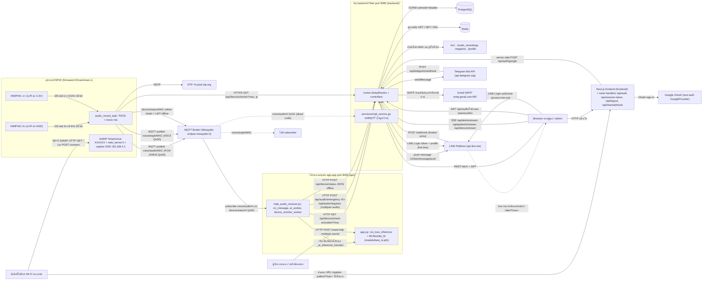
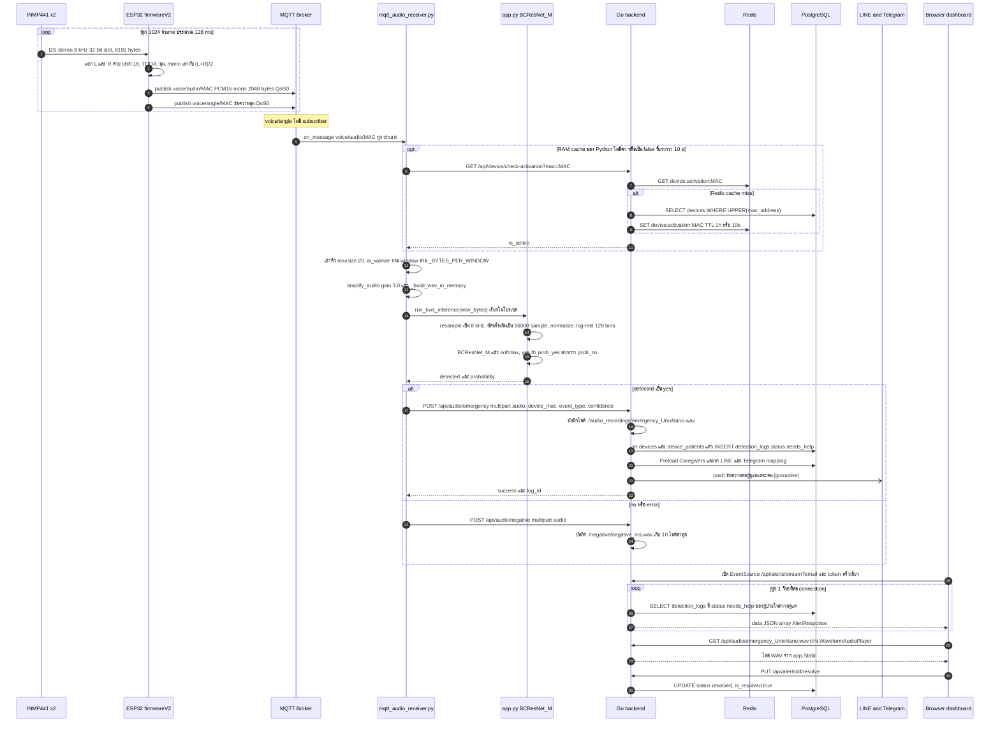
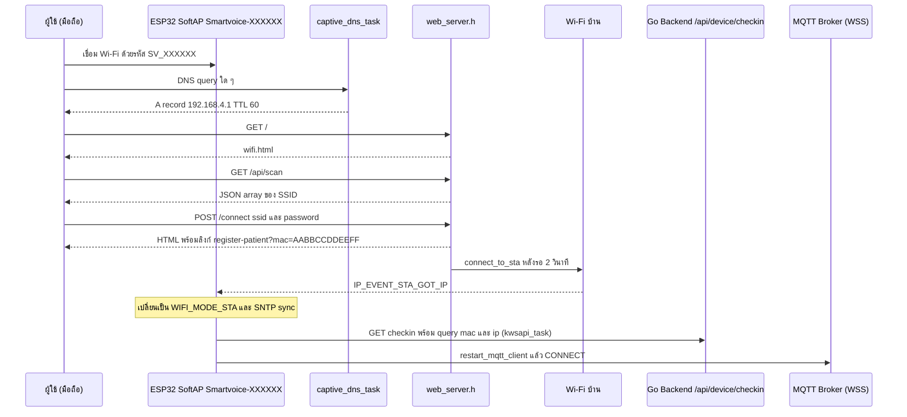
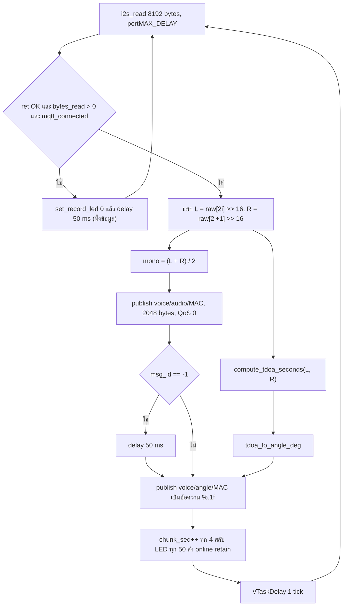
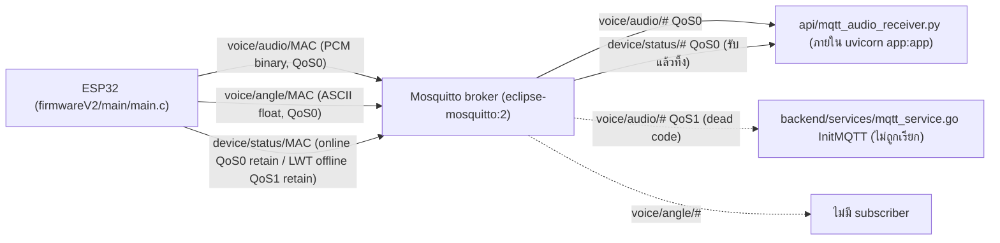
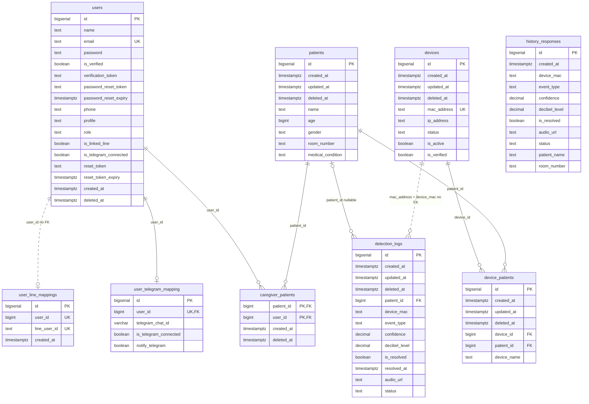
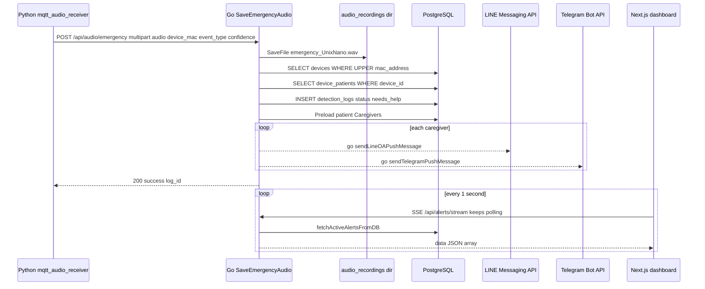
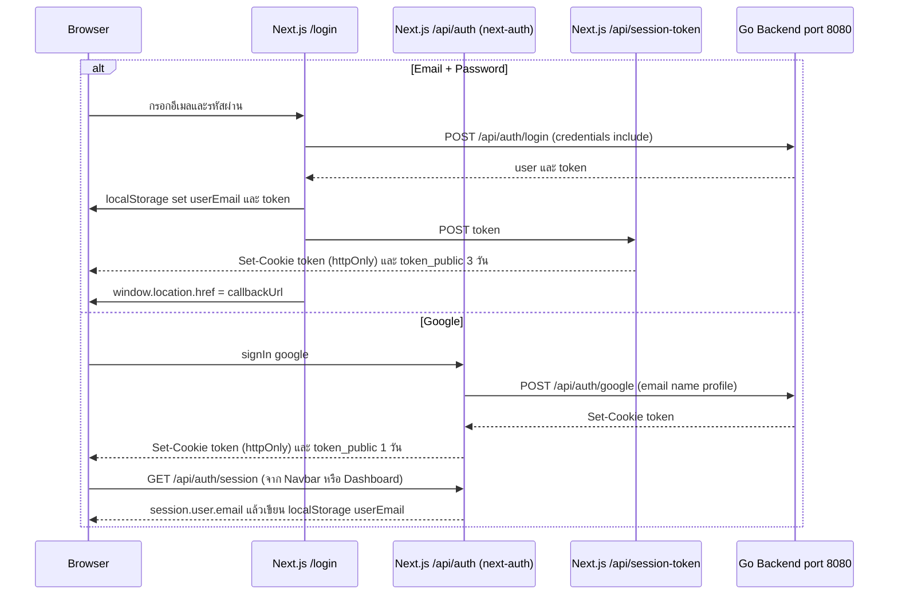
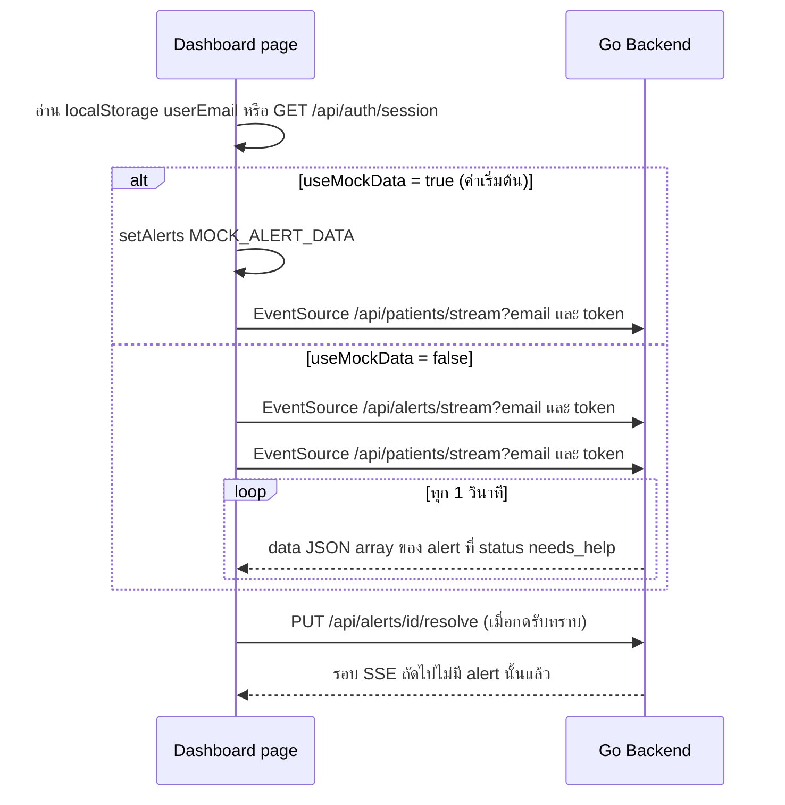

# ARCHITECTURE — AI Emergency Voice Detection System

เอกสารนี้สรุปสถาปัตยกรรมของระบบจากการอ่านโค้ดจริงทั้งโปรเจกต์ เขียนโดยยึดโค้ดเป็นหลัก ไม่ได้ยึดเอกสารเดิม

- **ขอบเขตที่อ่าน:** `api/`, `backend/`, `firmwareV2/`, `frontend/`, `mosquitto/`, `docker-compose.yml`, `start_guardian.bat`, `CLAUDE.md`, `PROJECT_SPEC.md`, `README.md`
- **ไม่ได้อ่าน:** `.venv`, `node_modules`, `__pycache__`, `.git`, ไฟล์เสียง, ไฟล์โมเดล (`.pth`) และไฟล์ binary
- **สถานะโค้ดที่อ้างอิง:** branch `main` ที่ commit `818413f` รวมกับ working tree ณ วันที่ 2026-10-01 ซึ่งโฟลเดอร์ `firmware/` เดิมถูกลบออกจาก working tree แล้ว
- **หมายเลขบรรทัด** (เช่น `L120`) อ้างอิงตามโค้ดในวันที่เขียนเอกสาร ถ้าโค้ดเปลี่ยน หมายเลขอาจเลื่อนได้
- **ค่าลับ** เช่น password, token และ API key แสดงเฉพาะชื่อ key กับไม่เกิน 3 ตัวอักษรแรก (`abc***`) ไม่มีการคัดลอกค่าจริงลงในเอกสารนี้
- ถ้าหาข้อมูลไม่พบในโค้ด จะเขียนว่า **"ไม่พบในโค้ด"**

## สารบัญ

1. ภาพรวมระบบ
2. Flow การทำงานแบบ end-to-end
3. Firmware (firmwareV2)
4. การประมวลผลสัญญาณ (DSP)
5. โมเดล AI
6. MQTT
7. Database schema
8. Redis schema
9. API
10. Frontend
11. Deployment และการรัน
12. ข้อสังเกต


---

## 1. ภาพรวมระบบ

### 1.1 ระบบนี้ทำอะไร

ระบบนี้ตรวจจับเสียงร้องขอความช่วยเหลือของผู้ป่วยหรือผู้สูงอายุแบบ real-time แล้วแจ้งผู้ดูแล การทำงานจริงตามโค้ดมีดังนี้

1. **บันทึกเสียง:** บอร์ด ESP32 ต่อไมค์ INMP441 สองตัวบนบัส I2S เดียวกัน (stereo L/R) อ่านเสียงที่ 8000 Hz ต่อเนื่องตลอดเวลา ไม่มี VAD บอร์ดคำนวณมุมทิศทางเสียงด้วย TDOA แล้วมิกซ์ L/R ลงเป็น mono จากนั้น publish เป็นก้อนละ 2048 bytes ผ่าน MQTT (`firmwareV2/main/main.c` → `audio_record_task()` L609-684)
2. **รับเสียงและจำแนก:** โปรเซส `uvicorn app:app` ของ `api/` รวมสองส่วนไว้ด้วยกัน คือ MQTT receiver (`api/mqtt_audio_receiver.py`) และโมเดล `BCResNet_M` (`api/app.py`, `api/bcresnet.py`) receiver ต่อก้อนเสียงเป็น window ขนาด `SAMPLE_RATE × 4` bytes (2.048 วินาทีของเสียงจริงเมื่อตั้ง `SAMPLE_RATE=8000` แต่ค่า default ในโค้ดคือ 16000 ซึ่งได้ประมาณ 4 วินาที ดูหัวข้อ 2.4) แล้วเรียก `run_kws_inference()` ในโปรเซสเดียวกัน ไม่ได้เรียกผ่าน HTTP (`api/app.py` → `lifespan()` L51-67 ส่ง callback ให้ `mqtt_audio_receiver.start_receiver()` L309) ผลที่ได้มี 2 class คือ `yes` (ฉุกเฉิน) และ `no`
3. **ส่งผลต่อ:** receiver POST ไฟล์ WAV แบบ multipart ไปที่ Go backend ถ้าผลเป็น `yes` จะไปที่ `/api/audio/emergency` ถ้าไม่ใช่จะไปที่ `/api/audio/negative` (`api/mqtt_audio_receiver.py` → `_process_and_forward()` L191-228)
4. **บันทึกและแจ้งเตือน:** Go backend (Fiber) บันทึกไฟล์เสียงและแถว `detection_logs` ลง PostgreSQL หา patient ที่ผูกกับอุปกรณ์ แล้วส่ง push ไปยัง LINE และ Telegram ของผู้ดูแลทุกคนของ patient นั้น (`backend/controllers/audio_controller.go` → `SaveEmergencyAudio()` L110-232)
5. **แสดงผล:** หน้า dashboard ของ Next.js เปิด SSE ไปที่ Go (`/api/alerts/stream`) ฝั่ง Go จะ query DB ทุก 1 วินาทีแล้วส่ง snapshot รายการ alert ที่ยังไม่ resolve กลับมา (`backend/controllers/alert_controller.go` → `StreamAlerts()` L119-155) ผู้ดูแลกด "รับทราบ" ได้ทั้งจาก dashboard (`PUT /api/alerts/:id/resolve`) และจากหน้า `/alert` ที่ลิงก์มาใน LINE (`POST /api/alerts/acknowledge`)
6. **ส่วนประกอบรอบข้าง:**
   - ระบบบัญชีผู้ใช้: email/password, Google ผ่าน NextAuth, email verification ผ่าน Gmail SMTP
   - ทะเบียนผู้ป่วยและอุปกรณ์ หน้า admin
   - การ provisioning อุปกรณ์ผ่าน SoftAP + captive portal เมื่อ `POST /connect` สำเร็จ หน้าเว็บของบอร์ดจะแสดง URL `https://kws.wattanapong.com/register-patient?mac=<MAC 12 หลักไม่มี colon>` เป็น**ข้อความให้ผู้ใช้กดค้างเพื่อคัดลอก**ไปเปิดเองในเบราว์เซอร์ (ไม่ใช่ลิงก์ที่กดได้) จากนั้นหน้า frontend จะเติม colon ให้ MAC ด้วย `formatMacAddress()` (`firmwareV2/main/web_server.h` L11-18, `connect_post_handler()` L189-278 โดย MAC สร้างที่ L229-230 และแทรก `SERVER_URL` ที่ L249; `frontend/app/register-patient/page.tsx` → `formatMacAddress()` L8)

สิ่งที่เอกสารหรือคำขอกล่าวถึงแต่**ไม่พบในโค้ด**: Delay-and-Sum / Coherence post-filter / MVDR beamforming, Whisper + keyword fallback, Auth0, WebSocket ฝั่ง server, การนำมุม `voice/angle/{MAC}` ไปใช้ (ไม่มี subscriber) และค่า `mic_levels` (รายละเอียดอยู่ในหัวข้อ 4, 5, 6, 9 และ 12)

### 1.2 หน้าที่ของแต่ละโฟลเดอร์และ service

| โฟลเดอร์ / ไฟล์ | บทบาท | ภาษา / framework | Port | Entry point | หมายเหตุ |
|---|---|---|---|---|---|
| `firmwareV2/` | firmware ESP32 ไมค์ 2 ตัว (I2S stereo) ทำ TDOA, มิกซ์เป็น mono, publish MQTT, Wi-Fi provisioning ด้วย SoftAP + captive DNS, HTTP check-in ไปที่ Go | C, ESP-IDF 5.5.2 (`firmwareV2/sdkconfig` L3), FreeRTOS, esp-mqtt, esp_http_server | HTTP server ใช้ `HTTPD_DEFAULT_CONFIG()` (`web_server.h` → `start_web_server()` L386-388) ไม่ได้กำหนดพอร์ตเอง, captive DNS ใช้ UDP 53 (`main.c` → `captive_dns_task()` L692) | `firmwareV2/main/main.c` → `app_main()` (L768) | build เฉพาะ `main.c` (`firmwareV2/main/CMakeLists.txt` → `SRCS "main.c"`, `EMBED_TXTFILES "wifi.html"`) ส่วน `web_server.h` ถูก `#include` ที่ `main.c` L27 ไฟล์ `firmwareV2/main_fixed.c` และ `firmwareV2/old.c` อยู่นอกโฟลเดอร์ component `main/` และไม่อยู่ใน `SRCS` จึง**ไม่ถูก compile** (`firmwareV2/CMakeLists.txt` มีแค่ `project(guardian_ai_voice_recorder)`) ข้อควรรู้: `web_server.h` L11 `#define IS_LOCAL_ENV 0` ถูก include ก่อนที่ `main.c` L82 จะ `#define IS_LOCAL_ENV 2` ซ้ำ (macro ถูก redefine ด้วยค่าต่างกัน) ดังนั้น `#if` ใน `web_server.h` ใช้ค่า 0 ส่วนโค้ดหลัง L82 ของ `main.c` ใช้ค่า 2 และใช้ driver I2S แบบ legacy (`#include "driver/i2s.h"` L9) |
| `mosquitto/` + `docker-compose.yml` | MQTT broker | `eclipse-mosquitto:2` (`docker-compose.yml` L3) | 1883 TCP, 8083 WebSocket + TLS, 9001 WebSocket (`mosquitto/config/mosquitto.conf` L6, L9-12, L18-19, `docker-compose.yml` L5-8) | `mosquitto/config/mosquitto.conf` | `allow_anonymous false` และใช้ `password_file` (L2-3) แต่ไฟล์ `passwd` และ certs ไม่อยู่ใน repo ใน compose มี service เดียวคือ `mosquitto` |
| `api/` | MQTT audio receiver + AI inference (BCResNet_M) + HTTP endpoint สำหรับทดสอบ `POST /need-help` | Python `>=3.12` (`api/pyproject.toml` L6), FastAPI, PyTorch, torchaudio, nnAudio, paho-mqtt, requests | 8000 (`api/app.py` L170 หรือคำสั่ง `uvicorn app:app --port 8000`) | `api/app.py` → object `app` (L72) และ `lifespan()` (L51) ซึ่งเรียก `mqtt_audio_receiver.start_receiver()` | ไฟล์ที่ใช้จริงคือ `app.py`, `bcresnet.py`, `mqtt_audio_receiver.py` และ `models/best_m.pth` ไฟล์ที่ไม่ถูก import คือ `model.py`, `models.py`, `main.py`, `config.py` (ดูหัวข้อ 5.1) ตอน import `mqtt_audio_receiver` จะเรียก `get_env_required()` สำหรับ `MQTT_BROKER_HOST` และ `GO_SERVER_URL` (L19-29) ถ้าไม่ได้ตั้งจะ `raise ValueError` ทำให้ `import mqtt_audio_receiver` ใน `app.py` L17 ล้ม และ `uvicorn app:app` เริ่มไม่ได้ |
| `backend/` | REST API, SSE, auth (JWT), จัดการผู้ใช้ ผู้ป่วย และอุปกรณ์, รับผลจาก AI, บันทึกไฟล์เสียง, แจ้งเตือน LINE/Telegram, ส่งอีเมล | Go 1.26.2 (`backend/go.mod` L3), Fiber v2.52.12, GORM v1.31.1 + `gorm.io/driver/postgres` v1.6.0, go-redis v9.22.0, line-bot-sdk-go v7 | `PORT` default `8080` (`backend/main.go` L41) | `backend/main.go` → `main()` (L20) และ `backend/routes/routes.go` → `SetupRoutes()` (L11) | `backend/services/mqtt_service.go` → `InitMQTT()` (L95) **ไม่ถูกเรียกจากที่ใดเลย** (dead code; ไม่มีไฟล์ใด import package `services`) ตอนเริ่ม `main()` จะ `log.Fatalf` ถ้าไม่ได้ตั้ง `LINE_CHANNEL_SECRET`, `LINE_CHANNEL_TOKEN`, `JWT_SECRET` (`main.go` L33-37) หรือ `DB_HOST`, `DB_USER`, `DB_PASSWORD`, `DB_NAME` (`database/database.go` L19-22) ผ่าน `config.GetEnvRequired()` (`backend/config/config.go` L30-36) |
| `frontend/` | Web dashboard สำหรับผู้ดูแลและ admin เช่น alert, ผู้ป่วย, อุปกรณ์, ประวัติ, ตั้งค่าการแจ้งเตือน, หน้า `/alert` ที่เปิดจากลิงก์ใน LINE | TypeScript, Next.js 16.2.3 (App Router), React 19.2.4, next-auth, wavesurfer.js, Tailwind CSS 4 (`frontend/package.json`) | ไม่ได้กำหนดพอร์ตในสคริปต์ (`"dev": "next dev -H 0.0.0.0"`, `frontend/package.json` L6) จึงใช้ค่า default ของ Next.js ส่วน backend ตั้ง CORS origin default ไว้ที่ `http://localhost:3000` (`backend/main.go` L27) | `frontend/app/layout.tsx`, `frontend/app/page.tsx`, `frontend/middleware.ts` | URL ของ backend มาจาก `NEXT_PUBLIC_API_URL` ถ้าไม่ตั้งจะใช้ `http://localhost:8080` (เช่น `frontend/app/dashboard/page.tsx` L11) |
| PostgreSQL (อยู่นอก repo) | ฐานข้อมูลหลัก | PostgreSQL ผ่าน GORM | `DB_PORT` default `5433` (`backend/database/database.go` → `ConnectDB()` L23) | — | **ไม่มีใน `docker-compose.yml` และ `start_guardian.bat`** ตารางถูกสร้างด้วย `AutoMigrate` (ดูหัวข้อ 7) |
| Redis (อยู่นอก repo) | cache สถานะ activation ของอุปกรณ์ (`device:activation:{mac}`), throttle ของ alert ใน `CreateAlert()` (ซึ่ง throttle นี้ใช้งานไม่ได้จริง ดูหัวข้อ 2.2 ข้อ 19) และ `device:{id}:status` จาก `UpdateDevices()` | Redis ผ่าน go-redis v9 | `REDIS_PORT` default `6379` (`backend/database/redis.go` → `ConnectRedis()` L23-25) | — | ถ้าต่อไม่ได้ backend จะ `log.Fatal` ทันที (L40-42) แต่ไม่มีใน compose และ bat (ดูหัวข้อ 8) |
| `start_guardian.bat` | สคริปต์ Windows สำหรับเปิด broker, Python, Go และ Next.js ในหน้าต่างแยกกัน | Windows batch | — | ไฟล์เอง | path ยังเป็นของเดิมทั้งหมด (`D:\backend_golang`, `backend_ai`, `go_backend` ที่ L14, L20, L24, L28) และสั่ง `python mqtt_audio_receiver.py` (L20) ซึ่งไฟล์นั้นไม่มี `__main__` จึงไม่ได้เริ่ม receiver ตัวสคริปต์ไม่ได้เปิด uvicorn, PostgreSQL หรือ Redis (ดูหัวข้อ 11.4) |
| `a.py` (root) | สำเนาของ `api/app.py` | Python | — | — | ต่างจาก `api/app.py` แค่ comment ที่ L39 และ newline ท้ายไฟล์ (เทียบด้วย `diff`) ไม่มีไฟล์ใดอ้างถึง ถูกใส่ไว้ใน root `.gitignore` L69 แต่ยังถูก track อยู่ใน git |
| `firmware/` (ถูกลบแล้ว) | firmware รุ่นเก่า ไมค์เดียว | — | — | — | git status แสดงว่าทุกไฟล์ถูกลบ (`D firmware/...`) และไม่มีโฟลเดอร์นี้บนดิสก์ จึงไม่อยู่ในขอบเขต แต่ `CLAUDE.md` ยังอ้างถึง `firmware/main/web_server.h` อยู่ |
| `CLAUDE.md`, `README.md`, `PROJECT_SPEC.md` | เอกสาร | Markdown | — | — | มีหลายจุดที่ไม่ตรงกับโค้ด (ดูหัวข้อ 12) |

### 1.3 แผนภาพสถาปัตยกรรม

แผนภาพนี้แสดงเฉพาะการเชื่อมต่อที่พบในโค้ด เส้นประคือโค้ดที่มีอยู่แต่ไม่ถูกเรียก หรือ topic ที่ไม่มีผู้รับ



### 1.4 ตารางการเชื่อมต่อระหว่าง service (ใช้อ้างอิงกับแผนภาพ)

| จาก | ไป | Protocol | Endpoint / topic | อ้างอิง |
|---|---|---|---|---|
| INMP441 x2 | ESP32 | I2S master RX, `I2S_CHANNEL_FMT_RIGHT_LEFT`, SCK 26 / WS 25 / DIN 22 (ไมค์ทั้งสองตัวใช้ขา DIN ร่วมกัน) | — | `firmwareV2/main/main.c` → `init_i2s_audio()` L541-556, `#define` L38-41 |
| ESP32 | MQTT broker | MQTT 3.1.1 (`CONFIG_MQTT_PROTOCOL_311=y`, `firmwareV2/sdkconfig` L1769) over WSS ตรวจ cert ด้วย `esp_crt_bundle_attach`, keepalive 30 s, user `kws` และรหัสผ่านที่ hardcode ไว้ในซอร์ส (`PASS` = `31J***` ที่ L98 ส่วน ENV_LOCAL/ENV_LAB ใช้ `kws***` ที่ L90, L106 ไฟล์นี้ถูก track ใน git ดูหัวข้อ 12) | URI `TARGET_MQTT_URI` = `wss://mqtt.wattanapong.com:443/mqtt` เพราะ `IS_LOCAL_ENV 2` (ENV_SERVER) topics `voice/audio/{MAC}`, `voice/angle/{MAC}`, `device/status/{MAC}` (MAC รูปแบบ `AA:BB:CC:DD:EE:FF` ตัวพิมพ์ใหญ่ `app_main()` L784-797) ตัวแปร `mqtt_broker_uri_dynamic` (L59) ที่โหลดจาก NVS (`load_mqtt_uri_from_nvs()` L132) และแก้ได้ผ่าน `POST /host` **ไม่ถูกใช้** ตอนสร้าง client เพราะ `restart_mqtt_client()` ใช้ `TARGET_MQTT_URI` ตรง ๆ (L332) | `main.c` L82, L92-98, `restart_mqtt_client()` L317-366, `audio_record_task()` L649, L660, L671 |
| ESP32 | Go backend | HTTPS GET (`esp_http_client`, `crt_bundle_attach`, timeout 5 s) | `https://kwsb.wattanapong.com/api/device/checkin?mac=%s&ip=%s` เรียกครั้งเดียวทุกครั้งที่ได้ IP | `main.c` L94, `kwsapi_task()` L204-240, `wifi_event_handler()` L472-487; ฝั่ง Go คือ `backend/routes/routes.go` L89 → `controllers/activate.go` → `CheckinDeviceIP()` L14 |
| ESP32 | NTP | SNTP (poll mode) | `th.pool.ntp.org`, `time.google.com`, `pool.ntp.org` | `main.c` → `sync_time_via_sntp()` L410-417 |
| มือถือผู้ใช้ | ESP32 | Wi-Fi SoftAP (WPA2, SSID `Smartvoice-XXXXXX` จาก MAC 3 byte ท้าย, รหัสผ่าน `SV_` + MAC 3 byte แรก ซึ่งถูก log ออก serial ที่ L793), HTTP (ไม่มีการยืนยันตัวตน), DNS ตอบทุก query เป็น 192.168.4.1 | `GET /` (ส่ง `wifi.html`), `POST /connect`, `GET /api/scan`, `GET /admin`, `GET`/`POST /host`, `GET /scanwifi`, `GET /reconnect` และ 404 ทุกตัว redirect 302 ไป `http://192.168.4.1/` หน้า `/admin` มีลิงก์ `/wifi` แต่ route นี้ถูก comment ไว้ (L400-401) | `main.c` L789-793, `init_wifi()` L490-536, `captive_dns_task()` L692-728; `web_server.h` → `start_web_server()` L386-428, `captive_portal_404_handler()` L300-306 |
| ESP32 (หน้า HTML) | Frontend | ข้อความ URL ที่ผู้ใช้คัดลอกไปเปิดเอง (`user-select:all`) | `https://kws.wattanapong.com/register-patient?mac=%s` โดย `%s` คือ MAC 12 หลักไม่มี colon (`web_server.h` ใช้ค่า `IS_LOCAL_ENV 0` ที่ L11 จึงเลือก URL server จริงที่ L18) | `firmwareV2/main/web_server.h` L11-18, `connect_post_handler()` L229-263; `frontend/app/register-patient/page.tsx` → `formatMacAddress()` L8-18 |
| Mosquitto | Python receiver | MQTT ผ่าน TCP ถ้า `MQTT_BROKER_PORT` เป็น 1883/8883 นอกนั้นเป็น WebSocket path `/mqtt` เปิด TLS เฉพาะพอร์ต 443/8883 (ข้าม cert check เมื่อ `APP_ENV=development`) client_id `smartvoice_ai_forwarder`, keepalive 60 | subscribe `voice/audio/#` และ `device/status/#` ด้วย QoS 0 แต่ข้อความ status ถูกทิ้ง **ข้อควรระวัง:** ค่า default `MQTT_BROKER_PORT=8083` (L26) จะต่อแบบ WebSocket **ไม่มี TLS** แต่ listener 8083 ของ `mosquitto.conf` ตั้ง `certfile`/`keyfile` (L9-12) จึงคาดว่าเป็น WSS ทั้งสองฝั่งไม่ตรงกัน | `api/mqtt_audio_receiver.py` → `start_receiver()` L309-366 (transport L320, TLS L333-349), `on_connect()` L248-254, `on_message()` L256-278 |
| Python receiver | AI inference | เรียกฟังก์ชันในโปรเซสเดียวกัน | `_ai_inference_function(wav_bytes)` = `run_kws_inference` | `api/mqtt_audio_receiver.py` L199; `api/app.py` → `lifespan()` L56 |
| Python receiver | Go backend | HTTP GET (header `X-Tunnel-Skip-AntiPhishing-Page`, timeout 5 s, `verify=not is_local` โดย `is_local` เป็นจริงเมื่อ `APP_ENV` = `development` ซึ่งเป็นค่า default L17 จึง**ไม่ตรวจ TLS cert** โดยปริยาย) | `/api/device/check-activation?mac=` (endpoint นี้ไม่มี auth middleware `routes.go` L90) | `mqtt_audio_receiver.py` → `is_device_activated()` L89-145; `controllers/activate.go` → `CheckDeviceActivation()` L60 |
| Python receiver | Go backend | HTTP POST multipart (`audio` + `device_mac`, `event_type`, `confidence`) timeout 5 s, `verify=not is_local` | `/api/audio/emergency` หรือ `/api/audio/negative` (ไม่มี auth middleware `routes.go` L116-117) | `mqtt_audio_receiver.py` → `_send_to_go_async()` L178-189, `_process_and_forward()` L191-228; `controllers/audio_controller.go` → `SaveEmergencyAudio()` L110, `SaveNegativeAudio()` L256 |
| Python receiver | Go backend | HTTP POST JSON `{"mac","status":"offline"}` | `/api/device/status` | `mqtt_audio_receiver.py` → `device_monitor_worker()` L64-87, `_send_status_to_go_async()` L49-61; `controllers/device_controller.go` → `UpdateDevices()` L64 |
| ผู้เรียกภายนอก | AI server | HTTP POST multipart field `sound` | `/need-help` | `api/app.py` → `predict_keyword()` L150-165 (pipeline หลักไม่ได้ใช้ endpoint นี้) |
| Go backend | PostgreSQL | GORM (`gorm.io/driver/postgres`) DSN `sslmode=disable` | — | `backend/database/database.go` → `ConnectDB()` L17-73 |
| Go backend | Redis | go-redis | key `device:activation:{mac}`, `alert:throttle:{caregiverID}:{MAC}`, `device:{id}:status` | `backend/database/redis.go` → `ConnectRedis()` L22-45; `backend/database/redis_cache.go` (ดูหัวข้อ 8) |
| Go backend | ดิสก์ | file I/O | `./audio_recordings` (เสิร์ฟผ่าน `app.Static("/api/audio", ...)`), `./negative`, `./profile` | `backend/main.go` L23; `audio_controller.go` L127, L262; `routes.go` L14 |
| Go backend | LINE | HTTPS | `https://api.line.me/v2/bot/message/push`, `https://api.line.me/oauth2/v2.1/token`, `https://api.line.me/v2/profile` | `controllers/line_alert_controller.go` → `sendLineOAPushMessage()` L42-86; `controllers/line.go` → `LinkLineAccount()` L25, L38, L72 |
| LINE | Go backend | HTTP webhook | `POST /webhook` (ใช้ SDK ตอบข้อความกลับ) และ `POST /api/line/webhook` (stub) | `backend/main.go` L57 → `backend/linebot/handler.go` → `WebhookHandler()` L24; `routes.go` L20 → `LineWebhook()` |
| Go backend | Telegram | HTTPS | `https://api.telegram.org/bot<token>/sendMessage` | `controllers/telegram_alert_controller.go` → `sendTelegramPushMessage()` L31-60; `controllers/telegram.go` → `sendReplyWithBackButton()` L170 |
| Telegram | Go backend | HTTP webhook | `POST /api/telegram/webhook` และ `POST /api/webhook` | `routes.go` L16-17 → `controllers/telegram.go` → `TelegramWebhook()` L96 |
| Go backend | Gmail SMTP | SMTP (gomail) | `smtp.gmail.com:587` | `backend/utils/email.go` → `SendVerificationEmail()` L20, `SendResetPasswordEmail()` L66 (dial ที่ L60, L110) ถูกเรียกจาก `auth_controller.go` L196, L243, L318 |
| Next.js server | Google | OAuth (next-auth) | GoogleProvider | `frontend/app/api/auth/[...nextauth]/route.ts` L3, L9 |
| Next.js server | Go backend | HTTP POST | `/api/auth/google` (L64) และ `/api/auth/login` (L29, ใน CredentialsProvider ซึ่งไม่พบการเรียก `signIn("credentials")` ใน `frontend/app` มีแต่ `signIn("google")` ที่ `frontend/app/login/page.tsx` L312, L403) | `frontend/app/api/auth/[...nextauth]/route.ts` |
| LINE (webhook ที่อาจตั้งไว้) | Next.js server | HTTP POST | `/api/line/webhook` (route handler ฝั่ง Next.js ที่แค่ log body แล้วตอบ 200) | `frontend/app/api/line/webhook/route.ts` → `POST()` L4-16 |
| Browser | Go backend | HTTP REST (`fetch`) และ SSE (`EventSource`, `withCredentials`) | ดูรายการ endpoint ในหัวข้อ 9 และ 10.12, SSE: `/api/alerts/stream`, `/api/patients/stream`, `/api/device/stream` | `frontend/app/dashboard/page.tsx` L137-199; `frontend/app/device/page.tsx` L186-190 |
| Browser | LINE | redirect เพื่อ LINE Login | `https://access.line.me/oauth2/v2.1/authorize` แล้วกลับมาที่ `/line-callback` → `POST /api/user/link-line` | `frontend/app/settings/notifications/page.tsx` L108; `frontend/app/line-callback/page.tsx` L40 |

**การเชื่อมต่อที่ไม่พบในโค้ด**
- Go backend ไม่ได้เรียก Python AI server เลย (ไม่มี HTTP call จาก `backend/` ไปที่พอร์ต 8000)
- frontend ไม่มี MQTT client และไม่มี WebSocket (`frontend/hooks/useWebSocket.ts` เป็นแค่ placeholder ที่ไม่ถูก import)
- ไม่มี subscriber ของ `voice/angle/{MAC}` ใน `api/`, `backend/` หรือ `frontend/`
- ไม่มีการใช้ Redis จาก Python หรือ frontend และไม่มี Redis pub/sub ที่ใช้งานจริง (`PublishEmergency()` / `SubscribeEmergency()` ใน `backend/database/redis_cache.go` L128-142 ไม่มีผู้เรียก)
- Auth0: ไม่พบในโค้ด
- ESP32 ต่อไปที่ `wss://mqtt.wattanapong.com:443/mqtt` แต่ `mosquitto.conf` ไม่มี listener 443 และ `docker-compose.yml` map แค่ 1883, 9001, 8083 ส่วนจะมี reverse proxy ที่พอร์ต 443 ส่งต่อไปยัง Mosquitto ตัวนี้หรือไม่นั้น ไม่พบในโค้ด
- ส่วน Python receiver จะไปต่อ broker ตัวไหน ขึ้นกับ env `MQTT_BROKER_HOST` (บังคับ) / `MQTT_BROKER_PORT` (default 8083) และ `MQTT_USER` / `MQTT_PASSWORD` (`api/mqtt_audio_receiver.py` L25-28) แต่บนดิสก์ไม่มีไฟล์ `api/.env` (มีแค่ `backend/.env`, `backend/.env.production`, `frontend/.env.local`, `frontend/.env.production` ซึ่งถูก gitignore ทั้งหมด) จึงไม่พบในโค้ดว่าใช้ค่าใดจริง


---

## 2. Flow การทำงานแบบ end-to-end

หัวข้อนี้ไล่เส้นทางของเสียงหนึ่งก้อน ตั้งแต่ไมค์จนถึงหน้าจอผู้ดูแล รายละเอียดเชิงลึกของแต่ละช่วงอยู่ในหัวข้อ 3 (firmware), 4 (DSP), 5 (โมเดล), 6 (MQTT), 9 (API) และ 10 (frontend)

### 2.1 เงื่อนไขก่อนที่ flow จะทำงาน

เสียงจะถูกส่งเข้าโมเดลและแจ้งเตือนได้ ต้องผ่านเงื่อนไขเหล่านี้ก่อน

1. **บอร์ดต่อ Wi-Fi และ MQTT ได้แล้ว:** firmware จะ publish ก็ต่อเมื่อ `mqtt_connected == true` (`firmwareV2/main/main.c` → `audio_record_task()` L631) flag นี้ตั้งใน `mqtt_event_handler()` ตอน `MQTT_EVENT_CONNECTED` (L250-254) และ MQTT client ถูกสร้างหลังได้ IP เท่านั้น (`wifi_event_handler()` → `restart_mqtt_client()` L486)
2. **อุปกรณ์มีอยู่ใน DB:** ตอนได้ IP บอร์ดเรียก `GET /api/device/checkin?mac=..&ip=..` (`kwsapi_task()` L204-240) ฝั่ง Go จะแปลง MAC เป็นตัวพิมพ์ใหญ่ ถ้ายังไม่มีจะสร้างแถว `devices` ใหม่ (`Status: "online"`, `IsActive: false`, `IsVerified: true`) ถ้ามีแล้วจะอัปเดต `ip_address`, `is_verified = true`, `status = "online"` endpoint นี้ไม่มีการยืนยันตัวตน (`backend/controllers/activate.go` → `CheckinDeviceIP()` L14-58; `backend/routes/routes.go` L89)
3. **อุปกรณ์ถูก activate และผูกกับผู้ป่วย:** เมื่อผู้ดูแลลงทะเบียนผู้ป่วยผ่านหน้า `/register-patient?mac=` ระบบจะสร้าง `patients`, `caregiver_patients` และ `device_patients` แล้วตั้ง `devices.is_active = true` (`backend/controllers/patient_controller.go` → `RegisterPatientWithDevice()` L31-170, update `is_active` ที่ L151) ทางอื่นคือ `CreatePatient()` (`backend/controllers/patient.go` L113) ทั้งสองทาง**ไม่ได้ลบ** Redis key `device:activation:{mac}` (มีแค่ `UpdateDevices()` ที่เรียก `InvalidateDeviceCache()` ที่ `device_controller.go` L95) จึงอาจมีช่วงที่ cache ค่า `false` ค้างอยู่ได้ไม่เกิน 10 วินาทีทั้งฝั่ง Go และฝั่ง Python
4. **Python ยืนยันว่าอุปกรณ์ active:** `api/mqtt_audio_receiver.py` → `is_device_activated()` (L89-145) จะทิ้งเสียงของอุปกรณ์ที่ยังไม่ active

### 2.2 ขั้นตอนทีละขั้น

| # | ขั้นตอน | สิ่งที่เกิดขึ้นในโค้ด | อ้างอิง |
|---|---|---|---|
| 1 | ไมค์ 2 ตัวจับเสียง → I2S | INMP441 ตัวซ้ายต่อขา L/R ลง GND ตัวขวาต่อ 3.3V ทั้งคู่ใช้ SD เส้นเดียวกัน (DIN = GPIO22) ESP32 เป็น I2S master RX ที่ 8000 Hz, slot 32-bit, `I2S_CHANNEL_FMT_RIGHT_LEFT` (stereo interleave), DMA 8 buffer × 1024 frame | `firmwareV2/main/main.c` → `init_i2s_audio()` L541-556, `#define` L33-41 |
| 2 | อ่านก้อนเสียง | `i2s_read()` ขนาด `AUDIO_CHUNK_SAMPLES * 2 * sizeof(int32_t)` = 8192 bytes (1024 frame = 128 ms) และรอแบบ `portMAX_DELAY` | `main.c` → `audio_record_task()` L629 |
| 3 | แยก L/R และแปลงเป็น 16-bit | `l = raw[2i] >> 16`, `r = raw[2i+1] >> 16` ไม่มี gain, filter หรือการลบ DC (มี comment ว่าถ้า L/R สลับกันให้สลับ index เอง) | `main.c` L632-640 |
| 4 | TDOA และมุม | `compute_tdoa_seconds()` หา cross-correlation แบบไม่ normalize ในช่วง lag −4..+4 sample แล้วทำ parabolic interpolation จากนั้น `tdoa_to_angle_deg()` คำนวณ `asin(343·τ/0.10)` ได้มุม −90..90 องศา คำนวณทุก chunk แม้เป็นช่วงเงียบ | `main.c` L563-598, L602-607, L645-646 |
| 5 | Mixdown เป็น mono | `chunk_buf[i] = (l + r) / 2` เป็นการเฉลี่ยตรง ๆ **ไม่มีการชดเชย delay** ระหว่างไมค์ | `main.c` L641 |
| 6 | **DSP แบบ beamforming** | Delay-and-Sum Beamforming: **ไม่พบในโค้ด**<br>Coherence-based Post-filter: **ไม่พบในโค้ด**<br>MVDR Beamforming: **ไม่พบในโค้ด**<br>สิ่งที่มีจริงบนอุปกรณ์มีแค่ขั้น 4 (TDOA) กับขั้น 5 (เฉลี่ย L/R) | ค้นทั้ง `firmwareV2/`, `api/`, `backend/` (ดูหัวข้อ 4.1) |
| 7 | Publish MQTT | เสียง mono 2048 bytes ไป `voice/audio/{MAC}` (QoS 0, retain 0) มุมแบบ ASCII `"%.1f"` ไป `voice/angle/{MAC}` (QoS 0) และทุก 50 chunk ส่ง `"online"` ไป `device/status/{MAC}` (QoS 0, retain 1) LWT คือ `"offline"` (QoS 1, retain 1) ถ้า publish ได้ `-1` จะหน่วง 50 ms และ chunk นั้นหาย ถ้า MQTT ยังไม่ต่อ ข้อมูลจะถูกทิ้งแล้วรอ 50 ms | `main.c` L649-672, L677-682, `restart_mqtt_client()` L352-360 |
| 8 | Broker ส่งต่อ | ESP32 ต่อ `wss://mqtt.wattanapong.com:443/mqtt` (`TARGET_MQTT_URI`, ENV_SERVER) ส่วน broker ใน repo คือ Mosquitto ที่ listen 1883 / 8083 / 9001 จะมีอะไรเชื่อมพอร์ต 443 เข้ากับ Mosquitto ตัวนี้หรือไม่นั้น **ไม่พบในโค้ด** | `main.c` L82, L95; `mosquitto/config/mosquitto.conf` L6-19 |
| 9 | Python รับข้อความ | `on_message()` ทิ้ง `device/status/*` ทันที สำหรับ `voice/audio/*` จะเอา MAC จากส่วนท้ายของ topic อัปเดต `_device_last_seen` แล้วเรียก `is_device_activated()` (HTTP GET `/api/device/check-activation`, timeout 5 s, รันใน callback ของ paho) ถ้าผ่านจะ `put_nowait` เข้า `audio_data_queue` (maxsize 20 และทิ้งเมื่อคิวเต็ม) | `api/mqtt_audio_receiver.py` → `on_message()` L256-278, `is_device_activated()` L89-145, L47 |
| 10 | ฝั่ง Go ตอบเรื่อง activation | เช็ค Redis `device:activation:{mac}` ก่อนด้วย `database.GetJSON()` (ใช้ `mac` ตามที่ส่งมา ไม่ normalize) ถ้า hit ตอบ `{is_active, source:"cache"}` ถ้า miss จะ query `devices` ด้วย `UPPER(mac_address) = UPPER(?)` แล้ว `SetJSON()` cache ไว้ 1 ชั่วโมงถ้า active หรือ 10 วินาทีถ้าไม่ active ตอบ `{is_active, is_verified, source:"db"}` ถ้าไม่พบอุปกรณ์ตอบ `{is_active:false}` โดยไม่ cache ฝั่ง Python ก็ cache ใน RAM ด้วย และถ้าเคยได้ active แล้วจะจำไว้ตลอดอายุโปรเซส | `backend/controllers/activate.go` → `CheckDeviceActivation()` L60-101; `mqtt_audio_receiver.py` L94-99 |
| 11 | รวมเป็น window | `ai_worker()` (thread ที่เริ่มตอน import, L301) ต่อ payload ตาม MAC จนครบ `_BYTES_PER_WINDOW = SAMPLE_RATE × 1 × 2 × 2` แล้วเรียก `_flush_buffer()` window ไม่ซ้อนกันและไม่มี VAD | `mqtt_audio_receiver.py` L31-39, `ai_worker()` L280-298 |
| 12 | Gain และสร้าง WAV | `amplify_audio(pcm, 3.0)` คูณด้วย `min(3.0, 32767/peak)` แล้ว `_build_wav_in_memory()` เขียน header WAV แบบ 1 ch, 16-bit, `framerate = SAMPLE_RATE` (ค่าจาก env, default 16000) | `mqtt_audio_receiver.py` → `_flush_buffer()` L230-246, `amplify_audio()` L147-167, `_build_wav_in_memory()` L169-176 |
| 13 | เรียกโมเดลในโปรเซส | `_process_and_forward()` เรียก `_ai_inference_function(wav_bytes)` ซึ่ง `lifespan()` ตั้งให้เป็น `run_kws_inference` **ไม่ผ่าน HTTP `/need-help`** | `mqtt_audio_receiver.py` L191-199; `api/app.py` → `lifespan()` L51-67 |
| 14 | Preprocessing | `preprocess_audio()`:<br>1. `torchaudio.load()`<br>2. ถ้า sample rate ใน header ≠ 8000 ให้ `T.Resample` เป็น 8000<br>3. เฉลี่ยเป็น mono ถ้ามีหลาย channel<br>4. pad หรือตัดให้เหลือ 16000 sample (2 s)<br>5. peak normalize<br>6. `MelSpectrogram(sr=8000, n_fft=256, win_length=200, hop_length=80, n_mels=128)` แล้ว `torch.log(mel + 1e-6)`<br>7. `unsqueeze(0)` ได้ `[1, 1, 128, T]` | `api/app.py` L85-93, `preprocess_audio()` L112-141 |
| 15 | BC-ResNet | `model = BCResNet_M(2)` โหลด `models/best_m.pth` บน CPU ถ้าโหลดไม่ได้จะใช้ weight แบบสุ่มต่อไปพร้อม log เตือน ผลลัพธ์คือ logits `[1, 2]` | `api/app.py` L95-107; `api/bcresnet.py` → `BCResNet_M` L117-141 |
| 16 | ตัดสินผล | `softmax` ให้ index 0 = `prob_yes`, index 1 = `prob_no` แล้ว `detected = "yes"` ถ้า `prob_yes > prob_no` (เท่ากับ argmax) `probability` คือค่าความน่าจะเป็นของ class ที่ชนะ ปัดเป็นทศนิยม 4 ตำแหน่ง ถ้าเกิด exception จะได้ `{"detected": "error", "probability": 0.0}` **ไม่มี threshold** (`EMERGENCY_THRESHOLD` อยู่ใน `api/config.py` L45 ซึ่งไม่ถูก import) | `api/app.py` → `run_kws_inference()` L26-46 |
| 17 | ส่งผลให้ Go | `detected == "yes"` → `POST {GO_SERVER_URL}/api/audio/emergency` (ไฟล์ `emergency.wav`) กรณีอื่นรวมถึง `"error"` → `POST .../api/audio/negative` (ไฟล์ `negative.wav`) เป็น multipart field `audio` + `device_mac`, `event_type` (`needs_help`/`normal`), `confidence` ยิงจาก thread แยก, timeout 5 s, `verify=not is_local` และ**ไม่ส่ง `decibel_level`** | `mqtt_audio_receiver.py` → `_process_and_forward()` L200-225, `_send_to_go_async()` L178-189 |
| 18a | Go บันทึกเหตุฉุกเฉิน | `SaveEmergencyAudio()`:<br>1. อ่าน `FormFile("audio")` และเปลี่ยน MAC เป็นตัวพิมพ์ใหญ่<br>2. บันทึก `./audio_recordings/emergency_<UnixNano>.wav`<br>3. หา `devices` ด้วย `UPPER(mac_address)` แล้วหา `device_patients` ด้วย `device_id` เพื่อได้ `patientID`<br>4. INSERT `detection_logs` (`patient_id` ซึ่งเป็น NULL ได้ถ้าไม่พบการผูก, `device_mac` ตัวพิมพ์ใหญ่, `event_type` จากฟอร์ม (Python ส่ง `needs_help`), `status = "needs_help"`, `is_resolved = false`, `audio_url = /api/audio/<file>`, `confidence`, `decibel_level = 0` เพราะ Python ไม่ได้ส่ง)<br>5. ตอบ `{success, message, log_id}`<br>ใน path นี้**ไม่มีการใช้ Redis และไม่มีการ push SSE** และ endpoint นี้**ไม่มี auth middleware** (`routes.go` L116) | `backend/controllers/audio_controller.go` → `SaveEmergencyAudio()` L110-232 (อ่านฟอร์ม L112-124, ชื่อไฟล์ L138, save L144, query L154-165, INSERT L168-183) |
| 18b | Go บันทึกเสียงปกติ | `SaveNegativeAudio()` บันทึก `./negative/negative_<UnixMilli>.wav` แล้ว `cleanupOldNegativeFiles(saveDir, 10)` เก็บไว้ 10 ไฟล์ล่าสุด **ไม่เขียน DB** และไม่ใช้ `device_mac` หรือ `confidence` | `audio_controller.go` → `SaveNegativeAudio()` L256-278, `cleanupOldNegativeFiles()` L281 |
| 19 | แจ้งเตือน LINE / Telegram | ถ้ามี `patientID` จะ `Preload("Caregivers")` แล้ววนผู้ดูแลทุกคน:<br>- มี `user_line_mappings`: `go sendLineOAPushMessage()` → `POST https://api.line.me/v2/bot/message/push` ข้อความประกอบด้วยชื่อผู้ป่วย ห้อง เวลา และลิงก์ `FRONTEND_URL/alert?mac=<MAC>`<br>- มี `user_telegram_mapping` ที่ connected และ notify: `go sendTelegramPushMessage()` → `api.telegram.org/bot<token>/sendMessage` (ข้อความเดียวกันแต่ไม่มีลิงก์)<br>path นี้**ไม่มี throttle** จึงส่งทุกครั้งที่ window ใดได้ผล `yes` throttle ผ่าน Redis มีเฉพาะใน `CreateAlert()` (route `POST /api/alerts/ai` และ `POST /api/alerts/`, `routes.go` L98-99) ซึ่งไม่พบผู้เรียกใน `api/` และ `frontend/` และ throttle นั้นเองก็**ใช้งานไม่ได้**: `SetJSON(throttleKey, true, 5*time.Minute)` เก็บ JSON `true` แต่ `GetJSON(throttleKey, &struct{}{})` จะ unmarshal `true` ลง `struct{}` ไม่ได้ จึงคืน `hit = false` เสมอ (`alert_controller.go` L73-79; `backend/database/redis_cache.go` → `GetJSON()` L36-49) ส่วน LINE ใช้ HTTP client timeout 10 s ส่วน Telegram ใช้ `http.Post` ไม่มี timeout | `audio_controller.go` L190-224; `backend/controllers/line_alert_controller.go` → `sendLineOAPushMessage()` L42-86; `backend/controllers/telegram_alert_controller.go` → `sendTelegramPushMessage()` L31-60; `backend/controllers/alert_controller.go` → `CreateAlert()` L72-80 |
| 20 | SSE ไปยัง frontend | `StreamAlerts()` ใช้ `c.Context().SetBodyStreamWriter(fasthttp.StreamWriter(...))` และ `time.NewTicker(1 * time.Second)` ต่อ client (ข้อมูลชุดแรกออกหลังเชื่อมต่อประมาณ 1 วินาที) ทุก tick จะเรียก `fetchActiveAlertsFromDB(email)` ซึ่งดึง `detection_logs` ที่ `status = 'needs_help'` และ patient อยู่ใน `caregiver_patients` ของผู้ใช้นั้น แล้วเขียน `data: <JSON array ของ AlertResponse>\n\n` ไม่ได้ตรวจ token ใช้แค่ `?email=` | `alert_controller.go` → `StreamAlerts()` L119-155, `fetchActiveAlertsFromDB()` L157-188, `AlertResponse` L22-31; `routes.go` L104 (ไม่มี middleware) |
| 21 | Dashboard แสดงผล | `EventSource(${API_BASE_URL}/api/alerts/stream?email=..&token=..)` แต่ละข้อความแทนที่ state `alerts` ทั้งก้อน ถ้า `onerror` จะ `close()` และไม่ reconnect การ์ดแต่ละใบใช้ `BlinkingAlert` และ `WaveformAudioPlayer src={API_BASE_URL + audio_url}` ส่วน `DirectionCompass` แสดงเฉพาะเมื่อมี `alert.coordinates` ซึ่ง backend ไม่ส่งมา **ข้อควรรู้:** `useMockData` เริ่มต้นเป็น `true` และปุ่มสลับแสดงเฉพาะ `NODE_ENV === 'development'` ดังนั้น build อื่น ๆ จะแสดง mock data และไม่เปิด `/api/alerts/stream` เลย | `frontend/app/dashboard/page.tsx` L70, L128-208, L245-258, L302, L351-373 |
| 22 | ผู้ดูแลกดรับทราบ | (ก) จาก dashboard: `PUT /api/alerts/:id/resolve` → `ResolveAlert()` ตั้ง `status = "resolved"`, `is_resolved = true`, `resolved_at` แล้ว tick SSE ถัดไปจะไม่มีรายการนั้น<br>(ข) จากลิงก์ LINE: หน้า `/alert` เรียก `GET /api/alerts/device?mac=` → `GetAlertDeviceInfo()` (คืนชื่อ ห้อง โรคประจำตัว และ `audio_url` แบบเต็มด้วย `API_BASE_URL`) แล้ว `POST /api/alerts/acknowledge {mac_address, token}` (frontend แนบ header `X-Alert-Token` ด้วยถ้ามี token) → `AcknowledgeAlert()` จะ resolve log ล่าสุดของ MAC นั้นที่ยังไม่ resolve โดย**ไม่ตรวจ `token` เลย** (field `Token` ใน `AcknowledgeReq` ไม่ถูกใช้) และ `ResolveAlert()` ก็ไม่มี auth middleware (`routes.go` L102, L108) ข้อสังเกต: ถ้า log ไม่มี `patient_id` `GetAlertDeviceInfo()` จะ JOIN ตาราง `device_patient` (ไม่มี s, L247-248) ขณะที่ตารางของ model `Device_patient` ที่โค้ดส่วนอื่นใช้คือ `device_patients` (เช่น `device_response.go` L31) query fallback นี้จึงน่าจะ error และได้ค่า default `ไม่ทราบชื่อ` (อนุมานจากชื่อตาราง ไม่ได้รัน) | `frontend/app/dashboard/page.tsx` → `handleResolve()` L213-230; `alert_controller.go` → `ResolveAlert()` L102-117, `GetAlertDeviceInfo()` L221-268, `AcknowledgeAlert()` L195-219; `frontend/app/alert/page.tsx` L41, L68-95, L191-195 |

**เส้นทางรอง: ตรวจจับอุปกรณ์ offline**
- `device_monitor_worker()` ตื่นทุก 2 วินาที ถ้าอุปกรณ์ที่เคยส่งเสียงเงียบไปเกิน 10 วินาที จะ POST `{"mac", "status": "offline"}` ไปที่ `/api/device/status` (`api/mqtt_audio_receiver.py` L64-87)
- ฝั่ง Go คือ `UpdateDevices()` ซึ่งอ่าน `c.Params("id")` แต่ route `POST /api/device/status` ไม่มี `:id` (ได้สตริงว่าง) และ payload struct ไม่มี field `mac` จึงไม่มีทางระบุอุปกรณ์ตัวที่หลุดได้ `database.DB.First(&device, "")` ใน GORM v1.31.1 ไม่สร้างเงื่อนไข WHERE (`statement.go` → `BuildCondition()` L296-297 คืน `nil` เมื่อ string ว่าง ส่วน `First()` ใส่ `ORDER BY` primary key `LIMIT 1` ที่ `finisher_api.go` L120-128) จึงได้**อุปกรณ์ที่ id ต่ำสุด** แล้วตั้ง `status = "offline"` ให้แถวนั้นแทน (`backend/controllers/device_controller.go` L64-104, `backend/routes/routes.go` L91; ดูหัวข้อ 6.2, 7.16 ข้อ 4 และ 12 B16)
- ข้อความ `device/status/{MAC}` และ LWT ที่ firmware ส่ง ถูก Python ทิ้งไป (`on_message()` L258-259)
- หน้า `/device` แสดงสถานะผ่าน SSE `/api/device/stream` ซึ่ง query DB ทุก 2 วินาที (`device_controller.go` → `StreamDevices()` L18)

**เส้นทางทดสอบ: `POST /need-help`**
- ส่ง WAV เข้ามาตรงที่ `api/app.py` → `predict_keyword()` L150-165 ก็จะผ่านขั้น 14-16 เหมือนกัน แล้วตอบ `{"detected", "probability"}`
- endpoint นี้ไม่ได้ส่งต่อไปที่ Go และไม่ได้บันทึกอะไร

### 2.3 Sequence diagram



หมายเหตุของแผนภาพ
- ข้อ 1-4 ของ sequence เกิดต่อเนื่องประมาณ 7.8 ครั้งต่อวินาที (คำนวณจาก 8000 / 1024 ไม่ได้วัดจริง)
- `is_device_activated()` ถูกเรียกทุก chunk ใน `on_message()` (L268) แต่ HTTP check-activation จะถูกยิงจริงเฉพาะตอนที่ RAM cache ของ Python ไม่มีค่า หรือมีค่า `false` ที่เก่ากว่า 10 วินาที (`is_device_activated()` L94-106) ส่วนตั้งแต่ `ai_worker` รวม window ลงมา เกิดต่อ window ไม่ใช่ต่อ chunk
- ใน build ที่ไม่ใช่ development แผนภาพส่วน SSE `/api/alerts/stream` จะไม่เกิดขึ้น เพราะ `useMockData` ค่าเริ่มต้นเป็น `true` (`frontend/app/dashboard/page.tsx` L70, L133)

### 2.4 Format เสียงในแต่ละขั้น

| ขั้น | Sample rate | Bit depth | Channels | ขนาด chunk / message | Container / encoding | อ้างอิง |
|---|---|---|---|---|---|---|
| INMP441 → I2S DMA | 8000 Hz (`I2S_SAMPLE_RATE`) | slot 32-bit (`I2S_BITS_PER_SAMPLE_32BIT`) | 2, interleave L,R (`I2S_CHANNEL_FMT_RIGHT_LEFT`) | DMA 8 × 1024 frame, `i2s_read` ครั้งละ 8192 B = 1024 frame = 128 ms | frame I2S `int32_t` ดิบ (Philips `I2S_COMM_FORMAT_STAND_I2S`) | `firmwareV2/main/main.c` L34, L36, L64, `init_i2s_audio()` L541-556, L629 |
| แยก L/R | 8000 Hz | 16-bit (`raw >> 16`) | 2 buffer แยกกัน | 1024 sample ต่อช่อง (2048 B ต่อช่อง) | array `int16_t` ใน RAM | `main.c` L615-617, L636-640 |
| ข้อมูลเข้า TDOA → มุม | 8000 Hz | 16-bit เข้า, `float` ออก | 2 เข้า, ค่าเดียวออก | 1024 sample ต่อช่องต่อการคำนวณ | ไม่มี container (คำนวณในหน่วยความจำ) | `main.c` L563-607, L645-646 |
| mono mixdown | 8000 Hz | 16-bit | 1 | 1024 sample = 2048 B | array `int16_t` | `main.c` L614, L641 |
| MQTT `voice/audio/{MAC}` | 8000 Hz (ไม่ได้ระบุใน payload) | 16-bit signed ตาม byte order ของ ESP32 (cast `int16_t*` เป็น `char*` ตรง ๆ) | 1 | 2048 B ต่อ message เมื่ออ่านได้เต็มก้อน (`num_frames * sizeof(int16_t)`) ≈ 128 ms ≈ 7.8 msg/s | **raw PCM ไม่มี header** เป็น binary payload QoS 0 retain 0 | `main.c` L649 |
| MQTT `voice/angle/{MAC}` | — | — | — | ข้อความไม่กี่ byte (buffer 16 B) | ASCII `"%.1f"` องศา −90.0..90.0 | `main.c` L657-660 |
| MQTT `device/status/{MAC}` | — | — | — | 6 B (`online`) / LWT `offline` | ASCII | `main.c` L670-672, L352-360 |
| คิวของ Python receiver | เท่าเดิม | 16-bit | 1 | เก็บได้สูงสุด 20 message (≈ 40 KB ≈ 2.56 s ที่ 8 kHz, คำนวณ) | tuple `(bytes, mac)` | `api/mqtt_audio_receiver.py` L47, L276 |
| window ที่ส่งเข้าโมเดล | ข้อมูลจริง 8000 Hz | 16-bit | 1 | flush เมื่อ ≥ `_BYTES_PER_WINDOW`:<br>- `SAMPLE_RATE=8000`: เกณฑ์ 32000 B ได้จริง 32768 B (16 chunk = 2.048 s)<br>- **default `SAMPLE_RATE=16000`**: เกณฑ์ 64000 B ได้จริง 65536 B (32 chunk = 4.096 s ของเสียงจริง)<br>(คำนวณจากโค้ด ไม่ได้รัน) | ต่อ `bytes` ตรง ๆ (`b"".join`) | `mqtt_audio_receiver.py` L31-39, L235, L292-296 |
| หลัง `amplify_audio` | เท่าเดิม | 16-bit (clip ±32767/−32768) | 1 | เท่าเดิม | PCM `array('h')` | `mqtt_audio_receiver.py` L147-167, L236 |
| WAV ในหน่วยความจำ | **header = ค่า env `SAMPLE_RATE`** (default 16000 ซึ่งไม่ตรงกับข้อมูลจริง 8000 ถูกต้องเฉพาะเมื่อตั้ง `SAMPLE_RATE=8000`) | 16-bit (`setsampwidth(2)`) | 1 (`setnchannels(1)`) | ขนาด PCM ของ window + header WAV | RIFF/WAVE PCM จาก Python module `wave` | `mqtt_audio_receiver.py` → `_build_wav_in_memory()` L169-176 |
| ข้อมูลเข้า `preprocess_audio` หลังโหลด | resample เป็น 8000 Hz ถ้า header ≠ 8000 | tensor float จาก `torchaudio.load` แล้ว peak-normalize ให้ max abs = 1 | 1 (เฉลี่ยถ้า > 1) | pad หรือตัดเหลือ 16000 sample (2 s)<br>- header 16 kHz: 32768 sample → resample เหลือ 16384 → ตัดเหลือ 16000 เสียงจริงประมาณ 4 s ถูกบีบเป็น 2 s<br>- header 8 kHz: 16384 → ตัดเหลือ 16000 ทิ้ง 384 sample ท้าย (48 ms)<br>(คำนวณ ไม่ได้รัน) | `torch.Tensor` | `api/app.py` L85-87, `preprocess_audio()` L112-132 |
| feature เข้าโมเดล | 8000 Hz (`sr=8000` ใน MelSpectrogram) | float32 log-mel (`log(mel + 1e-6)`) | 1 | `[1, 1, 128, T]` ถ้า nnAudio ใช้ `center=True` ตาม default จะได้ T = 1 + 16000/80 = 201 (คำนวณ ไม่ได้รัน ส่วนค่า `center` ไม่ได้กำหนดในโค้ด) | tensor (nnAudio `MelSpectrogram`, `n_fft=256`, `win_length=200`, `hop_length=80`, `n_mels=128`) | `api/app.py` L90-93, L134-138 |
| output ของโมเดล | — | float logits → softmax | — | `[1, 2]` (index 0 = yes, 1 = no) | tensor → dict `{"detected","probability"}` | `api/app.py` → `run_kws_inference()` L29-43 |
| Python → Go (HTTP) | ตาม header ของ WAV ในหน่วยความจำ (เป็นไฟล์เดียวกัน ยังไม่ resample และไม่ normalize แต่ผ่าน gain แล้ว) | 16-bit | 1 | 1 window ต่อ request | **multipart/form-data**: file field `audio` (`emergency.wav` / `negative.wav`, `audio/wav`) + form `device_mac`, `event_type`, `confidence` | `mqtt_audio_receiver.py` → `_send_to_go_async()` L178-189, L203-225 |
| ไฟล์ที่ Go เก็บ | เท่ากับที่ได้รับ (Go ไม่แตะเนื้อไฟล์) | 16-bit | 1 | 1 ไฟล์ต่อ window | WAV บนดิสก์: `./audio_recordings/emergency_<UnixNano>.wav` (นามสกุลมาจาก `filepath.Ext(file.Filename)`) หรือ `./negative/negative_<UnixMilli>.wav` (เก็บ 10 ไฟล์ล่าสุด) | `backend/controllers/audio_controller.go` L127-146, L262-275 |
| SSE ไป frontend | — | — | — | snapshot ทุก 1 s | text/event-stream `data: <JSON>\n\n` ไม่มีข้อมูลเสียง มีแค่ `audio_url` | `backend/controllers/alert_controller.go` L120-150 |
| frontend เล่นเสียง | อ่านจาก header WAV (ถ้า header เป็น 16000 ทั้งที่ข้อมูลจริงคือ 8000 เสียงจะเล่นเร็วขึ้นประมาณ 2 เท่า ซึ่งเป็นการอนุมานจาก header ไม่ได้ทดสอบ) | 16-bit | 1 | ทั้งไฟล์ | HTTP GET `{NEXT_PUBLIC_API_URL}/api/audio/<file>.wav` เสิร์ฟด้วย `app.Static("/api/audio", "./audio_recordings")` แล้ว decode ด้วย wavesurfer.js | `backend/main.go` L23; `frontend/app/dashboard/page.tsx` L371-373; `frontend/components/WaveformAudioPlayer.tsx` L6-15 |
| LINE / Telegram | — | — | — | 1 ข้อความต่อผู้ดูแลต่อเหตุการณ์ | ข้อความ JSON (text) **ไม่แนบไฟล์เสียง** LINE แนบลิงก์ `/alert?mac=` ซึ่งหน้านั้นเล่น `audio_url` ด้วย `<audio autoPlay>` | `line_alert_controller.go` L42-86; `telegram_alert_controller.go` L31-60; `frontend/app/alert/page.tsx` L191-195 |

**ข้อสังเกตของ flow นี้** (สรุปไว้ในหัวข้อ 12 ด้วย)
1. **sample rate ไม่ตรงกัน:** firmware ส่ง 8 kHz แต่ `SAMPLE_RATE` ของ receiver มี default 16000 (`api/mqtt_audio_receiver.py` L31) และใน repo ไม่มี `api/.env` หรือที่ใดที่ตั้งค่านี้ ถ้าไม่ตั้ง env:
   - window จะยาว 4 s แทน 2 s
   - header WAV ผิด
   - โมเดลได้เสียงที่ถูกเร่งความเร็ว 2 เท่า
   - ไฟล์ที่เก็บไว้เป็นหลักฐานก็เล่นเร็วผิดไปด้วย
2. **แจ้งเตือนซ้ำ:** ทุก window ที่ได้ผล `yes` จะสร้าง `detection_logs` ใหม่ 1 แถวและส่ง LINE/Telegram ใหม่ทุกครั้ง เพราะ `SaveEmergencyAudio()` ไม่มี throttle และ throttle ใน `CreateAlert()` ก็ใช้งานไม่ได้ (ดูขั้น 19)
3. **ไม่มีการ push แบบ event:** dashboard เห็นเหตุใหม่ได้ก็ต่อเมื่อ SSE poll รอบถัดไป (ทุก 1 s) และเฉพาะ build development ที่สลับออกจาก mock data แล้ว
4. **ข้อมูลทิศทางไม่ถึงผู้ใช้:** มุม TDOA ถูกส่งออกจากอุปกรณ์แต่ไม่มีผู้รับ ส่วนเข็มทิศบน dashboard ใช้ค่าจาก mock data เท่านั้น
5. **ช่องโหว่ด้านความปลอดภัยบนเส้นทางนี้:**
   - endpoint ที่ Python ใช้ (`/api/device/check-activation`, `/api/audio/emergency`, `/api/audio/negative`, `/api/device/status`) และ `/api/device/checkin` ของ ESP32 ไม่มี auth middleware ใด ๆ (`backend/routes/routes.go` L86-94, L114-117) ใครที่เข้าถึง backend ได้สามารถสร้าง `detection_logs` และสั่งส่ง LINE/Telegram ได้
   - `/api/alerts/stream`, `PUT /api/alerts/:id/resolve`, `POST /api/alerts/acknowledge` ไม่ตรวจ token (`routes.go` L96-109; `alert_controller.go` → `AcknowledgeAlert()` L195-219)
   - Python ไม่ตรวจ TLS cert เมื่อ `APP_ENV` = `development` ซึ่งเป็นค่า default (`api/mqtt_audio_receiver.py` L15, L17, `verify=not is_local` ที่ L58, L121, L186)
6. **ความล้มเหลวที่ไม่มีใครเห็น:**
   - ผล `"error"` จากโมเดลถูกส่งไป `/negative` เหมือนเสียงปกติ
   - เสียงถูกทิ้งเงียบ ๆ เมื่อคิวเต็ม (`mqtt_audio_receiver.py` L277-278), เมื่อ MQTT หลุด หรือเมื่อ publish ได้ `-1` (`main.c` L651-655, L677-682)


---

## 3. Firmware (firmwareV2)

### 3.1 โครงสร้างไฟล์และสิ่งที่ถูก build จริง

| ไฟล์ | หน้าที่ | ถูก compile หรือไม่ |
|---|---|---|
| `firmwareV2/CMakeLists.txt` | project หลักของ ESP-IDF ชื่อ `guardian_ai_voice_recorder` (`project(guardian_ai_voice_recorder)`) | ใช่ (build system) |
| `firmwareV2/Makefile` | GNU Make แบบเก่า (`PROJECT_NAME := guardian_ai_voice_recorder`, `include $(IDF_PATH)/make/project.mk`) | ไม่ถูกใช้ — `sdkconfig` สร้างจาก ESP-IDF 5.5.2 และ build ผ่าน `CMakeLists.txt`/`idf.py`; ไฟล์ `make/project.mk` ไม่อยู่ใน repo (การที่ ESP-IDF v5 ไม่รองรับ GNU Make เป็นข้อมูลของ ESP-IDF เอง ไม่ใช่โค้ดใน repo) |
| `firmwareV2/main/CMakeLists.txt` | `idf_component_register(SRCS "main.c" ... EMBED_TXTFILES "wifi.html" REQUIRES freertos lwip mqtt esp_netif esp_wifi esp_event nvs_flash driver esp_timer esp_rom esp_http_client esp_http_server)` | ใช่ |
| `firmwareV2/main/main.c` | firmware ทั้งหมด (I2S, TDOA, WiFi, MQTT, task ต่าง ๆ) — 819 บรรทัด | **ใช่ (source เดียวที่อยู่ใน `SRCS`)** |
| `firmwareV2/main/web_server.h` | HTTP server สำหรับ provisioning (header-only, `#include` จาก `main.c` L27) | ใช่ (ผ่าน `#include`) |
| `firmwareV2/main/wifi.html` | หน้าเว็บเลือก Wi-Fi ที่ฝังเข้า binary ผ่าน `EMBED_TXTFILES` (symbol `_binary_wifi_html_start` / `_binary_wifi_html_end`) | ใช่ (ฝังเป็นข้อมูล) |
| `firmwareV2/main_fixed.c` | ไฟล์เวอร์ชันเก่า (ไมค์เดียว 16 kHz) วางอยู่ที่ root ของ `firmwareV2/` | **ไม่** — ไม่อยู่ใน `SRCS` และไม่อยู่ในโฟลเดอร์ component `main/` |
| `firmwareV2/old.c` | ไฟล์เวอร์ชันเก่ากว่า (ไมค์เดียว 16 kHz) | **ไม่** — เหตุผลเดียวกัน |
| `firmwareV2/sdkconfig` | ค่า config ที่ generate โดย "ESP-IDF 5.5.2" (บรรทัด 3) — ถูก track ใน git (`firmwareV2/.gitignore` ignore แค่ `sdkconfig.old`/`sdkconfig.bak`) | ใช่ |
| `firmwareV2/README.md` | คู่มือ build (เนื้อหาล้าสมัย ดูหัวข้อ 3.12) | — |

ค่าใน `firmwareV2/sdkconfig` ที่เกี่ยวข้อง:

| key | ค่า | บรรทัด |
|---|---|---|
| ESP-IDF version (header comment) | `5.5.2` | L3 |
| `CONFIG_IDF_TARGET` | `"esp32"` | L255 |
| `CONFIG_ESPTOOLPY_FLASHSIZE` | `"2MB"` | L409 |
| `CONFIG_PARTITION_TABLE_SINGLE_APP` | `y` (`partitions_singleapp.csv`, ไม่มี OTA) | L423, L429 |
| `CONFIG_COMPILER_OPTIMIZATION_DEBUG` | `y` (-Og) | L437 |
| `CONFIG_ESP_DEFAULT_CPU_FREQ_MHZ` | `160` | L1076 |
| `CONFIG_FREERTOS_HZ` | `100` (1 tick = 10 ms) | L1302 |
| `CONFIG_FREERTOS_UNICORE` | not set (dual core) | L1301 |
| `CONFIG_ESP_SYSTEM_EVENT_TASK_STACK_SIZE` | `2304` | L1110 |
| `CONFIG_ESP_MAIN_TASK_STACK_SIZE` | `3584` | L1111 |
| `CONFIG_LOG_DEFAULT_LEVEL` | `3` (INFO) | L1405 |
| `CONFIG_I2S_SUPPRESS_DEPRECATE_WARN` | not set (โค้ดใช้ legacy driver `driver/i2s.h` จึงไม่ได้ปิดคำเตือน deprecate) | L575 |
| `CONFIG_ESP_TASK_WDT_TIMEOUT_S` | `5` | L1130 |
| `CONFIG_MQTT_PROTOCOL_311` | `y` (MQTT 3.1.1) | L1769 |
| `CONFIG_MQTT_TRANSPORT_SSL` / `_WEBSOCKET` / `_WEBSOCKET_SECURE` | `y` / `y` / `y` | L1771-1773 |
| `CONFIG_MQTT_SKIP_PUBLISH_IF_DISCONNECTED` | not set | L1775 |
| `CONFIG_MBEDTLS_CERTIFICATE_BUNDLE` / `_DEFAULT_FULL` | `y` / `y` | L1658-1659 |
| `CONFIG_LWIP_SNTP_MAX_SERVERS` | `1` | L1580 |
| `CONFIG_LWIP_DHCPS` / `_MAX_STATION_NUM` | `y` / `8` | L1491, L1493 |
| `CONFIG_HTTPD_MAX_URI_LEN` / `CONFIG_HTTPD_MAX_REQ_HDR_LEN` | `512` / `1024` | L850, L849 |
| `CONFIG_HTTPD_WS_SUPPORT` | not set | L854 |

---

### 3.2 การตั้งค่า I2S (ไมค์ INMP441 สองตัว)

อ้างอิง: `firmwareV2/main/main.c` → `init_i2s_audio()` (L541-556) และค่าคงที่ L33-41, L63-64

| พารามิเตอร์ | ค่าในโค้ด | หมายเหตุ |
|---|---|---|
| Driver | legacy `driver/i2s.h` (`i2s_driver_install`, `i2s_set_pin`, `i2s_read`) | L9, L554-555, L629 |
| Port | `I2S_PORT` = `I2S_NUM_0` | L33 |
| Mode | `I2S_MODE_MASTER \| I2S_MODE_RX` | L548 |
| Sample rate | `I2S_SAMPLE_RATE` = `8000` Hz | L34 |
| Bits per sample (บนบัส) | `I2S_BITS_PER_SAMPLE_32BIT` | L36 |
| Channel format | `I2S_CHANNEL_FMT_RIGHT_LEFT` (stereo interleaved) | L549 |
| Communication format | `I2S_COMM_FORMAT_STAND_I2S` (Philips I2S) | L549 |
| `intr_alloc_flags` | `ESP_INTR_FLAG_LEVEL1` | L550 |
| `dma_buf_count` | `8` | L550 |
| `dma_buf_len` | `I2S_DMA_BUF_LEN` = `1024` (frames) | L64, L550 |
| `use_apll` | `true` | L551 |
| `tx_desc_auto_clear` / `fixed_mclk` | `false` / `0` | L551 |
| ขา BCK (SCK) | `I2S_SCK_PIN` = GPIO 26 | L38 |
| ขา WS | `I2S_WS_PIN` = GPIO 25 | L39 |
| ขา DIN (SD) | `I2S_DIN_PIN` = GPIO 22 | L40 |
| ขา DOUT | `I2S_DOUT_PIN` = -1 (ไม่ใช้) | L41 |

**การต่อสายไมค์ 2 ตัว** (จาก comment ใน `init_i2s_audio()` L542-546): ขา SD ของไมค์ทั้งสองต่อเข้า `DIN_PIN` (GPIO 22) เส้นเดียวกัน, ไมค์ซ้าย (L) ต่อขา L/R ลง GND, ไมค์ขวา (R) ต่อขา L/R เข้า 3.3V, ใช้ BCK/WS ร่วมกัน — ทำให้สองช่องถูก sample พร้อมกันบนบัสเดียว

**การแปลง 32-bit → 16-bit** (`audio_record_task()` L636-642):
- อ่าน `int32_t` แบบ interleave แล้วถือว่า index คู่ `raw_buf[2*i]` = L และ index คี่ `raw_buf[2*i+1]` = R (comment L635 เตือนว่าถ้าสลับกันจริงให้สลับ index เอง — โค้ดไม่ได้ยืนยันลำดับจริง)
- แปลงด้วย `(int16_t)(raw_buf[...] >> 16)` คือเลื่อนขวา 16 bit (arithmetic shift ของ `int32_t`) เก็บเฉพาะ 16 bit บน
- **ไม่มี gain / AGC / DC-offset removal / filter ใด ๆ** — ไม่พบในโค้ด
- `I2S_CHANNELS` = `1` (L35) ถูก define ไว้แต่ไม่ถูกใช้ที่ใดเลย

---

### 3.3 Wi-Fi: STA + SoftAP, NVS และ provisioning

อ้างอิง: `firmwareV2/main/main.c` → `init_wifi()` (L490-536), `wifi_event_handler()` (L438-488), `connect_to_sta()` (L373-391), `trigger_wifi_reconnect()` (L393-403), `save_wifi_to_nvs()` / `load_wifi_from_nvs()` (L143-169), `app_main()` (L781-797)

#### 3.3.1 SoftAP
- SSID สร้างจาก MAC ของ STA: `snprintf(ap_ssid_dynamic, ..., "Smartvoice-%02X%02X%02X", mac[3], mac[4], mac[5])` (L789) → เช่น `Smartvoice-A1B2C3`
- Password สร้างจาก MAC 3 byte แรก: `"SV_%02X%02X%02X", mac[0], mac[1], mac[2]` (L790) — 3 byte แรกของ MAC คือ OUI ของผู้ผลิต จึงเดาได้ (ดู 3.13) และถูกพิมพ์ลง log ที่ L793
- `AP_CHANNEL` = 1, `AP_MAX_CONN` = 4, `authmode = WIFI_AUTH_WPA2_PSK` (L50-51, L504-510)
- `AP_SSID "SmartVoice-ESP32"` / `AP_PASSWORD` ถูก comment ทิ้งแล้ว (L48-49)
- IP ของ SoftAP: โค้ดไม่ได้ตั้ง IP เอง (ใช้ `esp_netif_create_default_wifi_ap()` L494) แต่ `captive_dns_task()` ตอบทุก DNS query เป็น `192.168.4.1` (L722) และ `captive_portal_404_handler()` redirect ไป `http://192.168.4.1/` (`web_server.h` L303)

#### 3.3.2 STA และ NVS
- NVS namespace `"storage"`; key `wifi_ssid`, `wifi_pass` (Wi-Fi) และ `mqtt_uri` (MQTT URI) — `save_wifi_to_nvs()` L143, `save_mqtt_uri_to_nvs()` L122, `load_mqtt_uri_from_nvs()` L132
- `init_wifi()`: เริ่มในโหมด `WIFI_MODE_APSTA` เสมอ (L517), ถ้ามี SSID ใน NVS จะตั้ง config STA (`threshold.authmode = WIFI_AUTH_WPA_WPA2_PSK`) แล้ว `esp_wifi_connect()` (L522-535)
- `connect_to_sta()`: ตั้งโหมด APSTA, ตั้ง SSID/password, reset `s_retry_num = 0`, `esp_wifi_connect()` แล้ว **บันทึกลง NVS ทันทีโดยยังไม่รู้ว่าเชื่อมต่อสำเร็จหรือไม่** (L390)
- Retry: `WIFI_MAXIMUM_RETRY` = 5 (L31). เมื่อ `WIFI_EVENT_STA_DISCONNECTED` จะ `esp_wifi_connect()` ซ้ำจนครบ 5 ครั้ง แล้วตั้งโหมด APSTA เปิด LED SoftAP (L458-469)
- เมื่อ `IP_EVENT_STA_GOT_IP` (L472-487): ปิด LED SoftAP, เปิด Status LED, **เปลี่ยนเป็น `WIFI_MODE_STA` (ปิด SoftAP)**, เรียก `sync_time_via_sntp()`, `trigger_kwsapi_website(ip_str)` และ `restart_mqtt_client()`

#### 3.3.3 SNTP
`sync_time_via_sntp()` (L410-436): โหมด `ESP_SNTP_OPMODE_POLL`, server index 0 = `th.pool.ntp.org`, 1 = `time.google.com`, 2 = `pool.ntp.org`; รอสูงสุด 60 รอบ × 500 ms = 30 วินาที จนกว่า `time(&now) > 1700000000`. หมายเหตุ: `CONFIG_LWIP_SNTP_MAX_SERVERS=1` ใน sdkconfig (L1580) จึงมีผลจริงเพียง server index 0

#### 3.3.4 Device check-in (HTTP)
`kwsapi_task()` (L204-240) ถูกสร้างจาก `trigger_kwsapi_website()` (L243-248) ทุกครั้งที่ได้ IP:
- `GET` ไปที่ `TARGET_GO_API` = `https://kwsb.wattanapong.com/api/device/checkin?mac=%s&ip=%s` (เมื่อ `IS_LOCAL_ENV == ENV_SERVER`, L94) โดย `mac` เป็นรูปแบบ `AA:BB:CC:DD:EE:FF`
- `timeout_ms = 5000`, `crt_bundle_attach = esp_crt_bundle_attach` (เฉพาะ ENV_SERVER), header `X-Tunnel-Skip-AntiPhishing-Page: true` (L225)
- log แค่ status code ไม่อ่าน response body
- ฝั่งรับ: `backend/routes/routes.go` L89 `deviceGroup.Get("/checkin", controllers.CheckinDeviceIP)` → `backend/controllers/activate.go` `CheckinDeviceIP()` อ่าน query `mac`, `ip`

#### 3.3.5 Provisioning web server (`web_server.h`) และ flow ไปหน้า register-patient
อ้างอิง: `firmwareV2/main/web_server.h` → `start_web_server()` (L386-428) เรียกจาก `app_main()` L810 หลัง `init_wifi()` + delay 1 วินาที. ใช้ `HTTPD_DEFAULT_CONFIG()` + `lru_purge_enable = true`

| Method | Path | Handler | ทำอะไร |
|---|---|---|---|
| GET | `/` | `wifi_page_get_handler()` (L65) | ส่ง `wifi.html` ที่ฝังไว้ |
| GET | `/admin` | `root_get_handler()` (L74) | หน้าเมนูเดิม: แสดง MQTT URI ปัจจุบัน + ลิงก์ `/host`, `/wifi`, `/scanwifi`, `/reconnect` |
| GET | `/host` | `host_get_handler()` (L94) | ฟอร์มแก้ MQTT Broker URI |
| POST | `/host` | `host_post_handler()` (L114) | รับ `uri=` (body < 150 byte), `url_decode()`, เขียน `mqtt_broker_uri_dynamic`, `save_mqtt_uri_to_nvs()`, `restart_mqtt_client()`, redirect ไป `/admin` ใน 3 วินาที |
| GET | `/scanwifi` | `scanwifi_get_handler()` (L157) | สแกน (สูงสุด 15 AP) แสดงเป็น HTML list พร้อมฟอร์ม POST `/connect` |
| POST | `/connect` | `connect_post_handler()` (L189) | รับ `ssid`, `password` (body < 512 byte), ตอบหน้า HTML ที่มีลิงก์ `SERVER_URL` + MAC, รอ 2 วินาที แล้ว `connect_to_sta()` |
| GET | `/reconnect` | `reconnect_get_handler()` (L281) | `trigger_wifi_reconnect()` ใช้ SSID/pass เดิมจาก NVS |
| GET | `/api/scan` | `api_scan_get_handler()` (L312) | สแกน Wi-Fi คืน JSON array ของ SSID (สูงสุด 15, ตัด SSID ว่าง) เช่น `["HomeWiFi","Office"]` |
| (404) | ทุก path อื่น | `captive_portal_404_handler()` (L300) | ตอบ `302 Found` + `Location: http://192.168.4.1/` (captive portal) |

- Handler ส่วนใหญ่ประกอบหน้า HTML ด้วย `snprintf` โดยขึ้นต้นด้วย `html_header` (L36) ซึ่งยาว 830 byte (นับจาก string literal) แต่ buffer ของบาง handler เล็กกว่าหรือเกือบเท่า: `reconnect_get_handler()` `response[500]` (L286), `scanwifi_get_handler()` `chunk[512]` (L164), `root_get_handler()` / `host_post_handler()` `response[1024]` (L75, L142) → หน้าเหล่านี้ถูกตัดท้าย (ดู 3.13)
- `/wifi` ถูก comment ทิ้ง (L400-401) แต่หน้า `/admin` ยังมีลิงก์ไป `/wifi` (L81) ซึ่งจะตกไป 404 → redirect `/`
- `wifi.html`: เมื่อโหลดจะเรียก `scanWifi()` → `fetch('/api/scan')`, ลบชื่อซ้ำด้วย `Set`, เติม `<select>`; ตอน submit ส่ง `fetch('/connect', {method:'POST', 'Content-Type': application/x-www-form-urlencoded, body: 'ssid=...&password=...'})` แล้วนำ response text ใส่ `statusText.innerHTML` (`wifi.html` L91-151)
- **Flow register-patient**: `SERVER_URL` ถูก define ใน `web_server.h` L11-19 โดยใช้ `#define IS_LOCAL_ENV 0` ของตัวเอง → ได้ `https://kws.wattanapong.com/register-patient?mac=%s` (ค่า local คือ devtunnels URL L15). `connect_post_handler()` แทน `%s` ด้วย MAC แบบ **ไม่มี colon 12 หลัก** (`"%02X%02X%02X%02X%02X%02X"`, L229-230) และแสดงในกล่อง `user-select:all` ให้ผู้ใช้**กดค้างเพื่อคัดลอกเอง** แล้วไปเปิดใน Safari/Chrome (L244-259). ฝั่ง frontend `frontend/app/register-patient/page.tsx` → `formatMacAddress()` (L8) แปลงกลับเป็นรูปแบบมี colon จาก `searchParams.get("mac")` (L36-38)
- **ไม่พบการสร้าง QR code ในโค้ด firmwareV2** (เป็นลิงก์ข้อความเท่านั้น)



---

### 3.4 MQTT client

อ้างอิง: `firmwareV2/main/main.c` → `restart_mqtt_client()` (L317-366), `mqtt_event_handler()` (L250-261), การเลือก environment L78-110, `app_main()` L795-797

#### 3.4.1 การเลือก environment
`#define IS_LOCAL_ENV 2` (L82) = `ENV_SERVER` จึงใช้ค่า:

| macro | ENV_LOCAL (1) | **ENV_SERVER (2) — ค่าที่ใช้จริง** | ENV_LAB (3) |
|---|---|---|---|
| `TARGET_GO_API` | `http://192.168.1.109:8080/api/device/checkin?mac=%s&ip=%s` | `https://kwsb.wattanapong.com/api/device/checkin?mac=%s&ip=%s` | `http://10.151.202.101:8080/api/device/checkin?mac=%s&ip=%s` |
| `TARGET_MQTT_URI` | `ws://192.168.1.109:9001/mqtt` | `wss://mqtt.wattanapong.com:443/mqtt` | `ws://10.151.202.101:9001/mqtt` |
| `SKIP_CERT_CHECK` | `true` | `false` | `true` |
| `USER` | `kws` | `kws` | `kws` |
| `PASS` | `kws***` (L90) | `31J***` (L98) | `kws***` (L106) |

ความสอดคล้องกับ broker ใน repo: `mosquitto/config/mosquitto.conf` มี listener `1883` (MQTT), `8083` (WSS + `certfile`/`keyfile`) และ `9001` (WebSocket ไม่มี TLS) พร้อม `allow_anonymous false` + `password_file /mosquitto/config/passwd` → URI ของ ENV_LOCAL/ENV_LAB (`ws://...:9001/mqtt`) ตรงกับ listener 9001; ส่วน ENV_SERVER (`wss://mqtt.wattanapong.com:443/mqtt`) ใช้ port 443 ซึ่งไม่มี listener นี้ใน `mosquitto.conf` และ `docker-compose.yml` (map แค่ 1883/9001/8083) — reverse proxy/TLS termination ที่ 443 ไม่พบในโค้ด. ไฟล์ `mosquitto/config/passwd` (ที่ต้องมี user `kws`) ไม่มีอยู่ใน repo

#### 3.4.2 ค่า config ของ client
| ค่า | ในโค้ด |
|---|---|
| Broker URI | `TARGET_MQTT_URI` (hardcode, L332) — **ไม่ได้ใช้ `mqtt_broker_uri_dynamic`** ที่โหลดจาก NVS/แก้ผ่าน `/host` (comment L330 ระบุว่าจงใจ) |
| Transport | WebSocket Secure (`wss://`) port 443 path `/mqtt` |
| TLS verify | `crt_bundle_attach = esp_crt_bundle_attach`, `skip_cert_common_name_check = SKIP_CERT_CHECK` (`false`) — branch `#if IS_LOCAL_ENV` (L335) เป็นจริงเพราะค่า 2 ≠ 0 |
| Client ID | ไม่ได้กำหนดในโค้ด (ใช้ค่า default ของ esp-mqtt) |
| Username / Password | `USER` / `PASS` (L347-349) |
| Keepalive | 30 วินาที (L353) |
| LWT | topic `device/status/{MAC}`, msg `"offline"`, QoS 1, retain 1 (L354-359) |
| Protocol | MQTT 3.1.1 (`CONFIG_MQTT_PROTOCOL_311=y`) |
| Subscribe | **ไม่มี** — ไม่มีการ `esp_mqtt_client_subscribe` และไม่จัดการ `MQTT_EVENT_DATA` |
| Event ที่จัดการ | `MQTT_EVENT_CONNECTED` → `mqtt_connected = true` + กะพริบ Record LED 3 ครั้ง; `MQTT_EVENT_DISCONNECTED` → `mqtt_connected = false` + ปิด Record LED |

`restart_mqtt_client()` จะ `esp_mqtt_client_stop()` + `esp_mqtt_client_destroy()` client เก่าก่อนสร้างใหม่ และถูกเรียกจาก `wifi_event_handler()` (ตอนได้ IP) และ `host_post_handler()`. `init_mqtt()` (L368) ถูก define ไว้แต่ไม่มีใครเรียก

#### 3.4.3 Topic ที่ publish
MAC ในชื่อ topic เป็นรูปแบบตัวพิมพ์ใหญ่มี colon `AA:BB:CC:DD:EE:FF` (จาก `esp_read_mac(mac, ESP_MAC_WIFI_STA)` L782-787)

| Topic | Payload | ขนาด | QoS | Retain | ความถี่ | อ้างอิง |
|---|---|---|---|---|---|---|
| `voice/audio/{MAC}` | raw PCM signed 16-bit little-endian, mono, 8000 Hz, **ไม่มี header** (ไม่ใช่ WAV) | `num_frames * 2` byte (ปกติ 2048 byte = 1024 samples = 128 ms) | 0 | 0 | ทุก chunk (~7.8 msg/s) | `audio_record_task()` L649 |
| `voice/angle/{MAC}` | ข้อความ ASCII ทศนิยม 1 ตำแหน่ง `"%.1f"` หน่วยองศา ช่วง -90.0 ถึง 90.0 เช่น `"-12.3"` | 3-5 byte | 0 | 0 | ทุก chunk (~7.8 msg/s) | L658-660 |
| `device/status/{MAC}` | ข้อความ `"online"` | 6 byte | 0 | 1 | ทุก 50 chunks (~6.4 วินาที) | L670-672 |
| `device/status/{MAC}` (LWT) | ข้อความ `"offline"` | 7 byte | 1 | 1 | เมื่อ broker ตรวจว่าหลุด | L354-359 |

หมายเหตุ: ไม่มีการ publish `"online"` ทันทีตอน `MQTT_EVENT_CONNECTED` — ต้องรอ chunk ที่ 50 (นับต่อเนื่องจาก `chunk_seq` ที่ไม่ reset)

---

### 3.5 การแบ่ง chunk เสียง การแยก 2 channel และ mixdown

อ้างอิง: `firmwareV2/main/main.c` → `audio_record_task()` (L609-684)

**Buffer** (malloc ครั้งเดียวตอนเริ่ม task, L614-617):

| buffer | ชนิด | ขนาด |
|---|---|---|
| `raw_buf` | `int32_t[AUDIO_CHUNK_SAMPLES * 2]` | 2048 × 4 = 8192 byte (stereo interleaved) |
| `left_buf` | `int16_t[AUDIO_CHUNK_SAMPLES]` | 2048 byte |
| `right_buf` | `int16_t[AUDIO_CHUNK_SAMPLES]` | 2048 byte |
| `chunk_buf` | `int16_t[AUDIO_CHUNK_SAMPLES]` | 2048 byte (mono ที่ส่งออก) |

**ขั้นตอนในแต่ละรอบ:**
1. `i2s_read(I2S_PORT, raw_buf, AUDIO_CHUNK_SAMPLES * 2 * sizeof(int32_t) /* 8192 */, &bytes_read, portMAX_DELAY)` (L629) — block จนได้ข้อมูล
2. ถ้า `ret == ESP_OK && bytes_read > 0 && mqtt_connected` (L631): `num_frames = bytes_read / 8` (ปกติ 1024 frames = 128 ms ที่ 8 kHz)
3. แยกช่อง: `l = raw_buf[2*i] >> 16`, `r = raw_buf[2*i+1] >> 16` → `left_buf`, `right_buf` (L636-640)
4. **Mixdown เป็น mono**: `chunk_buf[i] = (int16_t)(((int32_t)l + (int32_t)r) / 2)` (L641) — ค่าเฉลี่ยธรรมดา (integer division)
5. คำนวณ TDOA และมุมจาก `left_buf`/`right_buf` ก่อนทิ้ง (L645-646) — ดู 3.6
6. publish เสียง mono (QoS 0) — ถ้า `msg_id == -1` (outbox/network ไม่ทัน) จะ `vTaskDelay(50 ms)` และ chunk นั้นหายไป ไม่ retry (L649-655)
7. publish มุม (L658-660)
8. `chunk_seq++`; ทุก 4 chunk สลับ Record LED (~512 ms); ทุก 50 chunk publish `"online"` (L662-672)
9. `vTaskDelay(1)` (1 tick = 10 ms ตาม `CONFIG_FREERTOS_HZ=100`) (L675)
10. ถ้าเงื่อนไขข้อ 2 ไม่ผ่าน (เช่น MQTT ยังไม่เชื่อม): ปิด Record LED, `vTaskDelay(50 ms)` — **ข้อมูลเสียงที่อ่านมาถูกทิ้ง** (L677-682)

**VAD / energy threshold / trigger**: ไม่พบในโค้ด — firmware stream เสียงต่อเนื่องตลอดเวลาที่ MQTT เชื่อมต่อ (การตัดสินใจทั้งหมดอยู่ฝั่ง server)

**อัตราข้อมูล**: เสียง 8000 samples/s × 2 byte = 16,000 byte/s (≈ 15.6 KiB/s) + topic มุมอีก ~7.8 msg/s



---

### 3.6 TDOA (Time Difference of Arrival) และการคำนวณมุม

อ้างอิง: `firmwareV2/main/main.c` → `compute_tdoa_seconds()` (L563-598), `tdoa_to_angle_deg()` (L602-607), ค่าคงที่ L69-76

**Cross-correlation ช่วงแคบ** (`compute_tdoa_seconds(left, right, n)`):
- ทดลอง `lag` จาก `-TDOA_MAX_LAG_SAMPLES` ถึง `+TDOA_MAX_LAG_SAMPLES` (= -4 ถึง +4, รวม 9 ค่า)
- `score(lag) = Σ left[i] * right[i - lag]` สำหรับ `i` ในช่วงที่ซ้อนทับ (`start = max(lag,0)`, `end = lag>=0 ? n : n+lag`), สะสมใน `int64_t`
- เป็น correlation ดิบ **ไม่มี normalization, ไม่มี windowing, ไม่มี GCC-PHAT** — ไม่พบในโค้ด
- เลือก `best_lag` ที่ score สูงสุด
- **Parabolic interpolation** (L586-594): ถ้า `best_lag` ไม่อยู่ที่ขอบ (`-4 < best_lag < 4`) ใช้ `c_minus`, `c_0`, `c_plus` คำนวณ `frac = 0.5 * (c_minus - c_plus) / (c_minus - 2*c_0 + c_plus)` (ถ้า `|denom| > 1e-6`)
- คืนค่า `τ = (best_lag + frac) / I2S_SAMPLE_RATE` (วินาที)
- ต้นทุน ≈ 9 × 1024 ≈ 9.2k การคูณ-บวกต่อ chunk

**แปลงเป็นมุม** (`tdoa_to_angle_deg(tau)`):
- `ratio = (SPEED_OF_SOUND_MPS * tau) / MIC_DISTANCE_M` แล้ว clamp ไว้ใน [-1, 1]
- `angle = asinf(ratio) * 180 / M_PI` → 0° = ตรงหน้า (broadside), บวก = เอียงขวา, ลบ = เอียงซ้าย (ตาม comment L600-601 ซึ่งเตือนว่าเครื่องหมายขึ้นกับการต่อสาย L/R จริง)

**ตัวเลขที่ได้จากค่าคงที่ปัจจุบัน** (คำนวณจาก `MIC_DISTANCE_M = 0.10`, `SPEED_OF_SOUND_MPS = 343`, `I2S_SAMPLE_RATE = 8000`):
- lag สูงสุดทางกายภาพ = 0.10 / 343 × 8000 ≈ 2.33 samples (comment L72: ใช้ `ceil(...) + 1` = 4)
- lag 1 sample (125 µs) ≈ 25.4° → ความละเอียดหยาบ จึงต้องพึ่ง parabolic interpolation
- lag ที่ ≥ ~2.33 จะถูก clamp เป็น ±90°
- กรณีสัญญาณเป็นศูนย์ทั้ง chunk (digital silence หรือไมค์ข้างใดข้างหนึ่งไม่ส่งข้อมูล): ทุก `score` = 0, `best_score` เริ่มที่ `-1e18f` (L565) และใช้ `>` แบบเข้มงวด (L577) → `best_lag = -4` (ค่าแรก) ซึ่งอยู่ที่ขอบจึงไม่ทำ interpolation → τ = -0.5 ms → ratio ≈ -1.715 → clamp → publish `"-90.0"` ทุก chunk

**การจัดการ 2 channel หลังคำนวณ**: L/R ถูกใช้เพื่อ TDOA เท่านั้น แล้วส่งออกเฉพาะ mono — ข้อมูลแยกช่องไม่ออกจากอุปกรณ์

**Beamforming / post-filter บนอุปกรณ์** (Delay-and-Sum, Coherence, MVDR): ไม่พบในโค้ด firmwareV2 — mixdown เป็นเพียงการเฉลี่ย L+R โดยไม่ชดเชย delay

**ผู้ subscribe `voice/angle/#`**: ค้นทั้ง repo (`*.go`, `*.py`, `*.ts`, `*.tsx`) ไม่พบผู้ subscribe topic นี้ — `api/mqtt_audio_receiver.py` subscribe แค่ `TOPIC_SUBSCRIBE = "voice/audio/#"` (L33) และ `STATUS_TOPIC = "device/status/#"` (L34) ใน `client.subscribe(...)` (L251-252), `backend/services/mqtt_service.go` subscribe `voice/audio/#` QoS 1 (L114-115)

---

### 3.7 FreeRTOS tasks และ flow ของ `app_main()`

อ้างอิง: `firmwareV2/main/main.c` → `app_main()` (L768-820)

**ลำดับใน `app_main()`:**
1. `nvs_flash_init()` (ถ้า `ESP_ERR_NVS_NO_FREE_PAGES`/`NEW_VERSION_FOUND` → erase แล้ว init ใหม่) (L774-779)
2. อ่าน MAC STA → `device_mac_str` และ `mac_str` (รูปแบบ `%02X:...`) (L781-787)
3. สร้าง SoftAP SSID/password (L789-790)
4. สร้าง topic `voice/audio/%s`, `device/status/%s`, `voice/angle/%s` (L795-797)
5. `load_mqtt_uri_from_nvs()` (L803) — ค่าที่โหลดใช้แค่แสดงในหน้า `/admin` และ `/host`
6. `init_led()` → `init_i2s_audio()` → `init_wifi()` (L805-807)
7. `vTaskDelay(1000 ms)` → `start_web_server()` (L809-810)
8. สร้าง task (L813-819)

| Task | ฟังก์ชัน | Stack (byte) | Priority | Core | หน้าที่ |
|---|---|---|---|---|---|
| `monitor` | `system_monitor_task()` L686 | 2048 | 2 | ไม่ pin (`xTaskCreate`) | loop `vTaskDelay(30000 ms)` อย่างเดียว — **ไม่ทำอะไรเลย** |
| `reset_button` | `reset_button_task()` L730 | 2048 | 2 | ไม่ pin | อ่าน GPIO 13 (pull-up) ทุก 1 วินาที; กดค้าง ≥ 3 ครั้งติด (≈3 วินาที) → `nvs_flash_erase()`, กะพริบ Status LED 3 ครั้ง, รอ 1 วินาที, `esp_restart()` |
| `captive_dns` | `captive_dns_task()` L692 | 2048 | 2 | ไม่ pin | UDP server port 53 (`INADDR_ANY`) ตอบทุก query ที่ยาว 13-99 byte ด้วย flags `0x8180`, ANCOUNT=1, A record `192.168.4.1` TTL 60 วินาที; `vTaskDelay(10 ms)` ต่อรอบ |
| `audio_record` | `audio_record_task()` L609 | 4096 | 5 | ไม่ pin | งานหลัก (3.5) |
| `kwsapi_task` | `kwsapi_task()` L204 | 4096 | 5 | ไม่ pin | one-shot HTTP check-in ทุกครั้งที่ได้ IP แล้ว `vTaskDelete(NULL)` |
| (httpd) | จาก `httpd_start()` | ค่า default ของ `HTTPD_DEFAULT_CONFIG()` | default | — | web server (3.3.5) |
| (esp-mqtt) | จาก `esp_mqtt_client_start()` | ค่า default ของ esp-mqtt | default | — | MQTT client |

Callback ที่รันบน default event loop task (stack `CONFIG_ESP_SYSTEM_EVENT_TASK_STACK_SIZE=2304`): `wifi_event_handler()` (รวม `sync_time_via_sntp()` ที่ block สูงสุด 30 วินาที และ `restart_mqtt_client()`)

---

### 3.8 LED และ GPIO

อ้างอิง: `firmwareV2/main/main.c` L38-53, `init_led()` (L174-191), `set_status_led()` / `set_record_led()` / `set_softap_led()` (L193-195), `blink_led()` (L197-202)

| GPIO | macro | ทิศทาง | ค่าเริ่มต้น | พฤติกรรม |
|---|---|---|---|---|
| 26 | `I2S_SCK_PIN` | I2S BCK | — | clock ของไมค์ทั้ง 2 |
| 25 | `I2S_WS_PIN` | I2S WS | — | L/R select |
| 22 | `I2S_DIN_PIN` | I2S DIN | — | data จากไมค์ทั้ง 2 (สายเดียว) |
| 2 | `STATUS_LED_PIN` | output | 0 | ติดเมื่อได้ IP จาก Wi-Fi บ้าน; ดับเมื่อเข้าโหมด AP; กะพริบ 3 ครั้งก่อน factory reset |
| 4 | `RECORD_LED_PIN` | output | 0 | กะพริบ 3 ครั้งเมื่อ MQTT connected; สลับทุก 4 chunk ขณะ stream; ดับเมื่อ MQTT หลุด/ไม่ได้ส่ง |
| 16 | `SOFTAP_LED_PIN` | output | 0 | ติดเมื่อ `WIFI_EVENT_AP_START` หรือ retry STA ครบ; กะพริบ 3 ครั้งเมื่อมีมือถือเชื่อม AP; ดับเมื่อได้ IP |
| 14 | `STATUS_BORD_PIN` | output | 1 | ตั้งเป็น high ตลอด ไม่มีการเปลี่ยนค่าหลังจากนั้น |
| 13 | `RESET_BUTTON_PIN` | input pull-up | — | ปุ่ม factory reset (active low) |

`blink_led()` ใช้ `vTaskDelay(300 ms)` × 2 ต่อครั้ง → 3 ครั้ง = 1.8 วินาที และถูกเรียกภายใน `mqtt_event_handler()` (L255) และ `wifi_event_handler()` (L449) ซึ่ง block task ของ callback นั้น

---

### 3.9 Telemetry / status

- เนื้อหา status ที่ firmware ส่งมีเพียงสตริง `"online"` (ทุก 50 chunks ≈ 6.4 วินาที, QoS 0, retain) และ LWT `"offline"` (QoS 1, retain) บน `device/status/{MAC}` — `audio_record_task()` L670-672, `restart_mqtt_client()` L354-359
- **ไม่มี** telemetry อื่น เช่น RSSI, heap, uptime, IP, firmware version — ไม่พบในโค้ด (`system_monitor_task()` ว่างเปล่า)
- IP ของอุปกรณ์ถูกส่งผ่าน HTTP check-in (3.3.4) ไม่ใช่ MQTT

---

### 3.10 ตารางค่าคงที่ (`#define`) สำคัญ

อ้างอิง: `firmwareV2/main/main.c` L31-110, `firmwareV2/main/web_server.h` L11-19

| ค่าคงที่ | ค่า | ความหมาย | บรรทัด |
|---|---|---|---|
| `WIFI_MAXIMUM_RETRY` | `5` | จำนวน retry STA ก่อนกลับเข้าโหมดรอตั้งค่า | main.c L31 |
| `I2S_PORT` | `I2S_NUM_0` | I2S peripheral | L33 |
| `I2S_SAMPLE_RATE` | `8000` | sample rate (Hz) ต่อช่อง | L34 |
| `I2S_CHANNELS` | `1` | **ไม่ถูกใช้** (จริงอ่าน stereo) | L35 |
| `I2S_BITS_PER_SAMPLE` | `I2S_BITS_PER_SAMPLE_32BIT` | ความกว้าง slot บนบัส | L36 |
| `I2S_SCK_PIN` / `I2S_WS_PIN` / `I2S_DIN_PIN` / `I2S_DOUT_PIN` | `26` / `25` / `22` / `-1` | ขา I2S | L38-41 |
| `STATUS_LED_PIN` | `2` | LED สถานะ Wi-Fi | L43 |
| `RECORD_LED_PIN` | `4` | LED อัด/ส่งเสียง | L44 |
| `SOFTAP_LED_PIN` | `16` | LED โหมด SoftAP | L45 |
| `STATUS_BORD_PIN` | `14` | ขา output ตั้ง high ตลอด | L46 |
| `AP_CHANNEL` / `AP_MAX_CONN` | `1` / `4` | channel และจำนวน client ของ SoftAP | L50-51 |
| `RESET_BUTTON_PIN` | `13` | ปุ่ม factory reset | L53 |
| `AUDIO_CHUNK_SAMPLES` | `1024` | samples ต่อช่องต่อ chunk (128 ms) | L63 |
| `I2S_DMA_BUF_LEN` | `1024` | frames ต่อ DMA buffer | L64 |
| `MIC_DISTANCE_M` | `0.10f` | ระยะห่างไมค์ L-R (เมตร) — comment ให้แก้ตามจริง | L69 |
| `SPEED_OF_SOUND_MPS` | `343.0f` | ความเร็วเสียง (m/s) | L70 |
| `TDOA_MAX_LAG_SAMPLES` | `4` | ช่วง lag ที่ค้น ±4 samples | L71 |
| `M_PI` | `3.14159265358979323846f` (ถ้ายังไม่มี) | ค่า π | L74-76 |
| `ENV_LOCAL` / `ENV_SERVER` / `ENV_LAB` | `1` / `2` / `3` | รหัส environment | L78-80 |
| `IS_LOCAL_ENV` (main.c) | `2` | เลือก ENV_SERVER | L82 |
| `TARGET_GO_API` | `https://kwsb.wattanapong.com/api/device/checkin?mac=%s&ip=%s` | URL check-in (ENV_SERVER) | L94 |
| `TARGET_MQTT_URI` | `wss://mqtt.wattanapong.com:443/mqtt` | MQTT broker (ENV_SERVER) | L95 |
| `SKIP_CERT_CHECK` | `false` | `skip_cert_common_name_check` (ENV_SERVER) | L96 |
| `USER` / `PASS` | `kws` / `31J***` | MQTT credentials (ENV_SERVER) | L97-98 |
| `IS_LOCAL_ENV` (web_server.h) | `0` | define ซ้ำคนละค่า ใช้เลือก `SERVER_URL` | web_server.h L11 |
| `SERVER_URL` | `https://kws.wattanapong.com/register-patient?mac=%s` | ลิงก์ลงทะเบียนผู้ป่วยที่แสดงหลัง `/connect` | web_server.h L18 |

ตัวแปร global ที่สำคัญ: `mqtt_topic_dynamic[128]`, `status_topic_dynamic[128]`, `angle_topic_dynamic[128]`, `device_mac_str[18]`, `mqtt_broker_uri_dynamic[128]` (ค่าเริ่ม `wss://mqtt.wattanapong.com:443/mqtt`), `ap_ssid_dynamic[32]`, `ap_password_dynamic[64]` (main.c L55-61)

---

### 3.11 ไฟล์ค้าง `main_fixed.c` และ `old.c`

ทั้งสองไฟล์อยู่ที่ `firmwareV2/` (ไม่ใช่ `firmwareV2/main/`) และไม่อยู่ใน `SRCS` ของ `firmwareV2/main/CMakeLists.txt` จึง**ไม่ถูก build** (ทั้งสองยัง `#include "web_server.h"` ซึ่งไม่มีอยู่ใน root ด้วย) แต่ถูก commit ไว้ใน git

| ประเด็น | `main/main.c` (ใช้จริง) | `main_fixed.c` | `old.c` |
|---|---|---|---|
| Sample rate | 8000 | 16000 (L32) | 16000 (L29) |
| Channel format | `RIGHT_LEFT` (2 ไมค์) | `ONLY_LEFT` (L468) | `ONLY_LEFT` (L425) |
| `AUDIO_CHUNK_SAMPLES` | 1024 | 2048 (L57) | 2048 (L54) |
| TDOA / `voice/angle` | มี | ไม่มี | ไม่มี |
| SoftAP | SSID/pass จาก MAC | `AP_SSID "SmartVoice-ESP32"` + password คงที่ `sma***` (L46-47) | เหมือน main_fixed (L43-44) |
| `IS_LOCAL_ENV` | 2 (3 environment) | 1 (local/server 2 ทาง) (L64) | 1 (L61) |
| Check-in URL | `/api/device/checkin?mac=%s&ip=%s` | `/api/checkin?ip=%s` (L67, L72) | `/api/checkin?ip=%s` (L64, L69) |
| MQTT URI | `TARGET_MQTT_URI` | `TARGET_MQTT_URI` (`wss://192.168.1.108:8083` เมื่อ local) | `mqtt_broker_uri_dynamic` (ตามที่ตั้งผ่านเว็บ, L255) |
| MQTT credentials | `kws` / `31J***` | `esp32_user` / `kws***` | `esp32_user` / `kws***` |
| TLS | CA bundle | local ใช้ `.certificate = server_cert` | `.certificate = server_cert`, skip CN = true |
| SNTP | มี | มี (`sync_time_via_sntp()` L343) | ไม่มี |
| status `"online"` QoS | 0 | 1 (L509) | 1 (L466) |
| Priority `audio_record` | 5 | 10 (L637) | 10 (L594) |
| `init_mqtt()` ใน `app_main` | ไม่เรียก | เรียก (L635) | เรียก (L592) |

---

### 3.12 รูปแบบเสียงที่ออกจากอุปกรณ์ (สรุป)

| ขั้น | Sample rate | Bit depth | Channels | ขนาด |
|---|---|---|---|---|
| บนบัส I2S | 8000 Hz | 32-bit slot | 2 (L/R interleaved) | `i2s_read` ครั้งละ 8192 byte = 1024 frames |
| หลังแปลง (`left_buf`/`right_buf`) | 8000 Hz | 16-bit (`>> 16`) | 2 แยก buffer | 2048 byte ต่อช่อง |
| Payload `voice/audio/{MAC}` | 8000 Hz | 16-bit signed PCM little-endian | 1 (mono = (L+R)/2) | 2048 byte ต่อ message (128 ms), ไม่มี header, QoS 0, ไม่ retain |
| Payload `voice/angle/{MAC}` | — | ข้อความ ASCII `"%.1f"` องศา | — | 1 message ต่อ chunk |

---

### 3.13 ข้อสังเกตเฉพาะ firmware

**เอกสารไม่ตรงกับโค้ด**
- `firmwareV2/README.md` ยังเป็นของรุ่นไมค์เดียว: ระบุ 16000 Hz, chunk 2048 samples, อัดคลิป 5 วินาที, ~160 KB ต่อคลิป (L83-87, L148-149), L/R ต่อ GND (mono) (L21), ให้แก้ `main/voice_recorder.c` และ `MQTT_DEVICE_CODE` (L46-51, L79) ซึ่งไม่มีในโค้ด; topic ใช้ `<device_code>` แต่จริงใช้ MAC; ไม่กล่าวถึง `voice/angle`
- `firmwareV2/README.md` L28, root `README.md` L280 และ `CLAUDE.md` ระบุ SoftAP LED = GPIO 14 แต่โค้ดใช้ `SOFTAP_LED_PIN 16` (main.c L45) และ GPIO 14 เป็น `STATUS_BORD_PIN` ที่ high ตลอด
- `CLAUDE.md` / root `README.md` L282-283 ระบุ SoftAP SSID `SmartVoice_AP` และ MQTT broker `192.168.4.2:1883` — โค้ดใช้ SSID `Smartvoice-XXXXXX` และ broker `wss://mqtt.wattanapong.com:443/mqtt`
- `CLAUDE.md` และ `firmwareV2/README.md` L6 ระบุ ESP-IDF v4.4+ แต่ `sdkconfig` สร้างจาก ESP-IDF 5.5.2 และโค้ดใช้ API ของ v5 (`esp_mqtt_client_config_t` แบบ `.broker.address.uri`, `esp_sntp_*`)
- `CLAUDE.md` ระบุว่า `firmware/main/web_server.h` hardcode URL register-patient ใน "QR-code flow" — โฟลเดอร์ `firmware/` ถูกลบใน working tree; ไฟล์ที่ใช้จริงคือ `firmwareV2/main/web_server.h` L15/L18 และไม่พบการสร้าง QR code (เป็นข้อความให้คัดลอก)
- root `README.md` L107-108 ระบุ "publish binary PCM ทุก 2 วินาที" — โค้ด publish ทุก 128 ms (1024 samples)
- root `README.md` L9 ระบุ "INMP441 x4" และ `CLAUDE.md` กล่าวถึง `MicLevelIndicator` 4 ไมค์ — firmwareV2 รองรับ 2 ไมค์ และไม่ส่งระดับสัญญาณไมค์ (mic levels) ใด ๆ
- `PROJECT_SPEC.md` L60 ระบุ payload เป็น "Binary WAV audio (16 kHz, 16-bit, mono)" — โค้ดส่ง raw PCM ไม่มี WAV header ที่ 8 kHz
- `CLAUDE.md` บอกว่า `voice/angle/{mac}` เป็นส่วนของสถาปัตยกรรม แต่ไม่พบผู้ subscribe ใน repo
- `api/mqtt_audio_receiver.py` L31 default `SAMPLE_RATE = 16000` (ใช้ใน `wf.setframerate` L174) ขณะ firmware ส่ง 8000 Hz — ถ้าไม่ตั้ง env จะได้ WAV ที่ header ผิด และ `_BYTES_PER_WINDOW` (L39) = 16000 × 1 × 2 × 2 = 64,000 byte ซึ่งที่ 8 kHz เท่ากับเสียง 4 วินาที ไม่ใช่ `SECONDS_PER_WINDOW = 2` (L32) — ใช้ตัดหน้าต่างที่ L295

**ความเสี่ยงด้านความปลอดภัย**
- MQTT password hardcode ใน `firmwareV2/main/main.c` L90 (`kws***`), L98 (`31J***` — ของ production `mqtt.wattanapong.com`), L106 (`kws***`); ไฟล์นี้ถูก track ใน git (`git ls-files` แสดง `firmwareV2/main/main.c` และไม่ถูก ignore) — ควร rotate รหัสและย้ายไป Kconfig/NVS
- `main_fixed.c` และ `old.c` (ถูก track ใน git) มี MQTT username `esp32_user` / password `kws***` และ SoftAP password คงที่ `sma***`
- SoftAP password = `"SV_"` + 3 byte แรกของ MAC (OUI ของผู้ผลิต) (L790) ขณะที่ SSID เปิดเผย 3 byte ท้าย → password เดาได้สำหรับทุกบอร์ดที่ OUI เดียวกัน และถูกพิมพ์ลง log (L793)
- Web server ไม่มี authentication ใด ๆ: `/admin`, `/host` (เปลี่ยน MQTT URI + restart client), `/connect`, `/reconnect` และหลังเข้า STA web server ยังเปิดอยู่บน IP ของวง LAN บ้าน (SoftAP ถูกปิด แต่ไม่มีการ `httpd_stop`)
- `scanwifi_get_handler()` (web_server.h L169-178) ใส่ SSID ลง HTML โดยไม่ escape และ `api_scan_get_handler()` (L368) ใส่ SSID ลง JSON โดยไม่ escape → SSID ที่มี `"` หรือ `<script>` ทำให้ JSON พังหรือเกิด XSS บนหน้า captive portal; `wifi.html` L145 ใส่ response ลง `innerHTML`
- `captive_dns_task()` bind `INADDR_ANY` จึงตอบ DNS ปลอม (`192.168.4.1`) บน interface STA ด้วย
- `server_cert` (L263-315) เป็น cert ของ `devtunnels.ms` / `*.devtunnels.ms` / `*.asse.devtunnels.ms` อายุ 2026-05-29 ถึง 2026-11-25 และไม่ถูกใช้แล้ว (บรรทัด `.certificate = server_cert` ถูก comment ที่ L336)

**บั๊กที่อาจเกิด / dead code**
- `IS_LOCAL_ENV` ถูก define สองครั้งคนละค่า: `web_server.h` L11 (`0`) ถูก include ก่อน แล้ว `main.c` L82 define ใหม่เป็น `2` → compiler จะเตือน macro redefinition และสวิตช์ environment ของสองไฟล์ไม่สัมพันธ์กัน (MQTT/API ใช้ ENV_SERVER แต่ `SERVER_URL` ใช้ค่าของ web_server.h เอง)
- `mqtt_broker_uri_dynamic` + NVS key `mqtt_uri` + หน้า `/host` ไม่มีผลต่อการเชื่อมต่อจริง เพราะ `restart_mqtt_client()` ใช้ `TARGET_MQTT_URI` (L332) — ผู้ใช้จะเห็นว่า "บันทึกสำเร็จ" แต่ broker ไม่เปลี่ยน
- `s_retry_num` reset เฉพาะใน `connect_to_sta()` ไม่ reset ตอน `IP_EVENT_STA_GOT_IP` → หลังหลุดสะสมครบ 5 ครั้ง (ตั้งแต่ boot/ตั้งค่าล่าสุด) บอร์ดจะเลิก reconnect อัตโนมัติ (L459-469)
- `sync_time_via_sntp()` block สูงสุด 30 วินาทีภายใน `wifi_event_handler()` บน event loop task (stack 2304) และ `esp_sntp_init()` ถูกเรียกซ้ำทุกครั้งที่ได้ IP โดยไม่ `esp_sntp_stop()`; server index 1-2 ไม่มีผลเพราะ `CONFIG_LWIP_SNTP_MAX_SERVERS=1`
- Race: `restart_mqtt_client()` (เรียกจาก event loop หรือ httpd task) `destroy` client ขณะที่ `audio_record_task()` อาจกำลังเรียก `esp_mqtt_client_publish(mqtt_client, ...)` อยู่ — โค้ดพยายามกันด้วยการตั้ง `mqtt_connected = false` ก่อน (L318-319) แต่ `audio_record_task()` ตรวจ `mqtt_connected` ครั้งเดียวที่ L631 แล้ว publish 2-3 ครั้งต่อรอบ (L649, L660, L671) โดยไม่มี lock/`volatile` → ยังอาจ use-after-free ได้ถ้า destroy เกิดระหว่างรอบ
- `blink_led()` (1.8 วินาที) ถูกเรียกใน `mqtt_event_handler()` และ `wifi_event_handler()` ทำให้ task ของ MQTT/event loop ค้างชั่วคราว
- `connect_post_handler()` บันทึก SSID/password ลง NVS ก่อนรู้ผล (ผ่าน `connect_to_sta()` L390) และรับ `ssid` ได้ 128 byte แต่ `wifi_config_t.sta.ssid` รับได้ 32 byte (ตัดทิ้งเงียบ ๆ)
- `I2S_DMA_BUF_LEN = 1024` frames × 2 ช่อง × 4 byte = 8192 byte ต่อ DMA buffer (L64, L550) — ขนาดนี้เกินขีดจำกัด 4092 byte ต่อ DMA descriptor ที่ระบุในเอกสาร ESP-IDF; driver ทำอย่างไรกับค่านี้อยู่ในโค้ด ESP-IDF ซึ่งไม่อยู่ใน repo (ไม่พบในโค้ด) — ควรตรวจ log ใน `idf.py monitor`
- **Stack buffer overflow ใน `connect_post_handler()`** (`web_server.h` L205-212): `httpd_query_key_value()` คัดลอกค่าได้สูงสุด 255 ตัวอักษรลง `ssid_raw[256]`/`pass_raw[256]` แต่ `url_decode()` เขียนผลลง `ssid[128]`/`password[128]` โดยไม่จำกัดความยาว (L40-62) → body ที่ `ssid=` หรือ `password=` ยาวเกิน 127 ตัวอักษร (ไม่ encode) จะเขียนทับ stack ของ httpd task. ผู้ที่ต่อ SoftAP ได้ (หรืออยู่ใน LAN เดียวกันหลังเข้า STA) ส่งได้โดยไม่ต้อง auth. (`host_post_handler()` ไม่มีปัญหานี้เพราะ `uri_val` และ `decoded_uri` ขนาด 128 เท่ากัน)
- **หน้า HTML ถูกตัด** เพราะ `html_header` ยาว 830 byte: `reconnect_get_handler()` ใช้ `response[500]` (L286) → ส่งได้แค่ส่วนต้นของ `<head>`/CSS ไม่มีข้อความและ `<script>` redirect เลย; `scanwifi_get_handler()` chunk แรก `chunk[512]` (L164-165) → หัวข้อ `<h2>`/`<ul>` และ `</head><body>` หาย; `root_get_handler()` (`/admin`) และ `host_post_handler()` ใช้ `response[1024]` (L75, L142) แต่เนื้อหารวม (header 830 + template ~550 / ~235 byte + URI + footer) เกิน 1023 byte → `/admin` เสียลิงก์ท้าย ๆ (เช่น `/reconnect`) และ `host_post_handler()` เสีย `<script>` redirect ไป `/admin`. `host_get_handler()` (`response[1500]`) และ `connect_post_handler()` (`malloc(4096)`) พอ
- `captive_dns_task()` (main.c L708-724) คัดลอก query ทั้งก้อนแล้วต่อ answer record ท้ายสุด แก้แค่ flags และ ANCOUNT โดยไม่ล้าง NSCOUNT/ARCOUNT → ถ้า query มี additional record (เช่น EDNS OPT) answer จะไปอยู่หลัง additional section ทำให้ client อาจ parse ผิด; และตอบ A record `192.168.4.1` กับทุก QTYPE (รวม AAAA)
- TDOA คำนวณและ publish ทุก chunk แม้เป็นความเงียบ/noise (ไม่มี energy gate) และใช้ correlation ดิบไม่ normalize → มุมที่ได้ในช่วงเงียบไม่มีความหมาย
- Mixdown เฉลี่ย L+R โดยไม่ชดเชย delay → อาจเกิด comb filtering เล็กน้อยกับเสียงที่มาจากด้านข้าง
- ข้อมูลเสียงถูกทิ้งเงียบ ๆ ทั้งตอน MQTT ยังไม่เชื่อม (L677-682) และตอน `msg_id == -1` (L651-655)
- Dead code: `I2S_CHANNELS` (L35), `client_connected` (เขียนแต่ไม่อ่าน, L113), `sta_netif`/`ap_netif` (เก็บค่าแต่ไม่ใช้), `server_cert` (L263), `init_mqtt()` (L368 ไม่มีผู้เรียก), `system_monitor_task()` (loop ว่าง), `device_mac_str` ซ้ำกับ `mac_str` ใน `app_main()`, `#include "esp_crt_bundle.h"` ซ้ำ (L2, L22), handler `/wifi` ถูก comment แต่ยังมีลิงก์ใน `/admin`, `Makefile` (GNU Make ใช้ไม่ได้กับ ESP-IDF 5.x), `main_fixed.c`, `old.c`


---

## 4. การประมวลผลสัญญาณ (DSP)

หัวข้อนี้รวบรวมทุกขั้นตอนที่แปลงสัญญาณเสียง ตั้งแต่ตัวอย่างดิบจาก I2S บน ESP32 จนได้ tensor ที่ป้อนเข้าโมเดล วิธีค้นคือ grep ทั้ง `api/`, `firmwareV2/`, `backend/` และ `a.py` ด้วยคำว่า `beamform`, `mvdr`, `coherence`, `delay`, `steering`, `covariance`, `stft`, `fft`, `tdoa`, `corr`, `noise`, `vad`, `rms`, `resampl`, `normaliz`, `filter`, `gain`, `mix` แล้วอ่านโค้ดที่ grep เจอ

DSP ทั้งหมดในระบบอยู่ใน 3 ที่

| ที่ | ไฟล์ | สิ่งที่ทำ |
|---|---|---|
| ESP32 (on-device) | `firmwareV2/main/main.c` | แปลง 32-bit เป็น 16-bit, แยกช่อง L/R, หา TDOA ด้วย cross-correlation, มิกซ์ลงเป็น mono |
| MQTT receiver (Python) | `api/mqtt_audio_receiver.py` | ต่อ chunk ให้ครบหนึ่ง window, ขยายเสียงด้วย `amplify_audio()`, ใส่ WAV header |
| AI preprocessing (Python) | `api/app.py` | resample, ทำ mono, pad/trim, peak normalization, log-Mel spectrogram |

ใน `backend/` (Go) ไม่มี DSP ฝั่งเสียงเลย คำที่ grep เจอใน `backend/controllers/patient_controller.go` เป็นแค่ชื่อตัวแปร `normalizedBoardID` (L61) ไม่เกี่ยวกับเสียง ฝั่ง Go มีแค่ `createWAVHeader()` ใน `backend/services/mqtt_service.go` (L30) ซึ่งเป็นการเขียน header ไม่ใช่ DSP และเป็นโค้ดที่ไม่ถูกเรียกใช้ (ดู 4.4)

### 4.1 ตารางสรุปเทคนิค DSP ที่ขอให้ตรวจ

| เทคนิค | มีในโค้ดไหม | ตำแหน่ง / หมายเหตุ |
|---|---|---|
| Delay-and-Sum Beamforming | **ไม่พบในโค้ด** | ไม่มีการเลื่อนสัญญาณตาม delay ก่อนรวมช่อง มีแค่ค่าเฉลี่ย `(l + r) / 2` แบบไม่มี delay ใน `audio_record_task()` (`firmwareV2/main/main.c` L641) ค่า TDOA ที่หาได้ไม่ได้ใช้จัดแนวสัญญาณก่อนรวม |
| Coherence-based Post-filter | **ไม่พบในโค้ด** | grep `coheren` ไม่เจอใน api/firmwareV2/backend |
| MVDR Beamforming | **ไม่พบในโค้ด** | grep `mvdr`, `covariance`, `steering` ไม่เจอ |
| TDOA (Time Difference of Arrival) | **มี** | `compute_tdoa_seconds()` L563 และ `tdoa_to_angle_deg()` L602 ใน `firmwareV2/main/main.c` (ดู 4.2.3) |
| STFT / FFT แบบเขียนเอง | **ไม่พบในโค้ด** | ใช้ STFT ภายในของ `nnAudio.features.mel.MelSpectrogram` เท่านั้น (`api/app.py` L90) |
| Noise reduction / Noise suppression | **ไม่พบในโค้ด** | |
| Filter (high-pass, low-pass, DC-offset removal, pre-emphasis) | **ไม่พบในโค้ด** | firmware แค่ shift บิต ไม่มีการกรอง |
| AGC / Gain | **มี (gain คงที่ที่จำกัดด้วย peak)** | `amplify_audio()` `api/mqtt_audio_receiver.py` L147, `VOLUME_GAIN = 3.0` (L37) |
| Resampling | **มี (มีเงื่อนไข)** | `preprocess_audio()` `api/app.py` L118-120 ด้วย `torchaudio.transforms.Resample` |
| Normalization | **มี** | peak normalization `api/app.py` L131-132 |
| VAD / RMS / energy gating | **ไม่พบในโค้ด** | ไม่มีการตัด window เงียบทิ้ง ทุก window ถูกส่งเข้าโมเดล และ firmware ก็ publish มุมทุก chunk แม้ในช่วงเงียบ |
| Sliding window / overlap | **ไม่พบในโค้ด** | window ต่อกันแบบไม่ซ้อนทับ (`_flush_buffer()` ล้าง buffer ทั้งหมดทุกรอบ L244) |
| Decibel / mic level | **ไม่พบในโค้ด** (ฝั่ง Python) | Go รอรับฟิลด์ `decibel_level` (`backend/controllers/audio_controller.go` `SaveEmergencyAudio()` L124) แต่ Python ไม่ได้ส่งมา ค่าจึงเป็น 0.0 เสมอ ส่วน `mic_levels` ไม่พบในโค้ดของ `api/` และ `backend/` |

### 4.2 DSP บน ESP32 (`firmwareV2/main/main.c`)

#### 4.2.1 การอ่าน I2S และแปลงบิต

อ้างอิง: `init_i2s_audio()` (L541-556), `audio_record_task()` (L609-684)

- ตั้ง I2S ไว้ที่ `I2S_SAMPLE_RATE = 8000` (L34), `I2S_BITS_PER_SAMPLE_32BIT` (L36), `.channel_format = I2S_CHANNEL_FMT_RIGHT_LEFT` (stereo), `I2S_COMM_FORMAT_STAND_I2S`, `.intr_alloc_flags = ESP_INTR_FLAG_LEVEL1`, `.dma_buf_count = 8`, `.dma_buf_len = I2S_DMA_BUF_LEN` (1024, L64), `.use_apll = true`, `.fixed_mclk = 0` (L547-552) ขา: `I2S_SCK_PIN` 26, `I2S_WS_PIN` 25, `I2S_DIN_PIN` 22, `I2S_DOUT_PIN` -1 (L38-41, L553)
- ไมค์ 2 ตัวใช้ data line `I2S_DIN_PIN` (GPIO 22) เส้นเดียวกัน ไมค์ซ้ายต่อขา L/R ลง GND ไมค์ขวาต่อขา L/R เข้า 3.3V (comment L542-546) ข้อมูลจึงมาแบบ interleave L,R,L,R
- แต่ละรอบอ่าน `AUDIO_CHUNK_SAMPLES * 2 * sizeof(int32_t)` = 1024 × 2 × 4 = **8192 bytes** (L629) เท่ากับ 1024 frame ต่อช่อง หรือ 128 ms ที่ 8 kHz
- แปลงเป็น 16 บิตด้วยการ shift ขวา 16 บิต `(int16_t)(raw_buf[2*i] >> 16)` สำหรับ L และ `raw_buf[2*i+1] >> 16` สำหรับ R (L637-638) คือเก็บเฉพาะ 16 บิตบนของ slot 32 บิต ไม่มี dither และไม่มีการลบ DC comment L635 เตือนว่าถ้า L/R สลับกับของจริงให้สลับ index `[2*i]` กับ `[2*i+1]`
- `num_frames = bytes_read / (2 * sizeof(int32_t))` (L632) ปกติได้ 1024 เพราะ `i2s_read()` รอด้วย `portMAX_DELAY` จนอ่านครบ
- ประมวลผลและ publish **เฉพาะเมื่อ** `ret == ESP_OK && bytes_read > 0 && mqtt_connected` (L631) ถ้า MQTT ยังไม่เชื่อมต่อ ข้อมูลรอบนั้นถูกทิ้ง ไฟ record ดับ และหน่วง 50 ms (L677-682)
- ค่าคงที่ `I2S_CHANNELS 1` (L35) ถูกประกาศไว้แต่ไม่มีที่ใดใช้ (grep เจอแค่บรรทัดที่ประกาศ)

#### 4.2.2 การมิกซ์ 2 ช่องลงเป็น mono

อ้างอิง: `audio_record_task()` L641

```c
chunk_buf[i] = (int16_t)(((int32_t)l + (int32_t)r) / 2);
```

- เป็นค่าเฉลี่ยตรง ๆ ของ L/R ใน sample เดียวกัน **ไม่มีการชดเชย delay** ถ้าเทียบกับ beamforming ก็คือ delay-and-sum ที่หันลำไว้ตรงหน้า (0°) ตายตัว และไม่ได้ใช้มุมที่หามาได้
- ขนาด payload ที่ publish คือ `num_frames * sizeof(int16_t)` = 1024 × 2 = **2048 bytes** ต่อข้อความ (เมื่ออ่านได้ครบ 1024 frame) ส่งด้วย `esp_mqtt_client_publish(..., 0, 0)` คือ QoS 0, retain 0 (L649) เป็น PCM 16-bit little-endian, mono, 8 kHz **ไม่มี WAV header**
- ถ้า publish คืน `msg_id == -1` จะ `vTaskDelay(50 ms)` (L651-655) ระหว่างนั้นไม่ได้อ่าน I2S จึงอาจเสีย sample ส่วนหนึ่ง (ขึ้นกับ DMA buffer 8 × 1024)

#### 4.2.3 TDOA และการคำนวณมุม

อ้างอิง: `compute_tdoa_seconds()` (L563-598), `tdoa_to_angle_deg()` (L602-607), ค่าคงที่ L69-71

| ค่าคงที่ | ค่า | บรรทัด |
|---|---|---|
| `MIC_DISTANCE_M` | `0.10f` เมตร (comment ให้แก้เป็นระยะที่ติดตั้งจริง) | L69 |
| `SPEED_OF_SOUND_MPS` | `343.0f` m/s | L70 |
| `TDOA_MAX_LAG_SAMPLES` | `4` sample (comment L72-73: คิดจาก `ceil(MIC_DISTANCE_M / SPEED_OF_SOUND_MPS * I2S_SAMPLE_RATE)` + เผื่อ 1) | L71 |
| `I2S_SAMPLE_RATE` | `8000` Hz | L34 |

ขั้นตอน
1. **Cross-correlation ในช่วงแคบ:** วน `lag` ตั้งแต่ -4 ถึง +4 แล้วคำนวณ `sum += left[i] * right[i - lag]` ด้วย `int64_t` บนช่วงที่สองช่องซ้อนกัน (`start = lag>=0 ? lag : 0`, `end = lag>=0 ? n : n+lag`) เก็บผลไว้ใน `corr_at[9]` และเลือก `best_lag` ที่ให้ค่าสูงสุด (L568-581) ค่า correlation **ไม่ได้ normalize** (ไม่หารด้วยพลังงานหรือจำนวน sample ที่ซ้อนกัน `n - |lag|`) และไม่มี weighting แบบ GCC-PHAT ผลรวม `int64_t` ถูกแปลงเป็น `float` ก่อนเก็บใน `corr_at` (L575-576)
2. **Parabolic interpolation:** ถ้า `best_lag` ไม่อยู่ที่ขอบ ±4 จะคำนวณ `frac = 0.5 * (c_minus - c_plus) / (c_minus - 2*c_0 + c_plus)` เมื่อ `|denom| > 1e-6` (L585-594) เพื่อให้ได้ความละเอียดต่ำกว่า 1 sample
3. **แปลงเป็นวินาที:** `tau = (best_lag + frac) / I2S_SAMPLE_RATE` (L596-597)
4. **แปลงเป็นมุม:** `ratio = SPEED_OF_SOUND_MPS * tau / MIC_DISTANCE_M` clamp ไว้ที่ [-1, 1] แล้ว `angle = asinf(ratio) * 180 / M_PI` (L602-607) โดย 0° = ตรงหน้า (broadside) ค่าบวก = ขวา ค่าลบ = ซ้าย และ comment L601 บอกว่าเครื่องหมายขึ้นกับการต่อสายจริง
5. **Publish:** `snprintf("%.1f", angle_deg)` แล้วส่งไป `voice/angle/{mac}` ด้วย QoS 0, retain 0 ทุก chunk (L658-660) หรือประมาณ 7.8 ครั้งต่อวินาที (8000/1024) **ไม่มี smoothing และไม่มีการเช็กพลังงานก่อนส่ง** (ใน loop เดียวกันยังส่ง `"online"` ไป `device/status/{mac}` ทุก 50 chunk ด้วย QoS 0, retain 1 ที่ L670-672 ซึ่งไม่ใช่ DSP)

ความละเอียดเชิงมุม (คำนวณจากค่าคงที่ ไม่ได้รันจริง): lag 1 sample = 1/8000 s ให้ `ratio` = 343 × 0.000125 / 0.10 ≈ 0.429 หรือประมาณ 25.4° ก่อนทำ parabolic interpolation

ข้อสังเกตเชิงตัวเลข (คำนวณจากค่าคงที่ข้างบน): ผลต่างเวลาสูงสุดทางกายภาพคือ 0.10 / 343 × 8000 ≈ 2.33 sample จึงอยู่ในช่วง `TDOA_MAX_LAG_SAMPLES = 4` ถ้าย้ายไมค์ให้ห่างเกิน 0.10 × 4 / 2.33 ≈ 0.17 m ต้องเพิ่มค่านี้ (ตรงกับคำเตือนใน `CLAUDE.md`)

ปลายทางของมุม: ใน `api/` subscribe แค่ `voice/audio/#` กับ `device/status/#` (`api/mqtt_audio_receiver.py` L33-34) ส่วนใน `backend/` grep `angle` ไม่เจอ จึง **ไม่พบในโค้ดว่ามี service ใด subscribe `voice/angle/{mac}`** ค่า `angle_degrees` ใน `frontend/app/dashboard/page.tsx` (L44, L58) เป็น mock data

#### 4.2.4 ไฟล์ firmware ที่ไม่ได้ compile

`firmwareV2/main/CMakeLists.txt` ระบุ `SRCS "main.c"` เท่านั้น ส่วน `firmwareV2/main_fixed.c` และ `firmwareV2/old.c` อยู่นอกโฟลเดอร์ component `main/` จึง **ไม่ถูก compile** (`firmwareV2/CMakeLists.txt` และ `firmwareV2/Makefile` ก็ไม่ได้อ้างถึงสองไฟล์นี้) ทั้งสองไฟล์เป็นเวอร์ชันไมค์เดียว (`I2S_CHANNEL_FMT_ONLY_LEFT`, `I2S_SAMPLE_RATE 16000`, `AUDIO_CHUNK_SAMPLES 2048`, ไม่มี TDOA) ดู `main_fixed.c` L32, L57, L468 และ `old.c` L29, L54, L425

### 4.3 DSP ใน MQTT receiver (`api/mqtt_audio_receiver.py`)

#### 4.3.1 การรวม chunk เป็น window

อ้างอิง: `on_message()` (L256-278), `ai_worker()` (L280-298), `_flush_buffer()` (L230-246), ค่าคงที่ L31-39

- `on_message()` นำ payload ของ `voice/audio/{mac}` ใส่ `audio_data_queue` (`queue.Queue(maxsize=20)`, L47) หลังผ่าน `is_device_activated()` (L89-145) ถ้าคิวเต็มจะทิ้งข้อมูลพร้อมพิมพ์ log (L275-278) ข้อความใน `device/status/#` ถูก `return` ทิ้งทันที (L258-259)
- `is_device_activated()` ทำงานบน network thread ของ paho (ใน `on_message()`) และเรียก `GET {GO_SERVER_URL}/api/device/check-activation?mac=...` แบบ blocking (`timeout=5`) ถ้าผลเป็น active จะ cache ไว้ตลอดอายุโปรเซส (L96-97) ถ้าไม่ active หรือเรียกไม่สำเร็จ จะบล็อกเสียงของ MAC นั้นไว้ 10 วินาทีก่อนถามใหม่ (L98-99, L103-106) chunk ที่มาระหว่างนั้นถูกทิ้ง ไม่เข้า DSP
- `ai_worker()` (thread เดียว เริ่มตอน import โมดูล L301) ต่อ chunk ลง `_device_states[mac]["buffer"]` แยกตาม MAC เมื่อจำนวน byte สะสมถึง `_BYTES_PER_WINDOW` จะเรียก `_flush_buffer()`
- `_BYTES_PER_WINDOW = SAMPLE_RATE * CHANNELS * SAMPLE_WIDTH * SECONDS_PER_WINDOW` (L39) โดย `CHANNELS = 1`, `SAMPLE_WIDTH = 2`, `SECONDS_PER_WINDOW = 2` และ `SAMPLE_RATE = int(os.getenv("SAMPLE_RATE", 16000))` (L31)

| `SAMPLE_RATE` env | `_BYTES_PER_WINDOW` | จำนวน chunk 2048 B ที่ทำให้ flush | byte จริงต่อ window | เสียงจริงที่ 8 kHz |
|---|---|---|---|---|
| ตั้งเป็น `8000` | 32000 | 16 | 32768 (16384 samples) | 2.048 s |
| ไม่ตั้ง (default `16000`) | 64000 | 32 | 65536 (32768 samples) | 4.096 s |

(ตัวเลขคำนวณจาก payload 2048 bytes ใน 4.2.2 และเงื่อนไข `>=` ใน L295)

- byte ที่เกินจาก `_BYTES_PER_WINDOW` ไม่ได้ถูกยกไป window ถัดไป แต่ถูกรวมไปใน WAV ก้อนเดียวกัน แล้วไปถูกตัดทิ้งใน `preprocess_audio()` ขั้น Pad/Trim (4.5) กรณี `SAMPLE_RATE=8000` WAV มี 16384 sample แต่โมเดลใช้แค่ 16000 sample แรก จึงทิ้ง 384 sample (48 ms) ท้ายทุก window (คำนวณจากโค้ด)
- `shutdown_receiver()` (L369-372) เรียก `_flush_buffer()` กับทุก MAC ตอนปิด server ทำให้ส่ง buffer ที่ยังไม่ครบ window เข้าโมเดลด้วย (จะถูก zero-pad ใน 4.5)
- `_device_states` ถูกแก้จาก thread `ai_worker` และจาก `shutdown_receiver()` โดยไม่มี lock

#### 4.3.2 `amplify_audio()` — gain คงที่ที่จำกัดด้วย peak

อ้างอิง: `amplify_audio(pcm_data, volume_gain)` L147-167 เรียกจาก `_flush_buffer()` L236 ด้วย `VOLUME_GAIN = 3.0` (L37)

0. ถ้า `volume_gain == 1.0` หรือไม่มี sample คืนค่าเดิมทันที (L148-153)
1. แปลง bytes เป็น `array.array('h')` (int16, byte order ตามเครื่องที่รัน)
2. หา `peak = max(|sample|)` ถ้า peak = 0 คืนค่าเดิม
3. `effective_gain = min(volume_gain, 32767 / peak)` เพื่อให้ไม่ clip
4. คูณทุก sample แล้ว clamp ไว้ที่ [-32768, 32767]

ข้อสังเกต: เมื่อเข้า `preprocess_audio()` สัญญาณจะถูก peak-normalize อีกรอบ (4.5) gain ที่คูณแบบ linear จึง**ไม่มีผลกับ input ของโมเดล** นอกจากผลของการปัดเศษ int16 ผลจริงมีแค่กับไฟล์ WAV ที่ส่งไปเก็บที่ Go (ดังขึ้นตอนฟัง)

#### 4.3.3 การสร้าง WAV ในหน่วยความจำ

อ้างอิง: `_build_wav_in_memory()` L169-176 (เรียกจาก `_process_and_forward()` L192)

- ใช้โมดูล `wave` โดยกำหนด `setnchannels(CHANNELS=1)`, `setsampwidth(SAMPLE_WIDTH=2)` (16-bit), `setframerate(SAMPLE_RATE)`
- อัตราใน header มาจาก env `SAMPLE_RATE` (default **16000**) **ไม่ได้มาจาก firmware** ถ้าไม่ตั้ง env เป็น 8000 header จะบอก 16 kHz ทั้งที่ข้อมูลจริงเป็น 8 kHz (ผลกระทบดู 4.5 และหัวข้อ 12)
- ใน repo ไม่มีไฟล์ที่ตั้ง `SAMPLE_RATE` ให้ receiver: ไม่มี `api/.env` (ไฟล์ `.env*` ถูก ignore ที่ root `.gitignore` L7), `docker-compose.yml` มีแค่ service `mosquitto` และ `start_guardian.bat` ไม่ได้ `set` env ใด ๆ ค่าที่ใช้จริงจึงเป็น default 16000 เว้นแต่ผู้รันตั้ง env เอง
- WAV ก้อนเดียวกันนี้คือไฟล์ที่ส่งต่อไป Go (`/api/audio/emergency` หรือ `/api/audio/negative`) ไฟล์เสียงที่เก็บจึงมี header ตาม env เดียวกัน

### 4.4 Go backend: `createWAVHeader()` ที่ไม่ถูกใช้

อ้างอิง: `backend/services/mqtt_service.go` → `createWAVHeader()` (L30-53), `messagePubHandler` (L58-90), `InitMQTT()` (L95-119)

- hardcode `sampleRate := uint32(16000)` (L32) โดย comment บอกว่า "ตรงกับ I2S_SAMPLE_RATE ใน ESP32" ซึ่งไม่จริงสำหรับ firmwareV2 (8000), mono, 16-bit, ตัดไฟล์ทุก `maxBufferSize = 160000` bytes
- grep `InitMQTT` เจอแค่ตอนประกาศ ไม่มีที่ใดเรียก (รวมถึง `backend/main.go`) โค้ดชุดนี้จึง**ไม่ถูกใช้งาน**

### 4.5 Preprocessing ก่อนเข้าโมเดล (`api/app.py`)

อ้างอิง: ค่าคงที่ L85-93, `preprocess_audio(audio_bytes)` L112-141 เรียกจาก `run_kws_inference()` L29

| ขั้น | โค้ด | รายละเอียด |
|---|---|---|
| 1. โหลด | `torchaudio.load(io.BytesIO(audio_bytes))` L115 | รับ bytes ของไฟล์ WAV ทั้งก้อน ได้ `waveform` เป็น float tensor รูป `[channels, samples]` และ `sr` จาก header |
| 2. Resample | L118-120 | ถ้า `sr != SAMPLE_RATE` (8000) จะสร้าง `T.Resample(orig_freq=sr, new_freq=8000)` ใหม่ทุกครั้งที่เรียก |
| 3. Mono | L122-123 | ถ้ามีมากกว่า 1 ช่อง ใช้ `torch.mean(dim=0, keepdim=True)` |
| 4. Pad/Trim | L125-129 | `TARGET_SAMPLES = SAMPLE_RATE * DURATION_SEC = 8000 × 2 = 16000` ถ้าสั้นกว่าจะ zero-pad ทางขวา (`F.pad(waveform, (0, pad_len))`) ถ้ายาวกว่าจะตัดเหลือ 16000 sample แรก |
| 5. Peak normalization | L131-132 | `waveform / waveform.abs().max()` ถ้า max > 0 ให้อยู่ในช่วง [-1, 1] |
| 6. Mel spectrogram | L90-93, L135 | `nnAudio.features.mel.MelSpectrogram(sr=8000, n_fft=256, win_length=200, hop_length=80, n_mels=128)` บน CPU |
| 7. Log | L136 | `torch.log(mel_spec + 1e-6)` (natural log ไม่ใช่ dB) |
| 8. เพิ่มมิติ | L138 | `log_mel.unsqueeze(0)` |

พารามิเตอร์ Mel ที่โค้ดกำหนดเอง: `sr=8000`, `n_fft=256` (32 ms), `win_length=200` (25 ms), `hop_length=80` (10 ms), `n_mels=128` ส่วน `fmin`, `fmax`, ชนิด window, `center`, `power`, `htk` **ไม่ได้ระบุในโค้ด** จึงใช้ค่า default ของ nnAudio บรรทัด L91 มีค่าชุดเก่าที่ comment ทิ้งไว้ (`n_fft=512, win_length=400, hop_length=160` สำหรับ 16 kHz)

**ไลบรารี:** Mel ใช้ **nnAudio** (`from nnAudio.features.mel import MelSpectrogram`, L11) ส่วน resample ใช้ **torchaudio** (`from torchaudio import transforms as T`, L10) ไม่พบการใช้ librosa (แม้ comment ใน `api/config.py` L34 จะเอ่ยถึง)

**รูปร่าง tensor:**
- หลังขั้น 4: `[1, 16000]`
- หลัง `MelSpectrogram`: `[1, 128, T]` (nnAudio คืน `[batch, n_mels, time]`)
- input ของโมเดล: **`[1, 1, 128, T]`** = `[N, C, F(mel), T(frames)]`
- ค่า `T` ไม่ได้ระบุในโค้ด ถ้า nnAudio ใช้ `center=True` ตาม default ได้ T = 1 + 16000/80 = **201 เฟรม** (คำนวณจากพารามิเตอร์ ไม่ได้รันจริง)

**ค่าในไฟล์ config ที่ไม่ถูกใช้:** `api/config.py` มี `MEL_SPECTROGRAM_CONFIG = {"sr": SAMPLE_RATE, "n_fft": 512, "win_length": 400, "hop_length": 160, "n_mels": 128}` (L35-41) และ `SAMPLE_RATE` default 16000 (L17) แต่ grep `import config` / `from config` ไม่เจอในไฟล์ใดเลย `config.py` จึงไม่มีผลกับ pipeline จริง

**ผลของ sample rate ใน header ไม่ตรงกัน (เส้นทาง MQTT):** ถ้า `SAMPLE_RATE` ของ receiver เป็น default 16000 จะได้ WAV ที่มีข้อมูล 8 kHz จริง 32768 sample แต่ header บอก 16 kHz ทำให้ `preprocess_audio()` resample จาก 16000 เป็น 8000 จนเหลือ 16384 sample แล้วตัดเหลือ 16000 ผลคือโมเดลได้เสียงยาวประมาณ 4 วินาทีที่ถูกบีบเหลือ 2 วินาที (เร็วขึ้นและเสียงสูงขึ้น 2 เท่า) ส่วนการเรียกผ่าน `POST /need-help` โดยตรงด้วยไฟล์ WAV ที่ header ถูกต้องไม่มีปัญหานี้ (คำนวณจากโค้ดใน 4.3.1 และ 4.5)

**การจัดการ error:** `preprocess_audio()` โยน `HTTPException(400)` (L140-141) แต่ `run_kws_inference()` ครอบด้วย `except Exception` (L44-46) แล้วคืน `{"detected": "error", "probability": 0.0}` ทำให้ endpoint ตอบ HTTP 200 พร้อม `detected="error"` แทนที่จะเป็น 400

### 4.6 สรุป format เสียงในแต่ละช่วงของ DSP

| ช่วง | Sample rate | Bit depth | Channel | ขนาด | อ้างอิง |
|---|---|---|---|---|---|
| I2S DMA read | 8000 Hz | 32-bit slot | 2 (interleave L/R) | 8192 B ต่อรอบ (1024 frame) | `main.c` L34, L36, L629 |
| L/R หลัง shift | 8000 Hz | 16-bit | 2 buffer แยก | 1024 sample ต่อช่อง | `main.c` L636-642 |
| MQTT `voice/audio/{mac}` | 8000 Hz | 16-bit PCM LE, ไม่มี header | 1 (mono mix) | 2048 B (128 ms) | `main.c` L649 |
| MQTT `voice/angle/{mac}` | — | ข้อความ ASCII `"%.1f"` (เช่น `-25.4`) | — | ไม่กี่ byte (buffer 16 B, ค่าในช่วง -90.0 ถึง 90.0) | `main.c` L658-660, L602-607 |
| Window ใน receiver | ข้อมูลจริง 8000 Hz, header ตาม env (default 16000) | 16-bit | 1 | 32768 B หรือ 65536 B | `mqtt_audio_receiver.py` L31-39, L169-176 |
| Input ของ `preprocess_audio()` | resample ให้เป็น 8000 Hz | float32 [-1, 1] | 1 | 16000 sample (2 s) | `app.py` L85-87, L112-132 |
| Input ของโมเดล | — | float32 log-mel | 1 | `[1, 1, 128, T≈201]` | `app.py` L90-93, L135-138 |


---

## 5. โมเดล AI

### 5.1 ไฟล์ใน `api/` ไฟล์ไหนใช้จริง

| ไฟล์ | บทบาท | ใช้จริงไหม | หลักฐาน |
|---|---|---|---|
| `api/app.py` | **entry point จริงของ AI server** (FastAPI app ชื่อ `app`, endpoint `/need-help`, โหลดโมเดล, preprocessing, inference, เริ่ม MQTT receiver ใน `lifespan()`) | ใช้ | รันด้วย `uvicorn app:app` (`CLAUDE.md`, `README.md`) และใน `if __name__ == "__main__"` L167-170 |
| `api/bcresnet.py` | นิยาม `SubSpectralNorm`, `BCBlock`, `BCResNet1`, `BCResNet_Tiny`, `BCResNet_M` | ใช้ (เฉพาะ `BCResNet_M`) | `app.py` L15 `from bcresnet import BCResNet1, BCResNet_M, BCResNet_Tiny` และ L98 `model = BCResNet_M(2)` |
| `api/mqtt_audio_receiver.py` | MQTT subscriber ที่รวมเสียงเป็น window แล้วเรียก inference ในโปรเซสเดียวกัน | ใช้ | `app.py` L17 `import mqtt_audio_receiver` และ L56 `start_receiver(inference_callback=run_kws_inference)` |
| `api/model.py` | นิยาม `BCResNet` อีกแบบ (`BCResBlock`, `num_classes=8`) และ `get_model()` | **ไม่ใช้** | `app.py` L14 `# from models import BCResNet` ถูก comment ไว้ grep ไม่พบการ import |
| `api/models.py` | **เหมือน `api/model.py` ทุก byte** (`diff` ไม่มีความต่าง) | **ไม่ใช้** | เหมือนข้างบน |
| `api/main.py` | `main()` ที่พิมพ์ `"Hello from kws-fastapi!"` (template ของ uv) | **ไม่ใช้** | ไม่มีอะไรเกี่ยวกับโมเดลหรือ server |
| `api/config.py` | อ่าน env และมี `EMERGENCY_THRESHOLD`, `WHISPER_MODEL_SIZE`, `MEL_SPECTROGRAM_CONFIG` | **ไม่ใช้** | grep `import config` / `from config` ไม่เจอในไฟล์ใด |
| `a.py` (root) | สำเนาของ `api/app.py` ต่างกันแค่บรรทัด comment `# print(prob_yes, prob_no)` (L39) และ newline ท้ายไฟล์ | **ไม่ใช้** | grep ทั้ง repo ไม่พบการอ้างถึง ถูกระบุใน root `.gitignore` (L69) แต่ยังถูก track อยู่ใน git (`git ls-files a.py`) ถ้ารันจาก root จะ import `bcresnet` / `mqtt_audio_receiver` ไม่เจอ เพราะไฟล์เหล่านั้นอยู่ใน `api/` |
| `api/pyproject.toml` | รายการ dependency (`fastapi`, `torch>=2.0.0`, `torchaudio`, `torchcodec`, `python-multipart`, `uvicorn`, `pandas`, `numpy`, `nnAudio`, `paho-mqtt`, `requests`, `dotenv`), `requires-python = ">=3.12"` | ใช้ (ติดตั้ง dependency) | ไม่มี `librosa`, `openai-whisper`, `faster-whisper` และ `pandas`/`numpy` ไม่ถูก import ในไฟล์ `.py` ใดของ `api/` |
| `api/Readme-docker.md` | คำสั่ง `docker build -t kws-service .` และ `docker run -d -p 8000:8000 ...` | — | ไม่มีไฟล์ `dockerfile`/`Dockerfile` ใน `api/` (ชื่อ `dockerfile` อยู่ใน `api/.gitignore` L3) คำสั่ง build จึงใช้กับ repo นี้ตรง ๆ ไม่ได้ |

`api/.gitignore` ระบุ `model.py`, `models.py`, `main.py` (L10-12) และ `models/*` (L7) โดย `model.py`/`models.py`/`main.py` เป็นการแก้ใน working tree ที่ยังไม่ commit (`git diff api/.gitignore`) แต่ทั้งหมดรวมถึง `api/models/best_m.pth` ยังถูก track ใน git อยู่ (`git ls-files api`) กฎ ignore จึงไม่มีผลกับไฟล์เหล่านี้

### 5.2 สถาปัตยกรรม `BCResNet_M` (ตัวที่โหลดจริง)

อ้างอิง: `api/bcresnet.py` → `BCResNet_M` (L117-141), `BCBlock` (L24-62), `SubSpectralNorm` (L5-21)

#### 5.2.1 `SubSpectralNorm(channels, sub_bands)` (L5-21)

- reshape `x` จาก `[N, C, F, T]` เป็น `[N, C*sub_bands, F/sub_bands, T]` แล้วใช้ `nn.BatchNorm2d(channels * sub_bands)` ก่อน reshape กลับ เป็นการ normalize แยกตามแถบความถี่ย่อย
- โยน `ValueError` ถ้า `F % sub_bands != 0` (L15-16)
- ใน `BCBlock` ใช้ `sub_bands=4` (L40) โดย comment บอกว่าเพื่อให้หาร 64 ลงตัว (128 mel หลัง stride 2)

#### 5.2.2 `BCBlock(in_channels, out_channels, stride, dilation=1)` (L24-62)

ลำดับใน `forward()` (L48-62)
1. `identity` = `x` หรือ `transition(x)` ซึ่งเป็น `Conv2d(in, out, kernel_size=1, stride=(1, stride))` เมื่อจำนวนช่องเปลี่ยนหรือ `stride != 1` (L28-30)
2. `dw_conv`: depthwise `Conv2d(in, in, kernel_size=(1,3), stride=(1,stride), padding=(0,dilation), dilation=(1,dilation), groups=in)` เป็น conv **ตามแกนเวลาเท่านั้น** (L33-37)
3. `ssn`: `SubSpectralNorm(in_channels, sub_bands=4)` (L40)
4. `exc_conv`: `Conv2d(in, out, kernel_size=1)` แล้ว `F.silu` (L42, L53-54)
5. เฉลี่ยตามแกนความถี่ `torch.mean(out, dim=2, keepdim=True)` → `pw_conv` (`Conv2d(out, out, 1x1)`) → `BatchNorm2d(out)` (L45-46, L56-59)
6. gating: `out = out * torch.sigmoid(out_freq)` (L61)
7. `return F.silu(out + identity)` (L62)

ทุก conv ตั้ง `bias=False` และ stride ลดขนาดแค่แกนเวลา (`(1, stride)`) ส่วน `dilation` ไม่มีที่ใดส่งค่าอื่นนอกจาก 1 ใน `BCBlock` ไม่มี conv ที่ kernel ครอบแกนความถี่ (มีแค่ `dw_conv` kernel `(1,3)` ตามเวลา และ `pw_conv` 1×1 บนค่าเฉลี่ยตามความถี่) conv ที่ครอบแกนความถี่ในโมเดลนี้มีแค่ `conv1` (5×5) และ `dw_conv_final` (5×5) ขนาดแกนความถี่จึงคงที่ 64 ตลอดทุก block (ตรงกับเงื่อนไข `sub_bands=4` ของ `SubSpectralNorm`)

#### 5.2.3 โครงของ `BCResNet_M(num_classes=2)` และรูปร่าง tensor

รูปร่างด้านล่างคำนวณจาก kernel/stride/padding ในโค้ด โดยใช้ input `[1, 1, 128, 201]` (ดู 4.5) ไม่ได้รันจริง

| ชั้น | นิยาม (บรรทัด) | Output `[N, C, F, T]` |
|---|---|---|
| input | log-mel จาก `preprocess_audio()` | `[1, 1, 128, 201]` |
| `conv1` + `bn1` + SiLU | `Conv2d(1, 8, k=(5,5), stride=(2,1), pad=(2,2))` (L120-121, L134) | `[1, 8, 64, 201]` |
| `block1` | `BCBlock(8, 8, stride=1)` (L123) | `[1, 8, 64, 201]` |
| `block2` | `BCBlock(8, 16, stride=2)` (L124) | `[1, 16, 64, 101]` |
| `block3` | `BCBlock(16, 24, stride=2)` (L125) | `[1, 24, 64, 51]` |
| `block4` | `BCBlock(24, 32, stride=1)` (L126) | `[1, 32, 64, 51]` |
| `dw_conv_final` + `bn_final` + SiLU | `Conv2d(32, 32, k=(5,5), groups=32)` ไม่มี padding (L129-130, L139) | `[1, 32, 60, 47]` |
| global pool | `F.adaptive_avg_pool2d(x, (1,1)).squeeze(-1).squeeze(-1)` (L140) | `[1, 32]` |
| `fc` | `nn.Linear(32, num_classes)` (L131, L141) | `[1, 2]` (logits) |

comment ที่ L128 เขียนว่า "Updated the final layers from 24 to 48" แต่โค้ดจริงใช้ 32 ช่อง (comment ไม่ตรงกับโค้ด)

#### 5.2.4 รุ่นอื่นใน `bcresnet.py` ที่ import ไว้แต่ไม่ได้ใช้

| คลาส | ช่องของ block1→block4 | ช่องสุดท้าย / `fc` | บรรทัด |
|---|---|---|---|
| `BCResNet1` | 8→16, 16→24, 24→32, 32→48 | 48 / `Linear(48, n)` | L65-88 |
| `BCResNet_Tiny` | 8→8, 8→12, 12→16, 16→24 | 24 / `Linear(24, n)` | L91-114 |
| `BCResNet_M` (ใช้จริง) | 8→8, 8→16, 16→24, 24→32 | 32 / `Linear(32, n)` | L117-141 |

#### 5.2.5 `BCResNet` ใน `model.py` / `models.py` (ไม่ได้ใช้)

`BCResNet(num_classes=8, dropout=0.1)` (L69-110): `conv1` 1→16 k=5 stride=2, 4 stage จาก `_make_layer()` (16→16 ×2, 16→24 ×2 stride 2, 24→32 ×3 stride 2, 32→48 ×3), `BCResBlock` ใช้ frequency conv (3,1) + time depthwise conv (1,3) + global context gating + dropout + ReLU, header `conv2` 48→64, `AdaptiveAvgPool2d(1)`, `Linear(64, num_classes)` และ `get_model(num_classes=8)` (L112-113) ไฟล์นี้มี `SubSpectralNorm(channels, sub_groups=2)` (L5-15) ของตัวเองแต่ `BCResBlock`/`BCResNet` ไม่ได้เรียกใช้ คลาสนี้ไม่ถูก import ที่ใด และชื่อ layer (`layer1`-`layer4`, `conv2`, `bn2`) ต่างจาก `BCResNet_M` (`block1`-`block4`, `dw_conv_final`, `bn_final`) จึงใช้ `state_dict` ชุดเดียวกันกับ `load_state_dict()` แบบ strict ไม่ได้ (เปรียบเทียบจากชื่อ attribute ในโค้ด ไม่ได้เปิดไฟล์ `.pth`)

### 5.3 การโหลดโมเดล

อ้างอิง: `api/app.py` L77-107

| รายการ | ค่าในโค้ด |
|---|---|
| คลาส | `BCResNet_M(2)` (L98) |
| ไฟล์ weight | `MODEL_PATH = os.path.join(BASE_DIR, "models", "best_m.pth")` โดย `BASE_DIR` = โฟลเดอร์ของ `app.py` (L96-97) ได้เป็น `api/models/best_m.pth` |
| ไฟล์ใน `api/models/` | มีไฟล์เดียวคือ `best_m.pth` (51,416 bytes) ซึ่ง **ถูก track ใน git** (commit `818413f`) ทั้งที่ตรงกับกฎ `models/*` ใน `api/.gitignore` L7 ไม่มี `best_sens_model.pth` ที่ `CLAUDE.md`/`README.md` อ้างถึง (`api/.gitignore` L1-4 ยังมีชื่อ `best_bcresnet_kws.pth`, `best_sens_model.pth`, `epoch000_best_sens.pth`) |
| การโหลด | `torch.load(MODEL_PATH, map_location=device, weights_only=True)` แล้ว `model.load_state_dict(state_dict)` แบบ strict (ค่า default) (L101-102) |
| device | `torch.device("cpu")` ตายตัว (L88) ไม่มีการตรวจหา CUDA |
| โหมด | `model.eval()` (L103) |
| ตั้งค่า runtime | `os.environ["PYTORCH_JIT_USE_NNC"] = "0"`, `os.environ["PYTORCH_JIT_USE_NVFUSER"] = "0"`, `torch.backends.nnpack.enabled = False` (L78-80) ตั้งหลัง `import torch` แล้ว |
| เวลาที่โหลด | ตอน import โมดูล `app` (ระดับ module) ก่อน `lifespan()` จะทำงาน |
| side effect ตอน import | `app.py` L17 `import mqtt_audio_receiver` ซึ่งเรียก `get_env_required("MQTT_BROKER_HOST")` และ `get_env_required("GO_SERVER_URL")` ระดับ module (`api/mqtt_audio_receiver.py` L25, L29) ถ้าไม่ได้ตั้ง env สองตัวนี้จะเกิด `ValueError` และ import `app` ไม่สำเร็จ (server เปิดไม่ได้ ก่อนถึงขั้นโหลดโมเดล) และยังสร้าง thread `ai_worker` กับ `device_monitor_worker` ทันที (L301-302) |
| **ถ้าไม่มีไฟล์หรือ state_dict ไม่ตรง** | จับ `Exception` แล้ว `logger.warning("... Running with dummy initialization.")` และ `model.eval()` (L105-107) **server ยังเปิดได้และตอบผลจาก weight สุ่ม** ไม่มี error ส่งกลับไปที่ client |

โค้ดสำหรับเทรนโมเดล: **ไม่พบในโค้ด** (ทั้ง repo มีไฟล์ `.py` แค่ใน `api/` และ `a.py` ซึ่งไม่มีส่วนเทรน) อัตรา sample ที่ใช้ตอนเทรน `best_m.pth`: **ไม่พบในโค้ด**

### 5.4 Input / Output, label และการตัดสินใจ

อ้างอิง: `api/app.py` → `run_kws_inference()` (L26-46)

- **Input:** tensor `[1, 1, 128, T]` (T ≈ 201 ดู 4.5) จาก `preprocess_audio()`
- **Output ของโมเดล:** logits `[1, 2]`
- **Activation:** `torch.softmax(logits, dim=-1).squeeze()` (L32) ไม่ได้ใช้ sigmoid
- **Label (ตาม index):**

| index | ตัวแปร | ความหมาย | `detected` | `event_type` ที่ส่งไป Go |
|---|---|---|---|---|
| 0 | `prob_yes` (L34) | เสียงขอความช่วยเหลือ / ฉุกเฉิน | `"yes"` | `needs_help` |
| 1 | `prob_no` (L35) | เสียงปกติ | `"no"` | `normal` |

- **กฎตัดสิน:** `detected = "yes" if prob_yes > prob_no else "no"` (L37) เท่ากับ argmax หรือ threshold 0.5 โดยนัย ถ้าค่าเท่ากันพอดีจะได้ `"no"`
- **`probability` ที่คืน:** ความน่าจะเป็นของคลาสที่ชนะ (`prob_yes` ถ้า yes, `prob_no` ถ้า no) ปัดทศนิยม 4 ตำแหน่ง (L38-43) ค่าจึงอยู่ในช่วง [0.5, 1.0] เสมอ และไม่ได้หมายถึง "ความน่าจะเป็นที่ฉุกเฉิน" เมื่อผลเป็น `"no"`
- **กรณี error:** คืน `{"detected": "error", "probability": 0.0}` (L44-46)
- **Threshold ที่กำหนดได้:** `EMERGENCY_THRESHOLD = float(os.getenv("EMERGENCY_THRESHOLD", 0.35))` อยู่ใน `api/config.py` L45 แต่**ไม่ถูกใช้** (config.py ไม่ถูก import) และไม่มี threshold อื่นใน `app.py` ฝั่ง Go ก็ไม่มีการเทียบ `confidence` กับ threshold (grep `threshold` และการเปรียบเทียบ `confidence` ใน `backend/` ไม่เจอ) `SaveEmergencyAudio()` (`backend/controllers/audio_controller.go` L110, L123) แค่ parse ค่าไปเก็บ การตัดสินว่าเป็นเหตุฉุกเฉินจึงมาจาก argmax ใน `run_kws_inference()` อย่างเดียว
- **การ smoothing หรือโหวตหลาย window:** **ไม่พบในโค้ด** ทุก window ตัดสินแยกกัน

### 5.5 Response JSON

อ้างอิง: `api/app.py` → `KWSResponse` (L146-148), `predict_keyword()` (L150-165)

```json
{ "detected": "yes", "probability": 0.9998 }
```

- `detected: str` ใน comment เขียนว่าเป็น `"yes"` หรือ `"no"` แต่เป็น `"error"` ได้ด้วย (ดู 5.4)
- `probability: float`
- Request: `multipart/form-data` field `sound` (`UploadFile = File(...)`, L151) ตรวจแค่ชื่อไฟล์ลงท้าย `.wav` (L153-154) ถ้าไม่ใช่ตอบ HTTP 400 `"Only standard WAV files are supported."` (`('.wav')` ในโค้ดเป็น string ไม่ใช่ tuple แต่ `endswith` รับได้) ไม่มีการตรวจขนาดไฟล์หรือ content type
- `predict_keyword()` เป็น `async def` แต่เรียก `run_kws_inference()` ซึ่งเป็นงาน CPU แบบ synchronous (L160) จึงรันบน event loop และบล็อก request อื่นระหว่าง inference
- endpoint นี้ไม่มีการตรวจสิทธิ์ (ไม่มี dependency/auth ใด ๆ ใน `api/app.py`)

เส้นทาง MQTT ไม่ส่ง JSON นี้ไปที่ Go โดยตรง แต่แปลงเป็น multipart form (`device_mac`, `event_type`, `confidence`) ใน `_process_and_forward()` (`api/mqtt_audio_receiver.py` L191-228) ถ้าผลเป็น `"error"` จะเข้า branch `else` และถูกส่งไป `/api/audio/negative` พร้อม `event_type='normal'` ฝั่ง Go `SaveNegativeAudio()` (`backend/controllers/audio_controller.go` L256) อ่านแค่ไฟล์ `audio` เก็บที่ `./negative/` และเหลือ 10 ไฟล์ล่าสุด (`cleanupOldNegativeFiles(saveDir, 10)`) ไม่ได้ใช้ `device_mac`/`confidence`

### 5.6 ระบบสำรอง Whisper + keyword detection

**ไม่พบในโค้ด** สิ่งที่มีอยู่จริง
- `api/config.py` L43-46 มี comment "การตั้งค่าระบบสำรอง (detect.py / Whisper)" และ `WHISPER_MODEL_SIZE = os.getenv("WHISPER_MODEL_SIZE", "base")` แต่ไม่ถูก import
- ไม่มีไฟล์ `detect.py` ใน repo (`find` ไฟล์ `.py` ทั้งหมดเจอแค่ `a.py` กับไฟล์ใน `api/`)
- `api/pyproject.toml` ไม่มี dependency `openai-whisper` / `faster-whisper`
- ไม่มีรายการ keyword ในโค้ด คำว่า "keyword" มีแค่ใน title `"BCResNet Keyword Spotting (KWS) Service"` (`app.py` L73) และชื่อฟังก์ชัน `predict_keyword()` (L151)

### 5.7 จุดที่ inference ถูกเรียก

| ผู้เรียก | เส้นทาง | อ้างอิง |
|---|---|---|
| HTTP client | `POST /need-help` → `predict_keyword()` → `run_kws_inference()` | `api/app.py` L150-165 |
| MQTT receiver (โปรเซสเดียวกัน) | `ai_worker()` → `_flush_buffer()` → `_process_and_forward()` → `_ai_inference_function(wav_bytes)` ซึ่งเป็น `run_kws_inference` ที่ส่งเข้ามาใน `start_receiver()` | `api/mqtt_audio_receiver.py` L280-298, L230-246, L191-199, L309-313; `api/app.py` L56 |

การเรียกจาก MQTT **ไม่ได้ผ่าน HTTP** แม้ `CLAUDE.md`/`README.md` จะวาดว่าเป็น "HTTP POST /need-help" และ `AI_SERVER_URL` (`api/config.py` L29) ก็ไม่ถูกใช้ ทั้งสองเส้นทางเรียก `model` ตัวเดียวกันจากคนละ thread (event loop ของ FastAPI กับ thread `ai_worker`) โดยไม่มี lock

`start_guardian.bat` L20 สั่ง `python mqtt_audio_receiver.py` ตรง ๆ (ใน path เก่า `D:\backend_golang\backend_ai`) แต่ `api/mqtt_audio_receiver.py` ไม่มีบล็อก `if __name__ == "__main__"` ถ้ารันแบบนั้น `start_receiver()` จะไม่ถูกเรียก (ไม่ต่อ MQTT และ `_ai_inference_function` เป็น `None`) และ thread ที่สร้างตอน import เป็น `daemon=True` โปรเซสจึงจบทันทีหลัง import วิธีที่ทำให้ inference ทำงานได้จริงคือรัน `uvicorn app:app` จากโฟลเดอร์ `api/` เท่านั้น (วิเคราะห์จากโค้ด ไม่ได้รันจริง)


---

## 6. MQTT

### 6.1 ภาพรวมผู้ใช้ MQTT ในโค้ด

ในโค้ดปัจจุบันมี MQTT client อยู่ 3 ตัว แต่ **ทำงานจริงแค่ 2 ตัว**

| Client | ไฟล์ / ฟังก์ชัน | Client ID | บทบาท | สถานะ |
|---|---|---|---|---|
| ESP32 firmware | `firmwareV2/main/main.c` → `restart_mqtt_client()` (L317–366), `audio_record_task()` (L609–684) | ค่า default ของ ESP-IDF (ไม่ได้กำหนดใน `mqtt_cfg`) | Publisher ทั้งหมด | ใช้งานจริง (ไฟล์นี้ไฟล์เดียวที่ถูก compile ตาม `firmwareV2/main/CMakeLists.txt` → `SRCS "main.c"`) |
| Python MQTT receiver | `api/mqtt_audio_receiver.py` → `start_receiver()` (L309–366), `on_connect()` (L248), `on_message()` (L256) | `smartvoice_ai_forwarder` (L322) | Subscriber | ใช้งานจริง แต่**เริ่มทำงานผ่าน** `api/app.py` → `lifespan()` (L51–67) เท่านั้น |
| Go backend | `backend/services/mqtt_service.go` → `InitMQTT()` (L95–119), `messagePubHandler` (L58–90) | `Go_Backend_Audio_Recorder` (L104) | Subscriber | **dead code** — ค้นทั้ง `backend/` แล้วไม่พบการเรียก `InitMQTT()` (`backend/main.go` → `main()` ไม่เรียก) ถ้าถูกเรียกก็จะบันทึกไฟล์ WAV ทุก 160000 bytes (`maxBufferSize` L22) ลง `./audio_recordings` โดยใส่ header 16000 Hz (`createWAVHeader()` L32) ซึ่งไม่ตรงกับ 8000 Hz ของ ESP32 และรวม buffer ของทุกอุปกรณ์ไว้ก้อนเดียว (`audioBuffer` global L18) |



### 6.2 ตาราง topic ทั้งหมด

ชื่อ topic ถูกสร้างใน `firmwareV2/main/main.c` → `app_main()` (L795–797) ด้วย `snprintf(..., "voice/audio/%s", mac_str)` เป็นต้น โดย `mac_str` คือ MAC ของ Wi-Fi STA (`esp_read_mac(mac, ESP_MAC_WIFI_STA)` L782) ในรูปแบบ `%02X:%02X:%02X:%02X:%02X:%02X` (L787) คือ **ตัวพิมพ์ใหญ่และมีเครื่องหมาย `:`** เช่น `voice/audio/AA:BB:CC:DD:EE:FF`

| Topic | Publisher (ไฟล์ + ฟังก์ชัน) | Subscriber (ไฟล์ + ฟังก์ชัน) | Payload | QoS | Retain |
|---|---|---|---|---|---|
| `voice/audio/{MAC}` | `firmwareV2/main/main.c` → `audio_record_task()` L649: `esp_mqtt_client_publish(mqtt_client, mqtt_topic_dynamic, (const char *)chunk_buf, num_frames * sizeof(int16_t), 0, 0)` | (1) `api/mqtt_audio_receiver.py` → `on_connect()` L251 `client.subscribe("voice/audio/#", qos=0)` → `on_message()` L261–278 → `ai_worker()` L280–298<br>(2) `backend/services/mqtt_service.go` → `InitMQTT()` L114–115 `client.Subscribe("voice/audio/#", 1, nil)` — **ไม่ถูกเรียก (dead)** | **Binary** raw PCM ไม่มี header: signed 16-bit little-endian (`int16_t` บน ESP32), mono (มิกซ์ L/R แล้ว `(l + r) / 2` L641), 8000 Hz (`I2S_SAMPLE_RATE` L34) ขนาดปกติ 1024 sample = **2048 bytes** ต่อ message (`AUDIO_CHUNK_SAMPLES` L63; `num_frames = bytes_read / (2 * sizeof(int32_t))` L632) ≈ 128 ms ต่อ message ≈ 7.8 message/วินาที | 0 | 0 |
| `voice/angle/{MAC}` | `firmwareV2/main/main.c` → `audio_record_task()` L658–660: `snprintf(angle_payload, 16, "%.1f", angle_deg)` แล้ว `esp_mqtt_client_publish(..., angle_topic_dynamic, angle_payload, angle_len, 0, 0)` | **ไม่พบในโค้ด** — ไม่มี subscriber ใดใน `api/`, `backend/`, `frontend/` (wildcard `voice/audio/#` ไม่ครอบคลุม `voice/angle/...`) | ข้อความ ASCII ทศนิยม 1 ตำแหน่ง หน่วยองศา ช่วง −90.0 ถึง 90.0 (มาจาก `asinf()` ใน `tdoa_to_angle_deg()` L602–607) เช่น `"12.5"` ส่ง 1 ครั้งต่อ audio chunk | 0 | 0 |
| `device/status/{MAC}` (ข้อความ `online`) | `firmwareV2/main/main.c` → `audio_record_task()` L670–672: ทุก ๆ 50 chunk (`chunk_seq % 50 == 0`) ≈ ทุก 6.4 วินาที `esp_mqtt_client_publish(..., status_topic_dynamic, "online", 6, 0, 1)` | `api/mqtt_audio_receiver.py` → `on_connect()` L252 `client.subscribe("device/status/#", qos=0)` แต่ `on_message()` L258–259 `return` ทันที (**รับแล้วทิ้ง ไม่ได้ใช้**) | ข้อความ ASCII `online` (6 bytes) | 0 (comment L669 ระบุว่าเปลี่ยนจาก 1 เป็น 0) | 1 |
| `device/status/{MAC}` (LWT `offline`) | Broker publish แทน ESP32 เมื่อการเชื่อมต่อหลุด — ตั้งใน `restart_mqtt_client()` L352–360: `.last_will = { .topic = status_topic_dynamic, .msg = "offline", .qos = 1, .retain = 1 }` (keepalive 30 วินาที L353) | เหมือนแถวบน (รับแล้วทิ้ง) | ข้อความ ASCII `offline` | 1 | 1 |

ข้อสังเกตเกี่ยวกับ topic

- **Topic ที่ publish แต่ไม่มีใคร subscribe:** `voice/angle/{MAC}` — มุมทิศทางที่คำนวณด้วย TDOA บน ESP32 ไม่ถูกนำไปใช้ที่ใดในระบบ (ค้น `angle` ใน `backend/` ไม่พบ) ส่วน `frontend/components/DirectionCompass.tsx` รับ prop `angle` แบบ 0–360 องศา และใน `frontend/app/dashboard/page.tsx` ค่า `angle_degrees` มาจาก mock data (เช่น L44 `45`, L58 `180`) ไม่ได้มาจาก topic นี้ ช่วงค่าก็ต่างกัน (firmware −90..90)
- **Topic ที่ subscribe แต่ไม่ได้ใช้ข้อมูล:** `device/status/#` ใน `api/mqtt_audio_receiver.py` → `on_message()` L258–259 ระบบตรวจ online/offline ใช้วิธีจับเวลาจากข้อความเสียงแทน คือ `on_message()` บันทึก `_device_last_seen[mac]` (L265) แล้ว `device_monitor_worker()` (L64–87, ตื่นทุก 2 วินาที L69) จะส่ง HTTP `POST {GO_SERVER_URL}/api/device/status` พร้อม JSON `{"mac": mac, "status": "offline"}` (L82) ผ่าน `_send_status_to_go_async()` (L49–61) ถ้าไม่ได้รับเสียงเกิน 10 วินาที (`TIMEOUT_SECONDS = 10` L65)
- **บั๊กฝั่งรับสถานะ offline:** route `POST /api/device/status` (`backend/routes/routes.go` L91) ชี้ไปที่ `backend/controllers/device_controller.go` → `UpdateDevices()` (L64) ซึ่งอ่าน `c.Params("id")` (L65) แต่ path ไม่มี `:id` จึงได้ string ว่าง และ struct `UpdatePayload` (L68–73) ไม่มีฟิลด์ `mac` → `database.DB.First(&device, id)` (L81) กับ `""` ใน GORM v1.31.1 (`statement.go` → `BuildCondition()` คืน `nil` เมื่อ `s == ""`) จะไม่มีเงื่อนไข WHERE ได้ **อุปกรณ์แถวแรกตาม primary key** แล้วตั้ง `status = "offline"` ให้แถวนั้น ไม่ใช่อุปกรณ์ที่หลุดจริง นอกจากนี้ route group `/api/device` (L86–94) **ไม่มี middleware auth** และ `UpdateDevices()` รับ `is_active`, `patient_name`, `device_name` ได้ด้วย ใครก็เรียกเปลี่ยนค่าได้
- **ไม่มีการส่งสถานะ `online` จาก Python:** `_device_is_online[mac] = True` (L266) เก็บแค่ใน RAM ไม่ได้ยิง API สถานะ online ใน DB ถูกตั้งเฉพาะตอน ESP32 เรียก `GET /api/device/checkin` → `backend/controllers/activate.go` → `CheckinDeviceIP()` (L14, ตั้ง `"status": "online"` L46–50) ซึ่งเกิดเฉพาะตอนได้ IP (`firmwareV2/main/main.c` → `wifi_event_handler()` L472–487)
- **ไม่พบ topic อื่น** เช่น `esp32/...` หรือ topic ที่ backend/frontend publish กลับไปหาอุปกรณ์ (ไม่มีการ publish จาก `api/` หรือ `backend/` เลย และ `frontend/` ไม่มี MQTT client — `frontend/hooks/useWebSocket.ts` เป็นแค่ placeholder ที่ `console.log`)
- ESP32 publish เฉพาะตอน `mqtt_connected == true` (L631) และ **ไม่ publish `online` ตอน `MQTT_EVENT_CONNECTED`** (`mqtt_event_handler()` L250–261 แค่ตั้ง flag และกระพริบ LED) ข้อความ `online` จะออกเมื่อ `chunk_seq % 50 == 0` เท่านั้น และ `chunk_seq` (L624) ไม่ถูก reset ตอนต่อใหม่ ดังนั้นหลังต่อใหม่ retained message `offline` จาก LWT ครั้งก่อนจะยังค้างอยู่ได้สูงสุดประมาณ 50 chunk (≈ 6.4 วินาที)
- ถ้า publish เสียงคืนค่า `-1` firmware จะหน่วง 50 ms (L651–655) ไม่ retry chunk นั้น (chunk หายไป) และยังคง publish มุมของ chunk นั้นต่อ (L658–660) ไม่ตรวจค่าคืนของ publish มุม/สถานะ

### 6.3 การประมวลผลฝั่ง subscriber (Python)

อ้างอิง `api/mqtt_audio_receiver.py`

| ขั้น | ฟังก์ชัน | รายละเอียด |
|---|---|---|
| 1 | `on_message()` L256–278 | แยก MAC จาก topic ด้วย `topic.split('/')[-1]` (L262–263), อัปเดต `_device_last_seen` / `_device_is_online`, ตรวจ `is_device_activated()` แล้ว `audio_data_queue.put_nowait((data, device_mac))` ถ้าคิวเต็ม (`queue.Queue(maxsize=20)` L47) จะทิ้งข้อมูลและ print เตือน |
| 2 | `is_device_activated()` L89–145 | cache ใน RAM (`_device_activation_cache` L41) ถ้าเคยได้ `is_active == True` จะคืน `True` **ตลอดอายุโปรเซส** (L96–97 — ถ้า admin ปิด `is_active` ภายหลัง Python จะยังส่งเสียงต่อจนกว่าจะ restart) ถ้าไม่ active จะคืน `False` ทันทีโดยไม่ถามใหม่เป็นเวลา 10 วินาที (L98–99) ถามด้วย `GET {GO_SERVER_URL}/api/device/check-activation?mac=...` (header `X-Tunnel-Skip-AntiPhishing-Page: true`, timeout 5 วินาที, `verify=not is_local`) อ่านฟิลด์ `is_active` ฝั่ง Go คือ `backend/controllers/activate.go` → `CheckDeviceActivation()` (L60–101) ซึ่งเช็ค Redis key `device:activation:{mac}` ก่อน (L73) ถ้า miss จะ query `devices` ด้วย `UPPER(mac_address) = UPPER(?)` (L83) แล้ว cache ด้วย TTL 1 ชั่วโมงถ้า active หรือ 10 วินาทีถ้าไม่ active (L91–95) **การเรียก HTTP นี้รันใน callback `on_message()` ของ paho (network thread ของ `loop_start()`) จึงบล็อกการรับข้อความได้สูงสุด 5 วินาที** |
| 3 | `ai_worker()` L280–298 (thread daemon เริ่มตอน import L301) | สะสม payload ต่อ MAC ใน `_device_states[mac]["buffer"]` จนครบ `_BYTES_PER_WINDOW = SAMPLE_RATE * CHANNELS * SAMPLE_WIDTH * SECONDS_PER_WINDOW` (L39) โดย `CHANNELS = 1`, `SAMPLE_WIDTH = 2`, `SECONDS_PER_WINDOW = 2` แล้วเรียก `_flush_buffer()` |
| 4 | `_flush_buffer()` L230–246 | รวม buffer → `amplify_audio(pcm, VOLUME_GAIN=3.0)` (L147–167, จำกัด gain ไม่ให้เกิน `32767/peak`) → `_process_and_forward()` |
| 5 | `_process_and_forward()` L191–228 | `_build_wav_in_memory()` (L169–176) ใส่ WAV header mono / 16-bit / `SAMPLE_RATE` → เรียก `_ai_inference_function(wav_bytes)` ซึ่งคือ `api/app.py` → `run_kws_inference()` แบบ in-process (ไม่ผ่าน HTTP) → ส่งไฟล์ (`files={"audio": ...}`) และ form `device_mac`, `event_type` (`needs_help`/`normal`), `confidence` ไป `POST {GO_SERVER_URL}/api/audio/emergency` ถ้า `detected == "yes"` มิฉะนั้นไป `/api/audio/negative` (thread แยกผ่าน `_send_to_go_async()` L178–189, timeout 5 วินาที, ไม่ retry) — ถ้า inference error `run_kws_inference()` คืน `{"detected": "error"}` ซึ่งจะถูกส่งไป `/negative` ด้วย `event_type = "normal"` ฝั่ง Go `backend/controllers/audio_controller.go` → `SaveEmergencyAudio()` อ่าน `FormFile("audio")` L112, `device_mac` L118, `event_type` L122, `confidence` L123 และ `decibel_level` L124 (Python **ไม่ได้ส่ง** `decibel_level` จึงเป็น 0.0 เสมอ) |

ขนาด window จริงขึ้นกับ env `SAMPLE_RATE` (default **16000** ที่ L31) ขณะที่ ESP32 ส่ง 8000 Hz:

| `SAMPLE_RATE` ของ receiver | `_BYTES_PER_WINDOW` | flush จริงที่ (chunk 2048 bytes) | ความยาวเสียงจริงที่ 8 kHz | sample rate ใน WAV header |
|---|---|---|---|---|
| ไม่ตั้ง (default 16000) | 64000 | 32 chunk = 65536 bytes | ≈ 4.10 วินาที | 16000 (**ผิดจากความจริง**) |
| ตั้งเป็น 8000 | 32000 | 16 chunk = 32768 bytes | ≈ 2.05 วินาที | 8000 (ตรง) |

ผลของกรณี default 16000: `api/app.py` → `preprocess_audio()` (L112–142) อ่าน `sr` จาก WAV header แล้วถ้า `sr != SAMPLE_RATE` (8000, L85) จะ `T.Resample(orig_freq=16000, new_freq=8000)` (L118–120) — เสียงจริง 8 kHz ≈ 4.10 วินาทีจึงถูกลด sample ลงครึ่งหนึ่งเหลือ 32768 sample ซึ่งเทียบเท่าการเล่นเร็ว 2 เท่า (pitch สูงขึ้น 1 octave) แล้วถูกตัดเหลือ `TARGET_SAMPLES = 16000` (L87, L125–129) ก่อนเข้า `mel_transform` ข้อมูลที่เข้าโมเดลจึงผิดรูปจากเสียงจริง ส่วนไฟล์ WAV ที่ส่งต่อให้ Go ก็มี header 16000 Hz ทำให้ฟังย้อนหลังได้เสียงเร็วเป็น 2 เท่า

### 6.4 Broker address ที่แต่ละ client ใช้

| Client | ค่าที่ใช้จริง | ที่มา |
|---|---|---|
| ESP32 (build ปัจจุบัน) | `#define IS_LOCAL_ENV 2` (= `ENV_SERVER`) → `TARGET_MQTT_URI = "wss://mqtt.wattanapong.com:443/mqtt"`, username `kws`, password `31J***` (hardcode), `SKIP_CERT_CHECK false`, `crt_bundle_attach = esp_crt_bundle_attach` | `firmwareV2/main/main.c` L82, L92–98, `restart_mqtt_client()` L327–351 |
| ESP32 (`ENV_LOCAL`) | `ws://192.168.1.109:9001/mqtt`, user `kws`, pass `kws***` | `firmwareV2/main/main.c` L84–90 |
| ESP32 (`ENV_LAB`) | `ws://10.151.202.101:9001/mqtt`, user `kws`, pass `kws***` | `firmwareV2/main/main.c` L100–106 |
| ESP32 (ค่าที่ตั้งผ่านหน้าเว็บ `/host`) | เก็บใน `mqtt_broker_uri_dynamic` (default `wss://mqtt.wattanapong.com:443/mqtt` L59) และ NVS key `mqtt_uri` แต่ **ไม่ถูกใช้** เพราะ `restart_mqtt_client()` ใช้ `TARGET_MQTT_URI` ตายตัว (comment L330) | `firmwareV2/main/web_server.h` (handler ของ `/host` L135–139), `main.c` → `save_mqtt_uri_to_nvs()` L122, `load_mqtt_uri_from_nvs()` L132 |
| Python receiver | `MQTT_BROKER_HOST` (บังคับ) + `MQTT_BROKER_PORT` (default **8083**), `MQTT_USER`/`MQTT_PASSWORD` (ถ้ามีทั้งคู่จึง `username_pw_set`) ไม่มีไฟล์ `api/.env` ใน repo | `api/mqtt_audio_receiver.py` L25–28 |
| Python — การเลือก transport/TLS | port 1883 หรือ 8883 → `tcp`, port อื่น → `websockets` (L320) พร้อม `ws_set_options(path="/mqtt")` (L353); เปิด TLS **เฉพาะ** port 443 หรือ 8883 (L333) — ถ้า `APP_ENV == "development"` จะ `tls_set(cert_reqs=ssl.CERT_NONE)` + `tls_insecure_set(True)` (ไม่ตรวจ cert) | `api/mqtt_audio_receiver.py` → `start_receiver()` L320–353 |
| Python — keepalive / reconnect | `client.connect(BROKER_HOST, BROKER_PORT, keepalive=60)` แล้ว `client.loop_start()` (L363–364) ถ้า `connect()` ครั้งแรก throw จะแค่ print (L365–366) และ **ไม่ได้เรียก `loop_start()` จึงไม่มีการ reconnect** จนกว่าจะ restart uvicorn | `api/mqtt_audio_receiver.py` → `start_receiver()` |
| ESP32 — keepalive | `.session.keepalive = 30` วินาที | `firmwareV2/main/main.c` → `restart_mqtt_client()` L353 |
| Go backend (dead) | `tcp://{MQTT_BROKER_HOST:-localhost}:{MQTT_BROKER_PORT:-1883}` ไม่ส่ง username/password (ถึงถูกเรียกก็จะโดน broker ปฏิเสธเพราะ `allow_anonymous false`) | `backend/services/mqtt_service.go` → `InitMQTT()` L99–103; `backend/.env` L22–23 ตั้ง `127.0.0.1` / `1883` |
| ไฟล์ firmware ที่ไม่ได้ compile | `wss://192.168.1.108:8083` (`old.c` L52 มี `/mqtt` ต่อท้าย) และ hardcode credential username `esp32_user` / password `kws***` | `firmwareV2/main_fixed.c` L55, L68, L281–283; `firmwareV2/old.c` L52, L65, L266–268 |

ข้อสังเกต: ถ้าไม่ตั้ง `MQTT_BROKER_PORT` Python จะต่อ port 8083 แบบ **websockets ไม่มี TLS** (เพราะ 8083 ไม่อยู่ในรายการ `[443, 8883]`) แต่ listener 8083 ของ Mosquitto ตั้ง `certfile`/`keyfile` ไว้ (เป็น WSS) จึงจะต่อไม่สำเร็จ ต้องตั้ง port เป็น 1883 (tcp), 9001 (ws) หรือ 443 (wss ผ่าน reverse proxy ตามที่ ESP32 ใช้)

### 6.5 Config ของ Mosquitto

อ้างอิง `mosquitto/config/mosquitto.conf` และ `docker-compose.yml` → service `mosquitto`

| หัวข้อ | ค่าในไฟล์ | บรรทัด |
|---|---|---|
| Image | `eclipse-mosquitto:2` (container `smartvoice-mosquitto`) | `docker-compose.yml` L3–4 |
| Listener 1 | `listener 1883 0.0.0.0` — MQTT over TCP ไม่มี TLS | L6 |
| Listener 2 | `listener 8083 0.0.0.0` + `protocol websockets` + `certfile /mosquitto/certs/server.crt` + `keyfile /mosquitto/certs/server.key` → WebSocket over TLS (WSS) | L9–12 |
| TLS option อื่น | `tls_version tlsv1.2` และ `ciphers ...` ถูก comment ไว้ ไม่มี `cafile`, `require_certificate`, `use_identity_as_username` | L14–15 |
| Listener 3 | `listener 9001 0.0.0.0` + `protocol websockets` — WS ไม่มี TLS | L18–19 |
| Authentication | `allow_anonymous false` + `password_file /mosquitto/config/passwd` (ประกาศก่อน listener และไม่มี `per_listener_settings` จึงใช้กับทุก listener) | L2–3 |
| ACL | ไม่พบในโค้ด (ไม่มี `acl_file`) — ผู้ใช้ที่ login ได้ publish/subscribe ได้ทุก topic | — |
| Persistence | `persistence true`, `persistence_location /mosquitto/data/` | L22–23 |
| Log | `log_dest stdout`, `log_type all` (ไม่มี `log_dest file` ดังนั้น volume `./mosquitto/log` ไม่ถูกเขียน) | L24–25 |
| Port mapping | `1883:1883`, `9001:9001`, `8083:8083` | `docker-compose.yml` L5–8 |

ไฟล์ที่ config อ้างถึงแต่ **ไม่มีอยู่ใน repo และถูก gitignore**: `mosquitto/config/passwd` (root `.gitignore` L19), `mosquitto/certs/server.crt`, `server.key` (root `.gitignore` L20 `certs/` และ `*.crt`, `*.key`), `mosquitto/data/`, `mosquitto/log/` — บนดิสก์ตอนนี้มีเพียง `mosquitto/config/mosquitto.conf` ไฟล์เดียว (`git ls-files mosquitto` ก็มีแค่ไฟล์นี้) ดังนั้นการรัน broker จาก clone ใหม่ต้องสร้าง password file และ cert เอง (ดูหัวข้อ 11)

ข้อมูลที่ **ไม่พบในโค้ด**: ชื่อผู้ใช้/รหัสผ่านใน password file ของ broker (มีแต่ฝั่ง client ที่ hardcode ใน firmware), reverse proxy ที่ให้บริการ `wss://mqtt.wattanapong.com:443/mqtt` (ไม่มี config ใน repo)

ความเสี่ยงด้านความปลอดภัยของ config นี้
- listener 1883 (TCP) และ 9001 (WS) ไม่มี TLS และ bind `0.0.0.0` พร้อม publish port ออก host ใน `docker-compose.yml` L6–7 → username/password ของ MQTT ถูกส่งแบบ plaintext ถ้าเชื่อมผ่านสอง port นี้
- ไม่มี ACL: client ที่ login ได้ (เช่น ใช้ credential ที่ hardcode ใน firmware `firmwareV2/main/main.c` L97–98) สามารถ subscribe `voice/audio/#` ฟังเสียงของทุกอุปกรณ์ หรือ publish ปลอมเป็นอุปกรณ์อื่นได้
- QoS ที่ใช้จริงคือ 0 ทั้งฝั่ง publish (`esp_mqtt_client_publish(..., 0, ...)`) และ subscribe (`qos=0` ใน `on_connect()`) ข้อความเสียงจึงหายได้โดยไม่มีการแจ้ง

### 6.6 จุดที่โค้ด MQTT ไม่ตรงกับเอกสาร

| เอกสาร | สิ่งที่เอกสารบอก | สิ่งที่โค้ดทำจริง |
|---|---|---|
| `CLAUDE.md` (System Architecture), `README.md` L113–116 | MQTT Audio Receiver ส่ง HTTP POST ไป `/need-help` ของ AI server | `api/mqtt_audio_receiver.py` → `_process_and_forward()` L199 เรียก `_ai_inference_function` (= `api/app.py` → `run_kws_inference()`) ในโปรเซสเดียวกัน ไม่ผ่าน HTTP |
| `README.md` L107–108 | ESP32 publish binary PCM "ทุก 2 วินาที" | publish ทุก chunk 1024 sample ≈ 128 ms (`firmwareV2/main/main.c` → `audio_record_task()` L629–649) การรวมเป็น window 2 วินาทีทำฝั่ง Python (`ai_worker()`) |
| `README.md` L123 | Go Backend ใช้ `services/mqtt_service.go` ในเส้นทางข้อมูล | `InitMQTT()` ไม่ถูกเรียก (dead code) Go รับข้อมูลผ่าน HTTP `/api/audio/emergency` และ `/api/audio/negative` เท่านั้น |
| `CLAUDE.md` (ESP32 Network), `README.md` L283 | MQTT Broker `192.168.4.2:1883` | build ปัจจุบันใช้ `TARGET_MQTT_URI = "wss://mqtt.wattanapong.com:443/mqtt"` (`main.c` L95) |
| `README.md` L65 | Mosquitto port 1883 (TCP) / 9001 (WS) | `docker-compose.yml` L5–8 และ `mosquitto.conf` L9 มี listener 8083 (WSS) เพิ่มด้วย |
| `PROJECT_SPEC.md` L58–60 | Payload บน `voice/audio/{deviceId}` เป็น "Binary WAV audio (16 kHz, 16-bit, mono)" | payload เป็น raw PCM ไม่มี WAV header ที่ 8000 Hz (`I2S_SAMPLE_RATE` L34) และ `{deviceId}` คือ MAC แบบ `AA:BB:CC:DD:EE:FF` |
| `PROJECT_SPEC.md` L66–90 | Receiver ส่ง JSON base64 ไป `POST /api/v1/audio/analyze` และได้ JSON `isAlert`/`keyword`/`transcribedText` | ไม่พบ endpoint `/api/v1/audio/analyze` ในโค้ด ผล inference มีแค่ `{"detected", "probability"}` (`run_kws_inference()`) |
| `CLAUDE.md` (Common Commands) | สคริปต์ `start_guardian.bat` stale แค่เรื่อง path | นอกจาก path แล้วยังรัน `python mqtt_audio_receiver.py` ซึ่งไม่เริ่ม MQTT client (ดูหัวข้อ 11.4) |


---

## 7. Database schema

> **วิธีได้ข้อมูลในหัวข้อนี้:** อ่าน struct ใน `backend/models/*.go` และโค้ดใน `backend/database/database.go` แล้วตรวจชนิด SQL / ชื่อ index / ชื่อ FK ด้วยการ parse schema ผ่าน GORM เวอร์ชันเดียวกับใน `backend/go.mod` (`gorm.io/gorm v1.31.1`, `gorm.io/driver/postgres v1.6.0`) โดยใช้ `postgres.Dialector.DataTypeOf()` และ `Relationship.ParseConstraint()` ในโปรแกรมทดสอบชั่วคราวนอกโปรเจกต์ (รวมถึงเรียก `SetupJoinTable` แบบเดียวกับ `ConnectDB()` เพื่อตรวจชื่อ FK ของ `caregiver_patients`)
> ผลนี้คือ schema ที่ `AutoMigrate` **จะสร้าง** จากโค้ด ไม่ได้ตรวจกับฐานข้อมูลจริง ถ้าฐานข้อมูลจริงมีคอลัมน์เก่าค้างอยู่ (เพราะ `AutoMigrate` ไม่ลบคอลัมน์) โค้ดในโปรเจกต์ไม่ได้บอกไว้

### 7.1 DB engine และการเชื่อมต่อ

| หัวข้อ | รายละเอียด | อ้างอิง |
|---|---|---|
| Engine | PostgreSQL ผ่าน `gorm.io/driver/postgres` (`postgres.Open(dsn)`) | `backend/database/database.go` → `ConnectDB()` (L29) |
| ORM | GORM `gorm.io/gorm v1.31.1`; มีตัวแปร global คือ `database.DB *gorm.DB` | `backend/database/database.go` (L15), `backend/go.mod` |
| ที่มาของ DSN | ประกอบจาก env: `DB_HOST`, `DB_USER`, `DB_PASSWORD`, `DB_NAME` (บังคับต้องมีผ่าน `config.GetEnvRequired`, ถ้าไม่มีจะ `log.Fatalf`) และ `DB_PORT` (ค่า default `"5433"` ผ่าน `config.GetEnv`) | `ConnectDB()` (L19–L23), `backend/config/config.go` → `GetEnv()` (L22), `GetEnvRequired()` (L30) |
| รูปแบบ DSN | `host=%s user=%s password=%s dbname=%s port=%s sslmode=disable` (ปิด SSL ตายตัวในโค้ด) | `ConnectDB()` (L26–L27) |
| การโหลด env | `godotenv.Load()` อ่านไฟล์ `.env` ใน working directory ถ้าไม่พบจะใช้ environment ของระบบแทน | `backend/config/config.go` → `LoadConfig()` (L11–L19), เรียกใน `backend/main.go` → `main()` (L21) |
| PostgreSQL service ใน deployment | ไม่พบในโค้ด: `docker-compose.yml` มีแค่ service `mosquitto` และ `start_guardian.bat` ไม่ได้เปิด PostgreSQL | `docker-compose.yml`, `start_guardian.bat` |
| Connection pooling | ไม่พบในโค้ด (ไม่มีการเรียก `SetMaxOpenConns`, `SetMaxIdleConns`, `SetConnMaxLifetime` จึงใช้ค่า default ของ `database/sql`) | `backend/database/database.go` |
| ลำดับตอนเริ่มระบบ | `config.LoadConfig()` → `database.ConnectDB()` → `database.ConnectRedis()` → `database.SeedAdmin()` | `backend/main.go` → `main()` (L21, L43–L45) |
| คำสั่งหลังเปิด connection | `SET search_path TO public` (ถ้า error จะ `log.Fatal`) | `ConnectDB()` (L35–L37) |
| Join table แบบกำหนดเอง | `db.SetupJoinTable(&models.User{}, "Patients", &models.CaregiverPatient{})` และ `db.SetupJoinTable(&models.Patient{}, "Caregivers", &models.CaregiverPatient{})` ทำให้ความสัมพันธ์ M:M `caregiver_patients` ใช้ struct `CaregiverPatient` ซึ่งมี `created_at` และ `deleted_at` | `ConnectDB()` (L40–L45) |
| Driver สำหรับ test | `controllers/auth_controller_test.go` → `setupTestDB()` ใช้ SQLite in-memory (`gorm.io/driver/sqlite v1.6.0`) และ AutoMigrate เฉพาะ `models.User` | `backend/controllers/auth_controller_test.go` (L20–L34) |
| ค่าใน `.env` (masked) | `backend/.env` L12–L16: `DB_HOST=loc***`, `DB_USER=pos***`, `DB_PASSWORD=pos***`, `DB_NAME=god***`, `DB_PORT=543***`; `backend/.env.production` L9–L13: `DB_HOST=loc***`, `DB_USER=kws***`, `DB_PASSWORD=qwl***`, `DB_NAME=kws***`, `DB_PORT=543***` ทั้งสองไฟล์ถูก gitignore (`backend/.gitignore` L1–L2) และ `git log --all` ไม่พบว่าเคยถูก commit | `backend/.env`, `backend/.env.production` |

### 7.2 AutoMigrate และ migration ด้วยมือ

**ลำดับใน `db.AutoMigrate(...)`** (`backend/database/database.go` → `ConnectDB()` L48–L58) ถ้า error จะ `log.Fatal`:

| ลำดับ | Model | ตารางที่ได้ |
|---|---|---|
| 1 | `models.User` | `users` |
| 2 | `models.Patient` | `patients` |
| 3 | `models.CaregiverPatient` | `caregiver_patients` |
| 4 | `models.Device` | `devices` |
| 5 | `models.Device_patient` | `device_patients` |
| 6 | `models.DetectionLog` | `detection_logs` |
| 7 | `models.UserLineMapping` | `user_line_mappings` |
| 8 | `models.UserTelegramMapping` | `user_telegram_mapping` (มาจาก `TableName()`) |
| 9 | `models.HistoryResponse` | `history_responses` (struct นี้เป็น DTO สำหรับส่งออก แต่ถูกใส่ใน AutoMigrate จึงได้ตารางว่างที่ไม่มีโค้ดเขียนลงไป) |

หมายเหตุ: GORM จะจัดลำดับใหม่ตาม dependency ของ FK เอง (`ReorderModels` ใน GORM) ลำดับที่เขียนในโค้ดจึงไม่ใช่ลำดับที่ใช้รันจริงเสมอไป

**SQL ที่เขียนเองใน code:**

| ฟังก์ชัน | SQL | สถานะ | อ้างอิง |
|---|---|---|---|
| `cleanupLegacyPatientDeviceMACConstraint()` | `DROP INDEX IF EXISTS idx_patients_device_mac` และ `ALTER TABLE patients DROP CONSTRAINT IF EXISTS uni_patients_device_mac` | ถูกเรียกทุกครั้งที่เริ่มระบบ หลัง AutoMigrate | `backend/database/database.go` (L67–L69, L100–L113) |
| `backfillDevicePatientDeviceID()` | `UPDATE device_patients dp SET device_id = d.id FROM devices d WHERE dp.device_id IS NULL AND UPPER(dp.mac_address) = UPPER(d.mac_address)` และ `SELECT COUNT(*) FROM device_patients WHERE device_id IS NULL` | **dead code**: จุดที่เรียกถูก comment ไว้ (L63–L65) และอ้างถึงคอลัมน์ `device_patients.mac_address` ซึ่ง model ปัจจุบันไม่มีแล้ว | `backend/database/database.go` (L75–L98) |
| `SET search_path TO public` | ตั้ง schema | ทำงานทุกครั้ง | `ConnectDB()` (L35) |

- ไม่พบ `CREATE TABLE` ที่เขียนเองในโค้ด ทุกตารางสร้างจาก AutoMigrate
- ไม่พบเครื่องมือ migration แยก (เช่น golang-migrate, ไฟล์ `.sql`) ในโค้ด
- ชื่อ `idx_patients_device_mac` / `uni_patients_device_mac` บ่งบอกว่าตาราง `patients` เคยมีคอลัมน์ `device_mac` แต่โค้ด **ไม่ได้ลบคอลัมน์นั้น** (ลบแค่ index/constraint) และ AutoMigrate ก็ไม่ลบคอลัมน์ที่ไม่มีใน struct

**Seed data:** `SeedAdmin()` (`backend/database/database.go` L115–L134) ถ้าในตาราง `users` ไม่มีแถวที่ `role = 'admin'` จะสร้างผู้ใช้ `Name: "Super Admin"`, `Email: "admin@evr.com"`, `Role: "admin"`, `IsVerified: true` พร้อมรหัสผ่าน **ที่ hardcode ไว้** (`kws***`, L121) ผ่าน `utils.HashPassword()` (bcrypt cost 14, `backend/utils/password.go` L6–L9; error จาก hash ถูกทิ้งด้วย `_`) และพิมพ์อีเมลกับรหัสผ่านนั้นออกทาง stdout (L132) ด้วย ไฟล์ `backend/database/database.go` ถูก track ใน git รหัสนี้จึงอยู่ใน repository ส่วน error ของ `DB.Create(&admin)` (L131) และ `Count` (L117) ไม่ได้ถูกตรวจ

### 7.3 Convention ชนิดข้อมูลและการตั้งชื่อ (จาก GORM)

- ตั้งชื่อตารางด้วย `schema.NamingStrategy{}` ค่า default คือ snake_case แล้วเติมพหูพจน์ เช่น `Device_patient` → `device_patients`, `DetectionLog` → `detection_logs`; มีที่เดียวที่ override คือ `UserTelegramMapping.TableName()` → `user_telegram_mapping` (`backend/models/user_telegram_mapping.go` L14–L16)
- `gorm.Model` = `id` (PK, `bigserial`), `created_at`, `updated_at`, `deleted_at` (`timestamptz`) และ index `idx_<table>_deleted_at` (soft delete)
- การ map ชนิดข้อมูล Go → PostgreSQL ที่เกิดขึ้นจริงใน schema นี้: `uint` (PK auto-increment) → `bigserial`; `uint`/`*uint`/`int` → `bigint`; `string` → `text`; `bool` → `boolean`; `float64` → `decimal`; `time.Time`/`*time.Time`/`gorm.DeletedAt` → `timestamptz`; `type:varchar(255)` → `varchar(255)`
- `gorm:"unique"` → unique constraint ชื่อ `uni_<table>_<column>`; `gorm:"uniqueIndex"` → unique index ชื่อ `idx_<table>_<column>`; `gorm:"index"` → index ชื่อ `idx_<table>_<column>`
- ชื่อ FK constraint ตั้งตาม `fk_<owner_table>_<field>`

### 7.4 ตาราง `users`

Model: `models.User` (`backend/models/user.go` L9–L29) **ไม่ได้ embed `gorm.Model`** จึงไม่มี `updated_at`

| Column | Go field | Go type → SQL type | Constraints | หมายเหตุ |
|---|---|---|---|---|
| `id` | `ID` | `uint` → `bigserial` | PK (`gorm:"primaryKey"`), auto-increment | |
| `name` | `Name` | `string` → `text` | – | |
| `email` | `Email` | `string` → `text` | UNIQUE (`uni_users_email`) | ใช้ค้นหาผู้ใช้แทบทุก endpoint (`Where("email = ?")`) |
| `password` | `Password` | `string` → `text` | NOT NULL | `json:"-"`; เก็บ bcrypt hash; ผู้ใช้ที่มาจาก Google ได้ค่า `""` (`GoogleLogin()` ใน `controllers/auth_controller.go` L55–L62) |
| `is_verified` | `IsVerified` | `bool` → `boolean` | DEFAULT `false` | |
| `verification_token` | `VerificationToken` | `string` → `text` | – | `json:"-"`; ใช้ใน `Register()` / `VerifyEmail()` |
| `password_reset_token` | `PasswordResetToken` | `string` → `text` | – | `json:"-"`; ใช้ใน `ForgotPassword()` / `ResetPassword()` |
| `password_reset_expiry` | `PasswordResetExpiry` | `time.Time` → `timestamptz` | – | `json:"-"` |
| `phone` | `Phone` | `string` → `text` | – | |
| `profile` | `Profile` | `string` → `text` | – | URL รูปโปรไฟล์ (`UploadProfileImage()` ใน `controllers/user_controller.go` L133) |
| `role` | `Role` | `string` → `text` | DEFAULT `'caregiver'` | ค่าที่โค้ดเช็คคือ `"admin"` (`middleware/cors.go` → `RequireAdmin()` L35) |
| `is_linked_line` | `IsLinkedLine` | `bool` → `boolean` | DEFAULT `false` | ซ้ำซ้อนกับการมีแถวใน `user_line_mappings` |
| `is_telegram_connected` | `IsTelegramConnected` | `bool` → `boolean` | DEFAULT `false` | ซ้ำซ้อนกับ `user_telegram_mapping.is_telegram_connected` |
| `reset_token` | `ResetToken` | `*string` → `text` (NULL ได้) | – | **ไม่ถูกใช้ที่ไหนเลย** (grep ทั้ง `backend/` ไม่พบการอ่าน/เขียน) |
| `reset_token_expiry` | `ResetTokenExpiry` | `*time.Time` → `timestamptz` (NULL ได้) | – | **ไม่ถูกใช้ที่ไหนเลย** |
| `created_at` | `CreatedAt` | `time.Time` → `timestamptz` | – | |
| `deleted_at` | `DeletedAt` | `gorm.DeletedAt` → `timestamptz` | INDEX `idx_users_deleted_at` | soft delete (`AdminDeleteUser()` ใน `controllers/admin_controller.go` L29) |

Relationships ที่ประกาศใน struct:
- `Patients []Patient` `many2many:caregiver_patients` (ผ่าน `CaregiverPatient`)
- `TelegramMapping UserTelegramMapping` has-one, `foreignKey:UserID`, `constraint:OnUpdate:CASCADE,OnDelete:CASCADE` → FK `fk_users_telegram_mapping` บน `user_telegram_mapping.user_id`

### 7.5 ตาราง `patients`

Model: `models.Patient` (`backend/models/device.go` L6–L21 — struct นี้อยู่ในไฟล์ `device.go` ไม่ใช่ `models.go`)

| Column | Go field | Go type → SQL type | Constraints | หมายเหตุ |
|---|---|---|---|---|
| `id` | `gorm.Model.ID` | `uint` → `bigserial` | PK | |
| `created_at` | `gorm.Model.CreatedAt` | `time.Time` → `timestamptz` | – | |
| `updated_at` | `gorm.Model.UpdatedAt` | `time.Time` → `timestamptz` | – | |
| `deleted_at` | `gorm.Model.DeletedAt` | `gorm.DeletedAt` → `timestamptz` | INDEX `idx_patients_deleted_at` | soft delete (`DeletePatient()`, `AdminDeletePatient()`) |
| `name` | `Name` | `string` → `text` | NOT NULL | |
| `age` | `Age` | `int` → `bigint` | – | |
| `gender` | `Gender` | `string` → `text` | – | |
| `room_number` | `RoomNumber` | `string` → `text` | – | |
| `medical_condition` | `MedicalCondition` | `string` → `text` | – | |

Relationships ที่ประกาศ:
- `Caregivers []User` `many2many:caregiver_patients`
- `DeviceAssignments []Device_patient` has-many, `foreignKey:PatientID`, `OnUpdate:CASCADE,OnDelete:CASCADE` → FK `fk_patients_device_assignments` บน `device_patients.patient_id`
- `DetectionLogs []DetectionLog` has-many (ไม่มี tag constraint) → FK `fk_patients_detection_logs` บน `detection_logs.patient_id` (ไม่มี ON DELETE/ON UPDATE)

### 7.6 ตาราง `caregiver_patients` (junction M:M ระหว่าง users กับ patients)

Model: `models.CaregiverPatient` (`backend/models/models.go` L31–L41) ผูกเป็น join table ด้วย `SetupJoinTable` (`database.go` L40–L45)

| Column | Go field | Go type → SQL type | Constraints | หมายเหตุ |
|---|---|---|---|---|
| `patient_id` | `PatientID` | `uint` → `bigint` | PK (composite), FK → `patients.id` (`fk_caregiver_patients_patient`, ON UPDATE CASCADE, ON DELETE CASCADE) | |
| `user_id` | `UserID` | `uint` → `bigint` | PK (composite), FK → `users.id` (`fk_caregiver_patients_user`, ON UPDATE CASCADE, ON DELETE CASCADE) | |
| `created_at` | `CreatedAt` | `time.Time` → `timestamptz` | – | |
| `deleted_at` | `DeletedAt` | `gorm.DeletedAt` → `timestamptz` | INDEX `idx_caregiver_patients_deleted_at` | join table มี soft delete |

- Primary key = (`patient_id`, `user_id`)
- `ON DELETE CASCADE` ทำงานเฉพาะเมื่อ hard delete เท่านั้น แต่ `users` / `patients` ในโค้ดถูกลบแบบ soft delete ทั้งหมด แถวใน `caregiver_patients` จึงไม่ถูกลบตาม
- ที่เขียนลงตาราง: `RegisterPatientWithDevice()` (`controllers/patient_controller.go` L112–L118, `tx.Create(&caregiverPatient)`), `CreatePatient()` (`controllers/patient.go` L79, ผ่าน association `Caregivers`), `DeletePatient()` (`patient_controller.go` L225, `Association("Caregivers").Clear()`), `AdminUpdatePatient()` (`controllers/admin_controller.go` L150, `Association("Caregivers").Replace()`)
- ที่อ่านแบบ raw SQL/JOIN: `fetchActiveAlertsFromDB()` (`controllers/alert_controller.go` L175 subquery `SELECT patient_id FROM caregiver_patients WHERE user_id = ?`), `fetchDashboardDevices()` (`controllers/device_response.go` L43–L45), `GetPatientsByCaretaker()` (`patient_controller.go` L201–L202), `UpdatePatient()` (`patient_controller.go` L312–L314), `fetchPatientsFromDB()` (`patient_controller.go` L417–L419) — **ทุกจุดไม่กรอง `caregiver_patients.deleted_at`**

### 7.7 ตาราง `devices`

Model: `models.Device` (`backend/models/device.go` L38–L48)

| Column | Go field | Go type → SQL type | Constraints | หมายเหตุ |
|---|---|---|---|---|
| `id` | `gorm.Model.ID` | `uint` → `bigserial` | PK | |
| `created_at` | `gorm.Model.CreatedAt` | `time.Time` → `timestamptz` | – | |
| `updated_at` | `gorm.Model.UpdatedAt` | `time.Time` → `timestamptz` | – | |
| `deleted_at` | `gorm.Model.DeletedAt` | `gorm.DeletedAt` → `timestamptz` | INDEX `idx_devices_deleted_at` | ไม่พบ endpoint ที่ลบ device |
| `mac_address` | `MacAddress` | `string` → `text` | NOT NULL, UNIQUE INDEX `idx_devices_mac_address` | unique แบบ case-sensitive แต่ query ส่วนใหญ่ใช้ `UPPER(mac_address)`; `CheckinDeviceIP()` เก็บเป็นตัวพิมพ์ใหญ่ ส่วน `RegisterDevice()` เก็บตามที่ส่งมา |
| `ip_address` | `IpAddress` | `string` → `text` | – | อัปเดตโดย `CheckinDeviceIP()` (`controllers/activate.go` L46–L50) |
| `status` | `Status` | `string` → `text` | DEFAULT `'offline'` | ค่าที่ใช้คือ `"online"` / `"offline"` |
| `is_active` | `IsActive` | `bool` → `boolean` | DEFAULT `false` | `true` เมื่อผูกกับผู้ป่วย (`patient_controller.go` L151, `patient.go` L113) |
| `is_verified` | `IsVerified` | `bool` → `boolean` | DEFAULT `false` | `CheckinDeviceIP()` ตั้งเป็น `true` |

Relationship: `Assignments []Device_patient` has-many, `foreignKey:DeviceID`, `OnUpdate:CASCADE,OnDelete:CASCADE` → FK `fk_devices_assignments` บน `device_patients.device_id`

ที่เขียน: `CheckinDeviceIP()` (`activate.go` L33 Create, L46 Updates), `RegisterDevice()` (`controllers/admin_registor_bord.go` L56), `UpdateDevices()` (`controllers/device_controller.go` L104), `RegisterPatientWithDevice()`, `CreatePatient()`

### 7.8 ตาราง `device_patients` (junction device ↔ patient พร้อมชื่อจุดติดตั้ง)

Model: `models.Device_patient` (`backend/models/device.go` L24–L35) ชื่อตารางที่ GORM สร้างคือ `device_patients`

| Column | Go field | Go type → SQL type | Constraints | หมายเหตุ |
|---|---|---|---|---|
| `id` | `gorm.Model.ID` | `uint` → `bigserial` | PK | |
| `created_at` | `gorm.Model.CreatedAt` | `time.Time` → `timestamptz` | – | |
| `updated_at` | `gorm.Model.UpdatedAt` | `time.Time` → `timestamptz` | – | |
| `deleted_at` | `gorm.Model.DeletedAt` | `gorm.DeletedAt` → `timestamptz` | INDEX `idx_device_patients_deleted_at` | `RegisterPatientWithDevice()` กู้แถวที่ถูก soft delete กลับมาใช้ซ้ำ (`patient_controller.go` L125–L134, `Unscoped()` + `deleted_at = nil`) |
| `device_id` | `DeviceID` | `uint` → `bigint` | NOT NULL, INDEX `idx_device_patients_device_id`, FK → `devices.id` (`fk_devices_assignments`, CASCADE/CASCADE) | ไม่มี unique ต่อ device แต่โค้ดเช็คเองว่า device ผูกได้ทีละผู้ป่วย (`patient_controller.go` L83–L91) |
| `patient_id` | `PatientID` | `uint` → `bigint` | NOT NULL, INDEX `idx_device_patients_patient_id`, FK → `patients.id` (`fk_patients_device_assignments`, CASCADE/CASCADE) | |
| `device_name` | `DeviceName` | `string` → `text` | NOT NULL, DEFAULT `'ไมค์หัวเตียง'` | ชื่อจุดติดตั้ง |

- Belongs-to `Device` / `Patient` ใน struct นี้ไม่สร้าง FK ซ้ำ (GORM รวมเข้ากับ has-many ฝั่ง `Device.Assignments` / `Patient.DeviceAssignments`)
- `CreatePatient()` (`controllers/patient.go`) **ไม่ตรวจ** ว่า device ผูกกับผู้ป่วยรายอื่นอยู่แล้วหรือไม่ ต่างจาก `RegisterPatientWithDevice()`

### 7.9 ตาราง `detection_logs` (ประวัติการตรวจจับ / alert)

Model: `models.DetectionLog` (`backend/models/models.go` L15–L28) **ไม่มี model ชื่อ `Alert`** ตารางนี้ทำหน้าที่เป็นตาราง alert (CLAUDE.md เขียนว่า "Database models: User, Device, Patient, Alert, ..." และให้เพิ่ม `MicLevels` บน "Alert model" ซึ่งไม่ตรงกับโค้ด เพราะในโค้ดมีแค่ `DetectionLog` กับ DTO `HistoryResponse`)

| Column | Go field | Go type → SQL type | Constraints | หมายเหตุ |
|---|---|---|---|---|
| `id` | `gorm.Model.ID` | `uint` → `bigserial` | PK | |
| `created_at` | `gorm.Model.CreatedAt` | `time.Time` → `timestamptz` | – | ใช้กรองช่วงวันใน history/stats |
| `updated_at` | `gorm.Model.UpdatedAt` | `time.Time` → `timestamptz` | – | |
| `deleted_at` | `gorm.Model.DeletedAt` | `gorm.DeletedAt` → `timestamptz` | INDEX `idx_detection_logs_deleted_at` | query แบบ `Table("detection_logs")` ไม่กรองคอลัมน์นี้ |
| `patient_id` | `PatientID` | `*uint` → `bigint` (NULL ได้) | FK → `patients.id` (`fk_patients_detection_logs`, ไม่มี ON DELETE) | NULL เมื่อ device ยังไม่ผูกผู้ป่วย (`SaveEmergencyAudio()` L151–L161) |
| `device_mac` | `DeviceMAC` | `string` → `text` | – | ไม่มี index และไม่มี FK; join กับ `devices.mac_address` ตามตรรกะเท่านั้น |
| `event_type` | `EventType` | `string` → `text` | – | default ใน handler คือ `"emergency"` (`audio_controller.go` L122) |
| `confidence` | `Confidence` | `float64` → `decimal` | – | จาก form field `confidence` |
| `decibel_level` | `DecibelLevel` | `float64` → `decimal` | – | จาก form field `decibel_level` |
| `is_resolved` | `IsResolved` | `bool` → `boolean` | DEFAULT `false` | |
| `resolved_at` | `ResolvedAt` | `*time.Time` → `timestamptz` (NULL ได้) | – | ตั้งใน `ResolveAlert()` / `AcknowledgeAlert()` |
| `audio_url` | `AudioURL` | `string` → `text` | – | รูปแบบ `/api/audio/emergency_<unixnano><ext>` (`audio_controller.go` L138, L174) |
| `status` | `Status` | `string` → `text` | DEFAULT `'needs_help'` | ค่าที่ใช้คือ `"needs_help"` / `"resolved"` |

- ไม่มีคอลัมน์ `mic_levels` (grep `mic_levels`/`MicLevels` ใน `backend/` ไม่พบ)
- ที่เขียน: `SaveEmergencyAudio()` (`controllers/audio_controller.go` L180), `CreateAlert()` (`controllers/alert_controller.go` L67), `ResolveAlert()` (L111–L115), `AcknowledgeAlert()` (L209–L213)
- ที่อ่าน: `fetchActiveAlertsFromDB()` (`alert_controller.go` L165–L177), `GetAlertDeviceInfo()` (L228), `GetHistoryAlerts()` / `GetAlertStats()` (`controllers/้history.go` L18–L82 — ชื่อไฟล์ขึ้นต้นด้วยอักขระไทย `้`), `GetMyDetectionLogs()` (`audio_controller.go` L243–L246)

### 7.10 ตาราง `user_line_mappings`

Model: `models.UserLineMapping` (`backend/models/user_line_mapping.go` L8–L13)

| Column | Go field | Go type → SQL type | Constraints | หมายเหตุ |
|---|---|---|---|---|
| `id` | `ID` | `uint` → `bigserial` | PK, autoIncrement | |
| `user_id` | `UserID` | `uint` → `bigint` | NOT NULL, UNIQUE INDEX `idx_user_line_mappings_user_id` | **ไม่มี FK** ไป `users` (struct `User` ไม่ได้ประกาศความสัมพันธ์กับ model นี้) |
| `line_user_id` | `LineUserID` | `string` → `text` | NOT NULL, UNIQUE INDEX `idx_user_line_mappings_line_user_id` | LINE userId (ขึ้นต้นด้วย `U`) |
| `created_at` | `CreatedAt` | `time.Time` → `timestamptz` | – | |

ไม่มี `deleted_at` จึงลบแบบ hard delete (`UnlinkLineAccount()` ใน `controllers/line.go` L141) เขียนโดย `LinkLineAccount()` (`line.go` L103–L119) อ่านโดย `SaveEmergencyAudio()` (`audio_controller.go` L201) และ `TriggerLineAlert()` (`controllers/line_alert_controller.go` L30)

### 7.11 ตาราง `user_telegram_mapping`

Model: `models.UserTelegramMapping` (`backend/models/user_telegram_mapping.go` L4–L10) ชื่อตารางกำหนดเองผ่าน `TableName()` (L14–L16)

| Column | Go field | Go type → SQL type | Constraints | หมายเหตุ |
|---|---|---|---|---|
| `id` | `ID` | `uint` → `bigserial` | PK | |
| `user_id` | `UserID` | `uint` → `bigint` | NOT NULL, UNIQUE INDEX `idx_user_telegram_mapping_user_id`, FK → `users.id` (`fk_users_telegram_mapping`, ON UPDATE CASCADE, ON DELETE CASCADE) | |
| `telegram_chat_id` | `TelegramChatID` | `string` → `varchar(255)` | – | tag `type:varchar(255)` |
| `is_telegram_connected` | `IsTelegramConnected` | `bool` → `boolean` | DEFAULT `false` | |
| `notify_telegram` | `NotifyTelegram` | `bool` → `boolean` | DEFAULT `false` | |

ไม่มี timestamp และไม่มี `deleted_at` เขียนโดย `ConnectTelegram()` (`controllers/telegram.go` L28–L34, `FirstOrCreate` + `Assign`), `ToggleTelegramNotify()` (L54–L56), `DisconnectTelegram()` (L72–L79, update แล้ว hard delete), `TelegramWebhook()` (L125–L153) อ่านโดย `SaveEmergencyAudio()` (`audio_controller.go` L211), `TriggerTelegramAlert()` (`controllers/telegram_alert_controller.go` L20), `GetUserProfile()` (`controllers/user_controller.go` L70, `Preload("TelegramMapping")`)

### 7.12 ตาราง `history_responses` (เกิดจากการ AutoMigrate DTO)

Model: `models.HistoryResponse` (`backend/models/alert.go` L6–L18) ถูกใส่ไว้ใน AutoMigrate (`database.go` L57) จึงมีตารางนี้เกิดขึ้น แต่ **ไม่พบโค้ดที่เขียนหรืออ่านตารางนี้** `GetHistoryAlerts()` ใช้ struct นี้เป็นแค่ปลายทางของ `Scan/Find` จาก `Table("detection_logs")`

| Column | Go field | SQL type | Constraints |
|---|---|---|---|
| `id` | `ID` (`uint`) | `bigserial` | PK (ตาม convention ฟิลด์ชื่อ `ID`) |
| `created_at` | `CreatedAt` | `timestamptz` | – |
| `device_mac` | `DeviceMac` | `text` | – |
| `event_type` | `EventType` | `text` | – |
| `confidence` | `Confidence` | `decimal` | – |
| `decibel_level` | `DecibelLevel` | `decimal` | – |
| `is_resolved` | `IsResolved` | `boolean` | – |
| `audio_url` | `AudioUrl` | `text` | – |
| `status` | `Status` | `text` | – |
| `patient_name` | `PatientName` | `text` | – |
| `room_number` | `RoomNumber` | `text` | – |

`StatItem` และ `StatsResponse` (`models/alert.go` L20–L37) เป็น DTO ที่ไม่ถูก migrate

### 7.13 ตารางหรือคอลัมน์ที่โค้ดอ้างถึงแต่ไม่มีใน model/migration

| สิ่งที่อ้าง | อ้างที่ | สถานะ |
|---|---|---|
| ตาราง `device_patient` (เอกพจน์) | `GetAlertDeviceInfo()` → `Joins("JOIN device_patient ON device_patient.patient_id = patients.id")` และ `Joins("JOIN devices ON devices.id = device_patient.device_id")` (`controllers/alert_controller.go` L247–L248) | ไม่พบการสร้างตารางในโค้ด (GORM สร้างชื่อ `device_patients`) ใช้ใน branch ที่ `alert.PatientID == nil` เท่านั้น บนฐานข้อมูลที่สร้างจาก AutoMigrate จึงน่าจะเกิด SQL error แล้วตกไปใช้ค่า default `"ไม่ทราบชื่อ"` (เว้นแต่ DB จริงมีตารางชื่อนี้ค้างอยู่ ซึ่งโค้ดไม่ได้บอก ไม่ได้รันทดสอบ) |
| คอลัมน์ `devices.patient_id` | `GetHistoryAlerts()` → `Joins("LEFT JOIN patients ON patients.id = devices.patient_id")` (`controllers/้history.go` L33) | ไม่มีใน `models.Device` ถ้าฐานข้อมูลจริงไม่มีคอลัมน์ legacy นี้ query จะ error แล้วได้ HTTP 500 (โค้ดไม่ได้บอกว่าฐานข้อมูลจริงมีคอลัมน์นี้หรือไม่) และถึงจะมีอยู่ ก็ไม่มีโค้ดใดเขียนค่าลงไป `patient_name`/`room_number` จึงจะว่างเสมอ (ความสัมพันธ์จริงอยู่ที่ `device_patients`) นอกจากนี้ join `devices.mac_address = detection_logs.device_mac` เป็นแบบ case-sensitive |
| คอลัมน์ `patients.user_id` | `GetMyDetectionLogs()` → `Where("patients.user_id = ?", userID)` (`controllers/audio_controller.go` L244) | ไม่มีใน `models.Patient` (ความสัมพันธ์จริงอยู่ที่ `caregiver_patients`) และ route `GET /api/audio/my-logs` ไม่มี middleware ที่ตั้ง `c.Locals("user_id")` จึงตอบ 401 ทุกครั้งก่อนถึง query |
| คอลัมน์ `devices.patient_name`, `devices.device_name` | `UpdateDevices()` → `updates["patient_name"]`, `updates["device_name"]` (`controllers/device_controller.go` L87–L92, L104) | ไม่มีใน `models.Device` GORM ส่ง key ของ map ที่ไม่ตรงกับ field ใด ๆ ไปเป็นชื่อคอลัมน์ดิบ (`gorm@v1.31.1/callbacks/update.go` L230–L232) ถ้า payload ส่งฟิลด์เหล่านี้มา `UPDATE` ทั้งคำสั่งจะ error (รวมถึง `is_active`/`status` ที่ส่งมาพร้อมกันก็ไม่ถูกบันทึก) แต่โค้ดไม่ได้ตรวจ error และยังตอบ 200 ส่วน `InvalidateDeviceCache()` ถูกเรียกไปก่อนแล้ว (L95) |
| คอลัมน์ `device_patients.mac_address` | `backfillDevicePatientDeviceID()` (`database.go` L76–L82) | ไม่มีใน model ปัจจุบัน และฟังก์ชันนี้ไม่ถูกเรียก (dead code) |
| index/constraint `idx_patients_device_mac`, `uni_patients_device_mac` | `cleanupLegacyPatientDeviceMACConstraint()` (`database.go` L102–L103) | เป็นของ schema เก่า ใช้ `IF EXISTS` จึงไม่ error |

### 7.14 สรุป Index และ Foreign key ทั้งหมด

**Index / Unique (สร้างโดย AutoMigrate):**

| ชื่อ | ตาราง | คอลัมน์ | ชนิด |
|---|---|---|---|
| `uni_users_email` | `users` | `email` | UNIQUE constraint |
| `idx_users_deleted_at` | `users` | `deleted_at` | INDEX |
| `idx_patients_deleted_at` | `patients` | `deleted_at` | INDEX |
| `idx_caregiver_patients_deleted_at` | `caregiver_patients` | `deleted_at` | INDEX |
| (PK) | `caregiver_patients` | `patient_id`, `user_id` | composite PRIMARY KEY |
| `idx_devices_mac_address` | `devices` | `mac_address` | UNIQUE INDEX |
| `idx_devices_deleted_at` | `devices` | `deleted_at` | INDEX |
| `idx_device_patients_device_id` | `device_patients` | `device_id` | INDEX |
| `idx_device_patients_patient_id` | `device_patients` | `patient_id` | INDEX |
| `idx_device_patients_deleted_at` | `device_patients` | `deleted_at` | INDEX |
| `idx_detection_logs_deleted_at` | `detection_logs` | `deleted_at` | INDEX |
| `idx_user_line_mappings_user_id` | `user_line_mappings` | `user_id` | UNIQUE INDEX |
| `idx_user_line_mappings_line_user_id` | `user_line_mappings` | `line_user_id` | UNIQUE INDEX |
| `idx_user_telegram_mapping_user_id` | `user_telegram_mapping` | `user_id` | UNIQUE INDEX |

ไม่มี index บน `detection_logs.device_mac`, `detection_logs.patient_id`, `detection_logs.created_at`, `detection_logs.status` แม้ว่าจะถูก query ทุก 1 วินาทีต่อ SSE client (`StreamAlerts()` `alert_controller.go` L127)

**Foreign keys:**

| ชื่อ | ตาราง.คอลัมน์ | อ้างถึง | ON UPDATE | ON DELETE | ประกาศที่ |
|---|---|---|---|---|---|
| `fk_caregiver_patients_patient` | `caregiver_patients.patient_id` | `patients.id` | CASCADE | CASCADE | `CaregiverPatient.Patient` (`models.go` L39) |
| `fk_caregiver_patients_user` | `caregiver_patients.user_id` | `users.id` | CASCADE | CASCADE | `CaregiverPatient.User` (`models.go` L40) |
| `fk_devices_assignments` | `device_patients.device_id` | `devices.id` | CASCADE | CASCADE | `Device.Assignments` (`device.go` L47) |
| `fk_patients_device_assignments` | `device_patients.patient_id` | `patients.id` | CASCADE | CASCADE | `Patient.DeviceAssignments` (`device.go` L18) |
| `fk_patients_detection_logs` | `detection_logs.patient_id` | `patients.id` | – | – | `Patient.DetectionLogs` (`device.go` L20) |
| `fk_users_telegram_mapping` | `user_telegram_mapping.user_id` | `users.id` | CASCADE | CASCADE | `User.TelegramMapping` (`user.go` L24) |

ความสัมพันธ์ที่ **ไม่มี FK**: `user_line_mappings.user_id` → `users.id`, `detection_logs.device_mac` → `devices.mac_address`

### 7.15 ER diagram



เส้นทึบ = มี FK จริงจาก AutoMigrate, เส้นประ = join กันตามตรรกะในโค้ดเท่านั้น (ไม่มี FK) ส่วน `history_responses` ไม่มีความสัมพันธ์กับตารางใด

### 7.16 ข้อสังเกตด้านข้อมูล (เฉพาะส่วน DB)

1. **Soft delete ไม่ส่งต่อ (cascade)**: `AdminDeletePatient()` (`admin_controller.go` L103) soft-delete เฉพาะ `patients` ส่วนแถวใน `device_patients` ยังอยู่ ทำให้ `RegisterPatientWithDevice()` เห็นว่า device "ถูกผูกแล้ว" (L83–L91) และนำ device ไปผูกกับผู้ป่วยใหม่ไม่ได้ ส่วน `SaveEmergencyAudio()` ยังผูก log กับ `patient_id` ของผู้ป่วยที่ถูกลบไปแล้ว
2. **Soft delete ของ user กับ unique email**: `AdminDeleteUser()` soft-delete ผู้ใช้ แต่ `uni_users_email` ยังครอบคลุมแถวที่ถูกลบด้วย ถ้าสมัครด้วยอีเมลเดิมซ้ำ `Register()` (`auth_controller.go` L157) จะหาไม่เจอ (เพราะ GORM กรอง `deleted_at`) แล้ว `Create` (L190) ชน unique constraint ได้ 500 เช่นเดียวกับ `GoogleLogin()` (L52 ค้นไม่เจอ แล้ว `Create` L62 ได้ 500)
3. **`caregiver_patients.deleted_at` ไม่ถูกกรองใน raw JOIN** (ดู 7.6): GORM `Association(...).Clear()/Replace()` ลบแถวใน join model ด้วย `tx.Delete(...)` (ตรวจใน `gorm@v1.31.1/association.go`) ซึ่งเป็น soft delete เพราะ `CaregiverPatient` มี `DeletedAt` ผลคือผู้ดูแลที่ admin ถอดออกแล้วยังเห็น alert/device/patient และยังผ่านการตรวจสิทธิ์ใน `UpdatePatient()` (`patient_controller.go` L312–L315) ได้ ในทางกลับกัน ถ้า admin ใส่ผู้ดูแลคนเดิมกลับเข้าไปด้วย `Replace()` GORM จะ INSERT แถว join ด้วย `ON CONFLICT DO NOTHING` (`gorm@v1.31.1/callbacks/associations.go` L349–L353) ซึ่งชน composite PK ของแถวที่ถูก soft delete ไว้ แถวนั้นจึงยังมี `deleted_at` อยู่ ทำให้ `Preload("Caregivers")` (เช่นใน `SaveEmergencyAudio()` L193, `CreateAlert()` L54) ไม่เห็นผู้ดูแลคนนั้นและไม่ส่ง LINE/Telegram ให้ แม้ raw JOIN จะยังเห็นอยู่
4. **`UpdateDevices()` อาจอัปเดตผิดเครื่อง**: route `POST /api/device/status` (`routes/routes.go` L91) ไม่มี `:id` ทำให้ `c.Params("id")` เป็น `""` และ `database.DB.First(&device, "")` ไม่มีเงื่อนไข (GORM `BuildCondition` คืน nil สำหรับ string ว่าง) จึงได้ device ที่ id ต่ำสุด ขณะที่ `api/mqtt_audio_receiver.py` → `device_monitor_worker()` (L82) ส่ง `{"mac": ..., "status": "offline"}` มาที่ route นี้ แต่ `UpdatePayload` ไม่มีฟิลด์ `mac` ผลคือ device แรกในตารางถูกตั้งเป็น offline แทน device ที่หลุดจริง
5. `GetHistoryAlerts()` และ `GetAlertStats()` ไม่กรองตามผู้ใช้ (frontend ส่ง `email` มาใน `app/history/page.tsx` L111, L123 แต่ backend ไม่ได้อ่าน) ใครเรียกก็ได้ประวัติทั้งหมด และ route ไม่มี auth middleware (`routes.go` L101, L103) ส่วน `StatsResponse.Monthly` ไม่เคยถูกเติมค่า (`้history.go` L51–L85)
6. `ResetPassword()` (`controllers/auth_controller.go` L266–L273) ค้น `password_reset_token = ?` โดยไม่ตรวจว่า token เป็นค่าว่าง ผู้ใช้ที่ไม่เคยขอ reset หรือ reset ไปแล้วจะมีค่า `""` และ `password_reset_expiry` เป็น zero time (ซึ่งทำให้ข้ามการเช็ค expiry) ดังนั้น request `{"token":"","new_password":"<อย่างน้อย 6 ตัว>"}` จะเปลี่ยนรหัสผ่านของผู้ใช้แถวแรกที่ token ว่างได้ (ช่องโหว่ account takeover)
7. คอลัมน์ `users.reset_token`, `users.reset_token_expiry` ไม่ถูกใช้ และตาราง `history_responses` ไม่ถูกใช้
8. **ตาราง `user_telegram_mapping` ถูกแก้ได้โดยไม่ต้อง login**: `ConnectTelegram()`, `ToggleTelegramNotify()` และ `DisconnectTelegram()` (`controllers/telegram.go` L17–L84) รับ `userId` จาก body ตรง ๆ และ route `POST /api/user/telegram/connect`, `POST /api/user/telegram/toggle`, `DELETE /api/user/telegram/disconnect` (`routes/routes.go` L69–L70, L21) ไม่มี auth middleware ผู้ใดก็ตั้ง `telegram_chat_id` ของผู้ใช้คนอื่นเป็น chat ของตัวเองได้ แล้วจะได้รับแจ้งเตือนฉุกเฉินของผู้ป่วยของผู้ใช้นั้น (`SaveEmergencyAudio()` L211–L213) ทุกคำสั่ง DB ในสามฟังก์ชันนี้ไม่ตรวจ error
9. **สถานะซ้ำซ้อนอาจไม่ตรงกัน**: `LinkLineAccount()` ไม่ตรวจ error ของ `Create`/`Save` (`controllers/line.go` L112, L116) ถ้า `line_user_id` ซ้ำกับผู้ใช้อื่น (ชน `idx_user_line_mappings_line_user_id`) ก็ยังตั้ง `users.is_linked_line = true` (L119) และตอบสำเร็จ ส่วน `AdminUpdateUser()` (`admin_controller.go` L59–L66) เขียน `is_linked_line`/`is_telegram_connected` ใน `users` ได้ตรง ๆ โดยไม่แตะตาราง mapping
10. **Query ที่ใช้ `Table(...)` ไม่กรอง soft delete**: `fetchActiveAlertsFromDB()` (`alert_controller.go` L165–L177) ไม่กรองทั้ง `detection_logs.deleted_at` และ `patients.deleted_at` ส่วน `GetHistoryAlerts()`/`GetAlertStats()` ไม่กรอง `detection_logs.deleted_at` (scan เข้า struct ที่ไม่มี `DeletedAt`) ปัจจุบันยังไม่พบโค้ดที่ลบ `detection_logs` จึงยังไม่เกิดผล


---

## 8. Redis schema

> **ขอบเขตการค้น:** grep ทุกไฟล์ `.go` ใน `backend/` หาการเรียก `database.RDB`, `redis.*` และ helper ทุกตัวใน `backend/database/redis_cache.go` และค้นคำว่า `redis` ใน `api/*.py`, `api/pyproject.toml` และโค้ด frontend (`frontend/app`, `components`, `hooks`, `lib`) ด้วย **พบการใช้ Redis เฉพาะใน Go backend** ฝั่ง Python และ frontend ไม่พบในโค้ด

### 8.1 การเชื่อมต่อ

| หัวข้อ | รายละเอียด | อ้างอิง |
|---|---|---|
| Client library | `github.com/redis/go-redis/v9` (`v9.22.0`) | `backend/go.mod`, `backend/database/redis.go` (L11) |
| ตัวแปร global | `database.RDB *redis.Client`, `database.Ctx = context.Background()` (ทุก operation ใช้ context นี้ ไม่มี timeout ต่อ request) | `backend/database/redis.go` (L15, L18) |
| Address | `REDIS_HOST` (default `"localhost"`) + `REDIS_PORT` (default `"6379"`) → `"%s:%s"` | `ConnectRedis()` (L23–L26) |
| Password | `REDIS_PASSWORD` (default `""` คือไม่มีรหัสผ่าน) | `ConnectRedis()` (L25) |
| DB index | `0` (hardcode) | `ConnectRedis()` (L31) |
| Pool / timeout | `PoolSize: 10`, `DialTimeout: 5s`, `ReadTimeout: 3s` (ไม่ได้ตั้ง `WriteTimeout` จึงใช้ค่า default ของ go-redis) | `ConnectRedis()` (L34–L36) |
| ตรวจตอนเริ่มระบบ | `RDB.Ping(Ctx)` ถ้าไม่สำเร็จจะ `log.Fatal("❌ Failed to connect to Redis:")` **backend จะไม่ start ถ้าไม่มี Redis** | `ConnectRedis()` (L40–L42) |
| จุดที่เรียก | `database.ConnectRedis()` หลัง `database.ConnectDB()` | `backend/main.go` → `main()` (L44) |
| ค่าใน `.env` | ทั้ง `backend/.env` และ `backend/.env.production` **ไม่มีคีย์ `REDIS_*`** จึงใช้ค่า default `localhost:6379` แบบไม่มีรหัสผ่าน | `backend/.env`, `backend/.env.production` (ทั้งสองไฟล์ถูก gitignore ใน `backend/.gitignore` L1–L2) |
| Service ใน Docker | ไม่พบในโค้ด: `docker-compose.yml` มีแค่ service `mosquitto` และ `start_guardian.bat` ก็ไม่ได้สั่งเปิด Redis | `docker-compose.yml`, `start_guardian.bat` |

### 8.2 Helper functions (`backend/database/redis_cache.go`)

| Helper | Redis command | Key / channel | ถูกเรียกจาก |
|---|---|---|---|
| `KeySession(userID)` (L15) | – | `session:{userID}` | ใช้แค่ภายใน `SetSession`/`GetSession`/`DeleteSession` |
| `KeyDeviceStatus(deviceID)` (L16) | – | `device:{deviceID}:status` | `SetDeviceOnline`, `IsDeviceOnline` |
| `KeyDeviceCache(deviceID)` (L17) | – | `device:{deviceID}:data` | **ไม่ถูกเรียกที่ไหน** |
| `KeyPatientCache(patientID)` (L18) | – | `patient:{patientID}:data` | **ไม่ถูกเรียกที่ไหน** |
| `KeyRateLimit(ip)` (L19) | – | `ratelimit:{ip}` | ใช้แค่ภายใน `IncrRateLimit` |
| `SetJSON(key, value, ttl)` (L26–L32) | `SET key <json> EX ttl` | ใดก็ได้ | `controllers/activate.go` → `CheckDeviceActivation()` (L95), `controllers/alert_controller.go` → `CreateAlert()` (L79) |
| `GetJSON(key, dest)` (L36–L49) | `GET key` + `json.Unmarshal` | ใดก็ได้ | `activate.go` → `CheckDeviceActivation()` (L73), `alert_controller.go` → `CreateAlert()` (L74) |
| `Del(keys...)` (L52–L54) | `DEL` | ใดก็ได้ | `activate.go` → `InvalidateDeviceCache()` (L108) |
| `SetSession` / `GetSession` / `DeleteSession` (L62–L74) | `SET`/`GET`/`DEL` | `session:{userID}` | **ไม่ถูกเรียกที่ไหน** (`Logout()` ใน `controllers/auth_controller.go` L99 ลบแค่ cookie) |
| `SetDeviceOnline(deviceID, ttl)` (L83–L85) | `SET device:{id}:status "online" EX ttl` | `device:{deviceID}:status` | `controllers/device_controller.go` → `UpdateDevices()` (L100) |
| `SetDeviceOnlineByMAC(mac, ttl)` (L88–L91) | `SET device:online:{mac} "online" EX ttl` | `device:online:{mac}` | **ไม่ถูกเรียกที่ไหน** |
| `IsDeviceOnline(deviceID)` (L94–L103) | `GET` | `device:{deviceID}:status` | **ไม่ถูกเรียกที่ไหน** |
| `IncrRateLimit(ip, window)` (L111–L120) | pipeline `INCR` + `EXPIRE` | `ratelimit:{ip}` | **ไม่ถูกเรียกที่ไหน** (ไม่มี rate limiting ในระบบ) |
| `PublishEmergency(deviceID, payload)` (L128–L135) | `PUBLISH` | channel `emergency:{deviceID}` | **ไม่ถูกเรียกที่ไหน** |
| `SubscribeEmergency(deviceID)` (L139–L142) | `SUBSCRIBE` | channel `emergency:{deviceID}` | **ไม่ถูกเรียกที่ไหน** |
| `isRedisNil(err)` (L148–L150) | – | – | ใช้ภายใน `GetJSON`, `IsDeviceOnline` (เทียบด้วย string `"redis: nil"` ไม่ได้ใช้ `errors.Is(err, redis.Nil)`) |

ไม่พบการเรียก `database.RDB` ตรง ๆ นอก package `database`

### 8.3 Key ที่ถูกใช้งานจริง

| Key pattern | Redis type | ตัวอย่างค่า | TTL | เขียนโดย | อ่าน / ลบโดย |
|---|---|---|---|---|---|
| `device:activation:{mac}` | String (JSON) | `{"is_active":true}` | `1h` ถ้า `device.IsActive == true`, ไม่เช่นนั้น `10s` (`activate.go` L91–L94) | `controllers/activate.go` → `CheckDeviceActivation()` (L95) ผ่าน `SetJSON` หลังเกิด cache miss แล้ว query Postgres | อ่าน: `CheckDeviceActivation()` (L73) ผ่าน `GetJSON`; ลบ: `InvalidateDeviceCache()` (L104–L113) ซึ่งเรียกจาก `UpdateDevices()` (`device_controller.go` L95) เมื่อ payload มี `is_active` |
| `alert:throttle:{caregiverID}:{MAC}` | String (JSON) | `true` | `5m` | `controllers/alert_controller.go` → `CreateAlert()` (L79) ผ่าน `SetJSON(throttleKey, true, 5*time.Minute)` | อ่าน: `CreateAlert()` (L74) ผ่าน `GetJSON(throttleKey, &struct{}{})` |
| `device:{deviceID}:status` | String | `online` | `35s` | `controllers/device_controller.go` → `UpdateDevices()` (L100) เมื่อ `status == "online"` | ไม่มีโค้ดอ่าน (`IsDeviceOnline` ไม่ถูกเรียก) **เขียนอย่างเดียว** |

Key ที่ประกาศ helper ไว้แต่ **ไม่มีการใช้งานจริง**: `session:{userID}`, `device:{deviceID}:data`, `patient:{patientID}:data`, `ratelimit:{ip}`, `device:online:{mac}`

ผู้เรียก endpoint ที่แตะ Redis:
- `GET /api/device/check-activation?mac=...` (`backend/routes/routes.go` L90) เรียกจาก `api/mqtt_audio_receiver.py` → `is_device_activated()` (ฟังก์ชัน L89–L144, ส่ง request L108–L122) ทุกครั้งที่ cache ใน RAM ของ Python หมดอายุ ฝั่ง Python มี cache ของตัวเองซ้อนอีกชั้น (`_device_activation_cache` L41: ถ้า active จะ cache ถาวรจนกว่า process จะ restart (L96–L97) ถ้าไม่ active หรือเรียก Go ไม่สำเร็จจะ cache 10 วินาที (L98–L106)) ค่า `mac` ที่ส่งมาคือส่วนท้ายของ MQTT topic ตามที่ได้รับ (L263) ไม่ได้ normalize ตัวพิมพ์
- `POST /api/alerts` และ `POST /api/alerts/ai` (`routes.go` L98–L99) → `CreateAlert()` ไม่พบผู้เรียกใน `api/`, `firmwareV2/` หรือ `frontend/`
- `POST /api/device/status` (`routes.go` L91) → `UpdateDevices()` ถูกเรียกจาก `api/mqtt_audio_receiver.py` → `_send_status_to_go_async()` (L49–L61) ซึ่งถูกเรียกจาก `device_monitor_worker()` (L64–L87) แต่ Python ส่งเฉพาะ `"status": "offline"` (L82) จึงไม่เคยเขียน `device:{id}:status` ใน flow ปัจจุบัน (ไม่พบผู้เรียกอื่นที่ส่ง `"online"` ใน `api/`, `firmwareV2/`, `frontend/`) นอกจากนี้ route นี้ไม่มี `:id` ทำให้ `UpdateDevices()` ทำงานกับ device ที่ id ต่ำสุดเสมอ (ดู 7.16 ข้อ 4)

### 8.4 Pub/Sub, Queue, Stream และโครงสร้างอื่น

| ประเภท | สถานะ | อ้างอิง |
|---|---|---|
| Pub/Sub channel `emergency:{deviceID}` | มี helper `PublishEmergency` / `SubscribeEmergency` แต่ไม่พบการเรียกใช้จริง real-time ไปยัง frontend ใช้ SSE ที่ poll Postgres ทุก 1–2 วินาที (`StreamAlerts()`, `StreamPatients()`, `StreamDevices()`) | `backend/database/redis_cache.go` L128–L142 |
| List / Queue (`LPUSH`, `RPOP`, `BRPOP` ฯลฯ) | ไม่พบในโค้ด | – |
| Stream (`XADD`, `XREAD` ฯลฯ) | ไม่พบในโค้ด | – |
| Hash (`HSET`, `HGET`) | ไม่พบในโค้ด | – |
| Set / Sorted set | ไม่พบในโค้ด | – |
| `KEYS` / `SCAN` | ไม่พบในโค้ด | – |
| `INCR` + `EXPIRE` | มีเฉพาะใน `IncrRateLimit` ซึ่งไม่ถูกเรียก | `redis_cache.go` L111–L120 |

### 8.5 พฤติกรรมเมื่อ Redis ล่ม

| ช่วงเวลา | พฤติกรรม | อ้างอิง |
|---|---|---|
| ตอน start | `log.Fatal` ทำให้ backend ทั้งตัวไม่ทำงาน (รวมถึงทุก route ที่ไม่ได้ใช้ Redis) | `backend/database/redis.go` L40–L42 |
| `CheckDeviceActivation()` | `hit, _ := database.GetJSON(...)` ทิ้ง error ไป จึงตกไป query Postgres ตามปกติ ส่วน `SetJSON` ไม่ได้ตรวจ error ทำให้ endpoint ยังทำงานได้ ความหน่วงที่เพิ่มขึ้นขึ้นกับลักษณะความล้มเหลว โดยโค้ดตั้ง `DialTimeout` 5s / `ReadTimeout` 3s ไว้ (`database/redis.go` L35–L36) และใช้ `Ctx = context.Background()` ที่ไม่มี deadline | `controllers/activate.go` L73, L95 |
| `CreateAlert()` | error ของ `GetJSON` ถูกทิ้งไป → `hit == false` จึงแจ้งเตือนทุกครั้ง (throttle ไม่ทำงาน) | `controllers/alert_controller.go` L74–L79 |
| `UpdateDevices()` | ไม่ได้ตรวจ error ของ `SetDeviceOnline` | `controllers/device_controller.go` L100 |
| `InvalidateDeviceCache()` | พิมพ์ `⚠️ [Redis] ลบ cache MAC ... ไม่สำเร็จ` แล้วทำงานต่อ ค่า cache เก่าจะยังอยู่จนหมด TTL (สูงสุด 1 ชั่วโมง) | `controllers/activate.go` L108–L109 |

### 8.6 ข้อสังเกต / บั๊กที่พบใน Redis layer

1. **Throttle ของ alert ไม่เคยทำงาน**: `CreateAlert()` เก็บค่า JSON `true` (L79) แต่ตอนอ่านกลับ unmarshal เข้า `&struct{}{}` (L74) ซึ่งทำให้ `json.Unmarshal` คืน error `json: cannot unmarshal bool into Go value of type struct {}` (ทดสอบด้วย Go 1.26.2 แล้ว) `GetJSON` จึงคืน `(false, err)` และโค้ดทิ้ง error ไป ผลคือ `hit` เป็น `false` เสมอ และ `SetJSON` ต่ออายุ TTL ใหม่ทุกครั้ง แจ้งเตือน LINE/Telegram จึงถูกส่งทุกครั้งที่มี request
2. **Path หลักของ emergency ไม่ผ่าน Redis**: flow ที่ Python ใช้จริงคือ `POST /api/audio/emergency` → `SaveEmergencyAudio()` (`controllers/audio_controller.go` L110–L232) ซึ่งส่ง LINE/Telegram ตรง ๆ โดยไม่มี throttle เลย ส่วน throttle มีแค่ใน `CreateAlert()` ซึ่งไม่พบผู้เรียก
3. **Cache key ของ activation ไม่ normalize ตัวพิมพ์**: `CheckDeviceActivation()` ใช้ `mac` ตามที่ส่งมาใน query (`activate.go` L61, L73, L95) แต่ `InvalidateDeviceCache()` ใช้ `device.MacAddress` จาก DB (`device_controller.go` L95) ถ้าตัวพิมพ์หรือรูปแบบไม่ตรงกัน การ invalidate จะไม่โดน key จริง และค่า `is_active: true` จะค้างอยู่ได้ถึง 1 ชั่วโมง
4. **ไม่ invalidate เมื่อสถานะ activation เปลี่ยนผ่าน path อื่น**: `RegisterPatientWithDevice()` (`patient_controller.go` L151) และ `CreatePatient()` (`patient.go` L113) ตั้ง `is_active = true` โดยไม่ลบ cache (ค่า `false` ค้างได้ไม่เกิน 10 วินาที) ส่วน `DeletePatient()` / `AdminDeletePatient()` ไม่ได้ตั้ง `is_active = false` เลย
5. **รูปแบบ response ไม่เหมือนกัน**: ตอน cache hit `CheckDeviceActivation()` คืน `{"is_active", "source":"cache"}` (L75–L78) แต่ตอนอ่านจาก DB คืน `{"is_active", "is_verified", "source":"db"}` (L97–L101) และถ้าไม่พบ device คืน HTTP 200 `{"is_active": false}` โดยไม่ cache (L84–L88)
   - **Cache สองชั้นทำให้การ deactivate ไม่มีผลจริง**: แม้ `InvalidateDeviceCache()` จะลบ key ใน Redis แต่ฝั่ง Python cache ค่า `is_active: true` ไว้ใน RAM ถาวร (`api/mqtt_audio_receiver.py` → `is_device_activated()` L96–L97) การปิด device ผ่าน `UpdateDevices()` จึงไม่มีผลกับ receiver จนกว่าจะ restart process
6. **Key `device:{id}:status` เขียนอย่างเดียว**: ไม่มีโค้ดอ่าน สถานะ online/offline ที่ frontend เห็นมาจากคอลัมน์ `devices.status` ใน Postgres (`fetchDashboardDevices()` ใน `controllers/device_response.go` L22–L58)
7. **Dead code**: `SetSession`, `GetSession`, `DeleteSession`, `SetDeviceOnlineByMAC`, `IsDeviceOnline`, `IncrRateLimit`, `PublishEmergency`, `SubscribeEmergency`, `KeyDeviceCache`, `KeyPatientCache` (`backend/database/redis_cache.go`)
8. **เป็น hard dependency แต่ไม่มีใน deployment**: backend `log.Fatal` ถ้าไม่มี Redis แต่ `docker-compose.yml` และ `start_guardian.bat` ไม่ได้เปิด Redis ส่วน README.md ("📝 Planned — Redis as a high-performance queue replacing MQTT for some flows") และ CLAUDE.md ("Still planned: Redis ...") บอกเป็นแค่แผน ไม่ได้บอกว่าตอนนี้ต้องมี Redis ถึงจะรัน backend ได้ ทั้งนี้โค้ดยังไม่มี queue บน Redis จริง ตรงกับที่เอกสารบอกว่ายังเป็นแผน
9. Redis ไม่มีรหัสผ่านโดย default (`REDIS_PASSWORD` default `""`) และไม่ได้ตั้ง TLS


---

## 9. API

ระบบมี HTTP server อยู่ 3 ตัว: Go backend (Fiber, port 8080), Python AI server (FastAPI, port 8000) และ Next.js route handlers (port 3000) ตารางในหัวข้อนี้ดึงมาจากการลงทะเบียน route จริงใน `backend/main.go` → `main()`, `backend/routes/routes.go` → `SetupRoutes()`, `api/app.py` และ `frontend/app/api/**/route.ts` แล้วตรวจกับโค้ด handler ทีละตัว

> หมายเหตุเรื่องการอ่านตาราง
> - ช่อง "Auth" บอกเฉพาะ middleware ที่ผูกไว้ใน routes.go หรือการเช็ก token ที่ handler ทำเอง ถ้าเขียนว่า **ไม่มี** แปลว่าใครก็เรียกได้โดยไม่ต้องล็อกอิน
> - ไฟล์ `backend/controllers/้history.go` มีอักษรไทย "้" (ไม้โท) นำหน้าชื่อไฟล์ ในเอกสารนี้จะเขียนตามชื่อจริง
> - struct ที่ไม่มี `json` tag (เช่น `models.Patient`, `models.DetectionLog` บางฟิลด์) จะถูก serialize เป็นชื่อฟิลด์ Go ตรง ๆ เช่น `"Name"`, `"RoomNumber"`, `"PatientID"` และมีฟิลด์จาก `gorm.Model` คือ `ID`, `CreatedAt`, `UpdatedAt`, `DeletedAt`

### 9.1 Go Backend (Fiber, port 8080): ลำดับ middleware ระดับ app

อ้างอิง `backend/main.go` → `main()`

| ลำดับ | สิ่งที่ลงทะเบียน | บรรทัด | หมายเหตุ |
|---|---|---|---|
| 1 | `config.LoadConfig()` (โหลด `.env` ผ่าน godotenv) | L21 | `backend/config/config.go` → `LoadConfig()` L11 |
| 2 | `app.Static("/api/audio", "./audio_recordings")` | L23 | ลงทะเบียน**ก่อน** CORS ดูข้อ 9.8 |
| 3 | `app.Use(cors.New(...))` | L26-31 | รายละเอียดอยู่ในข้อ 9.8 |
| 4 | `linebot.InitBot(LINE_CHANNEL_SECRET, LINE_CHANNEL_TOKEN)` | L33-35 | ทั้งสองค่าบังคับผ่าน `GetEnvRequired` ถ้าไม่มี process จะจบการทำงาน |
| 5 | ตรวจว่ามี `JWT_SECRET` | L37 | `GetEnvRequired` |
| 6 | `database.ConnectDB()`, `database.ConnectRedis()`, `database.SeedAdmin()` | L43-45 | Redis ต่อไม่ได้ = `log.Fatal` (`backend/database/redis.go` → `ConnectRedis()` L40-42) |
| 7 | `logger.New(...)` เฉพาะเมื่อ `APP_ENV == "development"` | L48-54 | ลงทะเบียนหลัง Static/CORS |
| 8 | `routes.SetupRoutes(app)` | L56 | |
| 9 | `app.Post("/webhook", adaptor.HTTPHandlerFunc(linebot.WebhookHandler))` | L57 | LINE Bot SDK webhook |
| 10 | `app.Listen(":" + PORT)` (ค่า default `8080`) | L41, L60 | |

**ไม่พบในโค้ด**: การเรียก `services.InitMQTT()` ใน `main.go` หรือที่อื่นเลย ทำให้ MQTT subscriber ฝั่ง Go ไม่ทำงาน (ดูข้อ 9.12)

### 9.2 ตาราง Endpoint ทั้งหมดของ Go Backend

ไฟล์ทั้งหมดอยู่ใต้ `backend/` บรรทัดของ route อ้างอิง `routes/routes.go` (ไฟล์มีความยาว 124 บรรทัด)

#### 9.2.1 Health, Static และ Webhook

| Method | Path | Auth | Request | Response | Handler (ไฟล์) | ใช้ทำอะไร |
|---|---|---|---|---|---|---|
| GET | `/api/health` | ไม่มี | - | `200 {"status":"ok","message":"Guardian AI API is running smoothly! 🚀"}` | anonymous func (`routes/routes.go` L24-26) | health check |
| GET/HEAD | `/api/audio/*` (static) | ไม่มี | - | ไฟล์ใน `./audio_recordings` | `app.Static` (`main.go` L23) | เสิร์ฟไฟล์เสียง ถ้าไม่พบไฟล์ Fiber จะส่งต่อไปยัง route ถัดไป |
| GET/HEAD | `/profile/*` (static) | ไม่มี | - | ไฟล์รูปใน `./profile` | `app.Static` (`routes/routes.go` L14) | เสิร์ฟรูปโปรไฟล์ |
| POST | `/webhook` | ตรวจ signature ด้วย LINE SDK | LINE webhook event | 200 / 400 (signature ผิด) / 500 | `linebot.WebhookHandler` (`linebot/handler.go` L24) | echo bot ตอบกลับข้อความ `"คุณพิมพ์มาว่า: <ข้อความ>"` |
| POST | `/api/line/webhook` | ไม่มี | อะไรก็ได้ | `200` (body ว่าง) | `controllers.LineWebhook` (`controllers/line_alert_controller.go` L16) | stub แค่ print log |
| POST | `/api/telegram/webhook` | ไม่มี (ไม่ตรวจ secret token) | Telegram Update JSON `{message:{text, chat:{id}}}` | `200` เสมอ | `controllers.TelegramWebhook` (`controllers/telegram.go` L96) | รับคำสั่ง `/start <userId>` เพื่อผูก chat |
| POST | `/api/webhook` | ไม่มี | เหมือนด้านบน | `200` เสมอ | `controllers.TelegramWebhook` (ตัวเดียวกัน, routes.go L17) | alias ของ Telegram webhook |

#### 9.2.2 Auth (`/api/auth`), routes.go L31-40, ไฟล์ `controllers/auth_controller.go`

| Method | Path | Auth | Request | Response | Handler | ใช้ทำอะไร |
|---|---|---|---|---|---|---|
| POST | `/api/auth/google` | ไม่มี | JSON `{email, name, profile}` | `200 {message, user:<models.User>, token}` + Set-Cookie `token` (HttpOnly, SameSite=None, Secure, 72 ชม.) / 400 / 500 | `GoogleLogin()` L42 | หา user ตาม email ถ้าไม่มีให้สร้างใหม่ (`IsVerified=true`) ถ้ามีอยู่แล้วให้อัปเดต `profile` แล้วออก JWT |
| POST | `/api/auth/login` | ไม่มี | JSON `{email, password}` | `200 {message, user:{name,email,role}, token}` + Set-Cookie `token` (HttpOnly, SameSite=Lax, 72 ชม., ไม่ตั้ง `Secure`) / 401 (`"ไม่พบอีเมลนี้ในระบบ"` หรือ `"รหัสผ่านไม่ถูกต้อง"` ข้อความต่างกัน จึงใช้เดาได้ว่าอีเมลมีในระบบหรือไม่) / 403 (ยังไม่ยืนยันอีเมล) / 500 | `LoginWithEmail()` L294 | ล็อกอินด้วยรหัสผ่าน เช็ก `IsVerified` **ก่อน**เช็กรหัสผ่าน (L310) ถ้ายังไม่ verify จะสร้าง token ยืนยันใหม่และส่งอีเมลซ้ำ โดยไม่ต้องรู้รหัสผ่าน |
| POST | `/api/auth/register` | ไม่มี | JSON `{name, email, password}` | `201 {message, email}` / `200` (กรณีบัญชีที่มีอยู่แล้วแต่ `password` ว่าง เช่นบัญชี Google) / 400 / 500 | `Register()` L136 | สมัครสมาชิก hash ด้วย bcrypt cost 14 (`HashPassword()` L20-23) แล้วส่งอีเมลยืนยันใน goroutine กรณีบัญชีเดิมไม่มีรหัสผ่าน (L159-176) จะตั้งรหัสผ่านใหม่ให้ทันที**โดยไม่ยืนยันอีเมล** และบัญชี Google มี `IsVerified=true` อยู่แล้ว |
| POST | `/api/auth/forgot-password` | ไม่มี | JSON `{email}` | `200 {message}` เสมอ (ไม่บอกว่ามีอีเมลนี้ในระบบหรือไม่) / 400 / 500 | `ForgotPassword()` L207 | สร้าง `password_reset_token` และ expiry 1 ชม. แล้วส่งอีเมล |
| POST | `/api/auth/reset-password` | ไม่มี | JSON `{token, new_password}` (ยาวอย่างน้อย 6) | `200 {message}` / 400 / 500 | `ResetPassword()` L251 | ตั้งรหัสผ่านใหม่ แล้วล้าง token เป็น `""` และ expiry เป็น `time.Time{}` (L280-284) **ไม่มีการเช็กว่า `token` ว่าง**: query `password_reset_token = ?` (L266) กับค่า `""` จะตรงกับ user แถวแรกที่ไม่เคยขอรีเซ็ต (คอลัมน์เป็น `string` ไม่มี default ดู `backend/models/user.go` L16) และเมื่อ expiry เป็นค่า zero การเช็ก L271 จะถูกข้าม จากการอ่านโค้ดจึงน่าจะรีเซ็ตรหัสของบัญชีนั้นได้ (ยังไม่ได้รันทดสอบ) |
| POST | `/api/auth/logout` | ไม่มี | - | `200 {message}` + ลบ cookie `token` (MaxAge -1) | `Logout()` L99 | ออกจากระบบ |
| GET | `/api/auth/verify-email` | ไม่มี | query `token` | `200 {message}` / 400 | `VerifyEmail()` L358 | ตั้ง `is_verified=true` และล้าง `verification_token` |

#### 9.2.3 Admin (`/api/admin`), routes.go L42-57, middleware `RequireAuth` แล้วตามด้วย `RequireAdmin`, ไฟล์ `controllers/admin_controller.go`

| Method | Path | Request | Response | Handler | ใช้ทำอะไร |
|---|---|---|---|---|---|
| GET | `/api/admin/users` | - | `200 [models.User]` / 500 | `AdminGetAllUsers()` L12 | ดูผู้ใช้ทั้งหมด ใช้ `Find(&users)` **ไม่มี Preload** ฟิลด์ `patients` จึงเป็น `null` และ `TelegramMapping` เป็นค่า zero เสมอ |
| DELETE | `/api/admin/users/:id` | path `id` | `200 {message}` / 404 / 500 | `AdminDeleteUser()` L21 | soft delete user (`DeletedAt`) ไม่ลบ `caregiver_patients`, mapping LINE/Telegram และ unique index ของ `email` ยังอยู่ |
| PUT | `/api/admin/users/:id` | JSON `{name, email, role, is_verified, is_linked_line, is_telegram_connected}` | `200 {message, user}` / 400 / 404 / 500 | `AdminUpdateUser()` L36 | เขียนทับทุกฟิลด์ (ฟิลด์ที่ไม่ส่งมาจะกลายเป็นค่าว่างหรือ false) |
| GET | `/api/admin/patients` | - | `200 [models.Patient]` preload `Caregivers`, `DeviceAssignments.Device` | `AdminGetAllPatients()` L74 | ดูผู้ป่วยทั้งหมด |
| DELETE | `/api/admin/patients/:id` | path `id` | `200 {message}` / 404 / 500 | `AdminDeletePatient()` L89 | soft delete ผู้ป่วย (ไม่ลบ `device_patients` หรือ `caregiver_patients`) |
| PUT | `/api/admin/patients/:id` | JSON `{name, age, room_number, medical_condition, caregiver_ids:[uint]}` (ไม่มี `gender` จึงไม่แก้ gender) | `200 {message, patient}` / 400 / 404 / 500 | `AdminUpdatePatient()` L111 | `Save` ข้อมูลแล้ว `Association("Caregivers").Replace(...)` (L150) ถ้า `caregiver_ids` ว่าง slice ที่ส่งเข้า Replace จะว่าง ผู้ดูแลเดิมจึงถูกถอดออก |
| GET | `/api/admin/test` | - | `200 {"message":"ยินดีต้อนรับเข้าสู่โซน Admin!"}` | anonymous (routes.go L53-57) | ทดสอบสิทธิ์ admin |

#### 9.2.4 User (`/api/user`), routes.go L61-71: **ไม่มี middleware**

| Method | Path | Auth | Request | Response | Handler (ไฟล์) | ใช้ทำอะไร |
|---|---|---|---|---|---|---|
| GET | `/api/user/profile` | ไม่มี | query `email` | `200 {id, name, email, role, phone, profileImage, isLineConnected, notifyWeb:true, notifyLine, isTelegramConnected, notifyTelegram}` / 400 / 404 | `GetUserProfile()` (`controllers/user_controller.go` L60) | frontend ใช้ดึงโปรไฟล์และ `role` (รวมถึง `hooks/useAdminGuard.ts`) |
| PUT | `/api/user/profile` | ไม่มี | JSON `{email, name, phone}` | `200 {message}` / 400 / 404 / 500 | `UpdateUserProfile()` (user_controller.go L24) | แก้ชื่อและเบอร์ของ user ที่ระบุด้วย email (`UpdateProfileRequest` L17-21 มีแค่ `email,name,phone` field อื่นเช่น `notifyWeb`/`notifyLine`/`notifyTelegram` ที่ frontend ส่งมาถูกทิ้ง และถ้าไม่ส่ง `name`/`phone` ค่าเดิมจะถูกเขียนทับเป็น `""` ดู 10.14 ข้อ 15 และ 12 B25) |
| POST | `/api/user/upload-profile` | ไม่มี | multipart: `email`, ไฟล์ `profile_image` | `200 {message, imageUrl}` / 400 / 404 / 500 | `UploadProfileImage()` (user_controller.go L94) | บันทึกไฟล์ `profile/<userID>_<unix><ext>` แล้วตั้ง `users.profile = BASE_URL/profile/<file>` **ไม่ตรวจชนิด/นามสกุล/ขนาดไฟล์** แล้วเสิร์ฟผ่าน `app.Static("/profile")` ตัวแปร `BASE_URL` (L15) เป็น package-level var ที่อ่าน `API_BASE_URL` ตอน init package ซึ่งเกิด**ก่อน** `config.LoadConfig()` ใน `main()` ค่าจาก `.env` จึงไม่ถูกใช้ (จะได้ default `http://localhost:8080` เว้นแต่ตั้งเป็น env ของระบบ) |
| POST | `/api/user/link-line` | ไม่มี | JSON `{code, email}` | `200 {message, line_user_id}` / 400 / 404 / 500 | `LinkLineAccount()` (`controllers/line.go` L25) | แลก LINE Login code เป็น userId แล้วผูกกับ user ตาม `email` ใน body (ข้อ 9.6) อ่าน `LINE_LOGIN_*` ด้วย `GetEnvRequired` ตอนรับ request (L32-34) ถ้าไม่ได้ตั้งไว้ `log.Fatalf` จะปิด process ทั้งตัว |
| DELETE | `/api/user/unlink-line` | ไม่มี | JSON `{email}` | `200 {message}` / 400 / 404 / 500 | `UnlinkLineAccount()` (line.go L127) | ลบ `user_line_mappings` และตั้ง `is_linked_line=false` |
| POST | `/api/user/telegram/connect` | ไม่มี | JSON `{userId:int, chatId:string}` | `200 {message}` เสมอเมื่อ parse ผ่าน / 400 | `ConnectTelegram()` (`controllers/telegram.go` L17) | upsert `user_telegram_mapping` แบบ manual |
| POST | `/api/user/telegram/toggle` | ไม่มี | JSON `{userId:int, status:bool}` | `200 {message}` / 400 | `ToggleTelegramNotify()` (telegram.go L43) | เปิดหรือปิด `notify_telegram` |
| DELETE | `/api/user/telegram/disconnect` | ไม่มี | JSON `{userId:int}` | `200 {message}` / 400 | `DisconnectTelegram()` (telegram.go L62) ลงทะเบียนที่ routes.go L21 นอก group | เคลียร์แล้วลบ mapping และตั้ง `users.is_telegram_connected=false` |

#### 9.2.5 Patients (`/api/patients`), routes.go L75-84, middleware `RequireAuth`

| Method | Path | Auth เพิ่มเติมใน handler | Request | Response | Handler (ไฟล์) | ใช้ทำอะไร |
|---|---|---|---|---|---|---|
| GET | `/api/patients/` | `ExtractToken` + `utils.ParseToken` ซ้ำอีกรอบ | - | `200 [models.Patient]` preload `DeviceAssignments`, `DeviceAssignments.Device` / 401 / 404 / 500 | `GetPatientsByCaretaker()` (`controllers/patient_controller.go` L172) | ผู้ป่วยที่ผูกกับผู้ใช้ผ่าน `caregiver_patients` |
| POST | `/api/patients/` | ใช้ `c.Locals("user")` | JSON `{name, age, gender, room_number, medical_condition, devices:[{mac_address, device_name}]}` (ต้องมีอย่างน้อย 1 อุปกรณ์) | `201 {message, patient}` / 400 / 401 / 404 / 500 | `CreatePatient()` (`controllers/patient.go` L29) | สร้างผู้ป่วยพร้อม `Caregivers=[user]` และ `DeviceAssignments` แล้วตั้ง `devices.is_active=true` ใน transaction |
| POST | `/api/patients/register` | `ExtractToken` + `ParseToken` | JSON `{patientName, age, gender, roomNumber, medicalCondition, board_id, deviceName}` | `200 {message}` / 400 (`field:"boardId"` เมื่อหา MAC ไม่พบ) / 401 / 409 (อุปกรณ์ถูกผูกไปแล้ว) / 500 | `RegisterPatientWithDevice()` (patient_controller.go L31) | หน้า `/register-patient` ใช้ (`components/PatientFormModal.tsx` มี branch `mode="add"` ที่ยิง endpoint นี้แต่ไม่มีผู้เรียก ดู 10.5) สร้าง patient + caregiver_patients และถ้า `board_id` ไม่ว่าง (ไม่บังคับ, L69, L121) จะสร้างหรือกู้แถว `device_patients` ที่เคย soft-delete (L125-146) + ตั้ง `devices.is_active=true` (L151) ทั้งหมดใน transaction |
| PUT | `/api/patients/:id` | `ExtractToken` + `ParseToken` แล้วเช็ก ownership (ยกเว้น admin) | JSON `{patientName, age, gender, roomNumber, medicalCondition}` (บังคับชื่อและห้อง) | `200 {message, patient}` / 400 / 401 / 404 / 500 | `UpdatePatient()` (patient_controller.go L276) | แก้ไขผู้ป่วย ตามที่ CLAUDE.md อธิบาย |
| DELETE | `/api/patients/:id` | **ไม่มีการเช็ก ownership** | path `id` | `200 {message}` / 404 / 500 | `DeletePatient()` (patient_controller.go L212) | ล้าง `Caregivers` association, soft delete `device_patients` แล้ว soft delete patient ใน transaction |
| GET | `/api/patients/stream` | `RequireAuth` (รับ `?token=`) แต่ข้อมูลเลือกตาม `?email=` | query `email`, `token` | SSE (ข้อ 9.9) | `StreamPatients()` (patient_controller.go L365) | stream รายชื่อผู้ป่วย |

#### 9.2.6 Devices (`/api/devices` และ `/api/device`)

| Method | Path | Auth | Request | Response | Handler (ไฟล์) | ใช้ทำอะไร |
|---|---|---|---|---|---|---|
| GET | `/api/devices` | `middleware.AuthMiddleware` (routes.go L18) | header `Authorization: Bearer <jwt>` หรือ cookie `jwt` | `200 {message, data:[DashboardDeviceResponse]}` / 401 / 500 | `GetDashboardDevices()` (`controllers/device_response.go` L63) | รายการอุปกรณ์ (admin เห็นทั้งหมด caregiver เห็นเฉพาะของตัวเอง) |
| POST | `/api/devices` | `AuthMiddleware` (**ไม่เช็ก admin**) | JSON `{mac_address, ip_address, status, is_verified, is_active}` | `201 {message, data:<models.Device>}` / 400 / 409 (MAC ซ้ำ) / 500 | `RegisterDevice()` (`controllers/admin_registor_bord.go` L20) | หน้า `/admin/register-device` ใช้ลงทะเบียนบอร์ด (frontend ส่ง `status:"offline", is_verified:true, is_active:false`) เก็บ MAC ตามที่ส่งมา**ไม่แปลงเป็นตัวพิมพ์ใหญ่** และเช็กซ้ำด้วย `mac_address = ?` แบบตรงตัว (L39) |
| GET | `/api/device/checkin` | ไม่มี | query `mac`, `ip` | `200 {message, mac, ip, is_verified:true}` / 400 / 500 | `CheckinDeviceIP()` (`controllers/activate.go` L14) | สร้าง (`IsActive=false`) หรืออัปเดต device เป็น `online`, `is_verified=true` และเก็บ IP **firmware เรียก endpoint นี้**: `firmwareV2/main/main.c` → `wifi_event_handler()` (L438) เมื่อได้ `IP_EVENT_STA_GOT_IP` เรียก `trigger_kwsapi_website()` (L243, L485) → `kwsapi_task()` (L204) ยิง GET `TARGET_GO_API` (`.../api/device/checkin?mac=%s&ip=%s`, L86/L94/L102) โดย MAC อยู่ในรูป `%02X:%02X:...` (L784) ใครก็สร้างอุปกรณ์ใหม่ได้โดยไม่ต้องยืนยันตัวตน |
| GET | `/api/device/check-activation` | ไม่มี | query `mac` | `200 {is_active, source:"cache"}` หรือ `{is_active, is_verified, source:"db"}` หรือ `{is_active:false}` (ไม่พบอุปกรณ์ ก็ยังตอบ 200) / 400 `{error, is_active:false}` | `CheckDeviceActivation()` (activate.go L60) | Python (`api/mqtt_audio_receiver.py` → `is_device_activated()` L89) ใช้ถามว่าบอร์ดถูก activate แล้วหรือยัง มี Redis cache (ข้อ 9.11) |
| POST | `/api/device/status` | ไม่มี | JSON `{patient_name?, device_name?, is_active?, status?}` (Python ส่ง `{"mac":..., "status":"offline"}` แต่ struct `UpdatePayload` ไม่มีฟิลด์ `mac`) | `200 {message, device}` / 400 / 404 (เฉพาะเมื่อตาราง `devices` ว่าง) | `UpdateDevices()` (`controllers/device_controller.go` L64) | โค้ดอ่าน `c.Params("id")` (L65) แต่ route **ไม่มี** `:id` จึงได้ `""` แล้ว `database.DB.First(&device, "")` (L81) ซึ่ง GORM ตีความ string ว่างเป็น "ไม่มีเงื่อนไข" (`gorm.io/gorm@v1.31.1/statement.go` → `BuildCondition()` L296-297) ผลคือ**อัปเดตอุปกรณ์ที่ id ต่ำสุดเสมอ** ไม่ใช่ MAC ที่ Python แจ้ง และถ้าส่ง `patient_name`/`device_name` คอลัมน์เหล่านี้ไม่มีในตาราง `devices` ทำให้ UPDATE ทั้งคำสั่ง error (ผลลัพธ์ L104 ไม่ถูกเช็ก) |
| GET | `/api/device/stream` | ไม่มี | query `email` (`token` ถูกส่งมาแต่ไม่ได้ตรวจ) | SSE (ข้อ 9.9) | `StreamDevices()` (device_controller.go L18) | stream สถานะอุปกรณ์ ใส่ email ของ admin จะได้อุปกรณ์ทั้งหมด (`fetchDashboardDevices()` L41) |

#### 9.2.7 Alerts (`/api/alerts`), routes.go L96-109: **ไม่มี middleware**

| Method | Path | Request | Response | Handler (ไฟล์) | ใช้ทำอะไร |
|---|---|---|---|---|---|
| POST | `/api/alerts/ai` | JSON `{board_id, audio_url}` | `200 {message}` / 400 / 404 (ไม่พบอุปกรณ์ / อุปกรณ์ยังไม่ผูกผู้ป่วย / ไม่พบผู้ป่วย) / 500 | `CreateAlert()` (`controllers/alert_controller.go` L33) | สร้าง `detection_logs` (status `needs_help`) และแจ้ง LINE/Telegram ผ่าน Redis throttle 5 นาที **ไม่พบในโค้ด**ว่ามี service ใดเรียก endpoint นี้ (Python เรียก `/api/audio/emergency` แทน) |
| POST | `/api/alerts/` | เหมือน `/ai` | เหมือน `/ai` | `CreateAlert()` | alias |
| GET | `/api/alerts/` | query `email` | `200 [AlertResponse]` / 400 / 500 | `GetActiveAlerts()` (alert_controller.go L88) | alert ที่ `status='needs_help'` ของผู้ป่วยที่ผูกกับ email นั้น |
| GET | `/api/alerts/history` | query `from`, `to` (รูปแบบ `YYYY-MM-DD` ไม่บังคับ ต้องส่งทั้งคู่จึงกรอง L35-39) | `200 [models.HistoryResponse]` / 500 | `GetHistoryAlerts()` (`controllers/้history.go` L11) | ประวัติทั้งหมดของ**ทุกผู้ใช้** (ไม่กรองตาม caregiver) ใช้ใน history, calendar และ admin/audio-diagnostics query join `LEFT JOIN patients ON patients.id = devices.patient_id` (L33) แต่ `models.Device` (`backend/models/device.go` L38-48) **ไม่มีฟิลด์ `PatientID`** บน DB ที่สร้างจาก AutoMigrate ปัจจุบัน query นี้จึงน่าจะ error และได้ 500 เว้นแต่ DB เก่ายังมีคอลัมน์ `devices.patient_id` ค้างอยู่ (ยังไม่ได้รันทดสอบ) |
| PUT | `/api/alerts/:id/resolve` | path `id` | `200 {message}` / 404 | `ResolveAlert()` (alert_controller.go L102) | ตั้ง `status='resolved'`, `is_resolved=true`, `resolved_at=now` |
| GET | `/api/alerts/stats` | - | `200 models.StatsResponse {daily:[{label,count}], hourly:[...], monthly:null, summary:{today,this_week,this_month,unresolved,total}}` (`backend/models/alert.go` L20-37) | `GetAlertStats()` (้history.go L51) | สถิติหน้า history: `this_week` = 7 วันย้อนหลัง, `this_month` = 30 วันย้อนหลัง, `daily` = 30 วันย้อนหลังจัดกลุ่ม `YYYY-MM-DD`, `hourly` = ทุกแถวจัดกลุ่ม `HH24` (`Monthly` ไม่ถูกเติมค่าในโค้ด) ใช้ `db.Table(...)` ซึ่งไม่กรอง soft-delete และไม่เช็ก error |
| GET | `/api/alerts/stream` | query `email` (`token` ไม่ได้ตรวจ) | SSE (ข้อ 9.9) | `StreamAlerts()` (alert_controller.go L119) | stream alert ที่ active |
| GET | `/api/alerts/device` | query `mac` | `200 {patient_name, room_number, underlying_disease, audio_url:<API_BASE_URL + audio_url>}` (ค่า default `"ไม่ทราบชื่อ"`, `"-"`, `"ไม่ระบุ"`) / 400 / 404 | `GetAlertDeviceInfo()` (alert_controller.go L221) | หน้า `/alert?mac=` (ลิงก์จาก LINE, `frontend/app/alert/page.tsx` L41) ใช้ หา alert ด้วย `device_mac = ?` แบบตรงตัว (L228) กรณี `patient_id` เป็น NULL จะ fallback ไป join ตาราง `device_patient` (L247-248) ซึ่งไม่ตรงกับชื่อตารางที่ AutoMigrate สร้าง (`device_patients`) query จึงน่าจะ error และถูกกลืนไป ได้ค่า default (ไม่ได้รันทดสอบ) |
| POST | `/api/alerts/acknowledge` | JSON `{mac_address, token}` (`token` ถูก parse แต่ไม่ได้ใช้) | `200 {message, mac_address}` / 400 / 404 | `AcknowledgeAlert()` (alert_controller.go L195) | resolve alert ล่าสุดที่ยังค้างของ MAC นั้น (`frontend/app/alert/page.tsx` L74) ไม่มี auth ใครรู้ MAC ก็ปิดเหตุได้ |

`AlertResponse` (alert_controller.go L22-31) = `{id, created_at, device_mac, event_type, audio_url, status, patient_name, room_number}`
`models.HistoryResponse` (`backend/models/alert.go` L6-18) = `{id, created_at, device_mac, event_type, confidence, decibel_level, is_resolved, audio_url, status, patient_name, room_number}` **ไม่มี** `mic_levels` (ตรงกับที่ CLAUDE.md บอกว่ายังไม่ได้ทำ)

#### 9.2.8 Audio (`/api/audio`), routes.go L114-123: **ไม่มี middleware**, ไฟล์ `controllers/audio_controller.go`

| Method | Path | Request | Response | Handler | ใช้ทำอะไร |
|---|---|---|---|---|---|
| POST | `/api/audio/emergency` | multipart: ไฟล์ `audio`, `device_mac`, `event_type` (default `"emergency"`), `confidence` (default 0.0), `decibel_level` (default 0.0) | `200 {success:true, message, log_id}` / 400 / 500 | `SaveEmergencyAudio()` L110 | Python ส่งเสียงฉุกเฉินมา ดูขั้นตอนในข้อ 9.10 |
| POST | `/api/audio/negative` | multipart: ไฟล์ `audio` (ฟิลด์อื่นที่ Python ส่งมาถูกละไว้) | `200 {status:"success", message}` / 400 / 500 | `SaveNegativeAudio()` L256 | บันทึก `./negative/negative_<unixMilli>.wav` แล้ว `cleanupOldNegativeFiles(dir, 10)` (L281) เก็บแค่ 10 ไฟล์ล่าสุด เรียงตามชื่อและมี `sync.Mutex` ป้องกัน |
| GET | `/api/audio/my-logs` | - | ในทางปฏิบัติได้ `401` เสมอ | `GetMyDetectionLogs()` L234 | อ่าน `c.Locals("user_id")` แต่**ไม่พบในโค้ด** middleware ใดที่ตั้งค่านี้ และ query ใช้ `patients.user_id` ซึ่งไม่มีใน `models.Patient` |
| GET | `/api/audio/` | - | `200 [{filename, size_bytes, created_at, url}]` | `ListAudioFiles()` L34 | ลิสต์ไฟล์ `.wav` ใน `./audio_recordings` โดย `url = API_BASE_URL/api/audio/<file>` (อ่านด้วย `os.Getenv` default `http://localhost:8080`) |
| GET | `/api/audio/:filename` | path `filename` | ไฟล์ `audio/wav` + `Accept-Ranges: bytes` / 400 / 404 | `GetAudioFile()` L72 | เมื่อมีไฟล์อยู่จริง `app.Static` (main.go L23) จะตอบไปก่อน handler นี้จึงทำงานจริงแค่กรณีหาไฟล์ไม่เจอ (ได้ 404) การเช็ก `filepath.Clean(filePath) != filePath` (L76) ไม่มีผล เพราะ `filepath.Join` (L74) คืน path ที่ clean แล้วเสมอ |
| DELETE | `/api/audio/:filename` | path `filename` | `200 {message}` / 404 / 500 | `DeleteAudioFile()` L92 | ลบไฟล์ใน `./audio_recordings` โดยไม่มี auth (ไม่มีแม้แต่การเช็ก path แบบ L76) |

### 9.3 Python AI Server (FastAPI, port 8000)

อ้างอิง `api/app.py`

| Method | Path | Auth | Request | Response | Handler | ใช้ทำอะไร |
|---|---|---|---|---|---|---|
| POST | `/need-help` | ไม่มี | `multipart/form-data` ไฟล์ฟิลด์ `sound` ชื่อไฟล์ต้องลงท้าย `.wav` (L153) | `200 KWSResponse {detected:"yes"\|"no"\|"error", probability:float}` (`KWSResponse` L146-148) / `400` เฉพาะกรณีชื่อไฟล์ไม่ลงท้าย `.wav` / `422` เมื่อไม่มีฟิลด์ `sound` (validation ของ FastAPI) | `predict_keyword()` L151 → `run_kws_inference()` L26 | จำแนกเสียง: `softmax` แล้วถ้า `prob[0] > prob[1]` ได้ `"yes"` (L37) `probability` ปัด 4 ตำแหน่ง ถ้า preprocess หรือ inference error จะคืน `{"detected":"error","probability":0.0}` พร้อม **200** (L44-46) เพราะ `HTTPException(400)` ที่ `preprocess_audio()` (L141) raise ถูก `except Exception` ใน `run_kws_inference()` จับไว้ก่อน |
| GET | `/docs`, `/redoc`, `/openapi.json` | ไม่มี | - | Swagger / ReDoc / OpenAPI | ค่า default ของ FastAPI (`FastAPI(title=..., lifespan=lifespan)` L72-75 ไม่ได้ปิด) | เอกสาร API |

- `api/main.py` มีแค่ `main()` ที่ print `"Hello from kws-fastapi!"` **ไม่มี route**
- **ไม่พบในโค้ด**: CORS middleware, authentication และ endpoint อื่นของ FastAPI
- ใน pipeline จริง `mqtt_audio_receiver.py` **ไม่ได้เรียก HTTP `/need-help`** แต่ `lifespan()` (L52-67) ส่ง `run_kws_inference` ให้ `mqtt_audio_receiver.start_receiver(inference_callback=...)` แล้วเรียกตรงในโปรเซสเดียวกัน (`mqtt_audio_receiver.py` → `_process_and_forward()` L191-199) `/need-help` จึงใช้สำหรับทดสอบจากภายนอกเท่านั้น

**HTTP call ที่ Python ยิงไป Go** (ไฟล์ `api/mqtt_audio_receiver.py`, base URL = env `GO_SERVER_URL`):

| ฟังก์ชัน | Method + Path | Payload | เงื่อนไข |
|---|---|---|---|
| `is_device_activated()` L89-145 | GET `/api/device/check-activation?mac=<mac>` | header `X-Tunnel-Skip-AntiPhishing-Page: true`, timeout 5s, `verify=not is_local` | ทุกครั้งที่รับ chunk เสียง (มี cache ใน RAM ถ้า `is_active=True` จะผ่านตลอดไป ถ้า False จะเช็กใหม่ทุก 10 วินาที) |
| `_send_to_go_async()` L178-189 ผ่าน `_process_and_forward()` | POST `/api/audio/emergency` หรือ `/api/audio/negative` | multipart `audio=("emergency.wav"\|"negative.wav", wav)` + form `device_mac`, `event_type` (`needs_help` หรือ `normal`), `confidence` | `detected=="yes"` ไป emergency นอกนั้นไป negative (รวมถึงกรณี `"error"`) |
| `_send_status_to_go_async()` L49-61 ผ่าน `device_monitor_worker()` L64 | POST `/api/device/status` | JSON `{"mac": <mac>, "status": "offline"}` + header `X-Tunnel-Skip-AntiPhishing-Page`, timeout 5s | ไม่ได้รับ audio จาก MAC นั้นเกิน 10 วินาที (ตรวจทุก 2 วินาที) ฝั่ง Go ไม่อ่าน `mac` และไปอัปเดตอุปกรณ์ id ต่ำสุดแทน (ดูแถว `/api/device/status` ข้อ 9.2.6) |

- ไม่มี service ใดเรียก Python ผ่าน HTTP ใน flow ปกติ (Go ไม่เรียก `/need-help`) **ไม่พบในโค้ด**ว่ามี HTTP call จาก Go ไปหา Python

### 9.4 Next.js Route Handlers (port 3000)

| Method | Path | Auth | Request | Response | Handler (ไฟล์) | ใช้ทำอะไร |
|---|---|---|---|---|---|---|
| GET, POST | `/api/auth/[...nextauth]` (เช่น `/api/auth/session`, `/api/auth/signin`, `/api/auth/callback/google`) | NextAuth | ตาม NextAuth | ตาม NextAuth | `handler = NextAuth({...})` export เป็น `GET`/`POST` (`frontend/app/api/auth/[...nextauth]/route.ts` L7, L113) | Google OAuth + Credentials provider (ข้อ 9.5.4) |
| POST | `/api/session-token` | ไม่มี | JSON `{token}` | `200 {ok:true}` + Set-Cookie `token` (httpOnly, SameSite=lax, 3 วัน) และ `token_public` (อ่านได้จาก JS, 3 วัน) / 400 | `POST()` (`frontend/app/api/session-token/route.ts` L3) | หน้า login (`frontend/app/login/page.tsx` L139-145) เรียกหลังล็อกอินกับ Go สำเร็จ เพื่อให้ `middleware.ts` เห็น cookie `token` บนโดเมน frontend |
| POST | `/api/logout` | ไม่มี | - | `200 {message}` + ลบ cookie `token_public` และ `token` (maxAge 0, secure) | `POST()` (`frontend/app/api/logout/route.ts` L3) | ลบ cookie ฝั่ง frontend |
| POST | `/api/line/webhook` | ไม่มี | JSON ใดก็ได้ | `200 {message:"OK"}` / 400 (JSON ไม่ถูกต้อง) | `POST()` (`frontend/app/api/line/webhook/route.ts` L4) | stub ไว้ให้ LINE verify webhook ผ่าน |

### 9.5 Authentication และ Authorization

#### 9.5.1 JWT

| เรื่อง | ค่าในโค้ด | อ้างอิง |
|---|---|---|
| การสร้าง | `jwt.NewWithClaims(jwt.SigningMethodHS256, claims)` | `backend/utils/jwt.go` → `GenerateToken()` L11, L23 |
| Claims | `user_id` (uint), `email`, `exp = now + 72 ชม.` | jwt.go L16-20 |
| Secret | env `JWT_SECRET` ผ่าน `config.GetEnvRequired` (ไม่มีค่าจะ fatal) | jwt.go L13 |
| การตรวจ (utils) | `jwt.Parse` + keyfunc คืน `[]byte(secret)` โดยไม่ได้เช็ก `token.Method` และคืน `TokenData{UserID, Email}` | jwt.go → `ParseToken()` L38-67 |
| การตรวจ (middleware) | `jwt.Parse` กับ `config.GetEnv("JWT_SECRET", "EVR_SECRET_KEY")` (มี fallback hardcode) | `backend/middleware/auth_middleware.go` → `RequireAuth()` L47-50 |
| library | `github.com/golang-jwt/jwt/v5 v5.3.1` | `backend/go.mod` |
| ที่เก็บฝั่ง client | `localStorage.token`, cookie `token` (httpOnly) และ `token_public` | `frontend/app/login/page.tsx` L141-145, `frontend/app/api/session-token/route.ts` |

#### 9.5.2 ลำดับการหา token

- `middleware.ExtractToken()` (auth_middleware.go L13-25): (1) cookie `token` แล้ว (2) header `Authorization: Bearer <t>` (ไม่สนตัวพิมพ์เล็กใหญ่ของ "bearer")
- `middleware.RequireAuth()` (L28-62): ปล่อย `OPTIONS` ผ่านทันที (L30-32) → `ExtractToken` → ถ้ายังว่างใช้ query `?token=` (L36-38) → ตรวจลายเซ็นและวันหมดอายุ → `c.Locals("user", *jwt.Token)` ลำดับนี้ตรงกับ CLAUDE.md (cookie → Bearer → `?token=`)
- `middleware.AuthMiddleware()` (L64-99): ใช้กับ `/api/devices` เท่านั้น อ่าน header `Authorization` ก่อนแล้วจึงอ่าน cookie ชื่อ **`jwt`** (ไม่ใช่ `token`) จากนั้นตัด `"Bearer "` และเรียก `utils.ParseToken` แล้วสร้าง `jwt.Token` จำลองที่มี `user_id` (float64) และ `email` เก็บใน Locals
- handler ใน `patient_controller.go` (`RegisterPatientWithDevice`, `GetPatientsByCaretaker`, `UpdatePatient`) เรียก `ExtractToken` + `utils.ParseToken` ซ้ำเองอีกรอบ ทำให้ `?token=` ใช้กับ handler เหล่านี้ไม่ได้ ถึงจะผ่าน `RequireAuth` มาแล้วก็ตาม

#### 9.5.3 RequireAdmin

`backend/middleware/cors.go` → `RequireAdmin()` L13-44: อ่าน `c.Locals("user").(*jwt.Token)` → `claims["user_id"].(float64)` → `database.DB.First(&user, userID)` → ถ้า `user.Role != "admin"` ตอบ `403` ข้อนี้ตรงกับ CLAUDE.md ว่า role ถูกอ่านจาก DB ทุกครั้ง ใช้เฉพาะกับ group `/api/admin` (routes.go L42) โดยค่า default ของ role คือ `caregiver` (`backend/models/user.go` L20)

#### 9.5.4 Google OAuth (NextAuth) และ Credentials

**Auth0: ไม่พบในโค้ด** (ค้นคำ `auth0` ใน backend/api/frontend แล้วไม่พบ)

1. `GoogleProvider({clientId: GOOGLE_CLIENT_ID, clientSecret: GOOGLE_CLIENT_SECRET, authorization.params.prompt:"select_account"})` (`frontend/app/api/auth/[...nextauth]/route.ts` L9-17)
2. callback `signIn()` (L57-109): ถ้า provider เป็น google จะ POST `${NEXT_PUBLIC_API_URL||http://localhost:8080}/api/auth/google` พร้อม `{email, name, profile}` → regex ดึง `token=` จาก header `set-cookie` → ตั้ง cookie `token` (httpOnly, maxAge 1 วัน) และ `token_public` บนโดเมน frontend
3. ฝั่ง Go `GoogleLogin()` **ไม่ได้ตรวจ Google ID token** แต่เชื่อ `email` ใน body ตรง ๆ (auth_controller.go L42-94) และ endpoint เป็น public ใครก็ได้ที่ POST `/api/auth/google` ด้วย email ของบัญชีใด ๆ (รวม admin ที่ seed ไว้) จะได้ JWT ของบัญชีนั้นกลับมาใน body และ cookie
4. `CredentialsProvider.authorize()` (L25-47) POST `/api/auth/login` แล้วคืน JSON ของ Go (`{message,user,token}`) ไปเป็น user ของ NextAuth
5. `pages.signIn = "/login"`, `secret = NEXTAUTH_SECRET`

#### 9.5.5 Email verification และ Reset password

| ขั้น | รายละเอียด | อ้างอิง |
|---|---|---|
| สร้าง token | 16 byte สุ่มด้วย `crypto/rand` แล้วเข้ารหัส hex (32 ตัวอักษร) | `backend/utils/email.go` → `GenerateVerificationToken()` L13 |
| ส่งอีเมลยืนยัน | gomail ผ่าน `smtp.gmail.com:587` ใช้ `SMTP_EMAIL`/`SMTP_PASSWORD` ลิงก์ `${FRONTEND_URL}/verify?token=<t>` | email.go → `SendVerificationEmail()` L20-63 |
| ยืนยัน | หน้า `frontend/app/verify/page.tsx` (L27) เรียก `GET /api/auth/verify-email?token=` | `VerifyEmail()` |
| ล็อกอินโดยยังไม่ verify | ออก token ใหม่, ส่งอีเมลใหม่, ตอบ 403 | `LoginWithEmail()` L310-324 |
| ลืมรหัส | `password_reset_token` + `password_reset_expiry = now+1h` ลิงก์ `${FRONTEND_URL}/reset-password?token=<t>` (ข้ามการส่งได้ด้วย `SMTP_DISABLE=true`) | `ForgotPassword()` L207, email.go → `SendResetPasswordEmail()` L66-113 |
| รีเซ็ต | หน้า `frontend/app/reset-password/page.tsx` (L47) → `POST /api/auth/reset-password` | `ResetPassword()` L251 |
| ฟังก์ชันที่ไม่ถูกเรียกใช้ | `utils.SendPasswordResetEmail()` (`backend/utils/mailer.go` L11, ใช้ `SMTP_HOST/SMTP_PORT/SMTP_USER`) | ไม่พบผู้เรียก |

#### 9.5.6 บัญชี admin เริ่มต้น

`backend/database/database.go` → `SeedAdmin()` L115-134: ถ้ายังไม่มี user ที่ role=`admin` จะสร้าง `admin@evr.com` ด้วยรหัสผ่าน hardcode `kws***` (L121) และ **print รหัสผ่านเต็มลง log** (L132)

### 9.6 การผูกบัญชี LINE / Telegram

#### LINE Login (ผูกบัญชีเพื่อรับ push)

1. หน้า `frontend/app/line-callback/page.tsx` (L36-49) POST `/api/user/link-line` พร้อม `{code, email: localStorage.userEmail}` และแนบ Bearer token มาด้วย แต่ Go ไม่ได้ตรวจ
2. `LinkLineAccount()` (`backend/controllers/line.go` L25-125): POST `https://api.line.me/oauth2/v2.1/token` (grant_type=authorization_code โดยใช้ `LINE_LOGIN_CHANNEL_ID`, `LINE_LOGIN_CHANNEL_SECRET`, `LINE_LOGIN_CALLBACK_URL`) → GET `https://api.line.me/v2/profile` → ได้ `userId` (ขึ้นต้น U) → upsert `user_line_mappings` แล้วตั้ง `users.is_linked_line=true`
3. โค้ด print `clientID` และ `redirectURI` ลง log (L35-36)

#### LINE Messaging API (บอท)

- `linebot.InitBot()` (`backend/linebot/handler.go` L15) ใช้ `LINE_CHANNEL_SECRET`/`LINE_CHANNEL_TOKEN` ผ่าน `line-bot-sdk-go/v7`
- `WebhookHandler()` (L24-57) ที่ `POST /webhook`: ตรวจ signature แล้ว echo ข้อความ text กลับไป ไม่ได้ทำอะไรเกี่ยวกับการผูกบัญชี

#### Telegram

1. ผู้ใช้ส่ง `/start <userId>` หาบอท แล้ว Telegram เรียก `POST /api/telegram/webhook` (หรือ `/api/webhook`)
2. `TelegramWebhook()` (`backend/controllers/telegram.go` L96-168): print raw body ลง log → ถ้าข้อความขึ้นต้นด้วย `"/start "` จะแปลง userId และ upsert `user_telegram_mapping{TelegramChatID, IsTelegramConnected:true, NotifyTelegram:true}` → `users.is_telegram_connected=true` → `go sendReplyWithBackButton(chatId)`
3. `sendReplyWithBackButton()` (L170-194): POST `https://api.telegram.org/bot<TELEGRAM_BOT_TOKEN>/sendMessage` ข้อความ "✅ เชื่อมต่อระบบ EVR Alert สำเร็จเรียบร้อยแล้ว!..." พร้อม inline keyboard ปุ่ม "กลับไปหน้าโปรไฟล์" ลิงก์ไป `${FRONTEND_URL}/profile` อ่าน token ด้วย `config.GetEnvRequired("TELEGRAM_BOT_TOKEN")` (L172) ถ้าไม่ได้ตั้งไว้ `log.Fatalf` ใน goroutine นี้จะปิด backend ทั้ง process
4. webhook ไม่ตรวจ header `X-Telegram-Bot-Api-Secret-Token` ใครก็ POST `/start <userId>` พร้อม chat id ของตัวเองเพื่อรับแจ้งเตือนของ user คนอื่นได้
5. ทางเลือกแบบ manual: `POST /api/user/telegram/connect`, `/toggle` และ `DELETE /api/user/telegram/disconnect` รับ `userId` จาก body โดยไม่มี auth
6. env `TELEGRAM_API_URL` และ `TELEGRAM_ID` มีใน `backend/.env` แต่**ไม่พบในโค้ด**ว่าถูกอ่าน

### 9.7 การแจ้งเตือน (LINE / Telegram)

| ช่องทาง | ฟังก์ชันส่ง | API ปลายทาง | ข้อความ | ถูกเรียกจาก |
|---|---|---|---|---|
| LINE OA push | `sendLineOAPushMessage(lineUserID, patientName, roomNumber, macAddress)` (`backend/controllers/line_alert_controller.go` L42-86) | POST `https://api.line.me/v2/bot/message/push`, `Authorization: Bearer LINE_CHANNEL_TOKEN`, timeout 10s | `"🚨 แจ้งเตือนฉุกเฉิน 🚨\n\nพบเสียงร้องขอความช่วยเหลือ!\nผู้ป่วย: %s\nห้องพัก: %s\nเวลา: HH:MM:SS\n\n👇 กดลิงก์ด้านล่างเพื่อเข้าตรวจสอบและกดยอมรับ:\n<FRONTEND_URL>/alert?mac=<MAC>"` (ถ้าไม่มี FRONTEND_URL จะใช้ default `https://kws.wattanapong.com`) | `SaveEmergencyAudio()` (audio_controller.go L203) โดยตรง และ `TriggerLineAlert()` (L26) ← `CreateAlert()` |
| Telegram | `sendTelegramPushMessage(chatID, patientName, roomNumber)` (`backend/controllers/telegram_alert_controller.go` L31-60) | POST `https://api.telegram.org/bot<TELEGRAM_BOT_TOKEN>/sendMessage` ผ่าน `http.Post` ที่ไม่มี timeout | `"🚨 แจ้งเตือนฉุกเฉิน 🚨\n\nพบเสียงร้องขอความช่วยเหลือ!\nผู้ป่วย: %s\nห้องพัก: %s\nเวลา: HH:MM:SS\n\nกรุณาเข้าตรวจสอบทันที!"` (ไม่มีลิงก์) | `SaveEmergencyAudio()` (L213) เฉพาะเมื่อ mapping มี `is_telegram_connected=true AND notify_telegram=true` และ `TriggerTelegramAlert()` (L16) ← `CreateAlert()` |

- ผู้รับคือ `patient.Caregivers` ทุกคน (many2many `caregiver_patients`) แต่ละคนส่งใน goroutine แยก
- Throttle ผ่าน Redis (`alert:throttle:<caregiverID>:<MAC>`, TTL 5 นาที) มี**เฉพาะใน `CreateAlert()`** (alert_controller.go L72-80) เส้นทางจริงคือ `SaveEmergencyAudio()` **ไม่มี throttle** ทุกหน้าต่างเสียง 2 วินาทีที่โมเดลตอบ "yes" จะส่ง LINE/Telegram ทุกครั้ง
- ลิงก์ใน LINE เปิดหน้า `/alert?mac=` ซึ่งเป็น public path ใน `frontend/middleware.ts` (L18) แล้วเรียก `GET /api/alerts/device` และ `POST /api/alerts/acknowledge`

### 9.8 CORS

| Service | การตั้งค่า | อ้างอิง |
|---|---|---|
| Go | `cors.New{AllowOrigins: FRONTEND_URL (default "http://localhost:3000"), AllowCredentials: true, AllowHeaders: "Origin, Content-Type, Accept, Authorization", AllowMethods: "GET, POST, PUT, DELETE, OPTIONS"}` | `backend/main.go` L26-31 |
| Go (ไม่ถูกใช้) | `middleware.SetupCORS()` ค่าเหมือนกันทุกอย่าง แต่ไม่มีใครเรียก (main.go L46 มี comment ว่าเอาออกแล้ว) | `backend/middleware/cors.go` L47-56 |
| Python | **ไม่พบในโค้ด** | `api/app.py` |
| Next.js | ไม่มี config CORS (route handler อยู่ origin เดียวกับหน้าเว็บ) | - |

- `app.Static("/api/audio", ...)` (L23) ถูกลงทะเบียนก่อน `app.Use(cors...)` (L26) ใน Fiber handler ทำงานตามลำดับที่ลงทะเบียน ไฟล์เสียงที่หาเจอจึงน่าจะถูกตอบกลับ**โดยไม่มี header CORS** ส่วนนี้อนุมานจากลำดับในโค้ด ยังไม่ได้รันทดสอบ อาจกระทบ `WaveformAudioPlayer` ที่โหลดเสียงข้าม origin
- การ preflight `OPTIONS` ถูก `RequireAuth` ปล่อยผ่าน (auth_middleware.go L30-32)

### 9.9 Server-Sent Events (SSE) และ WebSocket

#### 9.9.1 สรุป SSE endpoint

| Endpoint | Handler | Auth จริง | Interval | Payload ใน `data:` |
|---|---|---|---|---|
| `GET /api/alerts/stream?email=&token=` | `StreamAlerts()` (`backend/controllers/alert_controller.go` L119-155) → `fetchActiveAlertsFromDB(email)` L157 | ไม่มี (ไม่ได้อ่าน `token`) | 1 วินาที (`time.NewTicker(1*time.Second)` L127) | JSON array ของ `AlertResponse` เฉพาะ `status='needs_help'` ของผู้ป่วยใน `caregiver_patients` ของ user ที่ระบุ email เรียงตาม `created_at DESC` |
| `GET /api/patients/stream?email=&token=` | `StreamPatients()` (`backend/controllers/patient_controller.go` L365-405) → `fetchPatientsFromDB(email)` L408 | `RequireAuth` (token ถูกต้องก็พอ) แต่เลือกข้อมูลตาม `email` | 1 วินาที (comment บอก 5 วินาที แต่โค้ดตั้ง 1 วินาที ที่ L374) | JSON array ของ `models.Patient` (ไม่ preload association) |
| `GET /api/device/stream?email=&token=` | `StreamDevices()` (`backend/controllers/device_controller.go` L18-61) → `fetchDashboardDevices(email)` (`device_response.go` L22) | ไม่มี | 2 วินาที (L28) | JSON array ของ `DashboardDeviceResponse {id, mac_address, patient_name, device_name, status, is_active, is_verified}` (admin เห็นทุกอุปกรณ์) |

#### 9.9.2 กลไก

- header: `Content-Type: text/event-stream`, `Cache-Control: no-cache`, `Connection: keep-alive`
- ใช้ `c.Context().SetBodyStreamWriter(fasthttp.StreamWriter(func(w *bufio.Writer){...}))` แต่ละ connection มี goroutine และ ticker ของตัวเอง แล้ว**poll ฐานข้อมูลทุกรอบ**
- **ไม่มี** client registry, map, channel, mutex หรือ broadcast hub ในโค้ด (ค้นแล้ว**ไม่พบในโค้ด**) และ**ไม่ได้ใช้** Redis Pub/Sub (`database.PublishEmergency/SubscribeEmergency` ใน `backend/database/redis_cache.go` L128-142 ไม่มีผู้เรียก)
- รูปแบบ event: `fmt.Fprintf(w, "data: %s\n\n", jsonData)` เป็น event ไม่มีชื่อ (ไม่มี `event:`, `id:` หรือ `retry:`) ฝั่ง client จึงรับผ่าน `onmessage`
- ส่ง snapshot เต็มทุก tick แม้ข้อมูลไม่เปลี่ยน จึงทำหน้าที่เป็น keepalive ไปในตัว ไม่มี heartbeat/comment แยก
- ตรวจว่า client หลุดได้จาก `w.Flush()` คืน error เท่านั้น ถ้า `email` ว่างหรือ query error จะ `continue` โดยไม่เขียนอะไร goroutine จึง**ไม่มีวันจบ**แม้ client ปิดไปแล้ว
- ฝั่ง client: `frontend/app/dashboard/page.tsx` L166-199 เปิด `new EventSource(url, {withCredentials:true})` ไปที่ alerts (L166-167) และ patients (L184-185) (โหมด mock เปิดแค่ patients ที่ L137-138) ส่วน `frontend/app/device/page.tsx` L189-190 เปิดไปที่ device stream พร้อม `email` และ `token` ใน query
- dashboard เมื่อ `onerror` จะ `close()` ทันที (L152, L181, L199) จึง**ไม่ reconnect** อัตโนมัติ ส่วน device page `onerror` (L223-226) แค่ `setIsLive(false)` ไม่ปิด EventSource เบราว์เซอร์จึง reconnect เองได้

#### 9.9.3 WebSocket

- ฝั่ง server (Go/Python/Next.js): **ไม่พบในโค้ด** (`gorilla/websocket` อยู่ใน `go.mod` แค่เป็น indirect dependency)
- `frontend/hooks/useWebSocket.ts` เป็น placeholder ที่ `connect()` แค่ `console.log("WebSocket connected (placeholder)")` และ**ไม่มีไฟล์ใด import ใช้งาน**
- คำว่า WebSocket ใน `frontend/app/page.tsx` L220 เป็นแค่ข้อความ marketing
- MQTT over WebSocket (port 9001/8083) เป็นของ broker ไม่ใช่ API ของแอป (ดูหัวข้อ MQTT)

### 9.10 เส้นทางเสียงฉุกเฉินภายใน Go Backend

อ้างอิง `backend/controllers/audio_controller.go` → `SaveEmergencyAudio()` L110-232



ขั้นตอน:

1. `c.FormFile("audio")` ถ้าไม่มีไฟล์ได้ `400 {"error":"Missing audio file"}` (L112-115)
2. `device_mac` → `strings.ToUpper` (L118-119), `event_type` default `"emergency"` (Python ส่ง `"needs_help"`), `confidence` และ `decibel_level` แปลงเป็น float โดย Python **ไม่ส่ง** `decibel_level` จึงเป็น 0
3. `os.MkdirAll("./audio_recordings")` แล้วบันทึกไฟล์ `emergency_<time.Now().UnixNano()><ext ของชื่อไฟล์ที่อัปโหลด>` (L127-147) Python ตั้งชื่อ `"emergency.wav"` จึงได้ `.wav`
4. หา `devices` ด้วย `UPPER(mac_address) = UPPER(?)` → หา `device_patients` ด้วย `device_id` → ได้ `patientID` (L150-165) ถ้าไม่พบจะเป็น `nil` และ log ไว้ แต่ยังบันทึกต่อ
5. `INSERT detection_logs {PatientID, DeviceMAC (ตัวพิมพ์ใหญ่), EventType, Confidence, DecibelLevel, AudioURL:"/api/audio/<file>", Status:"needs_help", IsResolved:false}` (L168-183)
6. ถ้ามี `patientID`: `Preload("Caregivers")` แล้ววนผู้ดูแล → LINE (มี `user_line_mappings`) และ Telegram (connected และ notify) ส่งใน goroutine (L190-224)
7. ตอบ `{success:true, message, log_id}`
8. **Redis: ไม่ถูกใช้ในเส้นทางนี้** (ไม่มี throttle และไม่มี publish)
9. **SSE: ไม่มีการ push** dashboard จะเห็น alert เมื่อ `StreamAlerts` poll DB รอบถัดไป (ภายในประมาณ 1 วินาที) และ caregiver จะเห็นเฉพาะ alert ที่ `patient_id` อยู่ใน `caregiver_patients` ของตัวเอง ถ้าอุปกรณ์ยังไม่ผูกผู้ป่วย (`patient_id = NULL`) alert จะไม่ขึ้นบน dashboard ของใครเลย และจะเห็นได้ทาง `/api/alerts/history` เท่านั้น (ถ้า query นั้นทำงานได้ ดูข้อ 9.2.7 เรื่อง `devices.patient_id`)
10. การปิดเหตุ: `PUT /api/alerts/:id/resolve` (dashboard/history) หรือ `POST /api/alerts/acknowledge` (หน้า `/alert` จาก LINE) จะตั้ง `status='resolved'` ทำให้หายจาก SSE รอบถัดไป

### 9.11 Redis ที่ใช้ในชั้น API (สรุปสำหรับเชื่อมกับหัวข้อ 8)

| Key | ค่า | TTL | เขียน | อ่าน/ลบ |
|---|---|---|---|---|
| `device:activation:<mac ตามที่ query ส่งมา>` | JSON `{"is_active":bool}` | 1 ชม. ถ้า active และ 10 วินาทีถ้าไม่ active (ไม่ cache กรณีหาอุปกรณ์ไม่พบ) | `CheckDeviceActivation()` (`controllers/activate.go` L91-95) | `GetJSON` (activate.go L73) / ลบด้วย `InvalidateDeviceCache()` (activate.go L106) ซึ่งเรียกจาก `UpdateDevices()` (device_controller.go L95) เมื่อส่ง `is_active` โดยใช้ `device.MacAddress` จาก DB (ตัวพิมพ์อาจไม่ตรงกับ key ที่ Python ส่งมา) และ device นั้นคือแถว id ต่ำสุดเสมอ (ข้อ 9.2.6) **ไม่พบในโค้ด**ว่า `RegisterPatientWithDevice()`/`CreatePatient()` ลบ cache นี้เมื่อตั้ง `is_active=true` (cache ค่า false มี TTL แค่ 10 วินาที จึงหายเอง) |
| `alert:throttle:<caregiverID>:<MAC>` | JSON `true` | 5 นาที | `CreateAlert()` (alert_controller.go L79) | `GetJSON` (L74) |
| `device:<deviceID>:status` | `"online"` | 35 วินาที | `UpdateDevices()` → `database.SetDeviceOnline()` (device_controller.go L100, `backend/database/redis_cache.go` L83) เมื่อ `status=="online"` | **ไม่พบในโค้ด**ว่ามีผู้อ่าน (`IsDeviceOnline()` ไม่ถูกเรียก) |

Client: `backend/database/redis.go` → `ConnectRedis()` (L22-45) ใช้ `REDIS_HOST` (default `localhost`), `REDIS_PORT` (`6379`), `REDIS_PASSWORD` (`""`), DB 0, PoolSize 10, DialTimeout 5s, ReadTimeout 3s
helper ทั่วไป: `SetJSON()` (redis_cache.go L26), `GetJSON()` (L36, คืน `false` เมื่อ key ไม่มี), `Del()` (L52)
helper ที่ไม่ถูกเรียกเลย (ค้นทั้ง `backend/` แล้ว): `SetSession/GetSession/DeleteSession`, `SetDeviceOnlineByMAC`, `IsDeviceOnline`, `IncrRateLimit`, `PublishEmergency`, `SubscribeEmergency`, `KeySession`, `KeyRateLimit` (ใช้แค่ใน helper ที่ไม่ถูกเรียก), `KeyDeviceCache`, `KeyPatientCache` (`backend/database/redis_cache.go`)

### 9.12 MQTT subscriber ใน Go (`backend/services/mqtt_service.go`)

| รายการ | ค่าในโค้ด | บรรทัด |
|---|---|---|
| ถูกเรียกใช้หรือไม่ | **ไม่ถูกเรียก** ไม่มีที่ไหนเรียก `InitMQTT()` | ค้นทั้ง `backend/` แล้ว |
| Broker | `tcp://<MQTT_BROKER_HOST\|localhost>:<MQTT_BROKER_PORT\|1883>` | L99-102 |
| ClientID | `Go_Backend_Audio_Recorder` | L104 |
| Subscribe | `voice/audio/#` QoS **1** โดย handler เป็น `nil` จึงไปใช้ `SetDefaultPublishHandler(messagePubHandler)` | L105, L114-117 |
| `device/status/#` | **ไม่ได้ subscribe** | - |
| พฤติกรรม handler | นำ payload ของ**ทุกอุปกรณ์**ไปต่อกันใน `audioBuffer` ก้อนเดียวที่ใช้ร่วมกัน (มี `sync.Mutex`) เมื่อ ≥ `maxBufferSize = 160000` byte จะเขียน `./audio_recordings/audio_<unix>.wav` พร้อม header 44 byte จาก `createWAVHeader()` แล้วล้าง buffer | L16-25, L58-90 |
| WAV header | `sampleRate = 16000`, mono, 16-bit (comment บอกว่า 160000 byte = 5 วินาที) | L30-53 |
| ถ้าเชื่อมต่อไม่สำเร็จ | `log.Println` แล้ว return / subscribe fail → `log.Fatal` | L108-117 |

### 9.13 สรุปจุดเสี่ยงและบั๊กในชั้น API ที่พบจากการอ่านโค้ด

ทุกข้อด้านล่างมาจากการอ่านโค้ดเท่านั้น ยังไม่ได้รันทดสอบ

| # | ประเด็น | อ้างอิง |
|---|---|---|
| 1 | ยึดบัญชีได้ผ่าน `POST /api/auth/google` เพราะ backend เชื่อ `email` ใน body โดยไม่ตรวจ Google token | `backend/controllers/auth_controller.go` → `GoogleLogin()` L42-94 |
| 2 | `POST /api/auth/reset-password` ที่ส่ง `token:""` น่าจะไปตรงกับ user ที่ไม่เคยขอรีเซ็ต (ค่า `password_reset_token` เป็น `""`) และข้ามการเช็กวันหมดอายุ | `ResetPassword()` L251-289, `backend/models/user.go` L16-17 |
| 3 | `POST /api/auth/register` ตั้งรหัสผ่านให้บัญชีที่ยังไม่มีรหัส (บัญชี Google) ได้โดยไม่ต้องยืนยันอีเมล | `Register()` L159-176 |
| 4 | กลุ่ม `/api/user/*`, `/api/alerts/*`, `/api/audio/*`, `/api/device/*` ไม่มี middleware ระบุตัวผู้ใช้ด้วย `email` หรือ `userId` ใน query/body (เช่นแก้โปรไฟล์คนอื่น, ผูก Telegram ของคนอื่น, ลบไฟล์เสียง, resolve alert) | `backend/routes/routes.go` L61-71, L86-123 |
| 5 | `DELETE /api/patients/:id` ไม่เช็ก ownership ผู้ใช้ที่ล็อกอินแล้วคนใดก็ลบผู้ป่วยคนอื่นได้ | `patient_controller.go` → `DeletePatient()` L212 |
| 6 | `POST /api/devices` ใช้ได้กับผู้ใช้ทุก role และ `GET /api/device/checkin` สร้างอุปกรณ์ `is_verified=true` ได้โดยไม่ต้องยืนยันตัวตน | routes.go L19, `activate.go` → `CheckinDeviceIP()` L14-58 |
| 7 | `POST /api/device/status` อัปเดตอุปกรณ์แถวแรก (id ต่ำสุด) เสมอ สถานะ offline ที่ Python แจ้งจึงไปลงผิดเครื่อง | `device_controller.go` → `UpdateDevices()` L65, L81 |
| 8 | `GET /api/alerts/history` อ้าง `devices.patient_id` ซึ่งไม่มีใน `models.Device` | `้history.go` → `GetHistoryAlerts()` L33 |
| 9 | `GET /api/alerts/device` fallback ไปที่ตาราง `device_patient` (ชื่อผิด) | `alert_controller.go` → `GetAlertDeviceInfo()` L247-248 |
| 10 | เส้นทางจริง `SaveEmergencyAudio()` ไม่มี throttle ทุก window ที่โมเดลตอบ `"yes"` จะส่ง LINE/Telegram ใหม่ | `audio_controller.go` L190-224 เทียบกับ `alert_controller.go` L72-80 |
| 11 | `GetEnvRequired` ถูกเรียกตอนรับ request (`LINE_LOGIN_*`, `TELEGRAM_BOT_TOKEN`) ถ้าไม่ได้ตั้ง env ไว้ process จะ `log.Fatalf` ทั้งตัว | `line.go` L32-34, `telegram.go` L172, `config/config.go` → `GetEnvRequired()` L30-36 |
| 12 | `BASE_URL` อ่าน `API_BASE_URL` ก่อนโหลด `.env` | `user_controller.go` L15 |
| 13 | อัปโหลดไฟล์โปรไฟล์ได้ทุกชนิดแล้วเสิร์ฟจาก origin ของ backend | `UploadProfileImage()` L94-139, routes.go L14 |
| 14 | รหัสผ่าน admin เริ่มต้น hardcode (`kws***`) และถูก print ลง log | `backend/database/database.go` → `SeedAdmin()` L121, L132 |
| 15 | Telegram webhook ไม่ตรวจ secret token และ print raw body ลง log | `telegram.go` → `TelegramWebhook()` L96-99 |
| 16 | `POST /api/session-token` (Next.js) รับ string ใดก็ได้มาตั้งเป็น cookie `token` ไม่ได้ตรวจ JWT ทำให้ผ่าน `middleware.ts` ที่เช็กแค่ว่ามี cookie ได้ (backend ยังตรวจ JWT อยู่) | `frontend/app/api/session-token/route.ts` L3-32, `frontend/middleware.ts` L21-36 |
| 17 | SSE ทั้ง 3 ตัว poll DB ต่อ connection และ goroutine ไม่จบถ้า `email` ว่าง | `alert_controller.go` L130-133, `patient_controller.go` L377-380, `device_controller.go` L31-34 |
| 18 | ค่า secret จริงใน `backend/.env` (เช่น `JWT_SECRET=Kit***`, `LINE_CHANNEL_TOKEN=dJR***`, `TELEGRAM_BOT_TOKEN=879***`, `SMTP_PASSWORD=fdh***`, `DB_PASSWORD=pos***`) ไฟล์นี้และ `backend/.env.production` ถูก gitignore (`backend/.gitignore` L1-2) | `backend/.env` |


---

## 10. Frontend

ส่วนนี้สรุปจากการอ่านซอร์สทั้งหมดใน `frontend/` (`app/**`, `components/**`, `hooks/**`, `untils/**`, `middleware.ts`, ไฟล์ config ทุกไฟล์ และ `.env.local` / `.env.production` ซึ่งปิดค่าลับไว้แล้ว) ทุกข้อมูลอ้างอิงไฟล์และบรรทัดที่อ่านจริง ส่วนที่ต้องเทียบกับ backend หรือ firmware ได้เปิดไฟล์ฝั่งนั้นตรวจด้วย และระบุไฟล์อ้างอิงไว้ทุกจุด

### 10.1 Tech stack และเวอร์ชัน

อ้างอิง: `frontend/package.json`, `frontend/next.config.ts`, `frontend/tailwind.config.ts`, `frontend/postcss.config.mjs`, `frontend/eslint.config.mjs`, `frontend/tsconfig.json`, `frontend/app/globals.css`

| หมวด | ไลบรารี / ค่า | เวอร์ชัน (package.json) | ใช้ที่ไหน |
|---|---|---|---|
| Framework | `next` (App Router) | `16.2.3` | ทั้งแอป |
| UI | `react`, `react-dom` | `19.2.4` | ทั้งแอป |
| Auth | `next-auth` (v4 API) | `^4.24.14` | `app/api/auth/[...nextauth]/route.ts`, `app/providers.tsx`, `app/login/page.tsx`, `components/Navbar.tsx` |
| Theme | `next-themes` | `^0.4.6` | `app/providers.tsx`, `components/ThemeToggle.tsx` |
| Audio waveform | `wavesurfer.js` + `@wavesurfer/react` | `^7.12.11` / `^1.0.12` | `components/WaveformAudioPlayer.tsx` |
| ปฏิทิน | `@fullcalendar/*` (core, daygrid, timegrid, list, interaction, react) | `^6.1.21` | `app/history/page.tsx` |
| กราฟ | `recharts` | `^3.10.1` | `app/history/page.tsx` |
| QR Code | `qrcode` | `^1.5.4` | `app/device/page.tsx`, `app/admin/register-device/page.tsx` |
| ครอปรูป | `react-easy-crop` | `^5.5.7` | `app/profile/page.tsx` |
| Popup | `sweetalert2` | `^11.26.25` | `hooks/useAlert.js`, `components/UnderConstruction.tsx` (ทั้งคู่ไม่มีใครเรียกใช้ ดู 10.5 และ 10.6) |
| CSS | `tailwindcss` + `@tailwindcss/postcss` | `^4` | `postcss.config.mjs`, `app/globals.css` |
| Lint / Type | `eslint ^9`, `eslint-config-next 16.2.3`, `typescript ^5` | — | `eslint.config.mjs` (core-web-vitals + typescript) |

Scripts (`package.json` L5-10): `dev` = `next dev -H 0.0.0.0` (bind ทุก interface), `build`, `start`, `lint` = `eslint`

ข้อสังเกตด้าน config:
- `next.config.ts` L5-12 `allowedDevOrigins` มี `192.168.1.75`, `192.168.1.108`, `localhost`, `127.0.0.1`, `26.161.225.127`, `kws.wattanapong.com` ส่วน L13-21 `transpilePackages` ระบุแพ็กเกจ `@fullcalendar/*` (รวม `@fullcalendar/common` ซึ่งไม่อยู่ใน `package.json`)
- `app/globals.css` L1 ใช้ `@import "tailwindcss";` (แบบ v4) และ L2-4 ยังมี `@tailwind base/components/utilities` (แบบ v3) ซ้อนกันอยู่ L6 ประกาศ `@custom-variant dark (&:where(.dark, .dark *))` และ L10 มี `@theme inline` ส่วนธีม neumorphism ใช้ตัวแปร `--neu-*` (L35-50 สำหรับโหมดสว่าง และ `html.dark` L53-60)
- `tailwind.config.ts` ตั้ง `darkMode: 'class'` และ content paths `./pages/**`, `./components/**`, `./app/**` (โฟลเดอร์ `pages/` ไม่มีอยู่จริง)
- `tsconfig.json` L32 มีรายการ `"components/ThemeToggle.tsx"` แปะต่อท้ายอาร์เรย์ `include` แบบผิดรูปแบบ (ไฟล์นี้ถูก include โดย `**/*.tsx` อยู่แล้ว) และ alias `@/*` → `./*`
- `frontend/README.md` เป็นเทมเพลต create-next-app ที่ไม่ได้แก้ ส่วน `frontend/CLAUDE.md` = `@AGENTS.md` ซึ่งเตือนให้อ่าน `node_modules/next/dist/docs/` ก่อนเขียนโค้ด

### 10.2 Root layout, providers และ layout ย่อย

| ไฟล์ | หน้าที่ |
|---|---|
| `app/layout.tsx` → `RootLayout` | `<html lang="th" suppressHydrationWarning>` โหลดฟอนต์ Material Symbols จาก Google Fonts (L31-34) ครอบด้วย `Providers` และแสดง `FloatingThemeToggle` ทุกหน้า metadata title template คือ `"%s \| Emergency Voice Rescuer"` ตัวแปร `inter` (L8-12) ถูกสร้างแต่ไม่ได้ผูก `inter.variable` กับ className ใด ทำให้ `--font-sans: var(--font-inter)` ใน `app/globals.css` L20 อ้างตัวแปรที่ไม่มีค่า (ฟอนต์ Inter จึงไม่ถูกใช้จริง) |
| `app/providers.tsx` → `Providers` | `SessionProvider` (next-auth) ครอบ `ThemeProvider attribute="class" defaultTheme="system" enableSystem` |
| `app/login/layout.tsx` → `LoginLayout` | ใช้ metadata แบรนด์ต่างจากส่วนอื่น คือ `"%s \| Guardian AI"` / `"Guardian AI — ระบบตรวจจับเสียงฉุกเฉินอัจฉริยะ"` |
| `app/{dashboard,device,help,history,patients,profile,register-patient,calendar,settings/notifications}/layout.tsx` และ `app/admin/{patients,users,register-device,audio-diagnostics}/layout.tsx` | ทุกไฟล์รูปแบบเดียวกัน คือ `<Navbar />` + `<main>` + `<Footer />` (ไฟล์ admin/register-device import ด้วย path `@//components/...` ที่มี slash ซ้อน) |
| หน้าที่ไม่มี layout ย่อย | `/` (`app/page.tsx`), `/alert`, `/line-callback`, `/verify`, `/forgot-password`, `/reset-password` ไม่มี Navbar/Footer |

### 10.3 ตารางหน้า (Routes) ทั้งหมด

"Guard ของ middleware" คือการเช็คว่ามี cookie `token` หรือไม่ (`middleware.ts`) ดูรายละเอียดที่ 10.7.4 ส่วน "Guard ในหน้า" คือการตรวจสิทธิ์ฝั่ง client ที่หน้านั้นทำเอง

| Path | ไฟล์ / component | หน้าที่ | แหล่งข้อมูล (API / SSE ที่เรียก) | Guard ของ middleware | Guard ในหน้า / role |
|---|---|---|---|---|---|
| `/` | `app/page.tsx` → `LandingPage` | หน้า landing แบบ static ลิงก์ไป `/login` และ `/dashboard` | ไม่มี | อยู่ใน matcher แต่ไม่อยู่ใน `protectedPaths` จึงไม่ redirect | ไม่มี |
| `/login` | `app/login/page.tsx` → `LoginPage` (default, L457) ครอบ `LoginFormContent` (L10) ด้วย Suspense | สมัครสมาชิก / เข้าสู่ระบบด้วยอีเมล หรือ Google | `POST /api/auth/register` (L61), `POST /api/auth/login` (L110), `POST /api/session-token` (Next route, L142), `signIn("google")` (L312, L403) | ถ้ามี cookie `token` แล้ว redirect ไป `/dashboard` (`middleware.ts` L24-26) | ไม่มี |
| `/dashboard` | `app/dashboard/page.tsx` → `Dashboard` | บอร์ดแจ้งเตือนผู้ป่วยวิกฤต | SSE `GET /api/alerts/stream?email&token` (L166), SSE `GET /api/patients/stream?email&token` (L137, L184), `PUT /api/alerts/:id/resolve` (L216), `GET /api/auth/session` (Next, L99) | ต้องมี token | ไม่มี |
| `/device` | `app/device/page.tsx` → `DevicesPage` | รายการบอร์ด สถานะ online/offline/inactive ตัวกรอง และ QR สำหรับต่อ WiFi | `GET /api/user/profile?email` (L142), `GET /api/devices` (L154), SSE `GET /api/device/stream?email&token` (L189), `GET /api/auth/session` (L128) | ต้องมี token | ใช้ `user.role` เพียงเพื่อเปลี่ยนข้อความตอนไม่มีข้อมูล (L233, L570) |
| `/patients` | `app/patients/page.tsx` → `PatientsPage` | ทะเบียนผู้ป่วยของผู้ดูแล แก้ไข (ผ่าน modal) และลบ | `GET /api/patients` (L48), `DELETE /api/patients/:id` (L105), `PUT /api/patients/:id` (ผ่าน `PatientFormModal`) | ต้องมี token | ไม่มี |
| `/register-patient` | `app/register-patient/page.tsx` → default export ชื่อ `DeviceRegistrationPage` (L337 ตั้งชื่อซ้ำกับหน้า admin) ครอบ `RegistrationFormContent` (L20) ด้วย Suspense | ลงทะเบียนผู้ป่วยพร้อมผูกบอร์ด (อ่านค่า `?mac=` จาก QR) | `POST /api/patients/register` (L69) | ต้องมี token และส่ง `callbackUrl` ที่มี `?mac=` ไปด้วย (`middleware.ts` L36-45) | ไม่มี |
| `/history` | `app/history/page.tsx` → `HistoryPage` | ปฏิทิน FullCalendar + สถิติ (Recharts) + modal ฟังเสียง | `GET /api/alerts/history?email&from&to` (L110), `GET /api/alerts/stats?email&days=30` (L122), `PUT /api/alerts/:id/resolve` (L145) | ต้องมี token | ไม่มี |
| `/calendar` | `app/calendar/page.tsx` → `CalendarPage` | ปฏิทินรายเดือนที่เขียนเอง (ไม่ใช้ FullCalendar) และรายการของวันที่เลือก | `GET /api/alerts/history?from&to` (L54) | ต้องมี token | ไม่มี |
| `/profile` | `app/profile/page.tsx` → `ProfilePage` | ดู/แก้ชื่อและเบอร์โทร อัปโหลดรูปโปรไฟล์ (ครอปได้) | `GET /api/user/profile?email` (L59), `POST /api/user/upload-profile` (L140), `PUT /api/user/profile` (L173), `GET /api/auth/session` (L47) | ต้องมี token | ไม่มี |
| `/settings/notifications` | `app/settings/notifications/page.tsx` → `NotificationSettingsPage` | เปิด/ปิด notifyWeb, notifyLine, notifyTelegram (บันทึกทันทีเมื่อสลับ `toggle()` L73-102) และปุ่มเชื่อม LINE (`connectLine()` L104-110) **แต่ backend ไม่บันทึกค่า notify ใด ๆ และล้างชื่อ/เบอร์โทรทิ้ง** (ดู 10.14 ข้อ 15) | `GET /api/user/profile?email` (L40), `PUT /api/user/profile` body `{email, notifyWeb, notifyLine, notifyTelegram}` (L81-94), redirect ไป `https://access.line.me/oauth2/v2.1/authorize` (L107-109) | ต้องมี token (prefix `/settings`) | ไม่มี |
| `/help` | `app/help/page.tsx` | FAQ แบบ static (L13-110) | ไม่มี | **ไม่อยู่ใน matcher** จึงเข้าได้โดยไม่ล็อกอิน | ไม่มี |
| `/alert` | `app/alert/page.tsx` → `AlertPage` (default, L217) ครอบ `AlertContent` (L17) | หน้าแจ้งเหตุสาธารณะที่เปิดจากลิงก์ LINE (`?mac=` และรองรับ `&token=`) | `GET /api/alerts/device?mac` + header `X-Alert-Token` ถ้ามี token (L38-41), `POST /api/alerts/acknowledge` (L74) | อยู่ใน `publicPaths` และไม่อยู่ใน matcher จึงเข้าได้เสมอ | ไม่มี guard จริง: ลิงก์ที่ backend สร้าง (`backend/controllers/line_alert_controller.go` L51 `"%s/alert?mac=%s"`) ไม่มี token และ backend ไม่ตรวจ token เลย (ดู 10.8.4) |
| `/line-callback` | `app/line-callback/page.tsx` → `CallbackContent` | รับ `?code=` จาก LINE OAuth แล้วผูกบัญชี | `POST /api/user/link-line` (L40) | ไม่อยู่ใน matcher | ไม่มี |
| `/verify` | `app/verify/page.tsx` → `VerifyEmailContent` | ยืนยันอีเมลจากลิงก์ `?token=` | `GET /api/auth/verify-email?token` (L26) | ไม่อยู่ใน matcher | ไม่มี |
| `/forgot-password` | `app/forgot-password/page.tsx` | ขอลิงก์รีเซ็ตรหัสผ่าน | `POST /api/auth/forgot-password` (L20) | ไม่อยู่ใน matcher | ไม่มี |
| `/reset-password` | `app/reset-password/page.tsx` → `ResetPasswordForm` | ตั้งรหัสผ่านใหม่จาก `?token=` (ขั้นต่ำ 6 ตัวอักษร L32) | `POST /api/auth/reset-password` (L47) | ไม่อยู่ใน matcher | ไม่มี |
| `/admin/patients` | `app/admin/patients/page.tsx` → `AdminPatients` | admin แก้/ลบผู้ป่วย และกำหนดผู้ดูแลหลายคน | `GET /api/user/profile?email` (L48), `GET /api/admin/patients` (L72), `GET /api/admin/users` (L81), `PUT /api/admin/patients/:id` (L136), `DELETE /api/admin/patients/:id` (L172) | ต้องมี token | **เช็ค role เองแบบ inline** (L36-112) ไม่ได้ใช้ `useAdminGuard` แต่ตรรกะเหมือนกัน คือถาม `/api/user/profile` แล้ว `router.push("/dashboard")` ถ้า role ไม่ใช่ admin |
| `/admin/users` | `app/admin/users/page.tsx` → `AdminUsers` | admin แก้ชื่อ อีเมล role is_verified และยกเลิกการเชื่อม LINE/Telegram รวมถึงลบผู้ใช้ | `GET /api/admin/users` (L33), `DELETE /api/admin/users/:id` (L59), `PUT /api/admin/users/:id` (L94) | ต้องมี token | `useAdminGuard()` (L14) |
| `/admin/register-device` | `app/admin/register-device/page.tsx` → default export `DeviceRegistrationPage` (L746) ครอบ `DevicesPageContent` (L606) ด้วย Suspense | แท็บ "สร้าง QR" (`QRGeneratorTab`) และแท็บ "ลงทะเบียนบอร์ด" (`RegisterDeviceTab`) | `POST /api/devices` (L400) | ต้องมี token | `useAdminGuard()` (L609) |
| `/admin/audio-diagnostics` | `app/admin/audio-diagnostics/page.tsx` → `AudioDiagnosticsPage` | ระดับสัญญาณไมค์ต่อเหตุการณ์ (ค่าเริ่มต้นคือ mock) | `GET /api/alerts/history` (L88) ซึ่งยิงเฉพาะตอนปิด mock หรือกด "โหลดใหม่" | ต้องมี token | `useAdminGuard()` (L74) |

Path ที่อยู่ใน `protectedPaths` / matcher แต่ไม่มีหน้า: `/devices` (`middleware.ts` L8, L57)

### 10.4 Next.js Route Handlers (`app/api/**`)

| Method + Path | ไฟล์ | ทำอะไร |
|---|---|---|
| `GET/POST /api/auth/[...nextauth]` | `app/api/auth/[...nextauth]/route.ts` → `NextAuth({...})` (L7-111) | next-auth handler ดู 10.7.3 |
| `POST /api/session-token` | `app/api/session-token/route.ts` → `POST` (L3-32) | รับ `{ token }` แล้วตั้ง cookie `token` (`httpOnly`, `sameSite: lax`, `secure` เฉพาะ production, `maxAge` 3 วัน) และ `token_public` (ไม่ httpOnly, 3 วัน) บนโดเมน frontend |
| `POST /api/logout` | `app/api/logout/route.ts` → `POST` (L3-30) | ลบ cookie `token_public` และ `token` (`maxAge: 0`, `secure: true`) |
| `POST /api/line/webhook` | `app/api/line/webhook/route.ts` → `POST` (L4-16) | `console.log` body แล้วตอบ `{message:"OK"}` 200 (มีไว้ให้ผ่าน LINE verify เท่านั้น) backend มี route ชื่อเดียวกันอีกตัวคือ `backend/routes/routes.go` L20 `controllers.LineWebhook` |

### 10.5 Component หลัก

ตรวจการใช้งานด้วยการค้น `import` ทั่ว `app/`, `components/`, `hooks/`, `untils/`

| Component | ไฟล์ | บทบาท | ใช้โดย |
|---|---|---|---|
| `Navbar` | `components/Navbar.tsx` | แถบบนแบบ fixed ดึงโปรไฟล์ (`fetchUserProfile` L25-154) เปิด `Sidebar` และจัดการ logout (`handleLogout` L157-198) | layout ทุกไฟล์ใน 10.2 (13 ไฟล์) |
| `Sidebar` | `components/Sidebar.tsx` | เมนูเลื่อนจากซ้าย มี `MAIN_ITEMS` 10 รายการ (L45-149: `/`, `/dashboard`, `/profile`, `/register-patient`, `/patients`, `/history`, `/calendar`, `/settings/notifications`, `/help`, `/device`) และ `ADMIN_ITEMS` 4 รายการ (L152-181) ซึ่งแสดงเมื่อ `user.role === "admin"` (L226) ปิดเองเมื่อเปลี่ยน path (L194-198) หรือกด Esc (L201-219) | `Navbar` |
| `Footer` | `components/Footer.tsx` | footer แบบ static | layout ทั้ง 13 ไฟล์ |
| `FloatingThemeToggle` | `components/FloatingThemeToggle.tsx` | ครอบ `ThemeToggle` ไว้ที่มุมขวาล่าง `z-40` | `app/layout.tsx` |
| `ThemeToggle` | `components/ThemeToggle.tsx` | ใช้ `useTheme()` สลับระหว่าง `light` กับ `dark` | `FloatingThemeToggle` |
| `BlinkingAlert` | `components/BlinkingAlert.tsx` | กรอบแดงกระพริบ ดู 10.8.3 | `app/dashboard/page.tsx` |
| `DirectionCompass` | `components/DirectionCompass.tsx` | เข็มทิศมุม/ระยะ/ความมั่นใจ ดู 10.8.3 | `app/dashboard/page.tsx` (แสดงเมื่อ `alert.coordinates` มีค่า) |
| `WaveformAudioPlayer` | `components/WaveformAudioPlayer.tsx` | เครื่องเล่นเสียงแบบ wavesurfer ดู 10.9 | `app/dashboard/page.tsx`, `app/history/page.tsx` |
| `MicLevelIndicator` | `components/MicLevelIndicator.tsx` | แท่งระดับสัญญาณ 4 ไมค์ ดู 10.10 | `app/admin/audio-diagnostics/page.tsx` |
| `PatientFormModal` | `components/PatientFormModal.tsx` | ฟอร์มเพิ่ม/แก้ไขผู้ป่วย (`mode: "add" \| "edit"`) | `app/patients/page.tsx` เฉพาะ `mode="edit"` (L297-302) **ยังไม่มีใครเรียก `mode="add"`** |
| `PhoneReminder` | `components/PhoneReminder.tsx` | toast เตือนให้เพิ่มเบอร์โทร มี cooldown 3 ชม. เก็บใน `localStorage["phone_reminder_timestamp"]` (L15-24) | import ใน `app/dashboard/page.tsx` L7 แต่ JSX ถูก comment ไว้ (L234) **จึงไม่ถูก render** |
| `AlertBanner` | `components/AlertBanner.tsx` | placeholder `<div>` ที่มีกรอบบาง | **ไม่มีใครใช้** |
| `AmbientOrbs` | `components/AmbientOrbs.tsx` | placeholder (โค้ดเหมือน `AlertBanner`) | **ไม่มีใครใช้** |
| `GlassCard` | `components/GlassCard.tsx` | placeholder (โค้ดเหมือนกัน) | **ไม่มีใครใช้** |
| `MobileNav` | `components/MobileNav.tsx` | placeholder (โค้ดเหมือนกัน) | **ไม่มีใครใช้** |
| `WaveformAnimation` | `components/WaveformAnimation.tsx` | placeholder (โค้ดเหมือนกัน) | **ไม่มีใครใช้** |
| `UnderConstruction` | `components/UnderConstruction.tsx` | Swal popup "อยู่ระหว่างการพัฒนา" ใช้ `useRouter` จาก **`next/router`** (Pages Router, L3) ซึ่งใช้ใน App Router ไม่ได้ | **ไม่มีใครใช้** (`app/patients/page.tsx` L5 เป็นเพียง import ที่ถูก comment) |
| `CustomAudioPlayer` | — | **ไม่พบในโค้ด** (ไฟล์ไม่มีใน `components/` แล้ว) | — |

### 10.6 Hooks และ utils

| Hook / util | ไฟล์ | ทำอะไร | ใช้โดย |
|---|---|---|---|
| `useAdminGuard(redirectTo = "/dashboard")` | `hooks/useAdminGuard.ts` L32-85 | อ่าน `localStorage["userEmail"]` แล้วเรียก `GET /api/user/profile?email=...` พร้อม `Authorization: Bearer <getAuthToken()>` และ `credentials: "include"` ถ้า `data.role?.toLowerCase() !== "admin"` หรือ fetch พลาดจะ `router.replace(redirectTo)` คืนค่า `{ isAdmin, isChecking }` | `app/admin/users/page.tsx` L14, `app/admin/register-device/page.tsx` L609, `app/admin/audio-diagnostics/page.tsx` L74 (`app/admin/patients` ไม่ได้ใช้) |
| `useAuth()` | `hooks/useAuth.ts` L5-26 | `fetch(${API}/profile)` แล้วคืน `{ user, isLoading }` | **ไม่มีใครใช้** และ backend ไม่มี API ที่คืนข้อมูลผู้ใช้ที่ path `/profile` มีเพียง `app.Static("/profile", "./profile")` (`backend/routes/routes.go` L14) ซึ่งเสิร์ฟไฟล์รูปโปรไฟล์แบบ static จึงไม่ได้ JSON ผู้ใช้กลับมา |
| `useAlert()` → `showEmergencyAlert(patientName, roomNumber)` | `hooks/useAlert.js` L3-21 | `Swal.fire` แบบ `allowOutsideClick: false` และเล่น `new Audio('/alert-sound.mp3')` | **ไม่มีใครใช้** และไฟล์ `public/alert-sound.mp3` **ไม่มีอยู่จริง** (ใน `public/` มีแค่ `bg-elderly-*.jpg`, `space-bg.jpg`, `google-color.svg` และ svg เทมเพลต) |
| `useWebSocket()` | `hooks/useWebSocket.ts` L2-6 | placeholder คืน `{ connect: () => console.log(...) }` | **ไม่มีใครใช้** และระบบไม่ได้ใช้ WebSocket |
| `getCroppedImg(imageSrc, pixelCrop)` | `untils/cropUtils.js` L2-36 | วาดลง canvas แล้วคืน `File` ชนิด `image/jpeg` ชื่อ `cropped_image.jpg` | `app/profile/page.tsx` L6, L113 (ชื่อโฟลเดอร์สะกดว่า `untils`) |
| `getAuthToken()` (ประกาศซ้ำทีละไฟล์ ไม่มี shared helper) | ดู 10.7.2 | — | — |

### 10.7 การดึงข้อมูล การยืนยันตัวตน และ middleware

#### 10.7.1 Base URL ของ backend

- ทุกไฟล์อ่าน `process.env.NEXT_PUBLIC_API_URL || "http://localhost:8080"` (พบ 24 จุด) เช่น `app/dashboard/page.tsx` L11, `hooks/useAdminGuard.ts` L7, `components/Navbar.tsx` L7 ส่วนฝั่ง server ใน `app/api/auth/[...nextauth]/route.ts` L27-28 และ L61-62 ก็ใช้ fallback เดียวกัน
- ไม่มี fetch wrapper กลาง ทุกหน้าเรียก `fetch()` ตรงเอง
- `app/admin/register-device/page.tsx` L9 ใช้ `process.env.FRONTEND_URL || "https://kws.wattanapong.com"` เป็นโดเมนใน QR แต่ไฟล์นี้เป็น client component และตัวแปรไม่มี prefix `NEXT_PUBLIC_` ใน browser จึงได้ `undefined` เสมอ ผลคือ QR ชี้ไป `https://kws.wattanapong.com/register-patient?mac=...` ทุกครั้ง แม้จะรัน dev ก็ตาม

#### 10.7.2 Token, localStorage และ cookie

| ที่เก็บ | Key | เขียนที่ | อ่านที่ |
|---|---|---|---|
| localStorage | `token` | `app/login/page.tsx` L141 (เฉพาะล็อกอินด้วยอีเมล จากค่า `data.token \|\| data.accessToken`) | `getAuthToken()` ทุกไฟล์, `app/profile`, `app/settings/notifications`, `app/line-callback`, `app/admin/patients`, `components/Navbar.tsx` L203 |
| localStorage | `userEmail` | `app/login/page.tsx` L132, `components/Navbar.tsx` L63, `app/dashboard/page.tsx` L109 (รวม fallback `test@example.com` ใน development L115-119), `app/device/page.tsx` L132, `app/profile/page.tsx` L52 | เกือบทุกหน้าใช้เป็น `?email=` |
| localStorage | `userRole` | ไม่มีที่เขียนแล้ว ถูก `removeItem` ที่ `app/login/page.tsx` L137 และตอน logout (`Navbar.tsx` L186, L195) | ไม่มีที่อ่าน |
| localStorage | `phone_reminder_timestamp` | `components/PhoneReminder.tsx` L29, L35 | `PhoneReminder.tsx` L15 |
| cookie | `token` (httpOnly) | `app/api/session-token/route.ts` (3 วัน) และ `callbacks.signIn` ของ next-auth (1 วัน, L82-89) | `middleware.ts` L21 และถูกส่งไป backend เมื่อใช้ `credentials: "include"` เฉพาะกรณีโดเมนตรงกัน |
| cookie | `token_public` (อ่านได้จาก JS) | ที่เดียวกับข้างบน | `getAuthToken()` ใช้ regex `/(?:^\|; )token_public=([^;]+)/` |

รูปแบบ `getAuthToken()` (ลำดับ: `localStorage["token"]` แล้วจึงเป็น cookie `token_public`) ถูกประกาศซ้ำใน `hooks/useAdminGuard.ts` L9-15, `app/dashboard/page.tsx` L73-79, `app/device/page.tsx` L25-31, `app/patients/page.tsx` L25-31, `components/PatientFormModal.tsx` L7-13, `app/calendar/page.tsx` L8-14, `app/admin/audio-diagnostics/page.tsx` L10-16, `app/register-patient/page.tsx` L59-65 และ `app/admin/register-device/page.tsx` L388-394

วิธีส่ง token ไม่สม่ำเสมอระหว่างหน้า:
- ส่งทั้ง `Authorization: Bearer` และ `credentials: "include"`: `useAdminGuard`, `patients`, `PatientFormModal`, `calendar`, `audio-diagnostics`, `register-patient`, `admin/register-device`, `device` (`/api/devices`), `admin/patients` (GET), `settings/notifications`
- ส่งเฉพาะ cookie (`credentials: "include"`): `admin/users` ทั้งหมด, `admin/patients` (PUT/DELETE), `history` (GET), `dashboard` (`resolve`), `Navbar` (profile, logout), `device` (`GET /api/user/profile` L142-148)
- หมายเหตุ: `admin/patients`, `profile`, `settings/notifications`, `line-callback` อ่าน `localStorage["token"]` ตรง ๆ (ไม่ใช้ `getAuthToken()`) จึงส่ง `Bearer ` ว่างเมื่อล็อกอินด้วย Google
- ส่งเฉพาะ Bearer: `profile` ทั้งหมด, `line-callback`
- ไม่ส่งอะไรเลย: `history` `PUT /api/alerts/:id/resolve` (L145-147), `verify`, `forgot-password`, `reset-password`, `alert/page.tsx` (ใช้ `X-Alert-Token` แทน)
- SSE ทุกเส้นส่ง `?email=...&token=...` ใน query string และตั้ง `withCredentials: true` (`dashboard` L137/L166/L184, `device` L189)

#### 10.7.3 next-auth (`app/api/auth/[...nextauth]/route.ts`)

- Providers:
  - `GoogleProvider` (L9-17) อ่าน `GOOGLE_CLIENT_ID` / `GOOGLE_CLIENT_SECRET` และกำหนด `authorization.params.prompt = "select_account"`
  - `CredentialsProvider` (L18-48) ซึ่ง `authorize()` ยิง `POST ${backend}/api/auth/login` แต่**ไม่มีหน้าใดเรียก `signIn("credentials")`** (ค้นทั้งโปรเจกต์แล้วพบเพียง `signIn("google")` ใน `app/login/page.tsx` L312, L403) หน้า login ยิง backend ตรงเอง provider นี้จึงไม่ถูกใช้
- `pages.signIn = "/login"` (L50-52) และ `secret = process.env.NEXTAUTH_SECRET` (L54)
- `callbacks.signIn` (L57-109): เมื่อ provider เป็น `google` จะ `POST ${backend}/api/auth/google` พร้อม `{ email, name, profile: imageUrl }` จากนั้นแกะ `token=...` ออกจาก header `set-cookie` ของ backend ด้วย regex (L75-78) แล้วตั้ง cookie `token` (httpOnly) และ `token_public` อายุ 1 วัน (L82-97) ถ้า backend ไม่ตอบ ok หรือ fetch throw จะคืน `false` ซึ่งทำให้ล็อกอินไม่ผ่าน แต่ถ้า backend ตอบ ok โดยไม่มี header `set-cookie` (หรือ regex ไม่ match) ก็ยังคืน `true` (L100) ผู้ใช้จะล็อกอิน next-auth ผ่านโดยไม่มี cookie `token` แล้ว `middleware.ts` จะเด้งกลับ `/login`
- ไม่มี `jwt` / `session` callback session จึงมีแค่ข้อมูล default ของ next-auth (`user.email/name/image`) ซึ่ง `Navbar`, `dashboard`, `device`, `profile` เรียกผ่าน `GET /api/auth/session` เพื่อหา `userEmail` เมื่อ localStorage ว่าง
- การล็อกอินด้วย Google **ไม่ได้เขียน `localStorage["token"]`** หน้าต่าง ๆ จึงต้องใช้ cookie `token_public` แทน

#### 10.7.4 `middleware.ts`

- `protectedPaths` (L4-15): `/dashboard`, `/settings`, `/patients`, `/devices`, `/register-patient`, `/device`, `/profile`, `/history`, `/admin`, `/calendar` และ `publicPaths` (L18): `/alert`
- `middleware()` (L20-48):
  1. ถ้ามี cookie `token` และ path คือ `/login` → redirect `/dashboard`
  2. ถ้าไม่มี token และ `pathname.startsWith(...)` ตรงกับ protected path (และไม่ใช่ public) → redirect `/login?callbackUrl=<encodeURIComponent(pathname+search)>`
- `config.matcher` (L50-67): `/`, `/login`, `/dashboard/:path*`, `/settings/:path*`, `/patients/:path*`, `/devices/:path*`, `/register-patient/:path*`, `/device/:path*`, `/device`, `/profile/:path*`, `/history/:path*`, `/admin/:path*`, `/calendar/:path*`, `/calendar`
- เช็คแค่ว่ามี cookie หรือไม่ **ไม่ verify JWT และไม่เช็ค role** ใครก็ตามที่มี cookie `token` (ค่าอะไรก็ได้) ผ่าน routing ไป `/admin/*` ได้ ส่วนการกันจริงอยู่ที่ `useAdminGuard` (ระดับ UX) และ `middleware.RequireAdmin` ใน backend (`backend/routes/routes.go` L42)

#### 10.7.5 Flow การล็อกอิน (sequence)



### 10.8 ระบบแจ้งเตือน (Alert system)

#### 10.8.1 Dashboard: การ subscribe SSE (`app/dashboard/page.tsx`)

1. **หา email** (`useEffect` L88-124): ใช้ `localStorage["userEmail"]` ก่อน ถ้าไม่มีจะเรียก `GET /api/auth/session` (timeout 3 วินาที L98-103) ถ้า throw (timeout หรือ network error) และอยู่ใน `NODE_ENV === 'development'` จะตั้ง `test@example.com` ลง localStorage (L113-119) ส่วนกรณี session ตอบ ok แต่ไม่มี email จะไม่ตั้งค่าอะไร `userEmail` จึงเป็น `null` และไม่เปิด SSE เลย (L130)
2. **เปิด SSE** (`useEffect` L129-208, deps `[userEmail, useMockData]`):
   - ถ้า `useMockData === true` จะ `setAlerts(MOCK_ALERT_DATA)` (L134) และเปิดเฉพาะ `EventSource(${API}/api/patients/stream?email=&token=)` (L137-156)
   - ถ้า `false` จะเปิด `EventSource(${API}/api/alerts/stream?email=&token=)` (L166-181) และ `EventSource(${API}/api/patients/stream?...)` (L184-199)
   - `onmessage`: `JSON.parse(event.data)` ถ้าไม่ใช่ array ให้เป็น `[]` และ setState เฉพาะเมื่อ `JSON.stringify` ต่างจากเดิม (L171-179, L189-197) ซึ่งแปลว่า backend ต้องส่ง **ทั้งรายการ** ทุกครั้ง (ตรงกับ `backend/controllers/alert_controller.go` → `StreamAlerts` L119 ที่ส่งทุก 1 วินาทีผ่าน `time.NewTicker(1 * time.Second)` (L127) และ `fmt.Fprintf(w, "data: %s\n\n", ...)` (L145)) ฝั่ง backend `StreamAlerts` อ่านเฉพาะ `c.Query("email")` (L124) และ route `/api/alerts/stream` (`backend/routes/routes.go` L104) **ไม่มี auth middleware** ค่า `token` ที่ frontend ส่งไปจึงไม่ถูกตรวจ ต่างจาก `/api/patients/stream` ที่อยู่ใต้ `middleware.RequireAuth` (`routes.go` L75, L83)
   - `onerror`: `alertsSource.close()` / `patientsSource.close()` (L152, L181, L199) **ปิดถาวรและไม่ reconnect** (ปิดกลไก auto-reconnect ของ EventSource เอง)
3. **ชนิดข้อมูลที่คาดหวัง** `EmergencyAlert` (L19-28): `id`/`ID`, `patient_name`, `room_number`, `created_at`, `audio_url`, `status` และ `coordinates?: { angle_degrees, distance_meters \| null, confidence }` (L13-17) ซึ่ง backend `AlertResponse` (`backend/controllers/alert_controller.go` L22-31) มี `id, created_at, device_mac, event_type, audio_url, status, patient_name, room_number` **แต่ไม่มี `coordinates`** ข้อมูลจริงจึงไม่มีทางแสดง `DirectionCompass` ได้ และไม่พบโค้ดฝั่ง frontend ที่รับข้อมูลจาก topic `voice/angle/{mac}` (ค้นใน `backend/**/*.go` และ `api/**/*.py` ก็ไม่พบ `voice/angle`, `coordinates` หรือ `angle_degrees` เช่นกัน จึงไม่มี subscriber ของ topic นี้เลย)
4. **State ที่แสดง** (L298-494): ถ้า `alerts.length > 0` แสดงการ์ดของทุก alert ภายใน `BlinkingAlert` ถ้า `patients.length === 0` แสดง empty state พร้อมลิงก์ `/register-patient` นอกเหนือจากนั้นแสดง "สถานการณ์ปกติ ปลอดภัยดี"
5. **ปุ่ม "รับทราบ & ช่วยเหลือ"** → `handleResolve(id)` (L213-230) ยิง `PUT ${API}/api/alerts/${id}/resolve` (`credentials: "include"`) และไม่ refetch โดยรอให้ SSE รอบถัดไปส่งรายการที่ไม่มี alert นั้นมาเอง (backend กรอง `status = "needs_help"` ใน `fetchActiveAlertsFromDB` L157-188 และ `ResolveAlert` L102-117 ตั้ง `status="resolved"`, `is_resolved=true`, `resolved_at`) ข้อควรระวัง: ในโหมด mock การ์ดมี `id` 1 และ 2 การกดปุ่มจะยิง `PUT /api/alerts/1/resolve` ไปยัง backend จริง ซึ่ง `ResolveAlert` ไม่ตรวจสิทธิ์หรือเจ้าของ จึง resolve แถว `detection_logs` id 1/2 ของจริงได้ ขณะที่การ์ด mock ไม่หายไปเพราะไม่มี SSE alerts มาแทนที่



#### 10.8.2 Mock data

- `MOCK_ALERT_DATA` (`app/dashboard/page.tsx` L35-63): ข้อมูลตัวอย่าง 2 รายการ ("นายสมชาย ใจดี" A-301 มุม 45° ระยะ 2.5 ม. ความมั่นใจ 0.87 และ "นางสาวมานี สุขใจ" B-205 มุม 180° ไม่ทราบระยะ ความมั่นใจ 0.65) ที่มี `audio_url: "/api/audio/emergency_00X.wav"`
- `const [useMockData, setUseMockData] = useState(true)` (L70) ส่วนปุ่มสลับ "🧪 Mock Data ON / 📡 Live SSE" จะแสดงเฉพาะเมื่อ `process.env.NODE_ENV === 'development'` (L245-258) **ผลคือใน production build หน้า dashboard จะแสดง mock data เสมอ และไม่เคยเปิด `/api/alerts/stream` เลย**
- `app/admin/audio-diagnostics/page.tsx` มี `MOCK_ROWS` (L33-58) และ `useMockData` เริ่มที่ `true` (L77) เช่นกัน แต่หน้านี้มี checkbox ให้ปิดได้ในทุก environment

#### 10.8.3 Component ด้านการแจ้งเตือน

- `BlinkingAlert` (`components/BlinkingAlert.tsx` L10-89): props `isActive` (ค่าเริ่มต้น true), `intensity: 'low' | 'medium' | 'high'` (ค่าเริ่มต้น high), `className` ถ้า `isActive=false` จะ render children เฉย ๆ มิฉะนั้นจะซ้อน `div` กรอบ `3px solid rgba(239,68,68,0.8)` พร้อม keyframes จาก `<style jsx>` ได้แก่ `pulse-border-slow` 3s, `pulse-border` 2s, `pulse-border-fast` 1s (map ที่ L20-24) ซึ่ง dashboard ใช้ `isActive={true} intensity="high"` (L302-306)
- `DirectionCompass` (`components/DirectionCompass.tsx` L9-111): props `angle` (0=N, 90=E, 180=S, 270=W), `distance?: number | null`, `confidence?: number` (0-1, ค่าเริ่มต้น 1) โดย `getDirectionLabel` (L15-25) แปลงมุมเป็น 8 ทิศภาษาไทย (ช่วงละ 45° เริ่มที่ 337.5/22.5) เข็มหมุนด้วย `rotate(${angle}deg)` (L57-59) แสดงระยะ `~x.x เมตร` เมื่อ `distance !== null` (L90-94) และแท่งความมั่นใจ `Math.round(confidence*100)%` (L96-107)
  - เทียบกับ firmware: `firmwareV2/main/main.c` → `tdoa_to_angle_deg()` (L602-607) คืน `asinf(ratio)` เป็นองศาในช่วง **-90 ถึง +90** (0 = ตรงหน้า/broadside) และ publish เป็นสตริง `"%.1f"` ไปที่ `voice/angle/{mac}` (L658-660) โดยไม่มีค่าระยะทางหรือ confidence ขณะที่ `DirectionCompass` ตีความ `angle` เป็นเข็มทิศ 0-360 (0 = เหนือ) และรับ `distance`/`confidence` ด้วย สองฝั่งจึงยังใช้ความหมายของมุมต่างกัน
- `AlertBanner` (`components/AlertBanner.tsx`): placeholder ที่ไม่ได้ใช้ (ดู 10.5)
- เสียง / สั่น / Browser Notification: **ไม่พบในโค้ด** ที่ทำงานจริง ไม่มีการเรียก `Notification`, `navigator.vibrate` หรือ service worker เลย จุดเดียวที่มีเสียงคือ `hooks/useAlert.js` L14-15 (`new Audio('/alert-sound.mp3')`) ซึ่งไม่มีใครเรียกและไฟล์เสียงไม่มีอยู่ ส่วนสวิตช์ `notifyWeb` ในหน้า `/settings/notifications` ที่บรรยายว่า "ส่งเสียงไซเรนและหน้าต่าง Pop-up บนเบราว์เซอร์" (L119-122) ถูกส่งไปกับ `PUT /api/user/profile` แต่ backend **ไม่บันทึก** (`UpdateProfileRequest` ใน `backend/controllers/user_controller.go` L17-21 ไม่มี field นี้ ดู 10.14 ข้อ 15) และ `GetUserProfile` คืน `notifyWeb: true` ตายตัว (L86) นอกจากนั้น **ไม่มีโค้ด frontend ใดอ่านค่า `notifyWeb` ไปใช้**

#### 10.8.4 หน้า `/alert` (ลิงก์จาก LINE / Telegram)

`app/alert/page.tsx` → `AlertContent` (L17-215)
- อ่าน `?mac=` และ `?token=` (L19-20) ถ้าไม่มี `mac` จะขึ้น error
- `GET ${API}/api/alerts/device?mac=<encoded>` พร้อม header `X-Alert-Token: <token>` (L38-41) ถ้าไม่ ok หรือ throw ก็ยังเข้าสถานะ `"alert"` แต่ข้อมูลเป็น null ทั้งหมด (L47-54) โดยคาดฟิลด์ `patient_name`, `room_number`, `underlying_disease`, `audio_url` (L10-15)
- พื้นหลังกระพริบด้วย class `.alert-blink` (`app/globals.css` L715-721, 0.8s) และไอคอน `.alert-icon-pulse` (L760-766)
- เล่นเสียงด้วย `<audio controls autoPlay src={deviceInfo.audio_url}>` (L186-200 แสดงเฉพาะเมื่อมี `audio_url`) ซึ่งไม่เติม `API_BASE_URL` นำหน้า (ต่างจาก dashboard/history) แต่ถูกต้องแล้ว เพราะ backend `GetAlertDeviceInfo` (`backend/controllers/alert_controller.go` L221-268) ประกอบ URL เต็มเป็น `API_BASE_URL + alert.AudioURL` ให้เอง (L259-260)
- ปุ่มรับทราบ → `handleAcknowledge()` `POST ${API}/api/alerts/acknowledge` body `{ mac_address, token }` + header `X-Alert-Token` (ถ้ามี token) (L68-95) เมื่อสำเร็จจะนับถอยหลัง 5 วินาที (L61-66, L89) และแสดง "ปิดหน้าต่างนี้ได้ใน {countdown} วินาที..." (L134) แต่**ไม่มีโค้ดปิดหน้าต่างเมื่อครบเวลา**
- ฝั่ง backend: `GetAlertDeviceInfo` และ `AcknowledgeAlert` (`alert_controller.go` L195-219) ค้นเพียง `device_mac = ? AND is_resolved = false` **ไม่ตรวจ `token` หรือ header `X-Alert-Token` เลย** ใครรู้ MAC ก็ดูข้อมูลผู้ป่วยและกดรับทราบได้ นอกจากนี้ CORS ของ backend (`backend/main.go` L26-31) อนุญาต header เพียง `Origin, Content-Type, Accept, Authorization` ถ้าลิงก์มี `?token=` จริง header `X-Alert-Token` จะทำให้ preflight ข้ามโดเมนล้มเหลว (ปัจจุบันลิงก์จาก `line_alert_controller.go` L51 ไม่มี token จึงยังไม่เกิด)

### 10.9 การเล่นเสียง (Audio playback)

| | `WaveformAudioPlayer` | `CustomAudioPlayer` | `<audio>` ธรรมดา |
|---|---|---|---|
| ไฟล์ | `components/WaveformAudioPlayer.tsx` | **ไม่พบในโค้ด** (ถูกลบไปแล้ว) | `app/alert/page.tsx` L191-198 |
| ผู้ใช้ | `app/dashboard/page.tsx` L371-373, `app/history/page.tsx` L685-687 | — | `/alert` |
| URL | `${API_BASE_URL}${alert.audio_url}` (คาดว่า `audio_url` เป็น path แบบ relative) | — | `deviceInfo.audio_url` ตรง ๆ (backend ส่ง URL เต็มมาแล้ว) |
| ฝั่งที่เสิร์ฟไฟล์ | `backend/main.go` L23 `app.Static("/api/audio", "./audio_recordings")` และ route `GET /api/audio/:filename` → `controllers.GetAudioFile` (`backend/routes/routes.go` L121) | — | เหมือนกัน |

รายละเอียด `WaveformAudioPlayer({ src })`:
- `useWavesurfer({ container, url: src, waveColor '#94a3b8', progressColor '#2563eb', cursorColor '#1d4ed8', height 32, barWidth 2, barGap 1, barRadius 2, normalize: true })` (L13-24)
- subscribe `timeupdate`, `interaction`, `seeking` เพื่ออัปเดตเวลา และ `load` / `error` เพื่อคุม `loadError` (L29-42)
- `togglePlay()` ทำ `wavesurfer.playPause().catch(() => setLoadError(true))` (L53-58)
- fallback UI เมื่อโหลดไม่ได้: ปุ่ม disabled และข้อความ "โหลดไฟล์เสียงไม่สำเร็จ" (L92-109) โดยยัง mount container ไว้ (L87-90)
- แถบ volume แนวตั้งแสดงตอน hover (0-1, step 0.05, L111-136)
- `register-patient` **ไม่มีเครื่องเล่นเสียงเลย**

### 10.10 `/admin/audio-diagnostics` และ `MicLevelIndicator`

- ชนิด `DiagnosticRow` (`app/admin/audio-diagnostics/page.tsx` L19-30) คือฟิลด์ของ `models.HistoryResponse` ได้แก่ `id, created_at, device_mac, patient_name, room_number, confidence, decibel_level, audio_url, status` บวก **`mic_levels?: number[]`** ซึ่งคอมเมนต์ระบุว่า backend ยังไม่ส่ง
- `fetchRows()` (L83-111) ยิง `GET ${API}/api/alerts/history` **โดยไม่ใส่ `from`/`to`** ทำให้ backend คืนทุกแถว (`backend/controllers/้history.go` → `GetHistoryAlerts` L11-49 จะกรองวันที่ก็ต่อเมื่อมีทั้ง `from` และ `to`) และจะยิงเฉพาะตอนปิด checkbox mock หรือกด "โหลดใหม่" เท่านั้น (L170-175, L184)
- แสดงเฉพาะแถวที่ `Array.isArray(mic_levels) && mic_levels.length === 4` (L129-131) แถวที่เหลือนับเป็น `missingLevels` และขึ้นแบนเนอร์เหลือง (L194-221) ซึ่งข้อมูลจริงทุกแถวจะตกกรณีนี้ เพราะ `backend/models/alert.go` → `HistoryResponse` (L6-18) **ไม่มีฟิลด์ `mic_levels`** (ค้นใน `backend/**/*.go` แล้วไม่พบคำว่า `mic_levels`)
- ระบุไมค์ที่ดังสุดด้วย `MIC_LABELS = ["ไมค์ 1".."ไมค์ 4"]` (L60, L248-249, L285-290)
- `MicLevelIndicator({ levels, labels = DEFAULT_LABELS, compact = true })` (`components/MicLevelIndicator.tsx`):
  - **สมมติว่ามี 4 ไมค์ตายตัว**: `DEFAULT_LABELS` 4 ค่า (L11) และ `levels.slice(0,4).concat(Array(4).fill(0)).slice(0,4)` (L19) ค่าแต่ละตัวอยู่ในช่วง 0-1 แล้วแปลงเป็น `%`
  - ไมค์ที่ค่าสูงสุดจะเป็นสีเขียว และถ้าเกิน 0.7 จะมี ✨ (L22-23, L71-75, L121)
  - `compact=true`: แท่งเล็ก `w-8` พร้อม tooltip ที่คุมด้วย state `hovered` เพื่อให้แสดงได้ทีละอัน (L33-91)
  - `compact=false`: แถวพร้อม label และ % (L96-127) ซึ่งหน้า diagnostics ใช้แบบนี้ (L282)
- เทียบกับ hardware: `firmwareV2/main/main.c` L549 ตั้ง `.channel_format = I2S_CHANNEL_FMT_RIGHT_LEFT` (2 ไมค์ L/R) และ `MIC_DISTANCE_M` (L69) เป็นระยะห่างไมค์ซ้าย-ขวา ระบบจริงจึงมี 2 ไมค์ ไม่ใช่ 4 (คอมเมนต์ใน `app/dashboard/page.tsx` L27 ก็เขียนว่า "4-mic array" เช่นกัน)

### 10.11 หน้าอุปกรณ์ (`/device`) และ QR สำหรับตั้งค่า WiFi

- `fetchData()` (`app/device/page.tsx` L120-175): `GET /api/user/profile?email=` (L142-148 ส่งแค่ cookie ไม่มี Bearer และไม่ encode email) และ `GET /api/devices` (L154-161) แล้วใช้ `deviceData.data || deviceData` (L168) ซึ่งตรงกับ backend ที่คืน `{"data": results}` (`backend/controllers/device_response.go` L87)
- SSE (L180-231): `EventSource(${API}/api/device/stream?email=&token=)` โดย `onopen` ตั้ง `isLive=true` และ `onmessage` รับได้ทั้ง array (แทนที่ทั้งชุด) และ object เดี่ยว (merge ด้วย `mac_address`) ส่วน `onerror` ตั้ง `isLive=false` แต่**ไม่ close** (EventSource จึง reconnect เองได้ ต่างจาก dashboard) ฝั่ง backend `StreamDevices` (`backend/controllers/device_controller.go` L18) ส่งข้อมูลทุก 2 วินาที
- `DeviceData` (L6-14): `id, mac_address, patient_name, device_name, status, is_active, is_verified` โดย online คือ `status.toLowerCase() === "online"` (L243)
- จัดกลุ่ม (L275-297) ได้แก่ "ต้องตรวจสอบ" (active แต่ offline), "ทำงานปกติ", "ยังไม่เปิดใช้งาน" พร้อมตัวกรอง all/online/offline/inactive/unassigned (L299-305) และช่องค้นหา (L254-260)
- `handleOpenWifiQr()` (L48-76): สร้างสตริง `WIFI:T:WPA;S:Smartvoice-<MAC 6 หลักท้าย>;P:SV-<MAC 6 หลักแรก>;;` (L58-60) ด้วย `QRCode.toDataURL` ขนาด 300px มีปุ่มดาวน์โหลด PNG (L78-85) และปุ่มพิมพ์ด้วย `window.open` + `document.write` (L87-117)
  - เทียบกับ firmware: `firmwareV2/main/main.c` (ใน `app_main`) L782 อ่าน MAC ด้วย `esp_read_mac(mac, ESP_MAC_WIFI_STA)` แล้ว L789 ตั้ง SSID `"Smartvoice-%02X%02X%02X"` (mac[3..5]) ซึ่งตรงกัน แต่ L790 ตั้ง password เป็น `"SV_%02X%02X%02X"` (mac[0..2]) ที่ใช้ **underscore** ขณะที่ frontend ใช้ **ขีดกลาง `SV-`** QR ที่สร้างจึงต่อ WiFi ไม่ได้
  - หน้าต่างพิมพ์ (L87-117) แสดง SSID และ password ของ SoftAP เป็นข้อความธรรมดา
- QR สำหรับลงทะเบียน (`app/admin/register-device/page.tsx` → `QRGeneratorTab` L13-346) เข้ารหัส URL `${APP_URL}/register-patient?mac=<MAC>` (L45, `errorCorrectionLevel: "H"`, 400px) ตรงกับ `SERVER_URL` ที่ firmware ฝังไว้ใน `firmwareV2/main/web_server.h` L15 (`https://s8449mbs-3000.asse.devtunnels.ms/register-patient?mac=%s` เมื่อ `IS_LOCAL_ENV` ไม่เป็น 0 เพราะใช้ `#if IS_LOCAL_ENV` ที่ L13) และ L18 (`https://kws.wattanapong.com/register-patient?mac=%s`) ซึ่งเป็นค่าที่ใช้จริงเพราะ L11 ตั้ง `#define IS_LOCAL_ENV 0` หน้า `/register-patient` จึงย้ายหรือลบไม่ได้
- `RegisterDeviceTab` (L351-601): `POST /api/devices` body `{ mac_address, ip_address, status: "offline", is_verified: true, is_active: false }` (L400-414) ฝั่ง backend route นี้ใช้เพียง `middleware.AuthMiddleware` (`backend/routes/routes.go` L19) **ไม่มี `RequireAdmin`** ผู้ใช้ที่ล็อกอินแล้วทุกคนจึงยิงลงทะเบียนบอร์ดได้ แม้หน้าจะกันด้วย `useAdminGuard`
- `DevicesPageContent` (L606-741) อ่าน `?mac=` (L611-612) แล้วส่งเป็น `scannedMAC` ให้ `RegisterDeviceTab` และสลับแท็บด้วย state `activeTab` (`"qr" | "register"`, L615, L733-735)

### 10.12 ตาราง endpoint ทั้งหมดที่ frontend เรียก (สำหรับ cross-check กับ backend)

คอลัมน์ "มีใน backend" ตรวจกับ `backend/routes/routes.go`

| Method | Path | เรียกจาก (ไฟล์:บรรทัด) | Request ที่ส่ง | มีใน backend |
|---|---|---|---|---|
| POST | `/api/auth/register` | `app/login/page.tsx:61` | JSON `{name,email,password}` | ✅ L35 |
| POST | `/api/auth/login` | `app/login/page.tsx:110`, `app/api/auth/[...nextauth]/route.ts:29` (provider ที่ไม่ได้ใช้) | JSON `{email,password}` | ✅ L34 |
| POST | `/api/auth/google` | `app/api/auth/[...nextauth]/route.ts:64` (server-side) | JSON `{email,name,profile}` | ✅ L33 |
| POST | `/api/auth/logout` | `components/Navbar.tsx:164` | — (credentials include) | ✅ L38 |
| POST | `/api/auth/forgot-password` | `app/forgot-password/page.tsx:20` | JSON `{email}` | ✅ L36 |
| POST | `/api/auth/reset-password` | `app/reset-password/page.tsx:47` | JSON `{token,new_password}` | ✅ L37 |
| GET | `/api/auth/verify-email?token=` | `app/verify/page.tsx:26` | query | ✅ L39 |
| GET | `/api/user/profile?email=` | `hooks/useAdminGuard.ts:54`, `components/Navbar.tsx:91`, `app/device/page.tsx:142`, `app/profile/page.tsx:59`, `app/settings/notifications/page.tsx:40`, `app/admin/patients/page.tsx:48` | query `email` | ✅ L63 (กลุ่ม `/api/user` ไม่มี auth middleware) `GetUserProfile` (`user_controller.go` L60-91) คืน `id,name,email,role,phone,profileImage,isLineConnected,notifyWeb,notifyLine,isTelegramConnected,notifyTelegram` โดย `notifyWeb` hardcode เป็น `true` (L86) และ `notifyLine` = `user.IsLinkedLine` (L87) |
| PUT | `/api/user/profile` | `app/profile/page.tsx:173` (`handleSave`), `app/settings/notifications/page.tsx:81` (`toggle`) | profile: JSON `{email,name,phone,notifyWeb,notifyLine,notifyTelegram}` / settings: JSON `{email,notifyWeb,notifyLine,notifyTelegram}` | ✅ L64 แต่ `UpdateProfileRequest` (`backend/controllers/user_controller.go` L17-21) มีแค่ `email,name,phone` และ `UpdateUserProfile` (L24-57) เขียน `Name`/`Phone` ทับเสมอ ค่า notify ถูกทิ้ง และ settings ที่ไม่ส่ง name/phone จะล้างทั้งสองค่าเป็น `""` |
| POST | `/api/user/upload-profile` | `app/profile/page.tsx:140` | multipart `profile_image` (jpeg ที่ครอปแล้ว), `email` | ✅ L65 |
| POST | `/api/user/link-line` | `app/line-callback/page.tsx:40` | JSON `{code,email}` | ✅ L67 |
| GET | `/api/patients` | `app/patients/page.tsx:48` | Bearer + cookie | ✅ L77 (`Get("/")`, RequireAuth) |
| POST | `/api/patients/register` | `app/register-patient/page.tsx:69`, `components/PatientFormModal.tsx:116` (branch add ที่ยังไม่มีใครเรียก) | register-patient: JSON `{patientName,age,gender,roomNumber,medicalCondition,board_id,deviceName}` (L76-85) / PatientFormModal: JSON `{patientName,age,gender,roomNumber,medicalCondition}` เท่านั้น (L125-131 ไม่มี `board_id`/`deviceName` ตามคอมเมนต์ L112-113) | ✅ L79 |
| PUT | `/api/patients/:id` | `components/PatientFormModal.tsx:115` | JSON `{patientName,age,gender,roomNumber,medicalCondition}` | ✅ L80 |
| DELETE | `/api/patients/:id` | `app/patients/page.tsx:105` | Bearer + cookie | ✅ L81 |
| GET (SSE) | `/api/patients/stream?email=&token=` | `app/dashboard/page.tsx:137`, `:184` | query | ✅ L83 |
| GET | `/api/devices` | `app/device/page.tsx:154` | Bearer + cookie | ✅ L18 (`AuthMiddleware`) |
| POST | `/api/devices` | `app/admin/register-device/page.tsx:400` | JSON `{mac_address,ip_address,status,is_verified,is_active}` | ✅ L19 |
| GET (SSE) | `/api/device/stream?email=&token=` | `app/device/page.tsx:189` | query | ✅ L93 (ไม่มี auth middleware) |
| GET (SSE) | `/api/alerts/stream?email=&token=` | `app/dashboard/page.tsx:166` (เฉพาะเมื่อ mock ปิด) | query | ✅ L104 (ไม่มี auth middleware, `StreamAlerts` ใช้แค่ `email`) |
| PUT | `/api/alerts/:id/resolve` | `app/dashboard/page.tsx:216`, `app/history/page.tsx:145` | — | ✅ L102 (ไม่มี auth middleware) |
| GET | `/api/alerts/history?email=&from=&to=` | `app/history/page.tsx:110`, `app/calendar/page.tsx:54` (ไม่มี email), `app/admin/audio-diagnostics/page.tsx:88` (ไม่มี query) | query | ✅ L101 (`GetHistoryAlerts` อ่านเฉพาะ `from`/`to`) |
| GET | `/api/alerts/stats?email=&days=30` | `app/history/page.tsx:122` | query | ✅ L103 (`GetAlertStats` ไม่อ่าน query ใดเลย ใช้ 7/30 วันแบบ hardcode) |
| GET | `/api/alerts/device?mac=` | `app/alert/page.tsx:41` | header `X-Alert-Token` (ถ้ามี) | ✅ L107 (ไม่ตรวจ token) |
| POST | `/api/alerts/acknowledge` | `app/alert/page.tsx:74` | JSON `{mac_address,token}` + header `X-Alert-Token` (ถ้ามี) | ✅ L108 (ไม่ตรวจ token) |
| GET | `/api/admin/users` | `app/admin/users/page.tsx:33`, `app/admin/patients/page.tsx:81` | cookie (patients ส่ง Bearer ด้วย) | ✅ L44 (RequireAuth + RequireAdmin) |
| PUT | `/api/admin/users/:id` | `app/admin/users/page.tsx:94` | JSON `{name,email,role,is_verified,is_linked_line,is_telegram_connected}` | ✅ L46 |
| DELETE | `/api/admin/users/:id` | `app/admin/users/page.tsx:59` | cookie | ✅ L45 |
| GET | `/api/admin/patients` | `app/admin/patients/page.tsx:72` | Bearer + cookie | ✅ L48 |
| PUT | `/api/admin/patients/:id` | `app/admin/patients/page.tsx:136` | JSON `{name,age,room_number,medical_condition,caregiver_ids}` คาด response `{patient}` | ✅ L50 |
| DELETE | `/api/admin/patients/:id` | `app/admin/patients/page.tsx:172` | cookie | ✅ L49 |
| GET | `/{audio_url}` เช่น `/api/audio/<file>.wav` | `WaveformAudioPlayer` (dashboard, history) | — | ✅ L121 `GET /api/audio/:filename` และ `backend/main.go` L23 `app.Static("/api/audio", ...)` |
| GET | `/profile` | `hooks/useAuth.ts:10` (hook ที่ไม่มีใครใช้) | cookie | ⚠️ มีเพียง `app.Static("/profile", "./profile")` (L14) ซึ่งเสิร์ฟไฟล์ static ไม่ใช่ API ข้อมูลผู้ใช้ |
| POST | `/dashboard/device` | `components/Navbar.tsx:211` → `handleRegisterPatient` (dead code ไม่มีปุ่มเรียก ส่ง MAC hardcode `AA:BB:CC:DD:EE:FF`) | JSON `{mac_address,patient_name}` | ❌ ไม่มี route นี้ |

Endpoint ฝั่ง Next.js เอง: `GET /api/auth/session` (`Navbar.tsx:36`, `dashboard/page.tsx:99`, `device/page.tsx:128`, `profile/page.tsx:47`), `POST /api/session-token` (`login/page.tsx:142`), `POST /api/logout` (`Navbar.tsx:178`) และลิงก์ภายนอก `https://access.line.me/oauth2/v2.1/authorize` (`settings/notifications/page.tsx:107-109`)

### 10.13 Environment variables ของ frontend

ไฟล์ `frontend/.env.local` และ `frontend/.env.production` ถูก ignore ด้วย `frontend/.gitignore` L15-19 (`.env*`) ตรวจด้วย `git check-ignore` แล้วยืนยันว่า ignore และ `git log --all` ไม่พบว่าไฟล์ทั้งสองเคยถูก commit ค่าที่เป็นความลับแสดงแบบปิดไว้

| ตัวแปร | `.env.local` | `.env.production` | ใช้ที่ไหน | หมายเหตุ |
|---|---|---|---|---|
| `NEXT_PUBLIC_API_URL` | `https://s8449mbs-8080.asse.devtunnels.ms` (L2) | `https://kwsb.wattanapong.com` (L5) | base URL ของ backend (24 จุด) default `http://localhost:8080` | ไม่ใช่ความลับ |
| `FRONTEND_URL` | `https://s8449mbs-3000.asse.devtunnels.ms` (L3) | ไม่มี | `app/admin/register-device/page.tsx` L9 | ใช้ใน client จึงเป็น `undefined` ใน browser (ดู 10.7.1) |
| `NEXTAUTH_URL` | `https://s8449mbs-3000.asse.devtunnels.ms` (L4) | `https://kws.wattanapong.com` (L3) | ไม่ได้อ้างตรงในโค้ด (ใช้โดยไลบรารี next-auth) | — |
| `GOOGLE_CLIENT_ID` | `496***` (L6) | `496***` (L1) | `[...nextauth]/route.ts` L10 | — |
| `GOOGLE_CLIENT_SECRET` | `GOC***` (L7) | `GOC***` (L2) | `[...nextauth]/route.ts` L11 | **ความลับ** |
| `NEXTAUTH_SECRET` | `Kit***` (L9) | `kit***` (L4) | `[...nextauth]/route.ts` L54 | **ความลับ** ค่าขึ้นต้นด้วยคำที่อ่านออก (ไม่ใช่ค่าสุ่ม) และค่าใน `.env.production` สั้นเพียง 11 ตัวอักษร ซึ่งอ่อนเกินไปสำหรับ secret ของ next-auth |
| `NEXT_PUBLIC_LINE_CLIENT_ID` | `201***` (L11) | `201***` (L7) | `settings/notifications/page.tsx` L105 | เปิดเผยฝั่ง client ตามที่ออกแบบไว้ |
| `NEXT_PUBLIC_LINE_CALLBACK_URL` | `https://s8449mbs-3000.asse.devtunnels.ms/line-callback` (L12) | `https://kws.wattanapong.com/line-callback` (L8) | **ไม่มีที่ใช้** (`connectLine()` ใช้ `${window.location.origin}/line-callback` แทน) | — |
| `NODE_ENV` | — | — | `dashboard/page.tsx` L115, L245, cookie `secure` ใน route handlers | ตั้งโดย Next.js |

### 10.14 ข้อสังเกตเฉพาะ Frontend (สรุปสำหรับหัวข้อ 12)

1. **Dashboard แสดง mock ใน production**: `useMockData` เริ่มที่ `true` (`app/dashboard/page.tsx` L70) และปุ่มสลับแสดงเฉพาะ development (L245) ผลคือ production ไม่เคยเปิด SSE `/api/alerts/stream` และผู้ดูแลจะเห็นผู้ป่วยปลอม 2 ราย
2. **SSE ไม่ reconnect**: `onerror → close()` (`app/dashboard/page.tsx` L152, L181, L199) ถ้าเน็ตสะดุดครั้งเดียว dashboard จะหยุดรับ alert จนกว่าจะรีโหลดหน้า ซึ่งเสี่ยงสำหรับระบบฉุกเฉิน
3. **รหัส WiFi ใน QR ไม่ตรงกับ firmware**: `SV-` (`app/device/page.tsx` L59) เทียบกับ `SV_` (`firmwareV2/main/main.c` L790) และหน้า help (`app/help/page.tsx` → `FAQS` L56 คำถาม "บอร์ดขึ้นสถานะออฟไลน์") บอกชื่อ AP ว่า `SmartVoice_AP` ซึ่งไม่ตรงกับ `Smartvoice-XXXXXX` ของ firmwareV2 ด้วย
4. **`coordinates` และ `mic_levels` ไม่มีใน backend**: UI ของ `DirectionCompass` และ `/admin/audio-diagnostics` จึงทำงานได้กับ mock เท่านั้น และ `MicLevelIndicator` สมมติ 4 ไมค์ ขณะที่ firmwareV2 มี 2 ไมค์
5. **`useAdminGuard` ข้ามได้**: hook เชื่อ `role` จาก `GET /api/user/profile?email=` ซึ่ง backend ไม่มี auth middleware (`backend/routes/routes.go` L61-71) และค้นผู้ใช้จาก `email` ใน query (`backend/controllers/user_controller.go` → `GetUserProfile` L60) ถ้าผู้ใช้แก้ `localStorage["userEmail"]` เป็นอีเมลของ admin ก็จะผ่าน guard ฝั่งหน้าเว็บได้ (API ใต้ `/api/admin/*` ยังถูกกันด้วย `RequireAdmin`) ข้อนี้ทำให้ email ของทุกคนดึงโปรไฟล์ได้โดยไม่ต้องล็อกอินด้วย
6. **Token ใน URL**: SSE ส่ง `?token=` (dashboard, device) ทำให้ token ไปอยู่ใน access log หรือ proxy log ได้ และ cookie `token_public` ที่ JS อ่านได้มีค่าเดียวกับ cookie `token` แบบ httpOnly ข้อดีของ httpOnly จึงหายไป (เสี่ยงต่อ XSS)
7. **Open redirect / XSS**: `window.location.href = callbackUrl` ที่ `callbackUrl` มาจาก query (`app/login/page.tsx` L15, L151) โดยไม่ตรวจว่าเป็น path ภายใน ลิงก์ `/login?callbackUrl=https://...` จะพาผู้ใช้ออกนอกเว็บหลังล็อกอิน และค่าแบบ `javascript:` จะถูกรันในบริบทของเว็บ (ซึ่งอ่าน `localStorage["token"]` และ cookie `token_public` ได้)
8. **LINE OAuth `state` hardcode** เป็น `random_string_12345` (`app/settings/notifications/page.tsx` L109) จึงไม่มีการป้องกัน CSRF ใน OAuth flow
9. **`FRONTEND_URL` ใช้ใน client** (`app/admin/register-device/page.tsx` L9) ทำให้ได้ค่า fallback production เสมอ
10. **history resolve ไม่ส่ง credentials** (`app/history/page.tsx` L145-147) ที่ทำงานได้เพราะ `ResolveAlert` (`backend/controllers/alert_controller.go` L102-117) ไม่ตรวจสิทธิ์เลย และ `GetHistoryAlerts` / `GetAlertStats` ไม่กรองตาม `email` ทำให้ผู้ดูแลทุกคนเห็นประวัติของทุกผู้ป่วย
11. **Dead code**: `AlertBanner`, `AmbientOrbs`, `GlassCard`, `MobileNav`, `WaveformAnimation`, `UnderConstruction` (ใช้ `next/router` ซึ่งพังใน App Router), `PhoneReminder` (import แต่ไม่ render), `useAuth` (เรียก `/profile` ที่ไม่มี), `useAlert` (ไฟล์ `alert-sound.mp3` ไม่มี), `useWebSocket`, `Navbar.handleRegisterPatient` (`POST /dashboard/device` ที่ไม่มี), next-auth `CredentialsProvider`, `PatientFormModal` mode `add`, state `activeTab` / `scannedMAC` ใน `app/register-patient/page.tsx` L31-32 (ไม่มี UI แท็บ scan) และปุ่ม "ลบบัญชี" ใน `app/profile/page.tsx` L393 ที่ไม่มี `onClick`
12. **ลิงก์วน**: ปุ่ม "เชื่อมต่อ Telegram" (`app/settings/notifications/page.tsx` L203-208) ลิงก์ไป `/profile` แต่หน้า profile ไม่มี UI เชื่อม Telegram แล้ว มีเพียงลิงก์กลับมาที่ `/settings/notifications` (L367)
13. **ข้อความล้าสมัย**: `PatientFormModal` L140-147 บอกว่า "รอ backend เพิ่ม PUT /api/patients/:id" ทั้งที่ backend มีแล้ว (`routes.go` L80) และหน้า landing (`app/page.tsx` L220-221) อ้างว่าใช้ WebSocket ทั้งที่จริงใช้ SSE
14. **อื่น ๆ**: `middleware.ts` ไม่ครอบ `/help` (มี Navbar แต่เข้าได้โดยไม่ล็อกอิน) และมี `/devices` ที่ไม่มีหน้า `app/verify/page.tsx` L27 และ `Navbar.tsx` L91 / `device/page.tsx` L143 / `history/page.tsx` L111, L123 / `admin/patients/page.tsx` L49 / `profile/page.tsx` L59 ไม่ `encodeURIComponent` ค่า query การพิมพ์ QR ใช้ `document.write` แทรก `mac_address` ลง HTML ตรง ๆ (`app/device/page.tsx` L91-115) `useAlert.js` แทรก `patientName` ลง `html:` ของ Swal (เสี่ยง XSS ถ้าถูกนำมาใช้) และ `app/login/page.tsx` L406 โหลดโลโก้ Google จาก `www.svgrepo.com` (ภายนอก)
15. **หน้าตั้งค่าการแจ้งเตือนทำข้อมูลผู้ใช้เสียหาย**: `toggle()` (`app/settings/notifications/page.tsx` L73-102) ส่ง `PUT /api/user/profile` เพียง `{email, notifyWeb, notifyLine, notifyTelegram}` แต่ backend `UpdateUserProfile` (`backend/controllers/user_controller.go` L24-57) อ่านเฉพาะ `UpdateProfileRequest{Email, Name, Phone}` (L17-21) แล้วตั้ง `user.Name = req.Name` และ `user.Phone = req.Phone` ก่อน `DB.Save` ทุกครั้ง การสลับสวิตช์หนึ่งครั้งจึง**ล้างชื่อและเบอร์โทรเป็นค่าว่าง** และค่า notify ไม่ถูกบันทึกเลย เมื่อโหลดหน้าใหม่ `GetUserProfile` จะคืน `notifyWeb: true` (L86) และ `notifyLine = IsLinkedLine` (L87) เสมอ สวิตช์จึงเด้งกลับ ส่วน `handleSave()` ของ `/profile` (`app/profile/page.tsx` L169-200) ก็ส่ง notify* ที่ถูกทิ้งเช่นกัน
16. **Mock mode resolve ข้อมูลจริง**: การ์ด mock ใน dashboard มี `id` 1 และ 2 (`app/dashboard/page.tsx` L37, L51) เมื่อกด "รับทราบ & ช่วยเหลือ" จะยิง `PUT /api/alerts/1/resolve` ไป backend จริง และ `ResolveAlert` (`backend/controllers/alert_controller.go` L102-117, route `routes.go` L102 ไม่มี middleware) ไม่ตรวจสิทธิ์ จึงปิดเหตุการณ์จริงที่มี id เดียวกันได้ ประกอบกับข้อ 1 ทำให้เกิดได้ใน production
17. **SSE และ API หลายเส้นไม่มีการยืนยันตัวตน**: `/api/alerts/stream` (`StreamAlerts` L119-155) และ `/api/device/stream` (`StreamDevices`, `backend/controllers/device_controller.go` L18) อ่านแค่ `?email=` และไม่อยู่ใต้ auth middleware (`routes.go` L86-109) ใครรู้อีเมลผู้ดูแลก็ subscribe alert ของผู้ป่วยได้ ส่วน `/api/alerts/device` และ `/api/alerts/acknowledge` ไม่ตรวจ token ใด ๆ (ดู 10.8.4) และ `POST /api/devices` ใช้แค่ `AuthMiddleware` ไม่ใช่ `RequireAdmin` (`routes.go` L19)
18. **เอกสารไม่ตรงกับโค้ด (CLAUDE.md)**: CLAUDE.md ระบุว่า `app/admin/users/page.tsx` "still does" เช็ค `localStorage.getItem("userRole")` แต่โค้ดปัจจุบันใช้ `useAdminGuard()` (L14) แล้ว และไม่มีที่ใดอ่าน `userRole` อีก (เหลือเพียง `removeItem`) CLAUDE.md ยังระบุว่า `CustomAudioPlayer.tsx` "Still used by `history/` and `register-patient/`" แต่ไฟล์ไม่มีใน `components/` แล้ว `history` ใช้ `WaveformAudioPlayer` และ `register-patient` ไม่มีเครื่องเล่นเสียง นอกจากนี้ CLAUDE.md บอกว่า SoftAP ชื่อ `SmartVoice_AP` แต่ firmwareV2 ตั้งเป็น `Smartvoice-XXXXXX` (`main.c` L789)
19. **มุมทิศทางคนละความหมาย**: firmware ส่งมุม -90 ถึง +90 องศาจาก `asinf` (`firmwareV2/main/main.c` → `tdoa_to_angle_deg()` L602-607) แต่ `DirectionCompass` และ comment `"4-mic array"` (`app/dashboard/page.tsx` L27) ออกแบบเป็นเข็มทิศ 0-360 องศาพร้อมระยะทาง และไม่มีส่วนใดใน `backend/` หรือ `api/` subscribe `voice/angle/{mac}` (ดู 10.8.3)


---

## 11. Deployment และการรัน

### 11.1 docker-compose

อ้างอิง `docker-compose.yml` (ทั้งไฟล์ 15 บรรทัด) ซึ่งมี **service เดียว** คือ `mosquitto`

| คุณสมบัติ | ค่า | บรรทัด |
|---|---|---|
| service | `mosquitto` | L2 |
| image | `eclipse-mosquitto:2` | L3 |
| container_name | `smartvoice-mosquitto` | L4 |
| ports | `1883:1883` (MQTT TCP), `9001:9001` (WS), `8083:8083` (WSS) | L5–8 |
| volumes | `./mosquitto/config:/mosquitto/config`, `./mosquitto/data:/mosquitto/data`, `./mosquitto/log:/mosquitto/log`, `./mosquitto/certs:/mosquitto/certs`, `./mosquitto/config/passwd:/mosquitto/config/passwd` | L9–14 |
| restart | `unless-stopped` | L15 |
| networks | ไม่ได้กำหนด (ใช้ default network ของ compose project) | — |
| depends_on | ไม่ได้กำหนด | — |
| environment / env_file | ไม่ได้กำหนด | — |
| healthcheck | ไม่ได้กำหนด | — |
| ไม่มี `version:` key | — | — |

**สิ่งที่ไม่อยู่ใน docker-compose** (ต้องรันเองนอก Docker): PostgreSQL, Redis, Python AI server (`api/`), Go backend (`backend/`), Next.js frontend (`frontend/`) และ reverse proxy/TLS ที่ให้บริการ `wss://mqtt.wattanapong.com:443/mqtt`, `https://kwsb.wattanapong.com`, `https://kws.wattanapong.com` (โดเมนเหล่านี้ปรากฏใน `firmwareV2/main/main.c` L94–95, `backend/.env.production`, `frontend/.env.production` แต่ไม่มี config ของ proxy ใน repo)

ข้อสังเกตเรื่อง volume
- `./mosquitto/config/passwd` ถูก mount ซ้อนทับอยู่ใน `./mosquitto/config` ที่ mount ไปแล้ว (L9 และ L13) ซ้ำซ้อน
- บนดิสก์ตอนนี้มีเพียง `mosquitto/config/mosquitto.conf` ส่วน `mosquitto/config/passwd`, `mosquitto/certs/`, `mosquitto/data/`, `mosquitto/log/` ไม่มีอยู่และถูก ignore ใน root `.gitignore` (L14–20) ถ้า path ต้นทางของ bind mount ไม่มี Docker จะสร้างเป็น **directory** ขึ้นมาให้ ซึ่งจะทำให้ `password_file /mosquitto/config/passwd` ชี้ไปที่ directory แทนไฟล์ และ listener 8083 หาไฟล์ `server.crt`/`server.key` ไม่เจอ ต้องเตรียมไฟล์เหล่านี้ก่อน `docker-compose up`
- ไฟล์ `api/Readme-docker.md` อธิบาย `docker build -t kws-service .` และ `docker run -d -p 8000:8000 -v "${PWD}:/app" -v /app/.venv --name kws-app kws-service` แต่ **ไม่มี Dockerfile ใน `api/`** (และ `api/.gitignore` L3 ignore ชื่อ `dockerfile` ไว้) จึงทำตามเอกสารนี้ไม่ได้จาก repo

### 11.2 Environment variables ทั้งหมด

ค่าที่เป็นความลับแสดงแบบ mask (ไม่เกิน 3 ตัวอักษรแรก) ไฟล์ env ทั้ง 4 ไฟล์ **ถูก gitignore และไม่เคยถูก commit** (ตรวจด้วย `git check-ignore` และ `git log --all -- <path>`): `backend/.env` และ `backend/.env.production` (ignore โดย `backend/.gitignore` L1–2), `frontend/.env.local` และ `frontend/.env.production` (ignore โดย `frontend/.gitignore` L19 `.env*`) และ root `.gitignore` L3–7 ก็ ignore `.env*` ทุกโฟลเดอร์ (รวม `api/.env` ถ้าสร้างขึ้น) — `git log --all` ของ `go_backend/.env` ก็ว่าง **ไม่มีไฟล์ `api/.env`** ใน repo หรือบนดิสก์

การโหลด env:
- Go: `backend/config/config.go` → `LoadConfig()` (L11–19) เรียก `godotenv.Load()` ซึ่งโหลดเฉพาะ `.env` ใน working directory ปัจจุบัน → **`backend/.env.production` ไม่ถูกโหลดโดยโค้ด** `GetEnv(key, fallback)` (L22) คืน fallback, `GetEnvRequired(key)` (L30) ใช้ `log.Fatalf` ปิดโปรแกรมถ้าไม่มีค่า
- Python: `load_dotenv()` ใน `api/mqtt_audio_receiver.py` L16 (และ `api/config.py` L5 ซึ่งไม่มีใคร import)
- Next.js: `process.env.*` ใน `frontend/` (ตัวแปรที่ขึ้นต้นด้วย `NEXT_PUBLIC_` เท่านั้นที่ใช้ได้ฝั่ง browser)

#### 11.2.1 Go backend (`backend/`)

| ชื่อ | Default ในโค้ด | ค่าใน `backend/.env` / `.env.production` | ใช้ที่ไหน (ไฟล์ → ฟังก์ชัน) |
|---|---|---|---|
| `PORT` | `"8080"` | `8080` / `8002` | `backend/main.go` → `main()` L41 |
| `APP_ENV` | `"development"` | `development ` (ในไฟล์มีช่องว่างต่อท้าย 1 ตัว แต่ `godotenv` v1.5.1 ตัดช่องว่างของค่าที่ไม่มี quote ออก (`parser.go` → `extractVarValue` ใช้ `strings.TrimFunc` L155) จึง**ไม่มีผล** — ช่องว่างท้าย `MQTT_BROKER_HOST` และ `LINE_LOGIN_CALLBACK_URL` ใน `.env.production` ก็ถูกตัดเช่นกัน) / `development` | `backend/main.go` → `main()` L48 (เปิด Fiber logger ถ้า `== "development"`); `backend/controllers/audio_controller.go` → `SaveNegativeAudio()` L270, `cleanupOldNegativeFiles()` L298 |
| `FRONTEND_URL` | `"http://localhost:3000"` (บางที่ `"https://kws.wattanapong.com"`) | `https://s8449mbs-3000.asse.devtunnels.ms` / `https://kws.wattanapong.com` | `backend/main.go` L27 (CORS `AllowOrigins`); `backend/middleware/cors.go` → `SetupCORS()` L49 (ไม่ถูกเรียก); `backend/utils/email.go` → `SendVerificationEmail()` L25, `SendResetPasswordEmail()` L76; `backend/controllers/line_alert_controller.go` → `sendLineOAPushMessage()` L50 (fallback `https://kws.wattanapong.com`); `backend/controllers/telegram.go` → `sendReplyWithBackButton()` L173 |
| `API_BASE_URL` | `"http://localhost:8080"` | `https://s8449mbs-8080.asse.devtunnels.ms` / `https://kwsb.wattanapong.com` | `backend/controllers/audio_controller.go` → `ListAudioFiles()` L47 (ใช้ `os.Getenv` ตรง); `backend/controllers/alert_controller.go` → `GetAlertDeviceInfo()` L259; `backend/controllers/user_controller.go` L15 (ตัวแปรระดับ package `BASE_URL` ใช้ใน `UploadProfileImage` L130) — **บั๊ก:** ตัวแปรระดับ package ถูกประเมินตอน package init ซึ่งเกิดก่อน `main()` เรียก `config.LoadConfig()` (`backend/main.go` L21) ค่าจาก `backend/.env` จึงยังไม่ถูกโหลด `BASE_URL` จะเป็น `http://localhost:8080` เสมอ เว้นแต่ตั้งเป็น environment variable ของระบบปฏิบัติการ |
| `DB_HOST` | ไม่มี (required) | `localhost` / `localhost` | `backend/database/database.go` → `ConnectDB()` L19 |
| `DB_USER` | ไม่มี (required) | `pos***` / `kws***` | `ConnectDB()` L20 |
| `DB_PASSWORD` | ไม่มี (required) | `pos***` / `qwl***` | `ConnectDB()` L21 |
| `DB_NAME` | ไม่มี (required) | `god***` / `kws***` | `ConnectDB()` L22 |
| `DB_PORT` | `"5433"` | `5433` / `5432` | `ConnectDB()` L23 (DSN มี `sslmode=disable` L26) |
| `JWT_SECRET` | required ใน `main()`; fallback `"EVR***"` ใน middleware | `Kit***` / `mys***` | `backend/main.go` L37 (required); `backend/utils/jwt.go` → `GenerateToken()` L13, `ParseToken()` L40 (required); `backend/middleware/auth_middleware.go` → `RequireAuth()` L47 (fallback hardcode) |
| `MQTT_BROKER_HOST` | `"localhost"` | `127.0.0.1` / `127.0.0.1` | `backend/services/mqtt_service.go` → `InitMQTT()` L99 (**dead code**) |
| `MQTT_BROKER_PORT` | `"1883"` | `1883` / `1883` | `InitMQTT()` L100 (**dead code**) |
| `LINE_CHANNEL_TOKEN` | required ใน `main()`; `""` ในอีกที่ | `dJR***` / `dJR***` | `backend/main.go` L34 → `linebot.InitBot()`; `backend/controllers/line_alert_controller.go` → `sendLineOAPushMessage()` L43 |
| `LINE_CHANNEL_SECRET` | required | `c69***` / `c69***` | `backend/main.go` L33 |
| `LINE_LOGIN_CHANNEL_ID` | required | `201***` / `201***` | `backend/controllers/line.go` → `LinkLineAccount()` L32 |
| `LINE_LOGIN_CHANNEL_SECRET` | required | `4c8***` / `4c8***` | `LinkLineAccount()` L33 |
| `LINE_LOGIN_CALLBACK_URL` | required | `https://s8449mbs-3000.asse.devtunnels.ms/line-callback` / `https://kws.wattanapong.com/line-callback` | `LinkLineAccount()` L34 |
| `TELEGRAM_BOT_TOKEN` | `""` / required | `879***` / `879***` | `backend/controllers/telegram_alert_controller.go` → `sendTelegramPushMessage()` L32; `backend/controllers/telegram.go` → `sendReplyWithBackButton()` L172 (required) |
| `TELEGRAM_API_URL` | — | `htt***` (URL มี bot token ฝังอยู่) | **ไม่พบการอ่านในโค้ด** (มีใน `.env` L35 แต่ไม่ได้ใช้) |
| `TELEGRAM_ID` | — | `886***` | **ไม่พบการอ่านในโค้ด** (`.env` L36) |
| `SMTP_EMAIL` | `"email@gmail.com"` | `Ma7***` | `backend/utils/email.go` → `SendVerificationEmail()` L23, `SendResetPasswordEmail()` L74 (SMTP host hardcode `smtp.gmail.com:587`) |
| `SMTP_PASSWORD` | `"AppPassword"` | `fdh***` | `email.go` L24, L75; `backend/utils/mailer.go` → `SendPasswordResetEmail()` L15 (**dead**) |
| `SMTP_DISABLE` | `"false"` | ไม่มีในไฟล์ env | `email.go` → `SendResetPasswordEmail()` L68 เท่านั้น |
| `SMTP_HOST`, `SMTP_PORT`, `SMTP_USER` | `""` (ใช้ `os.Getenv`) | ไม่มีในไฟล์ env | `backend/utils/mailer.go` → `SendPasswordResetEmail()` L12–14 — **ฟังก์ชันนี้ไม่ถูกเรียกที่ใด** |
| `REDIS_HOST` | `"localhost"` | **ไม่มีในไฟล์ env** | `backend/database/redis.go` → `ConnectRedis()` L23 |
| `REDIS_PORT` | `"6379"` | **ไม่มีในไฟล์ env** | `ConnectRedis()` L24 |
| `REDIS_PASSWORD` | `""` | **ไม่มีในไฟล์ env** | `ConnectRedis()` L25 |

ตัวแปรที่ `main()` ต้องมีตอน start มิฉะนั้นโปรแกรมจบทันที: `LINE_CHANNEL_SECRET`, `LINE_CHANNEL_TOKEN`, `JWT_SECRET` (`backend/main.go` L33–37), `DB_HOST`, `DB_USER`, `DB_PASSWORD`, `DB_NAME` (`ConnectDB()`) และ Redis ต้องเชื่อมต่อได้ (`ConnectRedis()` L40 `log.Fatal` ถ้า ping ไม่ผ่าน)

#### 11.2.2 Python AI server / MQTT receiver (`api/`)

| ชื่อ | Default | ใช้ที่ไหน | หมายเหตุ |
|---|---|---|---|
| `MQTT_BROKER_HOST` | ไม่มี (required → `ValueError`) | `api/mqtt_audio_receiver.py` L25 | ไม่มี `api/.env` จึงต้องสร้างเอง ถ้าไม่มี การ `import mqtt_audio_receiver` ใน `api/app.py` L17 จะล้มและ uvicorn start ไม่ได้ |
| `MQTT_BROKER_PORT` | `8083` | `api/mqtt_audio_receiver.py` L26 | ใช้เลือก transport/TLS ใน `start_receiver()` L320, L333 |
| `MQTT_USER` | `None` | `api/mqtt_audio_receiver.py` L27 | broker ตั้ง `allow_anonymous false` จึงต้องตั้ง |
| `MQTT_PASSWORD` | `None` | `api/mqtt_audio_receiver.py` L28 | — |
| `GO_SERVER_URL` | ไม่มี (required) | `api/mqtt_audio_receiver.py` L29 → ใช้ใน `_send_status_to_go_async()` L50, `is_device_activated()` L108, `_process_and_forward()` L203 | เช่น `http://localhost:8080` |
| `SAMPLE_RATE` | `16000` | `api/mqtt_audio_receiver.py` L31 → `_BYTES_PER_WINDOW` L39, `_build_wav_in_memory()` L174 | ESP32 ส่ง 8000 Hz และ `api/app.py` L85 ใช้ 8000 → ควรตั้งเป็น `8000` |
| `APP_ENV` | `"development"` | `api/mqtt_audio_receiver.py` L17 | `development` = ปิด TLS verify ของ `requests` (`verify=not is_local` ใน `is_device_activated()`, `_send_to_go_async()`, `_send_status_to_go_async()`) และถ้าใช้ port 443/8883 จะ `tls_set(cert_reqs=ssl.CERT_NONE)` + `tls_insecure_set(True)` (`start_receiver()` L333–338) — ค่า default คือ `development` ดังนั้นถ้าไม่ตั้ง production จะไม่ตรวจ cert เลย |
| `SAMPLE_RATE`, `DURATION_SEC`, `MQTT_BROKER_HOST`, `MQTT_BROKER_PORT` (default 1883), `AI_SERVER_URL` (required), `EMERGENCY_THRESHOLD` (0.35), `WHISPER_MODEL_SIZE` ("base") | ตามวงเล็บ | `api/config.py` L17–46 | **`api/config.py` ไม่ถูก import ที่ใด** ค่าทั้งหมดนี้ไม่มีผล |
| `PYTORCH_JIT_USE_NNC`, `PYTORCH_JIT_USE_NVFUSER` | โค้ด set เป็น `"0"` | `api/app.py` L78–79 | ถูกเขียนค่าโดยโค้ด ไม่ได้อ่านจากภายนอก |

ค่าที่ hardcode (ไม่ใช่ env): port 8000 และ host `0.0.0.0` อยู่ใน `api/app.py` L170 (`uvicorn.run("app:app", host="0.0.0.0", port=8000, reload=True)`) และ path โมเดล `api/models/best_m.pth` (L96–97)

#### 11.2.3 Next.js frontend (`frontend/`)

| ชื่อ | Default ในโค้ด | ค่าใน `.env.local` / `.env.production` | ใช้ที่ไหน |
|---|---|---|---|
| `NEXT_PUBLIC_API_URL` | `"http://localhost:8080"` | `https://s8449mbs-8080.asse.devtunnels.ms` / `https://kwsb.wattanapong.com` | เกือบทุกหน้า เช่น `frontend/app/dashboard/page.tsx` L11, `app/device/page.tsx` L16, `app/history/page.tsx` L22, `app/patients/page.tsx` L23, `app/login/page.tsx` L8, `app/register-patient/page.tsx` L6, `app/admin/*/page.tsx`, `components/Navbar.tsx` L7, `components/PatientFormModal.tsx` L5, `hooks/useAuth.ts` L4, `hooks/useAdminGuard.ts` L7, `app/api/auth/[...nextauth]/route.ts` L28, L62 |
| `GOOGLE_CLIENT_ID` | ไม่มี | `496***` / `496***` | `frontend/app/api/auth/[...nextauth]/route.ts` L10 |
| `GOOGLE_CLIENT_SECRET` | ไม่มี | `GOC***` / `GOC***` | `route.ts` L11 |
| `NEXTAUTH_SECRET` | ไม่มี | `Kit***` / `kit***` | `route.ts` L54 |
| `NEXTAUTH_URL` | — | `https://s8449mbs-3000.asse.devtunnels.ms` / `https://kws.wattanapong.com` | ไม่มีการอ้างถึงตรงในโค้ดโปรเจกต์ (เป็นตัวแปรที่ไลบรารี `next-auth` อ่านเอง) |
| `NEXT_PUBLIC_LINE_CLIENT_ID` | ไม่มี | `201***` / `201***` | `frontend/app/settings/notifications/page.tsx` → `connectLine()` L105 |
| `NEXT_PUBLIC_LINE_CALLBACK_URL` | — | `https://.../line-callback` | **ไม่พบการอ่านในโค้ด** — `connectLine()` L106 ใช้ `${window.location.origin}/line-callback` แทน |
| `FRONTEND_URL` | `"https://kws.wattanapong.com"` | `https://s8449mbs-3000.asse.devtunnels.ms` / ไม่มี | `frontend/app/admin/register-device/page.tsx` L9 (สร้าง URL ของ QR code L45) — ไฟล์นี้เป็น `"use client"` และชื่อตัวแปรไม่ขึ้นต้นด้วย `NEXT_PUBLIC_` ฝั่ง browser จึงได้ค่า fallback `https://kws.wattanapong.com` เสมอ |
| `NODE_ENV` | (Next.js กำหนดเอง) | — | `app/api/session-token/route.ts` L17, L26 และ `route.ts` L86, L94 (cookie `secure`); `app/dashboard/page.tsx` L115 (ถ้าดึง session ไม่สำเร็จใน dev จะใช้ email fallback `test@example.com`), L245 (แสดงปุ่ม debug toggle เฉพาะ dev) |

#### 11.2.4 ค่าที่ต้องแก้ใน firmware ก่อน build (compile-time, ไม่ใช่ env)

| Macro / ตัวแปร | ค่าปัจจุบัน | ไฟล์ |
|---|---|---|
| `IS_LOCAL_ENV` | `2` (`ENV_SERVER`) | `firmwareV2/main/main.c` L82 |
| `TARGET_GO_API` | `https://kwsb.wattanapong.com/api/device/checkin?mac=%s&ip=%s` (ENV_SERVER) | `main.c` L94 |
| `TARGET_MQTT_URI` | `wss://mqtt.wattanapong.com:443/mqtt` (ENV_SERVER) | `main.c` L95 |
| `USER` / `PASS` | `kws` / `31J***` (ENV_SERVER), `kws` / `kws***` (LOCAL, LAB) (username ไม่ใช่ความลับจึงแสดงเต็ม ส่วน password mask) | `main.c` L89–90, L97–98, L105–106 |
| `IS_LOCAL_ENV` (ของ web server) | `0` → `SERVER_URL = "https://kws.wattanapong.com/register-patient?mac=%s"` | `firmwareV2/main/web_server.h` L11–19 (ถูก `#define` ซ้ำเป็น 2 ใน `main.c` L82 หลัง `#include "web_server.h"` L27) |

### 11.3 ขั้นตอนรันระบบตั้งแต่เริ่ม (ตามที่โค้ดต้องการจริง)

ลำดับด้านล่างสรุปจากสิ่งที่โค้ดต้องใช้ คำสั่งที่ไม่ได้อยู่ใน repo (เช่น การรัน PostgreSQL/Redis) ระบุไว้ว่าเป็น "ตัวอย่าง"

1. **เตรียม Mosquitto**
   - สร้าง `mosquitto/config/passwd` (เช่น ใช้ `mosquitto_passwd`) ให้มีผู้ใช้ที่ ESP32 ใช้ (`USER`/`PASS` ใน `firmwareV2/main/main.c`) และผู้ใช้ของ Python receiver (`MQTT_USER`/`MQTT_PASSWORD`) เพราะ `mosquitto.conf` L2–3 ตั้ง `allow_anonymous false`
   - วาง `mosquitto/certs/server.crt` และ `server.key` สำหรับ listener 8083 (`mosquitto.conf` L11–12) มิฉะนั้นต้อง comment listener นี้ออก
   - รันที่ root ของ repo: `docker-compose up -d` (`docker-compose.yml`)
2. **PostgreSQL** (ไม่มีใน compose) — ตัวอย่าง: ให้มีฐานข้อมูลตาม `DB_NAME` ที่ `DB_HOST:DB_PORT` (default port ในโค้ดคือ 5433) ตารางจะถูกสร้างอัตโนมัติด้วย `db.AutoMigrate(...)` ใน `backend/database/database.go` → `ConnectDB()` L48–58 และ `SeedAdmin()` (L115–134) จะสร้าง admin เริ่มต้นถ้ายังไม่มี role admin — **บัญชีนี้ใช้ email `admin@evr.com` และรหัสผ่านเริ่มต้นที่ hardcode `kws***` (L121, L125) และพิมพ์รหัสผ่านออก stdout ด้วย (L132)** ต้องเปลี่ยนรหัสผ่านทันทีหลังรันครั้งแรก
3. **Redis** (ไม่มีใน compose และไม่มีในไฟล์ env) — ต้องมี Redis ที่ `localhost:6379` ไม่มีรหัสผ่าน หรือกำหนด `REDIS_HOST`/`REDIS_PORT`/`REDIS_PASSWORD` มิฉะนั้น `ConnectRedis()` (`backend/database/redis.go` L40) จะ `log.Fatal`
4. **Python AI server + MQTT receiver** (โปรเซสเดียวกัน)
   - `cd api` แล้วสร้าง virtualenv (Python `>=3.12` ตาม `api/pyproject.toml`) ติดตั้ง dependency ที่ระบุใน `pyproject.toml`: `fastapi`, `torch>=2.0.0`, `torchaudio`, `torchcodec`, `python-multipart`, `uvicorn`, `pandas`, `numpy`, `nnAudio`, `paho-mqtt`, `requests`, `dotenv` (ไม่พบ lock file เช่น `uv.lock` หรือ `requirements.txt`; โค้ดใช้ `mqtt.CallbackAPIVersion.VERSION2` ใน L322 ซึ่งมีใน paho-mqtt รุ่น 2.x)
   - สร้าง `api/.env` อย่างน้อย `MQTT_BROKER_HOST`, `GO_SERVER_URL` และควรตั้ง `MQTT_BROKER_PORT=1883` (หรือ 9001/443), `MQTT_USER`, `MQTT_PASSWORD`, `SAMPLE_RATE=8000`
   - ตรวจว่ามีไฟล์ `api/models/best_m.pth` (ถูก track ใน git แล้วตาม commit `818413f` แม้ `api/.gitignore` L7 จะ ignore `models/*`) ถ้าโหลดไม่ได้ `api/app.py` L105–107 จะแค่ warning แล้วรันด้วยน้ำหนักสุ่ม
   - รัน: `uvicorn app:app --host 0.0.0.0 --port 8000` (หรือ `python app.py` ซึ่งเรียก `uvicorn.run(..., reload=True)` L167–170) MQTT receiver จะเริ่มเองใน `lifespan()` (`api/app.py` L51–67) **ไม่ต้องและไม่ควรรัน `python mqtt_audio_receiver.py` แยก** เพราะไฟล์นั้นไม่มี `if __name__ == "__main__"` และไม่เรียก `start_receiver()` เอง
5. **Go backend**
   - `cd backend` (ต้องรันจากโฟลเดอร์นี้ เพราะ `godotenv.Load()` อ่าน `.env` จาก working directory และ path สัมพัทธ์ `./audio_recordings` (`backend/main.go` L23), `./profile` (`backend/routes/routes.go` L14), `./negative` (`audio_controller.go` → `SaveNegativeAudio()`))
   - เตรียม `backend/.env` ตามตาราง 11.2.1 (เพิ่ม `REDIS_*` ถ้าไม่ใช่ค่า default)
   - รัน `go run .` (หรือ `air` ตาม `backend/.air.toml`: build `go build -o ./tmp/main.exe .` บน Windows, exclude `assets`, `tmp`, `vendor`, `testdata`, `negative`, `audio_recordings`) ฟังที่ `:PORT` (default 8080)
   - Test: `go test ./...` (มี `backend/controllers/auth_controller_test.go`, `backend/middleware/auth_middleware_test.go`)
6. **Next.js frontend**
   - `cd frontend`, `npm install`, เตรียม `.env.local` (`NEXT_PUBLIC_API_URL`, `GOOGLE_CLIENT_ID`, `GOOGLE_CLIENT_SECRET`, `NEXTAUTH_SECRET`, `NEXTAUTH_URL`, `NEXT_PUBLIC_LINE_CLIENT_ID`)
   - `npm run dev` → `next dev -H 0.0.0.0` (`frontend/package.json` scripts) port 3000 (default ของ Next.js) ถ้าเปิดผ่าน IP/โดเมนอื่นต้องอยู่ใน `allowedDevOrigins` ของ `frontend/next.config.ts`
   - Production: `npm run build` แล้ว `npm run start`
   - Backend ต้องตั้ง `FRONTEND_URL` ให้ตรงกับ origin ของ frontend เพราะ CORS (`backend/main.go` L26–31) อนุญาต origin นั้นเท่านั้นพร้อม `AllowCredentials: true`
7. **Flash firmwareV2**
   - ใช้ ESP-IDF (ไฟล์ `firmwareV2/sdkconfig` L3 ระบุว่าสร้างโดย ESP-IDF **5.5.2**, target `esp32` L255, flash 2MB L409) แก้ `IS_LOCAL_ENV`, `TARGET_*`, `USER`/`PASS` ใน `firmwareV2/main/main.c` ให้ตรงกับ broker/backend ของตัวเอง
   - `cd firmwareV2` → `idf.py build` → `idf.py -p COMx flash monitor` (component มีแค่ `main.c` + `wifi.html` ที่ embed ตาม `firmwareV2/main/CMakeLists.txt`; `firmwareV2/main_fixed.c` และ `firmwareV2/old.c` อยู่นอกโฟลเดอร์ component จึง **ไม่ถูก compile**)
   - ตั้ง Wi-Fi: บอร์ดเปิด SoftAP ชื่อ `Smartvoice-XXXXXX` (3 byte ท้ายของ MAC) รหัส `SV_XXXXXX` (3 byte แรกของ MAC) ตาม `app_main()` L789–790 (ข้อสังเกต: 3 byte แรกของ MAC คือส่วน vendor prefix ที่เหมือนกันในบอร์ดรุ่นเดียวกัน รหัส SoftAP จึงเดาได้ง่าย และ SSID/รหัสถูก log ออก serial ที่ L792–793; ชื่อ SSID ไม่ตรงกับ `SmartVoice_AP` ที่ `CLAUDE.md` และ `README.md` L282 ระบุ) พร้อม captive DNS ตอบทุกชื่อเป็น `192.168.4.1` (`captive_dns_task()` L692–728) แล้วตั้งค่าผ่านหน้าเว็บใน `firmwareV2/main/web_server.h` (`/`, `/scanwifi`, `/connect`, `/reconnect`, `/host`, `/admin`, `/api/scan`)
   - เมื่อได้ IP บอร์ดจะ sync เวลา SNTP (`sync_time_via_sntp()` L410), เรียก `GET TARGET_GO_API` (`kwsapi_task()` L204 → `backend/controllers/activate.go` → `CheckinDeviceIP()`) แล้วต่อ MQTT (`restart_mqtt_client()`)
   - เสียงจะถูกประมวลผลก็ต่อเมื่ออุปกรณ์ active ในฐานข้อมูล (`api/mqtt_audio_receiver.py` → `is_device_activated()` ถาม `backend/controllers/activate.go` → `CheckDeviceActivation()` L60 ที่อ่าน `device.IsActive`) — ตอน checkin ครั้งแรก `CheckinDeviceIP()` (L14–58) จะสร้างแถว `devices` ใหม่ด้วย `IsActive: false` (L26–33) อุปกรณ์จะถูกตั้ง `is_active = true` เมื่อผูกผู้ป่วยผ่าน `POST /api/patients/` → `backend/controllers/patient.go` → `CreatePatient()` (L113) หรือ `POST /api/patients/register` → `backend/controllers/patient_controller.go` → `RegisterPatientWithDevice()` (L151) (ทั้งสองไม่เรียก `InvalidateDeviceCache()` แต่ cache สถานะ inactive ใน Redis มี TTL แค่ 10 วินาที) ข้อควรระวัง: Python cache สถานะ active ไว้ใน RAM ตลอด (`is_device_activated()` L96–97) และ route group `/api/device` (`backend/routes/routes.go` L86–94) ไม่มี auth

### 11.4 วิเคราะห์ `start_guardian.bat` ทีละบรรทัด (ไม่ได้รัน)

| บรรทัด | คำสั่ง | ผล / ปัญหา |
|---|---|---|
| L1–4 | `@echo off`, `chcp 65001 > nul`, `TITLE ...`, `CLS` | ปิด echo, ตั้ง code page เป็น UTF-8 เพื่อแสดงภาษาไทย, ตั้งชื่อหน้าต่าง, ล้างจอ |
| L5–10 | `echo ...` | แสดง banner |
| L13–15 | `cd /d "D:\backend_golang"` แล้ว `docker-compose up -d` | **path ผิด**: repo อยู่ที่ `D:\project1\V2` ไม่ใช่ `D:\backend_golang` ถ้า `cd` ล้ม คำสั่ง `docker-compose` จะรันใน working directory เดิม (จะได้ผลก็ต่อเมื่อบังเอิญเรียกสคริปต์จาก root ของ repo) ใช้รูปแบบคำสั่ง `docker-compose` (v1) ไม่ใช่ `docker compose` |
| L20 | `start "Guardian AI - Python Forwarder" cmd /k "cd /d D:\backend_golang\backend_ai && python mqtt_audio_receiver.py"` | **path ผิดสองชั้น**: root ผิด และโฟลเดอร์ `backend_ai` เปลี่ยนชื่อเป็น `api` แล้ว (CLAUDE.md, commit `b9492a6`) เนื่องจากใช้ `&&` เมื่อ `cd` ล้มจะไม่รัน python **ถึงแก้ path แล้วก็ยังใช้ไม่ได้**: `api/mqtt_audio_receiver.py` ไม่มี entry point (`if __name__ == "__main__"`) และไม่เรียก `start_receiver()` เอง การรันตรง ๆ จะแค่โหลด env (ถ้าไม่มี `MQTT_BROKER_HOST`/`GO_SERVER_URL` จะ `ValueError`), สร้าง daemon thread 2 ตัว (L301–302) แล้วจบโปรเซสทันที ไม่มีการต่อ MQTT และไม่มีโมเดล AI (`_ai_inference_function` เป็น `None`) |
| L24 | `start "... Go Backend (Port 8080)" cmd /k "cd /d D:\backend_golang\go_backend && go run main.go"` | **path ผิด**: `go_backend` เปลี่ยนเป็น `backend` แล้ว ตัวคำสั่ง `go run main.go` เองใช้ได้ (package `main` มีไฟล์เดียวคือ `backend/main.go`) |
| L28 | `start "... Next.js Frontend (Port 3000)" cmd /k "cd /d D:\backend_golang\frontend && npm run dev"` | **path ผิด** (root ผิด ชื่อโฟลเดอร์ `frontend` ถูก) |
| L30–37 | `echo ...`, `timeout /t 5 > nul`, `exit` | แสดงข้อความว่าเปิดครบ แล้วปิดหน้าต่างหลักใน 5 วินาที (ข้อความ "เปิดครบทุกบริการ" ไม่ได้ตรวจผลจริง) |

สิ่งที่สคริปต์ **ไม่ได้ทำ** แม้แก้ path แล้ว:
- ไม่ start Python AI server (`uvicorn app:app ...`) ซึ่งเป็นตัวเดียวที่เริ่ม MQTT receiver จริงพร้อมโมเดล — ทำให้ไม่มีการตรวจจับเสียงเลย
- ไม่ start PostgreSQL และ Redis (Go backend จะ `log.Fatal` ถ้าต่อไม่ได้)
- ไม่ activate virtualenv ของ Python
- ไม่เตรียม `mosquitto/config/passwd` และ cert

สรุป: สคริปต์ stale ตามที่ `CLAUDE.md` (หัวข้อ Starting All Services) และ `README.md` L152–153 เตือนไว้ และนอกจากเรื่อง path แล้ว **ขั้นตอน Python ออกแบบผิดตั้งแต่ต้น** (เรียกไฟล์ receiver แทน `uvicorn app:app`) ซึ่งเอกสารทั้งสองไม่ได้กล่าวถึง


---

## 12. ข้อสังเกต

หัวข้อนี้รวบรวมเฉพาะสิ่งที่ตรวจยืนยันกับโค้ดจริงแล้ว (อ่านไฟล์ / `grep` / `git ls-files` / `git check-ignore` / `git log -S`) โดยเทียบกับเอกสาร `CLAUDE.md`, `README.md`, `PROJECT_SPEC.md`, `firmwareV2/README.md`, `frontend/README.md` และ `api/Readme-docker.md` ไม่มีการรันระบบจริง จุดที่สรุปจากการอ่านโค้ดโดยไม่ได้รันจะระบุว่า "(อ่านจากโค้ด ไม่ได้รัน)" ค่าลับทุกตัวแสดงแบบ mask ไม่เกิน 3 ตัวอักษรแรก

หมายเหตุเรื่องเลขบรรทัดของ `CLAUDE.md`: อ้างอิงตามไฟล์บนดิสก์ (394 บรรทัด) ที่ได้จาก `grep -n`

### 12.1 โค้ดไม่ตรงกับเอกสาร

#### 12.1.1 สถาปัตยกรรมและ data flow

| # | เอกสาร (ไฟล์ + ตำแหน่ง) | สิ่งที่เอกสารบอก | สิ่งที่โค้ดทำจริง (ref) |
|---|---|---|---|
| 1 | `CLAUDE.md` L48, `README.md` L74, L116, `PROJECT_SPEC.md` L28-38 | MQTT Audio Receiver ส่ง `HTTP POST /need-help` ไปที่ AI Server (PROJECT_SPEC วาดเป็นคนละ service) | receiver ทำงานใน process เดียวกับ FastAPI และเรียก `run_kws_inference()` ตรง ๆ ไม่ผ่าน HTTP: `api/app.py` → `lifespan()` (L52-67) เรียก `mqtt_audio_receiver.start_receiver(inference_callback=run_kws_inference)` (L56) และ `api/mqtt_audio_receiver.py` → `_process_and_forward()` (L191-199) เรียก callback นั้น `/need-help` (`predict_keyword()` L150-165) ใช้สำหรับผู้เรียกภายนอก/ทดสอบเท่านั้น |
| 2 | `README.md` L123-127 ("Go Backend (services/mqtt_service.go) รับ JSON จาก AI Server") และ `CLAUDE.md` L213 ("MQTT subscriber for device status and audio") | Go รับผล AI ผ่าน `services/mqtt_service.go` และ subscribe ทั้ง status และ audio | `backend/services/mqtt_service.go` → `InitMQTT()` (L95) ไม่ถูกเรียกจากที่ใดเลย (`grep -rnw InitMQTT backend` เจอแค่นิยาม) และถ้าเรียกก็ subscribe แค่ `voice/audio/#` ไม่มี `device/status` ผล AI เข้า Go ทาง multipart HTTP: `backend/controllers/audio_controller.go` → `SaveEmergencyAudio()` (L110) / `SaveNegativeAudio()` (L256) ผ่าน `backend/routes/routes.go` L116-117 |
| 3 | `README.md` L126, `CLAUDE.md` L175 (SSE) | Go "ส่ง SSE" ให้ frontend แบบ real-time | SSE เป็นการ poll PostgreSQL ด้วย ticker ต่อ client: `StreamAlerts()` (`alert_controller.go` L119, ทุก 1 วินาที), `StreamPatients()` (`patient_controller.go` L365, ทุก 1 วินาที แม้ comment L374 จะบอก 5 วินาที), `StreamDevices()` (`device_controller.go` L18, ทุก 2 วินาที) ไม่มี hub/broadcast และ Redis pub/sub helper `PublishEmergency()`/`SubscribeEmergency()` (`database/redis_cache.go` L128/L139) ไม่ถูกเรียก |
| 4 | `PROJECT_SPEC.md` L45, L94, L97 และหน้า landing `frontend/app/page.tsx` L220 | Backend ส่ง WebSocket event ไปยัง frontend | ไม่มี WebSocket ฝั่ง server ใน `backend/` frontend ใช้ `EventSource` (SSE) ส่วน `frontend/hooks/useWebSocket.ts` เป็น placeholder ที่แค่ `console.log` และไม่มีไฟล์ใด import |
| 5 | `PROJECT_SPEC.md` L43 | Go backend อยู่ที่ `http://localhost:3001` | `backend/main.go` L41 `config.GetEnv("PORT", "8080")`; `backend/.env` L2 `PORT=8080`, `backend/.env.production` L2 `PORT=8002` ไม่มีที่ใดใช้ 3001 |
| 6 | `PROJECT_SPEC.md` L66-90 | Receiver เรียก `POST /api/v1/audio/analyze` (JSON + base64) และได้ `{success,isAlert,keyword,level,confidence,transcribedText,processingTime}` | ไม่มี route นี้ Python มี route เดียวคือ `POST /need-help` (multipart field `sound`) และตอบ `KWSResponse {detected, probability}` (`api/app.py` L146-148) |
| 7 | `CLAUDE.md` L43, L262, L355 | `voice/angle/{mac}` เป็นส่วนหนึ่งของสถาปัตยกรรม | firmware publish จริง (`firmwareV2/main/main.c` → `audio_record_task()` L658-660) แต่ไม่มี subscriber ใน `api/`, `backend/`, `frontend/` (`grep -rn "voice/angle"` ไม่พบ) `api/mqtt_audio_receiver.py` → `on_connect()` subscribe แค่ `voice/audio/#` และ `device/status/#` (L251-252) |
| 8 | `README.md` L18, L214 ("Direction Compass ... showing patient coordinates") | การ์ดแจ้งเตือนแสดงทิศ/ระยะของผู้ป่วยจากข้อมูลจริง | `AlertResponse` (`backend/controllers/alert_controller.go` L22-31) ไม่มี field พิกัด มุมใน dashboard มาจาก mock (`frontend/app/dashboard/page.tsx` L44, L58) นอกจากนี้ firmware ส่งมุม −90..90 องศา (`tdoa_to_angle_deg()` L602-607) ขณะที่ `DirectionCompass` ตีความเป็นทิศ 0-360 |
| 9 | `CLAUDE.md` L223 | ลำดับการหา token: cookie `token` → `Authorization: Bearer` → `?token=` | ตรงกันเฉพาะใน `RequireAuth()`: `backend/middleware/auth_middleware.go` → `ExtractToken()` (L13-25) อ่าน cookie `token` (L14) แล้ว `Authorization: Bearer` (L18) จากนั้น `RequireAuth()` (L28-62) จึง fallback ไป `?token=` (L37) ส่วน `AuthMiddleware()` (L64-99, ใช้กับ `/api/devices`) อ่าน `Authorization` ก่อนแล้ว fallback เป็น cookie ชื่อ **`jwt`** (L69) ไม่ใช่ `token` และไม่อ่าน `?token=` |

#### 12.1.2 รูปแบบเสียงและ firmware

| # | เอกสาร | สิ่งที่เอกสารบอก | สิ่งที่โค้ดทำจริง (ref) |
|---|---|---|---|
| 10 | `README.md` L108 | ESP32 "publish binary PCM ทุก 2 วินาที" | publish ทุก chunk ขนาด 1024 sample = 2048 byte ≈ 128 ms (`firmwareV2/main/main.c` `AUDIO_CHUNK_SAMPLES` L63, `audio_record_task()` L629-649) หน้าต่าง 2 วินาทีประกอบขึ้นใน `api/mqtt_audio_receiver.py` → `ai_worker()` (L280-298) |
| 11 | `PROJECT_SPEC.md` L60 | Payload เป็น "Binary WAV audio (16 kHz, 16-bit, mono)" | เป็น raw PCM int16 little-endian, mono, 8000 Hz, ไม่มี WAV header (`I2S_SAMPLE_RATE 8000` L34, publish L649) |
| 12 | `firmwareV2/README.md` L83-87, L148-149 | 16000 Hz, chunk 2048 sample, clip ละ 5 วินาที, ~160 KB/clip | 8000 Hz (L34), chunk 1024 frame (L63), stream ต่อเนื่องไม่มี clip/VAD (`audio_record_task()` L609-684) |
| 13 | `firmwareV2/README.md` L21, L139 | INMP441 ตัวเดียว ต่อ L/R ลง GND (mono) | ไมค์ 2 ตัวบน I2S bus เดียว `I2S_CHANNEL_FMT_RIGHT_LEFT` (`init_i2s_audio()` L548-549) แล้ว mix เป็น mono `(L+R)/2` (L641) |
| 14 | `firmwareV2/README.md` L46-51, L76-80, L89-91 | แก้ค่าใน `main/voice_recorder.c`, ใช้ `MQTT_DEVICE_CODE` ตั้งชื่อ topic, broker `mqtt://...:1883` | ไม่มี `voice_recorder.c` (build เฉพาะ `main.c` ตาม `firmwareV2/main/CMakeLists.txt`) ไม่มี `MQTT_DEVICE_CODE`; topic สร้างจาก MAC (`app_main()` L795-797); broker เป็น `wss://` (L95) |
| 15 | `firmwareV2/README.md` (ทั้งไฟล์) | ไม่กล่าวถึง `voice/angle` | firmware publish `voice/angle/{MAC}` ทุก chunk (L658-660) |
| 16 | `CLAUDE.md` L354, `firmwareV2/README.md` L6 | ESP-IDF v4.4+ | `firmwareV2/sdkconfig` L3 ระบุ ESP-IDF 5.5.2 และโค้ดใช้ API แบบ v5 เช่น `esp_mqtt_client_config_t .broker.address.uri` (L332) และ `esp_sntp_*` |
| 17 | `CLAUDE.md` L269, `README.md` L280, `firmwareV2/README.md` L28 | SoftAP LED (เหลือง) อยู่ที่ GPIO 14 | `SOFTAP_LED_PIN 16` (`main.c` L45); GPIO14 คือ `STATUS_BORD_PIN` (L46) ที่ถูกตั้งเป็น high ตลอด (`init_led()` L190) |
| 18 | `CLAUDE.md` L280, `README.md` L282, `frontend/app/help/page.tsx` L56 | SoftAP ชื่อ `SmartVoice_AP` | ชื่อเป็นรายเครื่อง `Smartvoice-%02X%02X%02X` จาก `mac[3..5]` และรหัส `SV_%02X%02X%02X` จาก `mac[0..2]` (`app_main()` L789-790) |
| 19 | `CLAUDE.md` L282, `README.md` L283, `PROJECT_SPEC.md` L19 | MQTT broker `192.168.4.2:1883` / `device.local:1883` | `IS_LOCAL_ENV 2` (L82) → `TARGET_MQTT_URI "wss://mqtt.wattanapong.com:443/mqtt"` (L95) ค่าอื่นที่มีคือ `ws://192.168.1.109:9001/mqtt` (L87) และ `ws://10.151.202.101:9001/mqtt` (L103) ไม่มี `192.168.4.2` หรือ `device.local` ในโค้ด |
| 20 | `CLAUDE.md` L166-168, `README.md` L28-29 | `/register-patient` ถูก hardcode ใน `firmware/main/web_server.h` ใน "ESP32 QR-code flow" | โฟลเดอร์ `firmware/` ไม่มีบนดิสก์ (git status แสดงเป็น deleted ที่ยังไม่ commit) URL อยู่ใน `firmwareV2/main/web_server.h` L15/L18 (`IS_LOCAL_ENV 0` ที่ L11 จึงใช้ `https://kws.wattanapong.com/register-patient?mac=%s` ที่ L18) และบอร์ดไม่ได้สร้าง QR แต่แสดงลิงก์เป็นข้อความใน `connect_post_handler()` (L249, `?mac=` เป็น MAC 12 หลักไม่มี `:` จาก L229-230 ซึ่ง `frontend/app/register-patient/page.tsx` จัดรูปแบบใหม่ด้วย `formatMacAddress()` L8, L36-38) QR ที่มีจริงอยู่ฝั่ง frontend `frontend/app/admin/register-device/page.tsx` |
| 21 | `CLAUDE.md` ตาราง Repository Layout | มี `firmware/` (single mic) | ไม่มีบนดิสก์ ไฟล์ทั้งหมดใน `firmware/` อยู่ในสถานะ `D` (ลบแล้วแต่ยังไม่ commit) ใน `git status` |
| 22 | `README.md` L9 ("INMP441 x4"), `CLAUDE.md` L184 ("4-mic signal bars"), comment `frontend/app/dashboard/page.tsx` L27 | ระบบมีไมค์ 4 ตัว | firmwareV2 รองรับ 2 ไมค์ (stereo L/R, `main.c` L549) แต่ `frontend/components/MicLevelIndicator.tsx` hardcode 4 ช่อง (`DEFAULT_LABELS` L11, slice/pad L19) และ `frontend/app/admin/audio-diagnostics/page.tsx` L130 กรอง `mic_levels.length === 4` |
| 23 | `CLAUDE.md` L295, `README.md` L43-45 | เพิ่ม `mic_levels` ลงใน "Alert model" และให้ DSP pipeline เติมค่า | ไม่มี struct ชื่อ Alert (ไฟล์ `backend/models/alert.go` มีอยู่แต่บรรจุเพียง `HistoryResponse`, `StatItem`, `StatsResponse`; ตาราง alert จริงคือ `models.DetectionLog`, `backend/models/models.go` L15) ไม่มี `mic_levels`/`MicLevels` ใน `backend/` และไม่มีที่ใดคำนวณระดับสัญญาณรายไมค์ (firmware ส่งเฉพาะ mono ที่ mix แล้ว) |
| 24 | `CLAUDE.md` L345-348 | เฉพาะ `api/config.py` ที่ยัง default `SAMPLE_RATE=16000` | `api/config.py` ไม่ถูก import ที่ใดเลย ตัวที่มีผลจริงคือ `api/mqtt_audio_receiver.py` L31 `SAMPLE_RATE = int(os.getenv("SAMPLE_RATE", 16000))` ซึ่งใช้ใน `_BYTES_PER_WINDOW` (L39) และ `wf.setframerate()` ใน `_build_wav_in_memory()` (L174) ดูบั๊ก B4 ใน 12.3 |
| 25 | comment ในโค้ด `backend/services/mqtt_service.go` (L19-20 และ `createWAVHeader()` L31) และ `api/app.py` L85 | "sampleRate 16000 ตรงกับ I2S_SAMPLE_RATE ใน ESP32" / "BCResNet typically uses 16kHz" | firmware ใช้ 8000 Hz (`main.c` L34) และ `api/app.py` เองตั้ง `SAMPLE_RATE = 8000` (L85) |

#### 12.1.3 โมเดล AI

| # | เอกสาร | สิ่งที่เอกสารบอก | สิ่งที่โค้ดทำจริง (ref) |
|---|---|---|---|
| 26 | `CLAUDE.md` L50, L246, L382, L389, `README.md` L80, L143 | ใช้ `best_sens_model.pth` ใน `api/models/` และไฟล์นี้ถูก gitignore | `api/app.py` L97 โหลด `models/best_m.pth` เข้า `BCResNet_M(2)` (L98) ใน `api/models/` มีเพียง `best_m.pth` (51,416 byte) ซึ่ง **ถูก track ใน git** (`git ls-files api/models`, commit `818413f`) แม้ `api/.gitignore` L7 จะมี `models/*` ส่วน `best_sens_model.pth` ไม่มีอยู่จริง |
| 27 | `CLAUDE.md` L51, L252, `README.md` L81 | มี fallback Whisper + keyword detection | ไม่พบในโค้ด มีเพียงค่า `WHISPER_MODEL_SIZE` ใน `api/config.py` L46 (ไฟล์ไม่ถูก import) และ comment L43 ที่อ้างถึง `detect.py` ซึ่งไม่มีอยู่ `api/pyproject.toml` ไม่มี dependency whisper |
| 28 | `CLAUDE.md` (หัวข้อ Python AI Server: "`model.py`, `bcresnet.py` — BCResNet definition and inference"), `README.md` L118 ("app.py / model.py") | inference อยู่ใน `model.py` | `api/model.py` (และ `api/models.py` ซึ่ง byte-identical, ตรวจด้วย `cmp`) ไม่ถูก import (`api/app.py` L14 ถูก comment) inference อยู่ใน `api/app.py` → `run_kws_inference()` (L26-46) ใช้คลาส `BCResNet_M` จาก `api/bcresnet.py` (L117-141) |
| 29 | `README.md` L168, L193-205 (Quick Start และวิธีทดสอบ `/need-help`) | รัน `uvicorn app:app` แล้วยิง `/need-help` ได้ทันที | `api/app.py` L17 import `mqtt_audio_receiver` ซึ่งอ่าน env ตอน import และ raise `ValueError` ถ้าไม่มี `MQTT_BROKER_HOST` (L25) หรือ `GO_SERVER_URL` (L29) และไม่มี `api/.env` ใน repo ดังนั้นตามโค้ดต้องตั้ง env สองตัวนี้ก่อน (อ่านจากโค้ด ไม่ได้รัน) |
| 30 | comment `api/app.py` L147 (`KWSResponse`) | `detected` เป็น `'yes'` หรือ `'no'` | `run_kws_inference()` คืน `"error"` เมื่อเกิด exception (L44-46) และ `HTTPException(400)` ที่ `preprocess_audio()` โยนจะถูก `except Exception` ใน `run_kws_inference()` กลืน ทำให้ `/need-help` ตอบ 200 `{"detected":"error"}` |
| 31 | comment `api/bcresnet.py` L128 | final layer ถูกเปลี่ยนจาก 24 เป็น 48 | `BCResNet_M` ใช้ 32 channel (L129-131) |
| 32 | comment `api/app.py` L169 และข้อความ `api/mqtt_audio_receiver.py` L195 | อ้างถึง `app2.py` | ไม่มีไฟล์ `app2.py` ใน repo |

#### 12.1.4 Backend, auth และ API

| # | เอกสาร | สิ่งที่เอกสารบอก | สิ่งที่โค้ดทำจริง (ref) |
|---|---|---|---|
| 33 | `CLAUDE.md` L221, `README.md` L88, L224 | JWT + Auth0 OAuth2 | ไม่พบ Auth0 ในโค้ด (`grep -ri auth0` ใน `backend/`, `frontend/app`, `frontend/package.json` ไม่พบ) OAuth ที่มีคือ Google ผ่าน NextAuth (`frontend/app/api/auth/[...nextauth]/route.ts`) JWT ออกโดย `backend/utils/jwt.go` → `GenerateToken()` (HS256, อายุ 72 ชั่วโมง) |
| 34 | `README.md` L252 | `/api/auth/google` รับ Google ID Token มาตรวจสอบ | `backend/controllers/auth_controller.go` → `GoogleLogin()` (L42-94) รับ `{email,name,profile}` และไม่ตรวจ token ใด ๆ (ดู S7 ใน 12.4) |
| 35 | `README.md` L254 | `GET /api/user/profile` ต้องแนบ JWT | `backend/routes/routes.go` L61-71 กลุ่ม `/api/user` ไม่มี middleware และ `GetUserProfile()` (`user_controller.go` L60) ค้นจาก `?email=` อย่างเดียว |
| 36 | `CLAUDE.md` L228, L365 | SSE `/api/alerts/stream` ต้องใช้ `?email=...&token=...` | เฉพาะ `/api/patients/stream` ที่อยู่ใต้ `RequireAuth` (`routes.go` L75, L83) `StreamAlerts()` (`alert_controller.go` L119-124) และ `StreamDevices()` (`device_controller.go` L18-24) อ่านแค่ `email` ไม่ตรวจ token |
| 37 | `CLAUDE.md` L216 | Database models: User, Device, Patient, **Alert**, UserLineMapping, UserTelegramMapping | ไม่มี struct Alert (`backend/models/alert.go` มีแค่ DTO `HistoryResponse`/`StatItem`/`StatsResponse`) รายการ AutoMigrate จริง (`backend/database/database.go` L48-58): `User, Patient, CaregiverPatient, Device, Device_patient, DetectionLog, UserLineMapping, UserTelegramMapping, HistoryResponse` (`HistoryResponse` เป็น DTO แต่ถูก migrate เป็นตาราง `history_responses` ที่ไม่ได้ใช้) |
| 38 | `CLAUDE.md` (Critical Routes / File Locations: "`GetHistoryAlerts` joined to devices and patients") | history join ตาราง devices และ patients | `backend/controllers/้history.go` → `GetHistoryAlerts()` L32-33 join `patients.id = devices.patient_id` แต่ `models.Device` (`backend/models/device.go` L38-48) ไม่มีคอลัมน์ `patient_id` (ความสัมพันธ์อยู่ใน `device_patients`) ดู B17 |
| 39 | `README.md` L50, `CLAUDE.md` L308 (Redis "Still planned"), `README.md` L139-143 (Prerequisites ไม่มี Redis) | Redis เป็นแผนในอนาคต | Redis เป็น dependency บังคับแล้ว: `backend/database/redis.go` → `ConnectRedis()` เรียก `log.Fatal` ถ้าต่อไม่ได้ (L41) และใช้เป็น cache (`device:activation:{mac}`, `alert:throttle:...`, `device:{id}:status`) แต่ `docker-compose.yml`, `start_guardian.bat` และไฟล์ `.env` ทั้งหมดไม่มี Redis/`REDIS_*` ส่วน "queue แทน MQTT" ไม่พบในโค้ด (ตรงกับคำว่า planned) |
| 40 | `README.md` L139-143 (Prerequisites) | ไม่กล่าวถึงพอร์ต DB | `ConnectDB()` default `DB_PORT` เป็น `"5433"` (`database.go` L23) ไม่ใช่ 5432 |
| 41 | `backend/.env` L10 / `backend/.env.production` L7 ตั้ง `API_BASE_URL` และ `backend/controllers/user_controller.go` L15 อ่านด้วย `config.GetEnv("API_BASE_URL", ...)` | ค่า `API_BASE_URL` ใน `.env` ควรถูกใช้สร้าง URL รูปโปรไฟล์ | `var BASE_URL` เป็นตัวแปรระดับ package ที่ถูกประเมินตอน package init ก่อน `config.LoadConfig()` (ที่เรียก `godotenv.Load()`) ใน `main()` (`main.go` L21) ค่าใน `.env` จึงไม่ถูกใช้ ได้ `http://localhost:8080` เสมอยกเว้นตั้งเป็น OS env (อ่านจากโค้ด ไม่ได้รัน) ต่างจาก `GetAlertDeviceInfo()` (`alert_controller.go` L259) และ `ListAudioFiles()` (`audio_controller.go` L47) ที่อ่านตอน request จึงได้ค่าจาก `.env` |
| 42 | `README.md` L64-65 | Broker ใช้พอร์ต 1883/9001 | `mosquitto/config/mosquitto.conf` มี listener 1883 (L6), 8083 websockets + `certfile`/`keyfile` (L9-12) และ 9001 websockets (L18-19) และ `docker-compose.yml` L6-8 map ทั้งสามพอร์ต |
| 43 | `CLAUDE.md` L64 (8083 = WSS) | Python receiver ต่อ WSS ที่ 8083 ได้ | `api/mqtt_audio_receiver.py` default `MQTT_BROKER_PORT=8083` (L26) แต่เปิด TLS เฉพาะพอร์ต 443/8883 (L333) จึงต่อ 8083 แบบ ws ธรรมดา ขัดกับ listener ที่เป็น TLS และไฟล์ cert ไม่อยู่ใน repo (root `.gitignore` มี `certs/`) |

#### 12.1.5 Frontend และสถานะ Phase 3

| # | เอกสาร | สิ่งที่เอกสารบอก | สิ่งที่โค้ดทำจริง (ref) |
|---|---|---|---|
| 44 | `CLAUDE.md` L182-183, L305, `README.md` L49 | `CustomAudioPlayer.tsx` ยังถูกใช้ใน `history/` และ `register-patient/` (ยังต้อง migrate) | ไม่มีไฟล์ `CustomAudioPlayer.tsx` ใน `frontend/components/` แล้ว `frontend/app/history/page.tsx` ใช้ `WaveformAudioPlayer` (L20, L685) และ `register-patient` ไม่มี audio player |
| 45 | `CLAUDE.md` L200-202 | `app/admin/users/page.tsx` ยังเชื่อ `localStorage.getItem("userRole")` | หน้านี้ใช้ `useAdminGuard()` แล้ว (`frontend/app/admin/users/page.tsx` L4, L14) และไม่มีโค้ดใดอ่าน `userRole` มีแต่ `removeItem` (`app/login/page.tsx` L137, `components/Navbar.tsx` L186, L195) |
| 46 | `CLAUDE.md` (Role enforcement: ใช้ `useAdminGuard`) | หน้า admin ใช้ `useAdminGuard` | `frontend/app/admin/patients/page.tsx` ตรวจ role แบบ inline เอง (L36-112) ไม่ได้ใช้ hook |
| 47 | `CLAUDE.md` L304, `README.md` L48 | Device Telemetry page (online/offline) ยังไม่เริ่ม | `frontend/app/device/page.tsx` มีสถิติ/ตัวกรอง online, offline, inactive (L240-264, L301-302) และรับสถานะสดผ่าน SSE `/api/device/stream` (L189) |
| 48 | `README.md` L19-20, L216 | Dashboard ใช้ SSE real-time และมี Mock toggle สำหรับทดสอบ | `useMockData` เริ่มต้นเป็น `true` (`frontend/app/dashboard/page.tsx` L70) และปุ่ม toggle แสดงเฉพาะ `NODE_ENV === 'development'` (L245) build production จึงแสดง mock ตลอดและไม่เปิด `/api/alerts/stream` (ดู B1) |
| 49 | comment/ข้อความ error `frontend/components/PatientFormModal.tsx` L140-144 | backend ยังไม่มี `PUT /api/patients/:id` | มีแล้ว: `backend/routes/routes.go` L80 → `controllers.UpdatePatient` |
| 50 | `frontend/README.md` L21 | template create-next-app: font Geist | `frontend/app/layout.tsx` import `Inter` (L3, L8-9) ไม่มี Geist และไม่พบการอ้าง `inter.variable`/`inter.className` ในไฟล์ (`grep "inter\."` ไม่พบ) |
| 51 | `PROJECT_SPEC.md` L5 (ทีมมี Flutter Mobile) | มีแอป Flutter | ไม่พบในโค้ด (ไม่มีไฟล์ `.dart`/`pubspec.yaml` ใน repo) |

#### 12.1.6 การ deploy และการรัน

| # | เอกสาร | สิ่งที่เอกสารบอก | สิ่งที่โค้ดทำจริง (ref) |
|---|---|---|---|
| 52 | `CLAUDE.md`, `README.md` L145-153 | `start_guardian.bat` แค่ path เก่า (`D:\backend_golang`, `backend_ai`, `go_backend`) | นอกจาก path ผิด (L14, L20, L24, L28) แล้ว L20 รัน `python mqtt_audio_receiver.py` ซึ่งไม่มี `if __name__ == "__main__"` และไม่เรียก `start_receiver()` เอง ต่อให้แก้ path ก็ไม่ได้เริ่ม pipeline AI (ต้องรันผ่าน `uvicorn app:app`) และสคริปต์ไม่เริ่ม PostgreSQL/Redis เลย (อ่านจากโค้ด ไม่ได้รัน) |
| 53 | `api/Readme-docker.md` L1-9 | `docker build -t kws-service .` | ไม่มี Dockerfile ใน `api/` (มีแต่ `api/.gitignore` L3 ที่ ignore `dockerfile`) และ `docker-compose.yml` มี service เดียวคือ `mosquitto` |
| 54 | `api/pyproject.toml` L5 | `readme = "README.md"` | ไม่มี `api/README.md` |
| 55 | `CLAUDE.md` L247 | ไม่มี `requirements.txt` | ตรงกัน (`api/requirements.txt` ไม่มี) แต่ `pandas`, `numpy` (L14-15) ไม่ถูก import ในโค้ด `api/*.py` เลย |
| 56 | `CLAUDE.md` Tech Stack (Go 1.26.2, Fiber v2.52.12, Next.js 16.2.3, React 19.2.4, Tailwind 4, Python ≥3.12) | — | ตรงกัน: `backend/go.mod` L3, L8; `frontend/package.json` L19, L23, L38; `api/pyproject.toml` L6 (ระบุเพื่อยืนยัน) |

### 12.2 โค้ดที่ไม่ถูกใช้ / dead code

วิธีตรวจ: ใช้ `grep -rnw <ชื่อ>` หา reference ที่ไม่ใช่บรรทัดนิยาม, ตรวจ `CMakeLists.txt` ว่าไฟล์ไหนถูก compile, ตรวจ import ของ Python/TS

| # | รายการ (ref) | วิธียืนยัน |
|---|---|---|
| D1 | `firmwareV2/main_fixed.c`, `firmwareV2/old.c` (single-mic 16 kHz รุ่นเก่า) | `firmwareV2/main/CMakeLists.txt` มี `SRCS "main.c"` อย่างเดียว และสองไฟล์อยู่นอกโฟลเดอร์ component (`firmwareV2/` root) จึงไม่ถูก compile แต่ยังถูก track ใน git |
| D2 | `firmwareV2/Makefile` (มีแค่ `PROJECT_NAME` และ `include $(IDF_PATH)/make/project.mk`) | `sdkconfig` L3 สร้างจาก ESP-IDF 5.5.2 และ `firmwareV2/CMakeLists.txt` คือ project file ของ CMake (`idf.py`) ส่วนการที่ ESP-IDF 5.x ยังรองรับ GNU Make หรือไม่เป็นข้อมูลภายนอก repo |
| D3 | `firmwareV2/main/main.c`: `I2S_CHANNELS` (L35, ค่า 1 แต่ I2S ตั้งเป็น stereo), `init_mqtt()` (L368, ไม่มีผู้เรียก), `system_monitor_task()` (L686-690, ถูกสร้างเป็น task ที่ L813 แต่ loop มีแค่ `vTaskDelay`), `#if IS_LOCAL_ENV` ที่ L335 (เป็นจริงเสมอเพราะค่าไม่เป็น 0 ทุก environment, branch `#else` L339-342 จึงไม่ถูก compile), `client_connected` (L113, เขียนที่ L448/L453 แต่ไม่ถูกอ่าน), `sta_netif`/`ap_netif` (L115-116, กำหนดค่าที่ L494-495 แต่ไม่ถูกใช้), `server_cert` (L263-315, `.certificate` ถูก comment ที่ L336), `#include "esp_crt_bundle.h"` ซ้ำ (L2, L22) | `grep -n` ไม่พบการอ่าน/เรียกนอกจากนิยาม |
| D4 | `mqtt_broker_uri_dynamic` (L59), `save_mqtt_uri_to_nvs()`/`load_mqtt_uri_from_nvs()` (NVS key `mqtt_uri`, L122-141, load ถูกเรียกที่ `app_main()` L803) และหน้า `/host` GET/POST (`web_server.h` `host_get_handler()` L94-111, `host_post_handler()` L114-154, ลงทะเบียนที่ L393-397) | `restart_mqtt_client()` ใช้ `TARGET_MQTT_URI` เสมอ (L332, comment L330 ยอมรับว่าตั้งใจไม่ใช้ค่าจาก NVS) ค่าที่ตั้งจาก `/host` จึงไม่มีผล แต่หน้า `/admin` และ `/host` ยังแสดงค่า `mqtt_broker_uri_dynamic` (L86, L106) ทำให้เข้าใจผิดว่าเปลี่ยน broker แล้ว |
| D5 | การลงทะเบียน route `/wifi` (`web_server.h` L400-401 ถูก comment) | `wifi_page_get_handler()` (L65-70, ส่ง `wifi.html` ที่ฝังผ่าน `EMBED_TXTFILES`) ยังถูกใช้ที่ route `/` (L402) แต่หน้า `/admin` (`root_get_handler()` L81) ยังลิงก์ไป `/wifi` ซึ่งจะได้ 404 แล้วถูก `captive_portal_404_handler()` (L300-306) redirect 302 ไป `http://192.168.4.1/` |
| D6 | `api/model.py`, `api/models.py` (เหมือนกันทุก byte ตรวจด้วย `cmp`) | import ใน `api/app.py` L14 ถูก comment ไม่มีไฟล์อื่น import |
| D7 | `api/config.py` (ค่า `SAMPLE_RATE`, `MEL_SPECTROGRAM_CONFIG`, `AI_SERVER_URL`, `EMERGENCY_THRESHOLD` 0.35, `WHISPER_MODEL_SIZE`) | `grep -rn "import config\|from config" api` ไม่พบ |
| D8 | `api/main.py` (`print("Hello from kws-fastapi!")`) | ไม่มี route และไม่มีที่ import |
| D9 | `BCResNet1`, `BCResNet_Tiny` (import ที่ `api/app.py` L15) | ใช้เฉพาะ `BCResNet_M` (L98) |
| D10 | `a.py` ที่ root | เป็นสำเนา `api/app.py` (`diff` ต่างแค่ comment L39 และ newline ท้ายไฟล์) ไม่มีที่อ้างถึง และแม้อยู่ใน root `.gitignore` L69 ก็ยังถูก track (`git ls-files a.py`) |
| D11 | dependency `pandas`, `numpy` ใน `api/pyproject.toml` L14-15 | ไม่มี `import pandas`/`import numpy` ใน `api/*.py` |
| D12 | `backend/services/mqtt_service.go` ทั้งไฟล์ (`InitMQTT()` L95, `createWAVHeader()` L30) | `InitMQTT` ไม่มีผู้เรียก (`createWAVHeader` ถูกเรียกจากภายในไฟล์นี้เท่านั้น L74) และต่อให้ถูกเรียก `InitMQTT()` ก็ไม่ตั้ง username/password (L96-106) จึงต่อ broker ที่ตั้ง `allow_anonymous false` (`mosquitto.conf` L2) ไม่ได้ |
| D13 | `middleware.SetupCORS()` (`backend/middleware/cors.go` L47) | ไม่มีผู้เรียก (`main.go` L46 มี comment ว่าลบออกแล้ว) |
| D14 | `controllers.GetProfile()` (`auth_controller.go` L118), `utils.SendPasswordResetEmail()` (`utils/mailer.go` L11) | ไม่มีผู้เรียก (หมายเหตุ: `controllers.HashPassword`/`CheckPasswordHash` ที่ L20, L25 **ถูกใช้** โดย `Register()` L151, `ResetPassword()` L275, `LoginWithEmail()` L326 แต่เป็นโค้ดซ้ำกับ `utils/password.go` L5-14 ที่ `SeedAdmin()` ใช้ — bcrypt cost 14 เท่ากัน) |
| D15 | `database.backfillDevicePatientDeviceID()` (`database.go` L75-98) | การเรียกถูก comment ที่ L63-65 |
| D16 | Redis helper ใน `backend/database/redis_cache.go`: `SetSession`/`GetSession`/`DeleteSession`/`KeySession`, `IsDeviceOnline`, `IncrRateLimit`/`KeyRateLimit`, `PublishEmergency` (L128)/`SubscribeEmergency` (L139), `SetDeviceOnlineByMAC`, `KeyDeviceCache`, `KeyPatientCache` | `grep -rnw` นอกจากนิยามมี 0 reference (reference ของ `KeySession`/`KeyRateLimit`/`PublishEmergency` อยู่ภายใน helper ที่ไม่ถูกเรียกเอง) |
| D17 | Redis key `device:{id}:status` (เขียนโดย `UpdateDevices()` ผ่าน `SetDeviceOnline`) | ไม่มีโค้ดอ่าน key นี้ |
| D18 | ตาราง `history_responses` (AutoMigrate `&models.HistoryResponse{}` ที่ `database.go` L57) และคอลัมน์ `users.reset_token`, `users.reset_token_expiry` (`models/user.go` L25-26) | ไม่มี query ใช้ |
| D19 | `GET /api/audio/my-logs` → `GetMyDetectionLogs()` (`audio_controller.go` L234-253) | ใช้ `c.Locals("user_id")` ที่ไม่มี middleware ตั้ง จึงตอบ 401 เสมอ (ดู B19) |
| D20 | `POST /api/alerts` และ `POST /api/alerts/ai` → `CreateAlert()` (`routes.go` L98-99) | ไม่พบผู้เรียกใน `api/`, `firmwareV2/`, `frontend/` |
| D21 | `POST /api/line/webhook` → `LineWebhook()` (`routes.go` L20, `line_alert_controller.go` L16-23) และ `frontend/app/api/line/webhook/route.ts` | เป็น stub ที่แค่ log แล้วตอบ 200 ส่วน webhook LINE ตัวที่ตรวจ signature จริงคือ `POST /webhook` (`main.go` L57) → `linebot.WebhookHandler()` (`backend/linebot/handler.go`) ซึ่งทำแค่ echo ข้อความกลับ ("คุณพิมพ์มาว่า: ...") |
| D22 | env `TELEGRAM_API_URL`, `TELEGRAM_ID` (`backend/.env` L35-36), `NEXT_PUBLIC_LINE_CALLBACK_URL` (`frontend/.env.local` L12) | `grep` ใน `backend/` (`*.go`) และ `frontend/app`, `components` ไม่พบโค้ดอ่าน |
| D23 | Frontend components `AlertBanner`, `AmbientOrbs`, `GlassCard`, `MobileNav`, `WaveformAnimation` | `grep` ชื่อเหล่านี้ใน `app/`, `components/`, `hooks/` พบเฉพาะในไฟล์ของตัวเอง (`AmbientOrbs` ถูกอ้างจาก component ที่ไม่ถูกใช้เท่านั้น) |
| D24 | `components/UnderConstruction.tsx` | import ถูก comment ที่ `app/patients/page.tsx` L5 |
| D25 | hooks `useWebSocket.ts`, `useAuth.ts`, `useAlert.js` | ไม่มีไฟล์อื่น import (`grep` พบแค่ไฟล์ของตัวเอง) นอกจากนี้ `useAuth()` (`frontend/hooks/useAuth.ts` L10) เรียก `GET {API}/profile` ซึ่ง backend ไม่มี API นี้ มีเพียง `app.Static("/profile", "./profile")` (`backend/routes/routes.go` L14) ที่เสิร์ฟไฟล์รูป และ `useAlert.js` เล่น `/alert-sound.mp3` ที่ไม่มีใน `frontend/public/` (ดู 10.6, 10.12) |
| D26 | `PhoneReminder` (import ที่ `app/dashboard/page.tsx` L7 แต่ render ถูก comment L234), `Navbar.handleRegisterPatient` (L200-239, ยิง `POST /dashboard/device` ที่ไม่มีใน backend), next-auth `CredentialsProvider` (`route.ts` L18-48, ไม่มีการเรียก `signIn("credentials")`), `PatientFormModal` `mode="add"` | ตรวจด้วย `grep`: ไม่มีที่เรียก `handleRegisterPatient`, มีแต่ `signIn("google", ...)` (`app/login/page.tsx` L312, L403), ไม่มีที่ส่ง `mode="add"` |
| D27 | `frontend/app/settings/notifications` บันทึก `notifyWeb`/`notifyLine`/`notifyTelegram` | backend `UpdateProfileRequest` ไม่มี field เหล่านี้ (`user_controller.go` L17-21) ค่าจึงถูกทิ้ง (ดู B25) |

### 12.3 จุดที่อาจเป็นบั๊ก

ทุกข้ออ่านจากโค้ด ไม่ได้รันจริง ยกเว้นที่ระบุ

#### 12.3.1 Pipeline เสียงและ AI

| # | จุด (ref) | เหตุผล | ผลกระทบ |
|---|---|---|---|
| B1 | `frontend/app/dashboard/page.tsx` L70 `useState(true)` และ toggle เฉพาะ dev L245 | production ไม่มีทางปิด mock | หน้า dashboard ของผู้ดูแลแสดงข้อมูลปลอม 2 รายการตลอดและไม่เปิด SSE `/api/alerts/stream` เลย ระบบฉุกเฉินจึงไม่แสดง alert จริงบนเว็บ (LINE/Telegram ยังทำงาน) |
| B2 | การ์ด mock มี id 1 และ 2 ปุ่ม "รับทราบ" เรียก `PUT /api/alerts/:id/resolve` (`dashboard/page.tsx` L216) → `ResolveAlert()` (`alert_controller.go` L102-117) ที่ไม่ตรวจสิทธิ์ | mock id ชนกับ id จริงใน `detection_logs` | กดรับทราบบนการ์ดปลอมอาจปิด alert จริงในฐานข้อมูล |
| B3 | `dashboard/page.tsx` L152, L181, L199 `onerror = () => source.close()` | ปิด `EventSource` ทำให้ browser ไม่ reconnect อัตโนมัติ | error ชั่วคราวครั้งเดียว (network/restart backend) ทำให้ไม่ได้รับ alert จนกว่าจะรีโหลดหน้า |
| B4 | `api/mqtt_audio_receiver.py` L31 `SAMPLE_RATE` default 16000, ใช้ที่ L39 และ L174 ขณะที่ firmware ส่ง 8000 Hz (`main.c` L34) | ไม่มีไฟล์ใดใน repo ตั้ง `SAMPLE_RATE` (ไม่มี `api/.env`, compose ไม่มี service api, bat ไม่ตั้ง env) | หน้าต่างกลายเป็น 64,000 byte ≈ 4 วินาทีของเสียงจริง, WAV header ระบุ 16 kHz, `preprocess_audio()` (`api/app.py` L118-119) resample 16k→8k ทำให้โมเดลเห็นเสียงเร็ว/สูงขึ้น 2 เท่า และไฟล์หลักฐานที่ Go เก็บเล่นเร็ว 2 เท่า |
| B5 | `api/mqtt_audio_receiver.py` L26 default `MQTT_BROKER_PORT=8083`, L320 เลือก websockets, L333 เปิด TLS เฉพาะ 443/8883 | listener 8083 ของ broker เป็น TLS (`mosquitto.conf` L9-12) | ค่า default ต่อ broker ในโปรเจกต์ไม่ได้ ต้องตั้งพอร์ตเอง |
| B6 | `api/mqtt_audio_receiver.py` L25, L29 raise `ValueError` ตอน import และ `api/app.py` L17 import ไฟล์นี้ | env บังคับถูกอ่านตั้งแต่ import | `uvicorn app:app` เริ่มไม่ได้ถ้าไม่มี `MQTT_BROKER_HOST`/`GO_SERVER_URL` แม้จะต้องการแค่ `/need-help` และ import ยัง start thread `ai_worker`/`device_monitor_worker` (L301-302) ทันที |
| B7 | `api/app.py` L100-107 | `except Exception` แค่ log warning แล้วใช้โมเดลที่ยังไม่ถูก train | ถ้าไฟล์ weight หาย/shape ไม่ตรง server ยังตอบผลจาก weight สุ่มโดยไม่มีใครรู้ |
| B8 | `api/mqtt_audio_receiver.py` → `_process_and_forward()` L204-225 | ผล `"error"` ถูกส่งไป `/api/audio/negative` เป็น `event_type 'normal'`; `confidence` คือความน่าจะเป็นของคลาสที่ชนะ (`app.py` L38) ไม่ใช่ prob ของ emergency; `decibel_level` ที่ Go อ่าน (`audio_controller.go` L124) ไม่ถูกส่ง; และ `SaveNegativeAudio()` (`audio_controller.go` L256-278) แค่เขียนไฟล์ลง `./negative` เก็บ 10 ไฟล์ล่าสุด (`cleanupOldNegativeFiles()` L281) โดยไม่บันทึก DB และทิ้ง `event_type`/`confidence` | ความล้มเหลวของโมเดลดูเหมือนเสียงปกติและไม่มีร่องรอยใน DB, `decibel_level` ใน `detection_logs` เป็น 0 เสมอ |
| B9 | `is_device_activated()` (`mqtt_audio_receiver.py` L89-144) เรียก `requests.get(timeout=5)` ภายใน `on_message` (L116-122) และ cache ผล active ตลอดอายุ process (L96-97) | callback รันบน network thread ของ paho | Go ช้า/ล่มจะหยุดรับ MQTT ทั้งหมดได้ถึง 5 วินาทีต่อข้อความ และการปิด device ใน Go จะไม่มีผลจนกว่าจะ restart Python |
| B10 | `audio_data_queue = queue.Queue(maxsize=20)` (L47) ใช้ร่วมทุก device, `put_nowait` ทิ้งเมื่อเต็ม (L276-278), worker เดียวรัน inference แบบ synchronous (L280-298) | 20 chunk ≈ 2.5 วินาทีของเสียงจากเครื่องเดียว | ภายใต้โหลดหรือหลายเครื่อง chunk ถูกทิ้งเงียบ ๆ ทำให้หน้าต่างมีช่องว่าง |
| B11 | หน้าต่าง 2 วินาทีไม่ซ้อนกันและไม่มี VAD (`_flush_buffer()` L230-244) | คำพูดที่คร่อมรอยต่อหน้าต่างถูกแบ่งครึ่ง | อาจพลาดเสียงขอความช่วยเหลือ และทุกหน้าต่างเงียบก็ยังรัน inference และ POST ไป `/api/audio/negative` |
| B12 | `model` ตัวเดียวถูกเรียกจาก `predict_keyword()` (async handler, รัน inference แบบ blocking) และจาก thread `ai_worker` โดยไม่มี lock; `_device_states` ถูกแก้จากหลาย thread | ไม่มี synchronization | อาจเกิด race และ `/need-help` block event loop ระหว่าง inference |
| B13 | `predict_keyword()` L153 `sound.filename.lower().endswith(('.wav'))` | `('.wav')` เป็น string ไม่ใช่ tuple (ทำงานได้โดยบังเอิญ) และถ้า `filename` เป็น `None` จะเกิด `AttributeError` | ตอบ 500 แทน 400 และตรวจแค่นามสกุล อ่านไฟล์ทั้งก้อนเข้าหน่วยความจำโดยไม่จำกัดขนาด |
| B14 | `shutdown_receiver()` (`mqtt_audio_receiver.py` L369-372) | flush buffer แต่ไม่ disconnect/stop paho client (client เป็นตัวแปร local ใน `start_receiver()`) | ปิด server แล้ว client ยังค้าง และ partial window ถูกส่งเข้าโมเดล |
| B15 | `start_guardian.bat` L20 | ดู 12.1 #52 | สคริปต์ไม่ได้เริ่ม AI pipeline |

#### 12.3.2 Go backend และฐานข้อมูล

| # | จุด (ref) | เหตุผล | ผลกระทบ |
|---|---|---|---|
| B16 | `POST /api/device/status` (`routes.go` L91) → `UpdateDevices()` (`device_controller.go` L64-110) | route ไม่มี `:id` ทำให้ `c.Params("id")` (L65) เป็น `""` และ `DB.First(&device, "")` (L81) ไม่มีเงื่อนไข WHERE (ใน GORM v1.31.1 `statement.go` → `BuildCondition()` L296 คืน nil เมื่อ string ว่าง ตรวจจาก module cache บนเครื่อง) และ `UpdatePayload` (L68-73) ไม่มี field `mac` ที่ Python ส่ง (`device_monitor_worker()` L82 → `_send_status_to_go_async()` L49-61) | สถานะ `offline` ไปลงที่ device ที่ id ต่ำสุด ไม่ใช่เครื่องที่หลุด นอกจากนี้ถ้า body มี `patient_name`/`device_name` (L87-92) ซึ่งไม่ใช่คอลัมน์ของ `devices` UPDATE ทั้งก้อนจะล้ม แต่ handler ไม่เช็ค error ของ `Updates` (L104) และตอบ 200 พร้อม `device` ค่าก่อนอัปเดต |
| B17 | `GetHistoryAlerts()` (`controllers/้history.go` L32-33) | join `devices.patient_id` ที่ไม่มีใน `models.Device` | บนฐานข้อมูลที่สร้างจาก AutoMigrate query น่าจะ error (หน้า history/calendar/audio-diagnostics ใช้ endpoint นี้) และถ้ามีคอลัมน์ legacy ก็ไม่มีโค้ดเขียนค่า ชื่อผู้ป่วยจะว่าง |
| B18 | `GetAlertDeviceInfo()` (`alert_controller.go` L245-250) | join ตาราง `device_patient` แต่ตารางจริงชื่อ `device_patients` | fallback path (เมื่อ `PatientID` เป็น nil) SQL error หน้า `/alert` ไม่ได้ชื่อผู้ป่วย |
| B19 | `GetMyDetectionLogs()` (`audio_controller.go` L234-253) | อ่าน `c.Locals("user_id")` ที่ไม่มี middleware ตั้ง และ query `patients.user_id` ที่ไม่มีอยู่ | ตอบ 401 เสมอ |
| B20 | `CreateAlert()` (`alert_controller.go` L72-80) `database.GetJSON(throttleKey, &struct{}{})` | ค่าที่ `SetJSON()` เก็บ (L79) คือ JSON `true` ซึ่ง `encoding/json` unmarshal เข้า `struct{}` ไม่ได้ (UnmarshalTypeError) `GetJSON()` จึงคืน `false, err` (`redis_cache.go` L45-47) และ error ถูกทิ้งด้วย `hit, _ :=` (L74) | throttle ไม่เคยทำงาน (และ `CreateAlert()` เองไม่มีผู้เรียก ดู D20) |
| B21 | `SaveEmergencyAudio()` (`audio_controller.go` L110-232) ส่ง LINE/Telegram ต่อ caregiver ใน goroutine โดยไม่มี throttle | throttle มีเฉพาะใน `CreateAlert()` ซึ่งไม่มีผู้เรียก | ทุกหน้าต่าง 2 วินาทีที่ได้ `"yes"` ส่ง push ซ้ำ ผู้ดูแลอาจโดนแจ้งเตือนถี่มาก |
| B22 | SSE handler: `alert_controller.go` L130-138, `device_controller.go` L31-41, `patient_controller.go` L377-386 | เมื่อ `email` ว่างหรือ DB error loop จะ `continue` โดยไม่เขียนข้อมูล ทำให้ `Flush` ไม่ล้มและ goroutine ไม่จบ | goroutine/ticker รั่วต่อการเชื่อมต่อ |
| B23 | `models.CaregiverPatient` มี `DeletedAt` (`models/models.go` L35) แต่ raw JOIN/subquery ไม่กรอง `caregiver_patients.deleted_at` เช่น `fetchActiveAlertsFromDB()` (`alert_controller.go` L175), `fetchDashboardDevices()` (`device_response.go` L43-45), `fetchPatientsFromDB()` (`patient_controller.go` L417-420), `UpdatePatient` ownership check (`patient_controller.go` L312-315) | ถ้าแถว join ถูก soft delete (เช่นจาก `Association("Caregivers").Clear()` ใน `DeletePatient()` L225 หรือ `Replace()` ใน `AdminUpdatePatient()` L150 — การที่ GORM ทำ soft delete กับ join model ที่มี `DeletedAt` เป็นพฤติกรรมของ library ไม่ได้ทดสอบ) | caregiver ที่ถูกถอดออกยังเห็นข้อมูลและผ่าน ownership check ได้ |
| B24 | `AdminDeletePatient()` (`admin_controller.go` L89-108) | soft delete เฉพาะ patient ไม่ลบ `device_patients` (ต่างจาก `DeletePatient()` L212-255 ที่ลบที่ L232) และทั้งสองฟังก์ชันไม่ตั้ง `devices.is_active` กลับเป็น false | device ที่ผูกอยู่ลงทะเบียนใหม่ไม่ได้ (`RegisterPatientWithDevice()` ตอบ 409 ที่ `patient_controller.go` L83-91) และบอร์ดยังถูกนับว่า active จึงยังถูกประมวลผลเสียงต่อ |
| B25 | `frontend/app/settings/notifications/page.tsx` L81-93 ส่ง `PUT /api/user/profile` แค่ `{email, notifyWeb, notifyLine, notifyTelegram}` → `UpdateUserProfile()` (`user_controller.go` L24) ตั้ง `user.Name = req.Name`, `user.Phone = req.Phone` (L44-45) แล้ว `Save` (L48) | field notify ไม่มีใน request struct และ name/phone ที่ไม่ได้ส่งเป็นค่าว่าง | กดสวิตช์ครั้งเดียวลบชื่อและเบอร์โทรของผู้ใช้ และสวิตช์กลับค่าเดิมเมื่อรีโหลด |
| B26 | `User.Email` มี tag `gorm:"unique"` (`models/user.go` L12) และ `User` มี `DeletedAt` (L28) ส่วน `AdminDeleteUser()` (`admin_controller.go` L21-33) เป็น soft delete | unique constraint ไม่สนใจ `deleted_at` ขณะที่ `First()` ใน `Register()` (L157) / `GoogleLogin()` (L52) มองไม่เห็นแถวที่ถูก soft delete จึงไปทาง `Create` | สมัคร/login Google ด้วยอีเมลเดิมอีกครั้งได้ 500 (`Register()` L190-192, `GoogleLogin()` L62-63) |
| B27 | cache `device:activation:{mac}` ใช้ MAC จาก query ดิบ (`activate.go` → `CheckDeviceActivation()` L73, L95) ขณะที่ `InvalidateDeviceCache()` (L106) ถูกเรียกที่เดียวคือ `UpdateDevices()` ด้วย `device.MacAddress` จาก DB (`device_controller.go` L95) | key ไม่ normalize (ถ้ารูปแบบตัวพิมพ์/คั่นของ MAC ต่างกัน invalidate จะพลาด) และ `CreatePatient()` (`patient.go` L113) / `RegisterPatientWithDevice()` (`patient_controller.go` L151) ตั้ง `is_active=true` โดยไม่ invalidate | ค่าที่ cache ไว้ว่า active (TTL 1 ชั่วโมง, L92-93) อาจค้างหลังปิดใช้งาน ส่วนฝั่ง Python cache active ตลอดอายุ process (B9) ยิ่งทำให้การปิด device ไม่มีผล (ค่า inactive cache แค่ 10 วินาทีจึงไม่ใช่ปัญหาหลัก) |
| B28 | `var BASE_URL` (`user_controller.go` L15) | ดู 12.1 #41 | URL รูปโปรไฟล์ชี้ `http://localhost:8080` บน production ถ้าไม่ได้ตั้ง OS env |
| B29 | `config.GetEnvRequired()` (ที่ `log.Fatalf`) ถูกเรียกขณะรับ request: `line.go` L32-34, `telegram.go` L172, `utils/jwt.go` L13, L40 | ไม่ใช่การตรวจตอน startup | env หายตัวเดียวทำให้ทั้ง process ตายระหว่าง request |
| B30 | `LinkLineAccount()` (`line.go` ~L69, L112, L116) | type assertion `tokenResp["access_token"].(string)` ไม่เช็ค และไม่เช็ค error ของ `Create`/`Save` | panic ได้ และรายงานว่าผูก LINE สำเร็จแม้ insert ชน unique index |
| B31 | `app.Static("/api/audio", "./audio_recordings")` อยู่ก่อน `app.Use(cors.New(...))` (`main.go` L23 vs L26-31) | middleware ลงทะเบียนหลัง static (อนุมานจากลำดับ ไม่ได้ทดสอบ) | ไฟล์ WAV ที่เสิร์ฟจาก static อาจไม่มี header CORS ทำให้ `WaveformAudioPlayer` (fetch ข้าม origin) โหลดไม่ได้ |
| B32 | Redis เป็น dependency บังคับ (`redis.go` L41) แต่ไม่มีใน `docker-compose.yml`, bat หรือ env | — | backend start ไม่ขึ้นบนเครื่องที่ตั้งตามเอกสาร |
| B33 | `models.DetectionLog` (`models/models.go` L15-28) ไม่มี tag `index` บน `DeviceMAC`, `PatientID`, `Status` (มีแค่ index ของ `deleted_at` จาก `gorm.Model`) ขณะที่ SSE query ทุก 1 วินาทีต่อ client (`StreamAlerts()` L127) | — | โหลด DB เพิ่มตามจำนวน client |
| B33a | `backend/.env.production` L3 ตั้ง `APP_ENV=development` | `main.go` L48-54 เปิด `logger` เมื่อ `development`, `SaveNegativeAudio()`/`cleanupOldNegativeFiles()` พิมพ์ log เพิ่ม | ถ้าใช้ไฟล์นี้บน production จะได้ log ระดับ dev (ฝั่ง Python ก็ใช้ `APP_ENV` คนละไฟล์ ดู S31) |
| B34 | history ส่ง `?email=` ไป `/api/alerts/history` และ `?email=&days=30` ไป `/api/alerts/stats` (`frontend/app/history/page.tsx` L111, L123) แต่ `GetHistoryAlerts()` อ่านแค่ `from`/`to` (`้history.go` L11) และ `GetAlertStats()` ไม่อ่าน query (L51) และไม่เติม `Monthly` | สัญญา API ไม่ตรงกัน | ผู้ใช้ทุกคนเห็นประวัติรวมของทุกคน (ดู S12) และกราฟรายเดือนว่าง |

#### 12.3.3 Frontend อื่น ๆ

| # | จุด (ref) | เหตุผล | ผลกระทบ |
|---|---|---|---|
| B35 | QR Wi-Fi `frontend/app/device/page.tsx` L59 ใช้ `SV-${first6}` | firmware ใช้ `SV_%02X%02X%02X` (`main.c` L790) ขีดกลางกับขีดล่างต่างกัน | สแกน QR แล้วต่อ SoftAP ไม่ได้ |
| B36 | `frontend/app/admin/register-device/page.tsx` L9 `process.env.FRONTEND_URL` ในไฟล์ client | ไม่ใช่ `NEXT_PUBLIC_` จึงเป็น `undefined` ใน browser | QR ชี้ `https://kws.wattanapong.com` เสมอ |
| B37 | dashboard dev fallback เขียน `test@example.com` ลง `localStorage` เมื่อ session fetch ล้มใน development (`dashboard/page.tsx` L115-119) | ค่าค้างข้าม session | dev ที่ login จริงภายหลังอาจยังใช้อีเมลปลอม |
| B38 | หน้า `/alert` countdown "ปิดหน้าต่างนี้ได้ใน {countdown} วินาที..." (`app/alert/page.tsx` L61-66, L134) | เมื่อนับถึง 0 ไม่มีการทำอะไรต่อ (effect หยุดที่ `countdown <= 0` L63) และข้อความจะแสดง "0 วินาที" ค้าง | ผลกระทบต่ำ (UX เท่านั้น) |

#### 12.3.4 Firmware (`firmwareV2/main/main.c`, `web_server.h`)

| # | จุด (ref) | เหตุผล | ผลกระทบ |
|---|---|---|---|
| B39 | `connect_post_handler()` (`web_server.h` L205-212): copy สูงสุด 255 ตัวลง `ssid_raw[256]`/`pass_raw[256]` แล้ว `url_decode()` (L40-62, ไม่มีพารามิเตอร์ความยาว) เขียนลง `ssid[128]`/`password[128]` | ไม่จำกัดความยาวปลายทาง | stack buffer overflow จาก body ที่ยาวเกิน 127 ตัว (ไม่ต้อง auth ดู S33) |
| B40 | `IS_LOCAL_ENV` ถูก define เป็น 0 ใน `web_server.h` L11 (ถูก include ก่อน) แล้วเป็น 2 ใน `main.c` L82 | ชื่อเดียวคุมสองเรื่อง | macro redefinition warning และ URL ของ register-patient กับ broker สลับ environment แยกกันโดยไม่ตั้งใจได้ |
| B41 | `s_retry_num` ถูก reset เฉพาะใน `connect_to_sta()` (L387) ไม่ reset ตอนได้ IP | นับสะสม | หลังหลุดรวม 5 ครั้ง (L459-469) จะเลิก reconnect อัตโนมัติและเข้า APSTA |
| B42 | `wifi_event_handler()` เรียก `sync_time_via_sntp()` (L483, วนรอสูงสุด 60×500 ms = 30 วินาที L424-434) และ `blink_led(SOFTAP_LED_PIN, 3)` (L449); `mqtt_event_handler()` เรียก `blink_led(RECORD_LED_PIN, 3)` (L255) — `blink_led()` (L197-202) ใช้ 3×600 ms ≈ 1.8 วินาที | block event loop/MQTT task | event อื่นค้าง; `esp_sntp_init()` (L418) ถูกเรียกซ้ำทุกครั้งที่ได้ IP และ `firmwareV2/sdkconfig` L1580 `CONFIG_LWIP_SNTP_MAX_SERVERS=1` ทำให้ `setservername(1)`/`(2)` (L416-417) ไม่มีผล (อนุมานจากค่า config ไม่ได้ทดสอบ) |
| B43 | `restart_mqtt_client()` (L317-366) ตั้ง `mqtt_connected=false` (L319) แล้ว stop/destroy client (L321-325) ขณะที่ `audio_record_task()` อาจกำลัง publish (L649, L660, L671) | task เสียงเช็ค `mqtt_connected` ครั้งเดียว (L631) แล้ว publish 3 ครั้งโดยไม่มี lock | race: อาจใช้ handle ที่ถูก free แล้ว |
| B44 | `connect_to_sta()` บันทึก SSID/password ลง NVS ก่อนรู้ว่าต่อสำเร็จ (L390) และ copy SSID ด้วย `strncpy(..., sizeof(sta.ssid) - 1)` (L377) | — | ค่าผิดถูกจำไว้, SSID ที่ยาวเท่าขนาด field ถูกตัดเงียบ ๆ 1 ตัว |
| B45 | `compute_tdoa_seconds()` (L563-598): correlation ไม่ normalize, ไม่มี energy gate; เมื่อ chunk เป็นศูนย์ทั้งหมด ทุก lag ได้ score 0, `best_score` เริ่มที่ `-1e18f` (L565) และแทนที่เมื่อ `>` เท่านั้น (L577) | lag −4 (ค่าแรกของ loop) ชนะ และไม่ทำ parabolic interpolation เพราะอยู่ขอบ (L586) τ = −0.5 ms → ratio −1.715 ถูก clamp เป็น −1 (L605) | ช่วงเงียบส่ง `"-90.0"` ทุก chunk และมุมระหว่าง noise ไม่มีความหมาย |
| B45a | `TDOA_MAX_LAG_SAMPLES 4` (L71) ขณะที่ delay สูงสุดทางกายภาพที่ `MIC_DISTANCE_M 0.10f` = 0.10/343×8000 ≈ 2.33 sample | lag ±3, ±4 ให้ ratio > 1 | ถูก clamp เป็น ±90° (L604-605) ค่าเหล่านี้คือ noise ไม่ใช่ทิศจริง |
| B46 | mono mix `(L+R)/2` ไม่ชดเชย delay (L641) | สองไมค์มีเฟสต่างกันตามมุม | comb filtering เล็กน้อยกับเสียงที่มาจากด้านข้าง |
| B47 | เสียงถูกทิ้งเมื่อ MQTT หลุด (L677-682) หรือ publish คืน `-1` (L651-655) | ไม่มี retry/buffer | ช่วงเสียงหายโดยไม่มี log ฝั่ง server |
| B48 | `html_header` (`web_server.h` L36) ยาว 830 byte (นับ UTF-8 ด้วยสคริปต์) แต่ buffer + format string ของ `reconnect_get_handler()` (`response[500]` L286, format ~400 byte), `scanwifi_get_handler()` (`chunk[512]` L164, format แรก ~75 byte), `root_get_handler()` (`response[1024]` L75, format ~558 byte), `host_post_handler()` (`response[1024]` L142, format ~239 byte + URI) รวมแล้วเกิน buffer ทุกตัว | `snprintf` ตัดข้อความ | `/reconnect` และ chunk แรกของ `/scanwifi` ถูกตัดตั้งแต่กลาง `html_header` (ภายในแท็ก `<style>` ที่ไม่ถูกปิด) จึงไม่มี `<h2>`/script redirect และ browser น่าจะตีความเนื้อหาที่ตามมาเป็น CSS (อนุมาน ไม่ได้ทดสอบ), `/admin` และ `/host` POST ขาดท้ายหน้า (รวม script redirect L147) |
| B49 | `captive_dns_task()` (L692-728) ไม่ล้าง NSCOUNT/ARCOUNT และตอบ A record ทุก query type รวม AAAA | packet ตอบกลับผิดรูป | client บางตัวอาจ parse ผิด |
| B50 | I2S DMA (`init_i2s_audio()` L547-552): `dma_buf_len 1024` (`I2S_DMA_BUF_LEN` L64) × 2 channel × 4 byte = 8192 byte ต่อ buffer, `dma_buf_count 8` | ขนาดต่อ buffer ที่ driver legacy รองรับเป็นข้อมูลนอก repo | พฤติกรรมของ driver กับค่านี้: ไม่พบในโค้ด (ควรดู log `idf.py monitor`) |

#### 12.3.5 Deploy

| # | จุด (ref) | เหตุผล | ผลกระทบ |
|---|---|---|---|
| B51 | `docker-compose.yml` L10-14 mount `./mosquitto/config/passwd` และ `./mosquitto/certs` ที่ไม่มีใน repo (ignore ที่ root `.gitignore` L19 และ `certs/`) และ mount `config/passwd` ซ้ำกับ mount `config` ทั้งโฟลเดอร์ | `mosquitto.conf` L3 ต้องการ `password_file` และ L11-12 ต้องการ cert | จาก clone ใหม่ broker ใช้งานไม่ได้จนกว่าจะสร้างไฟล์เอง (การที่ Docker สร้าง path ที่หายเป็นโฟลเดอร์เป็นพฤติกรรมของ Docker นอก repo) |
| B52 | `api/.gitignore` L1-12 (มีการแก้ที่ยังไม่ commit) list `model.py`, `models.py`, `main.py`, `models/*` แต่ไฟล์เหล่านี้รวม `models/best_m.pth` ถูก track อยู่แล้ว; root `.gitignore` L40-43 ใช้ชื่อเก่า `backend_ai/models/*.pth`, L28 `go_backend/main` | ignore ไม่มีผลกับไฟล์ที่ track แล้ว และ path เก่าไม่ตรงโฟลเดอร์ใหม่ | `.gitignore` ทำให้เข้าใจผิด และ binary `backend/main` (34,668,032 byte) ถูก track ใน git |

### 12.4 ความเสี่ยงด้านความปลอดภัย

ระดับ: **สูง** = ยึดบัญชี/ปลอม alert/รั่วข้อมูลผู้ป่วยได้โดยไม่ต้องมีสิทธิ์ หรือ secret ใช้งานจริงอยู่ใน git, **กลาง** = ต้องมีเงื่อนไขบางอย่าง (อยู่ใน LAN, ต้อง login, XSS) หรือผลกระทบจำกัด, **ต่ำ** = latent หรือเป็นแนวปฏิบัติที่ไม่ดี

#### 12.4.1 Secret ที่ hardcode และไฟล์ที่ถูก commit

| # | รายการ (ref) | สถานะใน git | ระดับ |
|---|---|---|---|
| S1 | MQTT credential ใน `firmwareV2/main/main.c`: `USER "kws"` (L89, L97, L105), `PASS` L90 = `kws***` (ENV_LOCAL), **L98 = `31J***` (ENV_SERVER, broker production `wss://mqtt.wattanapong.com:443/mqtt` ที่ build อยู่)**, L106 = `kws***` (ENV_LAB) | ไฟล์ถูก track และไม่ถูก ignore (`git check-ignore` = not-ignored) `git log -S` พบรหัส L98 ตั้งแต่ commit `c5265c6` จึงอยู่ใน history ควร rotate รหัสบน broker | สูง |
| S2 | Leftover `firmwareV2/main_fixed.c` L281-283 และ `firmwareV2/old.c` L266-268: username `esp32_user`, password `kws***`; SoftAP `AP_PASSWORD "sma***"` (`main_fixed.c` L47, `old.c` L44) | track ใน git (ไม่ถูก compile แต่ค่าเปิดเผยใน repo) | กลาง |
| S3 | Admin เริ่มต้น `backend/database/database.go` → `SeedAdmin()`: email `admin@evr.com`, password `kws***` (L121) และพิมพ์ทั้งอีเมลและรหัสผ่าน plaintext ลง stdout (L132) | track ใน git (`git log -S` พบตั้งแต่ `c5265c6`) ถ้า production ไม่ได้เปลี่ยนรหัส ใครอ่าน repo ก็ login เป็น admin ได้ | สูง |
| S4 | JWT fallback `config.GetEnv("JWT_SECRET", "EVR***")` ใน `middleware/auth_middleware.go` → `RequireAuth()` L47 | track ใน git; `main.go` L37 บังคับ `JWT_SECRET` อยู่แล้ว จึงเป็น latent | ต่ำ |
| S5 | ไฟล์ env บนดิสก์ที่มี secret จริง: `backend/.env` (`DB_PASSWORD=pos***` L14, `JWT_SECRET=Kit***` L19, `LINE_CHANNEL_TOKEN=dJR***` L26, `LINE_CHANNEL_SECRET=c69***` L27, `LINE_LOGIN_CHANNEL_SECRET=4c8***` L30, `TELEGRAM_BOT_TOKEN=879***` L34, `TELEGRAM_API_URL=htt***` L35 ซึ่งมีค่า bot token ตัวเดียวกับ `TELEGRAM_BOT_TOKEN` ฝังอยู่ใน URL (ตรวจด้วยการเทียบ substring), `SMTP_PASSWORD=fdh***` L39); `backend/.env.production` (`DB_PASSWORD=qwl***` L11, `JWT_SECRET=mys***` L15 และค่า `LINE_CHANNEL_TOKEN`/`LINE_CHANNEL_SECRET`/`LINE_LOGIN_CHANNEL_SECRET`/`TELEGRAM_BOT_TOKEN`/`TELEGRAM_API_URL`/`SMTP_PASSWORD` ที่ L21-36 ตรงกับ `backend/.env` ทุกตัว); `frontend/.env.local` (`GOOGLE_CLIENT_SECRET=GOC***` L7, `NEXTAUTH_SECRET=Kit***` L9); `frontend/.env.production` (`GOOGLE_CLIENT_SECRET=GOC***` L2, `NEXTAUTH_SECRET=kit***` L4) | ทั้ง 4 ไฟล์ถูก ignore (`backend/.gitignore` L1-2, `frontend/.gitignore` L19 `.env*`, root `.gitignore` L3-7) ไม่อยู่ใน `git ls-files` และ `git log --all` ไม่พบว่าเคย commit ข้อสังเกต: dev กับ prod ใช้ LINE/Telegram/SMTP ชุดเดียวกัน และ `NEXTAUTH_SECRET` กับ `JWT_SECRET` ใน dev ขึ้นต้นเหมือนกัน (`Kit***`) แต่ไม่ใช่ค่าเดียวกัน (ตรวจด้วยการเทียบค่า) | ต่ำ |
| S6 | Binary `backend/main` (34,668,032 byte ตาม `git cat-file -s`) ถูก track (`git ls-files backend/main`) | binary ที่ compile แล้วอาจฝังค่าที่ไม่ควรเผยแพร่ และตรวจสอบไม่ได้ว่า build จากโค้ดไหน | ต่ำ |

#### 12.4.2 Authentication / Authorization ฝั่ง backend

| # | รายการ (ref) | รายละเอียด | ระดับ |
|---|---|---|---|
| S7 | `POST /api/auth/google` → `GoogleLogin()` (`auth_controller.go` L42-94, route `routes.go` L33) | รับ `email` จาก body แล้วออก JWT + cookie `token` ให้ทันทีโดยไม่ตรวจ Google ID token ใครก็ได้ยิงด้วย `{"email":"admin@evr.com"}` แล้วได้ token ของ admin (อ่านจากโค้ด ไม่ได้รัน) | สูง |
| S8 | `POST /api/auth/reset-password` → `ResetPassword()` (L251-289) | ไม่ปฏิเสธ token ว่าง: `Where("password_reset_token = ?", "")` (L266) จะเจอผู้ใช้ที่ไม่เคยขอ reset (ค่าเป็น `""` เพราะ field เป็น `string` ที่ `models/user.go` L16) และ expiry เป็นค่า zero ทำให้ `IsZero()` ข้ามการตรวจหมดอายุ (L271) ส่ง `{"token":"","new_password":"xxxxxx"}` จึงเปลี่ยนรหัสผ่านของผู้ใช้คนแรกที่ match ได้ (อ่านจากโค้ด ไม่ได้รัน) | สูง |
| S9 | `POST /api/auth/register` → `Register()` (L136-192) | ถ้าอีเมลมีอยู่และ `Password == ""` (บัญชีที่สร้างผ่าน Google) จะตั้งรหัสผ่านใหม่ให้ทันทีโดยไม่ยืนยันอีเมล (L159-177) ผู้โจมตีตั้งรหัสให้บัญชี Google ของคนอื่นแล้ว login ด้วยอีเมล/รหัสได้ | สูง |
| S10 | กลุ่ม `/api/user/*` ไม่มี middleware (`routes.go` L61-71) และ `DELETE /api/user/telegram/disconnect` (L21) | อ่าน/แก้ profile ด้วย `email` (รวม `role` ใน response ของ `GetUserProfile()`), upload รูปแทนคนอื่น, ผูก/ยกเลิก LINE, และ `ConnectTelegram`/`ToggleTelegramNotify`/`DisconnectTelegram` (`telegram.go` L17-84) รับ `userId` จาก body ทำให้เปลี่ยน `telegram_chat_id` ของผู้อื่นเป็นแชทของผู้โจมตีและรับ alert ฉุกเฉินของเขาได้ (IDOR) | สูง |
| S11 | Telegram webhook `POST /api/telegram/webhook` และ `/api/webhook` (`routes.go` L16-17) → `TelegramWebhook()` (`telegram.go` L96-168) | ไม่ตรวจ header `X-Telegram-Bot-Api-Secret-Token` จึงยิง update ปลอมได้ และที่ง่ายกว่านั้น ผู้ใช้ Telegram ใดก็ได้พิมพ์ `/start <userId>` (L112-114, `userId` เป็นเลข `users.id` เรียงลำดับ) หา bot จริง ระบบจะผูก `telegram_chat_id` ของ user นั้นเป็นแชทของผู้ส่งทันที (L124-152) โดยไม่มี token ยืนยัน ผลเหมือน S10 และ log raw body (L99) | สูง |
| S12 | `/api/alerts/*` ไม่มี auth (`routes.go` L96-109) | `GET /history` และ `/stats` คืน detection log ของทุกคน (รวมชื่อผู้ป่วย/ห้อง), `GET /stream` เลือกข้อมูลตาม `?email=` อย่างเดียว, `PUT /:id/resolve` ปิด alert ใดก็ได้, `POST /`/`/ai` สร้าง alert ได้, `GET /device` และ `POST /acknowledge` ไม่ตรวจ token: `frontend/app/alert/page.tsx` ส่ง header `X-Alert-Token` (L39, L72) และ body `token` (L77) แต่ `GetAlertDeviceInfo()` ไม่อ่าน และ `AcknowledgeReq.Token` (`alert_controller.go` L192) ถูก parse แต่ไม่ถูกใช้ใน `AcknowledgeAlert()` (L195-219) ใครรู้ MAC ก็ปิด alert ล่าสุดของบอร์ดนั้นได้ | สูง |
| S13 | `/api/audio/*` ไม่มี auth (`routes.go` L114-123) | `POST /emergency` ปลอมเหตุฉุกเฉินและยิง LINE/Telegram ไปหาผู้ดูแลได้ไม่จำกัด (ไม่มี throttle, B21), `POST /negative` เขียนไฟล์ลงดิสก์, `GET /` list ไฟล์เสียงทั้งหมด, `DELETE /:filename` ลบไฟล์หลักฐานใน `./audio_recordings` ได้ `DeleteAudioFile()` (`audio_controller.go` L92-107) ไม่มีแม้แต่การเช็ค `filepath.Clean` แบบใน `GetAudioFile()` (L76) ซึ่งการเช็คนั้นเองก็ไม่มีผลเพราะ `filepath.Join()` (L74) คืน path ที่ clean แล้วเสมอ (เงื่อนไข L76 จึงเป็นเท็จทุกครั้ง) | สูง |
| S14 | `/api/device/*` ไม่มี auth (`routes.go` L86-94) | `POST /status` เปลี่ยน `is_active`/`status` ของ device ได้ (และกระทบ device ผิดตัว B16), `GET /checkin` เขียน IP/สร้าง device, `GET /stream` คืนรายการอุปกรณ์ตาม `?email=` | กลาง |
| S15 | `/api/patients/stream` → `StreamPatients()` (`patient_controller.go` L365-386) | ผ่าน `RequireAuth` แต่เลือกข้อมูลจาก `?email=` ไม่ใช่จากผู้ถือ token ผู้ใช้ที่ login แล้วดูผู้ป่วยของคนอื่นได้ | กลาง |
| S16 | `DELETE /api/patients/:id` → `DeletePatient()` (`patient_controller.go` L212-255) | ไม่ตรวจ ownership (ต่างจาก `UpdatePatient`) caregiver ใดก็ลบผู้ป่วยของคนอื่นได้ | กลาง |
| S17 | `POST /api/devices` (`routes.go` L19) → `RegisterDevice()` (`admin_registor_bord.go` L20-67) ใช้ `AuthMiddleware` อย่างเดียว | ไม่มี `RequireAdmin` ผู้ใช้ทั่วไปลงทะเบียนบอร์ดได้ ทั้งที่หน้า UI เป็นของ admin และรับ `is_active`/`is_verified` จาก body ตรง ๆ (L47-53) ส่วนการเช็คซ้ำใช้ `mac_address = ?` แบบตรงตัว (L39) ไม่ normalize ตัวพิมพ์ | กลาง |
| S18 | `POST /need-help` (`api/app.py` → `predict_keyword()` L150-165) ไม่มี auth และ bind `0.0.0.0` (L170 เมื่อรัน `python app.py`; คำสั่งใน `README.md` L168 / `CLAUDE.md` ก็ใช้ `--host 0.0.0.0`) | ใครใน network ใช้ทรัพยากร inference ได้ ไม่จำกัดขนาดไฟล์ (B13) | ต่ำ |
| S19 | `utils/jwt.go` → `ParseToken()` (L38-68, `jwt.Parse` L43) และ `middleware.RequireAuth()` (`auth_middleware.go` L48) ไม่ตรวจ `token.Method` ใน keyfunc | เป็นแนวปฏิบัติที่ควร pin `HS256` เอง (ความเสี่ยงจริงขึ้นกับพฤติกรรมของ `golang-jwt/v5` ซึ่งอยู่นอก repo) | ต่ำ |
| S20 | `LoginWithEmail()` (`auth_controller.go` L294-353) ตอบ "ไม่พบอีเมลนี้ในระบบ" (L306) ต่างจาก "รหัสผ่านไม่ถูกต้อง" (L327) และเช็ค `IsVerified` ก่อนรหัสผ่าน (L310) โดยสร้าง token ใหม่และส่งอีเมลยืนยันซ้ำทุกครั้ง (L312-318) | user enumeration และใครก็สั่งให้ระบบส่งอีเมลหาบัญชีที่ยังไม่ยืนยันได้ไม่จำกัด | ต่ำ |
| S21 | Upload รูปโปรไฟล์ `UploadProfileImage()` (`user_controller.go` L94-139) ไม่ตรวจชนิด/ขนาด ใช้นามสกุลจากชื่อไฟล์ที่ผู้ใช้ส่ง (L120) และเสิร์ฟจาก `/profile` (`routes.go` L14) โดยระบุผู้ใช้จาก `email` ใน form (L96) | อาจใช้เก็บไฟล์อันตราย (เช่น `.html`) บน origin ของ API และเปลี่ยนรูปของคนอื่นได้ | กลาง |

#### 12.4.3 Frontend

| # | รายการ (ref) | รายละเอียด | ระดับ |
|---|---|---|---|
| S22 | `frontend/middleware.ts` L21, L36 | ตรวจแค่ว่ามี cookie `token` ไม่ verify JWT และไม่ตรวจ role ค่าอะไรก็ผ่านไป `/admin/*` ได้ (API admin จริงยังป้องกันด้วย `RequireAuth` + `RequireAdmin` ที่ `routes.go` L42) | กลาง |
| S23 | `frontend/hooks/useAdminGuard.ts` (L50-69) | เชื่อ `role` จาก `GET /api/user/profile?email=` ที่ไม่มี auth (S10) และ `email` มาจาก `localStorage` แก้ `userEmail` เป็นอีเมล admin ก็ผ่าน guard ฝั่ง UI ได้ | กลาง |
| S24 | token ใน query string ของ SSE `?token=` (`dashboard/page.tsx` L137, L166, L184; `device/page.tsx` L189) | ติดไปใน log ของ server/proxy และ history | กลาง |
| S25 | JWT เดียวกันเก็บใน cookie httpOnly `token`, cookie ที่ JS อ่านได้ `token_public` (`app/api/session-token/route.ts` L15, L23; `[...nextauth]/route.ts` L91-97) และ `localStorage["token"]` | ทำให้ httpOnly ไม่ช่วยกัน XSS และ `/api/session-token` รับ string ใดก็ตั้งเป็น cookie ได้ | กลาง |
| S26 | `frontend/app/login/page.tsx` L15, L151 `window.location.href = callbackUrl` จาก query โดยไม่ตรวจ | open redirect และถ้าเป็น `javascript:` จะรันสคริปต์ (XSS) | กลาง |
| S27 | LINE OAuth `state=random_string_12345` คงที่ (`app/settings/notifications/page.tsx` L109) | ไม่มีการป้องกัน CSRF ตอนผูกบัญชี LINE | กลาง |
| S28 | `document.write` ใส่ `mac_address`/`deviceLabel` ลงหน้าพิมพ์ (`app/device/page.tsx` L91-115, `app/admin/register-device/page.tsx` L74-98) และ query param ไม่ encode (`Navbar.tsx` L91, `device/page.tsx` L143, `history/page.tsx` L111/L123, `admin/patients/page.tsx` L49, `profile/page.tsx` L59, `verify/page.tsx` L27) | XSS/parameter injection ได้ถ้าค่ามีอักขระพิเศษ | ต่ำ |

#### 12.4.4 MQTT, ESP32 และเครือข่าย

| # | รายการ (ref) | รายละเอียด | ระดับ |
|---|---|---|---|
| S29 | `mosquitto/config/mosquitto.conf` | `allow_anonymous false` + `password_file` (L2-3) ดี แต่ไม่มี `acl_file` client ใดที่มีรหัสก็ publish `voice/audio/{MAC}` ของ MAC ใดก็ได้ และ receiver เชื่อ MAC จาก topic (`mqtt_audio_receiver.py` L262-263) ทำให้ปลอมเสียง/alert ของเครื่องอื่นได้ ร่วมกับ S1 ที่รหัสอยู่ใน git | สูง |
| S30 | listener 1883 (L6) และ 9001 (L18-19) ไม่มี TLS และ QoS ของ audio เป็น 0 ทั้งเส้นทาง | username/password ส่งเป็น plaintext บนพอร์ตเหล่านี้ (ENV_LOCAL/LAB ของ firmware ใช้ `ws://...:9001`) | กลาง |
| S31 | Python ปิดการตรวจ TLS เมื่อ `APP_ENV` เป็น `development` ซึ่งเป็นค่า default: `requests(..., verify=not is_local)` (L58, L121, L186), `urllib3.disable_warnings` (L15), MQTT `tls_set(cert_reqs=ssl.CERT_NONE)` + `tls_insecure_set(True)` (L336-337) | ถ้า production ลืมตั้ง `APP_ENV` จะเสี่ยง MITM ทั้งช่อง Go และ broker | กลาง |
| S32 | SoftAP password `SV_` + `mac[0..2]` (`main.c` L790) | 3 byte แรกคือ OUI ของผู้ผลิต เหมือนกันทุกบอร์ดรุ่นเดียวกัน, SSID เผยอีก 3 byte, และรหัสถูกพิมพ์ลง log (L793) | กลาง |
| S33 | Web server provisioning (`web_server.h` → `start_web_server()` L386-428) ไม่มี auth บน `/`, `/admin`, `/host` (GET/POST), `/connect`, `/reconnect`, `/scanwifi`, `/api/scan` และถูกเริ่มครั้งเดียวที่ `app_main()` L810 โดยไม่มีโค้ด stop จึงยังรันอยู่หลังบอร์ดเข้าโหมด STA (`wifi_event_handler()` L482) | ใครใน LAN บ้านเปลี่ยน Wi-Fi ของบอร์ด หรือยิง B39 (stack overflow) ได้ | สูง |
| S34 | SSID ไม่ถูก escape: `scanwifi_get_handler()` (L169-178) ใส่ SSID ลง HTML ทั้งใน `<b>%s</b>` และ `value='%s'`; `api_scan_get_handler()` (L368) ใส่ลง JSON ด้วย `"\"%s\""` | AP ใกล้เคียงตั้งชื่อเป็น HTML/JS ได้ (XSS บนหน้า `/scanwifi`) หรือใส่ `"` ทำให้ JSON พัง ซึ่ง `wifi.html` จะแสดง "สแกนล้มเหลว" (L117-119) ส่วน `wifi.html` เองสร้าง `<option>` ด้วย `textContent` (L107-111) จึงไม่ XSS ทางนี้ (`innerHTML` ที่ L145 ใส่ response ของ `/connect` ซึ่งไม่มี SSID) | กลาง |
| S35 | `captive_dns_task()` bind `INADDR_ANY` (`main.c` L694) | ตอบ DNS ด้วย `192.168.4.1` บน interface STA ด้วย | ต่ำ |
| S36 | Redis ไม่มีรหัสผ่านโดย default (`REDIS_PASSWORD` = `""`, `database/redis.go` → `ConnectRedis()` L25) และไม่มีการตั้ง TLS ใน `redis.Options` (L28-37) | ถ้า Redis เปิดออกนอกเครื่อง ใครก็แก้ cache activation ได้ | ต่ำ |

#### 12.4.5 CORS, logging และอื่น ๆ

| # | รายการ (ref) | รายละเอียด | ระดับ |
|---|---|---|---|
| S37 | CORS `backend/main.go` L26-31 | `AllowOrigins` = `FRONTEND_URL` อย่างเดียว + `AllowCredentials: true` (ตั้งได้ดี) แต่ endpoint ส่วนใหญ่ไม่มี auth อยู่แล้ว (S10-S14) CORS จึงไม่ใช่ขอบเขตความปลอดภัย และ request ที่ไม่ใช่ browser ไม่ถูก CORS กัน; `AllowHeaders` ไม่มี `X-Alert-Token` และ static `/api/audio` อยู่ก่อน CORS (B31) | ต่ำ |
| S38 | Log ข้อมูลอ่อนไหว: `SeedAdmin` พิมพ์รหัส (S3), `TelegramWebhook` log raw body (`telegram.go` L99), `LinkLineAccount` log clientID/redirectURI (`line.go` L35-36), firmware log SoftAP password (S32), `GoogleLogin` พิมพ์ email/profile (`auth_controller.go` L49), Python พิมพ์ผล inference และ MAC ทุกหน้าต่างเมื่อ `APP_ENV=development` (`mqtt_audio_receiver.py` L213, L221, L240) | ข้อมูลไปอยู่ใน log | ต่ำ |
| S39 | `config.GetEnvRequired()` ใน request handler (B29) | ใครก็ทำให้ process ตายได้ถ้า env บางตัวไม่ได้ตั้ง โดยเรียก endpoint ที่ไม่มี auth เช่น `/api/user/link-line` | ต่ำ |
| S40 | `sendTelegramPushMessage` และ `sendReplyWithBackButton` ใช้ `http.Post` ไม่มี timeout (`telegram_alert_controller.go` L49, `telegram.go` L194) | goroutine ค้างได้ถ้า api.telegram.org ไม่ตอบ | ต่ำ |

